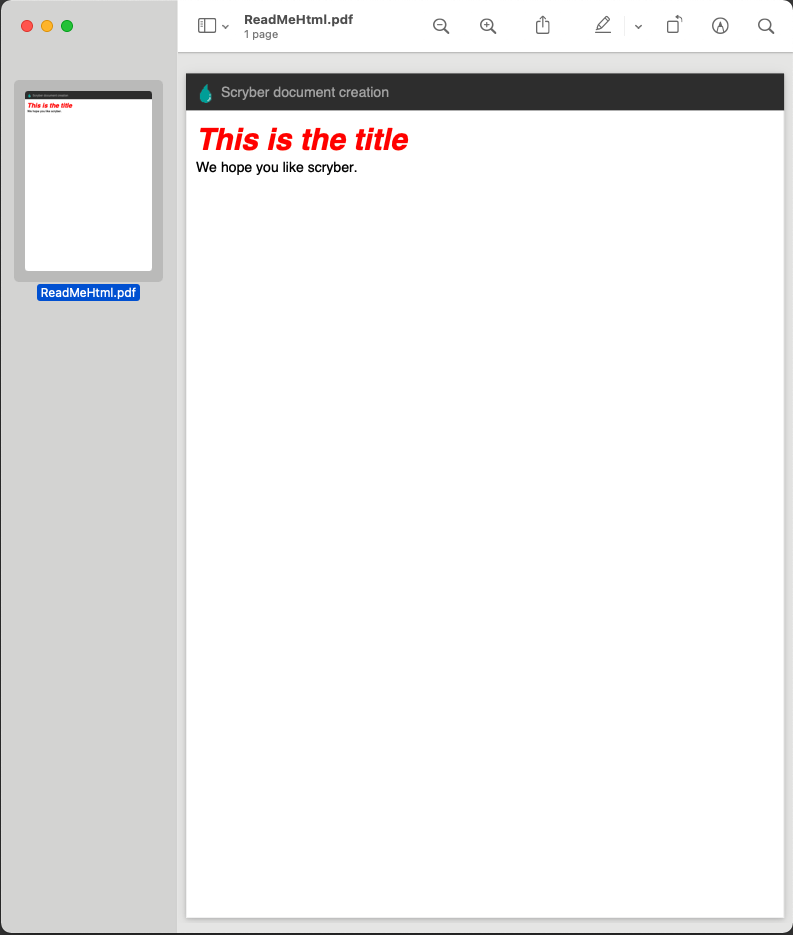

<h1 align='center'>
    
    <br/>
    scryber.core pdf engine
</h1>

## Make documents easily

The scryber engine is an advanced, complete, pdf creation library for dotnet core. 
It supports the easy definition of documents, pages, content, shapes and images either by html and templates or simple code. 

With a styles based layout it is easy to create good looking and flowing documents. 
Binding in xml allows you to quickly load data from many sources and output to PDF.

## HTML First

The latest version of scryber makes a significant switch to an XHTML first approach.
This supports cascading style sheets, databinding, repeating templates, imports and page directives.

## Getting Started

The easiest way to begin is to use the Nuget Packages here

[scryber.core package](https://www.nuget.org/packages/scryber.core/)
(Base libraries for GUI or console applications)

OR for asp.net mvc

[scryber.core.mvc package](https://www.nuget.org/packages/scryber.core.mvc/)
(Which includes the scryber.core package).

The full documentation is available here

[scryber.core documentation](https://scrybercore.readthedocs.io/en/latest/)

## Hello World

Just a bit more than a hello world example.

### Create your template pdfx (xml) file.

```xml

    <?xml version="1.0" encoding="UTF-8" ?>
    <doc:Document xmlns:doc='http://www.scryber.co.uk/schemas/core/release/v1/Scryber.Components.xsd'
                        xmlns:styles='http://www.scryber.co.uk/schemas/core/release/v1/Scryber.Styles.xsd'
                        xmlns:data='http://www.scryber.co.uk/schemas/core/release/v1/Scryber.Data.xsd'
                        title='Hello World' >
    <Params>
      <doc:Object-Param id='model'  />
    </Params>
    <Info >
        <Title>Hello World</Title>
    </Info>
    <Styles>
      <!-- Standard page font -->
      <styles:Style match='doc:Page'>
        <styles:Font family='sans-serif' size='14pt' />
      </styles:Style>

      <!-- Class definition -->
      <styles:Style match='p.header' >
        <styles:Background color='#333'
                img-src='../html/images/ScyberLogo2_alpha_small.png' repeat='None' 
                x-pos='10pt' y-pos='10pt' x-size='20pt' />
        <styles:Fill color='#AAA' />
        <styles:Margins top='0pt' />
        <styles:Padding all='10pt' left='35pt' />
      </styles:Style>

    </Styles>

    <Pages>
  
      <doc:Page styles:padding='0pt'>
        <!-- Header definition, with the class -->
        <Header>
            <doc:Para styles:class='header'>Scryber document creation</doc:Para>
        </Header>
        <Content>
         <!-- Single page content with bound data -->
         <doc:Div styles:padding='10pt' >
            <doc:H2 styles:style='{@:model.TitleStyle}' text='{@:model.Title}' />
            <doc:Div>We hope you like scryber.</doc:Div>
          </doc:Div>
        </Content>
      </doc:Page>
    </Pages>

    </doc:Document>
```

### Or using XHTML

```html

    <!DOCTYPE HTML >
    <html lang='en' xmlns='http://www.w3.org/1999/xhtml' >
        <head>
            <meta charset='utf-8' name='author' content='Richard Hewitson' />
            <title>Hello World</title>
            <style>
                body{
                    font-family: sans-serif;
                    font-size: 14pt;
                }

                p.header {
                    color: #AAA;
                    background-color: #333;
                    background-image: url('../html/images/ScyberLogo2_alpha_small.png');
                    background-repeat: no-repeat;
                    background-position: 10pt 10pt;
                    background-size: 20pt 20pt;
                    margin-top: 0pt;
                    padding: 10pt 10pt 10pt 35pt;
                }
            </style>
        </head>
        <body>
            <header>
                <p class="header">Scryber document creation</p>
            </header>
            <div style="padding:10pt" >
                <h2 class="heading" style="{@:model.TitleStyle}" >{@:model.Title}</h2>
                <div>We hope you like scryber.</div>
            </div>
        </body>
    </html>

```

### From your application code.

```cs

      //using Scryber.Components

      static void Main(string[] args)
      {
          using(var doc = Document.ParseDocument("[input template]"))
          {
              doc.Params["model"] = new
                {
                    Title = "This is the title",
                    TitleStyle = "color:red;"
                };
              
              doc.ProcessDocument("[output file].pdf");
          }
      }
```

### Or from an MVC web application

```cs

      //using Scryber.Components
      //using Scryber.Components.Mvc

      public IActionResult HelloWorld(string title = "This is the title")
      {
          using(var doc = Document.ParseDocument("[input template]"))
          {
              doc.Params["model"] = new
                {
                    Title = title,
                    TitleStyle = "color:red;"
                };
              
              return this.PDF(doc); // inline:false, outputFileName:"HelloWorld.pdf"
          }
      }
```

### And the output



Check out Read the Docs for more information on how to use the library.

[scryber.core documentation](https://scrybercore.readthedocs.io/en/latest/)


## Getting Involved

We would love to hear your feedback. Feel free to get in touch.
Issues, ideas, includes are all welcome.

If you would like to help with building, extending then happy to get contributions

