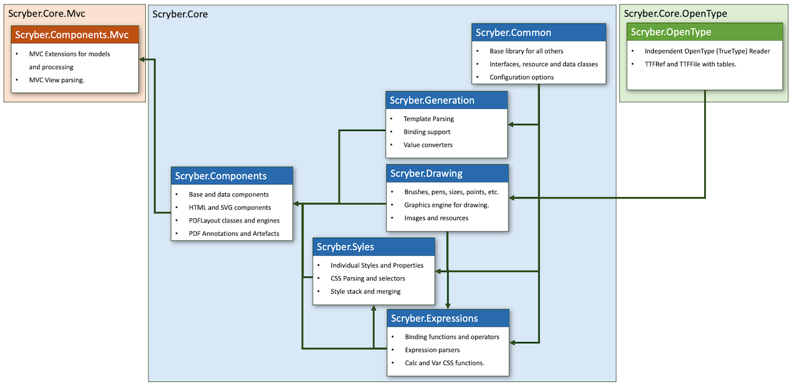
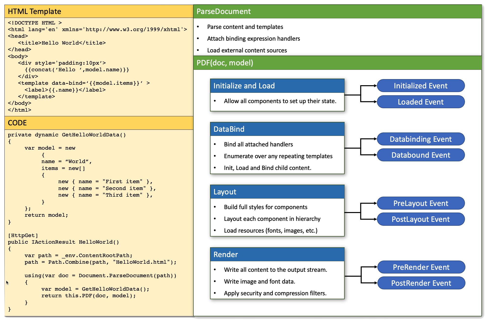

========================================
1.4. Scryber packages and the libraries
========================================

It is not nescessary to know the structure of the scryber code, or how it processes a document into a PDF.
But it helps in understanding what is going on under the hood, and also understanding the logs.

1.4.1. NuGet Packages
----------------------

There are 3 NuGet packages for scryber.

The `Scryber.Core.OpenType <https://www.nuget.org/packages/Scryber.Core.OpenType/>`_ package contains a single library for parsing ttf (open type) font files.

The `Scryber.Core <https://www.nuget.org/packages/Scryber.Core/>`_ package contains the main libraries for PDF generation.

The `Scryber.Core.Mvc <https://www.nuget.org/packages/Scryber.Core.Mvc/>`_ package contains the MVC extensions that allow for easy generation of you PDF from a web request.

1.4.2. Source code
------------------

The `Scryber.Core Git repository <https://github.com/richard-scryber/scryber.core>`_ contains the open source code, you are at liberty to use in your own projects for if wanted.

It also contains the samples for this documentation in the `Scryber.UnitSamples` project of the source.

1.4.3. Scryber.Core libraries
-----------------------------

Within the core package are 6 main libraries with the top level library Scryber.Components referencing others, and the Scryber.Common containing most of the interfaces and base structures.

`Full size version <../_images/dll_references.png>`_

1.4.4. Document Processing lifecycle
------------------------------------

When creating a PDF document from a template in your code there is a clear linear process that is followed to generate the final output.

* Parsing the template creates the document object model.
* Initialize and load on each component to ensure the correct state.
* Databind to any data models (which can create further components)
* Layout converts the high level components to lower level entities
* Render allows the layout entities to render themselves to a PDFWriter

Between parsing and initializing is a neat point to add your own content, or add any model(s) needed to the document,
along with setting up any events or custom code.

Each of the stages raises events that can be captured to perform any custom processing required

`Full size version <../_images/doc_lifecycle.png>`_

