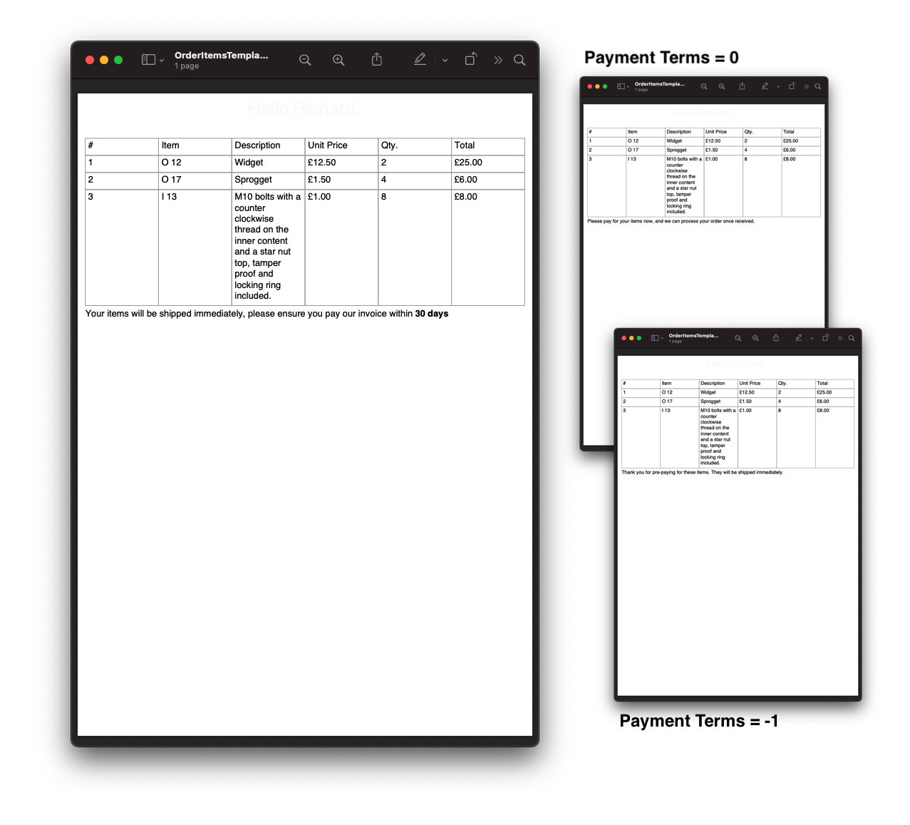
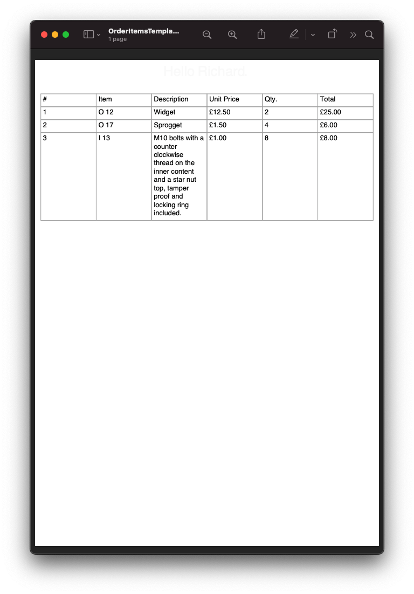

=====================================
1.7. Document parameters and binding
=====================================

Within the content of a document the parser will look for expressions that will be evaluated at binding time into actual values.
Every attribute in scryber, and all text can be bound with an expression.

The usual method for specifying these values uses the handlebars syntax - ``{{expression}}``.

.. code:: html

    
{{concat('Hello ',model.userName)}}

For styles and css the ``calc()`` method is extended to used expressions.

.. code:: css

    .banner {
        background-image: calc(model.logoSource);
    }

This allows the inclusion of dynamic content at runtime either for specific values, for binding onto repeating content, or for evaluating expressions.

The values are passed to the document through the ``Params`` property of a document instance.

.. code:: csharp

    doc.Params["model"] = new {
        userName = "Richard",
        logoSource = "url(../images/mylogo.png)"
    };

1.7.1 Generation methods
-------------------

All methods and files in these samples use the standard testing set up as outlined in :doc:`../1_overview/5_samples_reference`

1.7.2 Simple Binding Example
----------------------------

.. code:: html

    <!-- Templates/Overview/SimpleBinding.html -->

    <!DOCTYPE HTML >
    <html lang='en' xmlns='http://www.w3.org/1999/xhtml' >
        <head>
            <title>{{title}}</title>
        </head>
        <body>
            
{{title}}.

        </body>
    </html>

When processing the document, the value for ``title`` can be provided.

.. code:: csharp

    //Scryber.UnitSamples/OverviewSamples.cs

    public void SimpleBinding()
    {
        var path = GetTemplatePath("Overview", "SimpleBinding.html");

        using (var doc = Document.ParseDocument(path))
        {
            doc.Params["title"] = "Hello World";

            //Before databinding - value is not set
            Assert.IsNull(doc.Info.Title);

            using (var stream = GetOutputStream("Overview", "SimpleBinding.pdf"))
            {
                doc.SaveAsPDF(stream);
            }

            //After databinding
            Assert.AreEqual("Hello World", doc.Info.Title);
        }
    }

At generation time these values will be interpeted and set on the appropriate properties and rendered to the file.
As the layout has not executed before the databind, the content will be flowed with the rest of the document.

.. figure:: ../images/doc_simple_binding.png
    :target: ../_images/doc_simple_binding.png
    :alt: Binding simple content for documents
    :width: 600px
    :class: with-shadow

`Full size version <../_images/doc_simple_binding.png>`_

.. note:: Scryber is strongly typed. It will try and convert or parse the values on databinding, and most of the style values and properties can be parsed. But the content should be of the correct type.

1.7.3. Complex expressions
----------------------------

As you can imagine the parameters could start to get unmanageable and complex.
Thankfully the support for expressions allows both interrogation and calculation.

It is possible to use both strongly typed or dynamic objects (or a combination of both) for parameters.
And expressions support any depth of property, and also an indexor in brackets. For example the following are all supported.

.. code:: csharp

        model.property
        model.property[index]
        model.property[function()].name

The classes can be dynamic or strongly typed but the properties are **Case Sensitive** to ensure language compatibility. 
If properties are not found, then the whole expression will return null.

1.7.4. Binding to complex objects
---------------------------------

We can add both, a strongly typed user in the model, and also a dynamic theme object.

.. code:: csharp

    //Scryber.UnitSamples/OverviewSamples.cs

    public class User {

        public string Salutation {get;set;}

        public string FirstName {get;set;}

        public string LastName {get;set;}
    }

    public void ComplexBinding()
    {
        var path = GetTemplatePath("Overview", "ComplexBinding.html");

        using (var doc = Document.ParseDocument(path))
        {
            var user = new User() { Salutation = "Mr", FirstName = "Richard", LastName = "Smith" };

            doc.Params["model"] = new
            {
                user = user
            };
            doc.Params["theme"] = new
            {
                color = "#FF0000",
                space = "10pt",
                align = "center"
            };

            using (var stream = GetOutputStream("Overview", "ComplexBinding.pdf"))
            {
                doc.SaveAsPDF(stream);
            }
        }
    }

Our template can then access the properties on each of these objects. It can either be used in a function e.g. ``{{concat()}}`` or as a direct value ``{{model.user.FirstName}}``
For styles, the handlebars syntax is supported, but also the ``calc()`` css function.

.. code:: html

    <!-- Templates/Overview/ComplexBinding.html -->

    <!DOCTYPE HTML >
    <html lang='en' xmlns='http://www.w3.org/1999/xhtml' >
        <head>
            <title>{{concat('Hello ', model.user.FirstName)}}</title>
        </head>
        <body>
            

                Hello {{model.user.FirstName}}.
            

        </body>
    </html>

And the output as below.

.. figure:: ../images/doc_expression_binding.png
    :target: ../_images/doc_expression_binding.png
    :alt: Binding complex content for documents
    :width: 600px
    :class: with-shadow

`Full size version <../_images/doc_expression_binding.png>`_

1.7.5. Looping over collections
-------------------------------

Along with the interrogation of the object properties scryber supports the enumeration over collections using the ``<template />`` tag.
To set the value of the item or items to loop over use the ``data-bind`` attribute.

.. code:: html

    <template data-bind='{{ expression }}'>
        <!-- any inner content --->
    </template> 

Inside the template the current item can be referred to using the dot prefix ``.property``. And the zero based index of the current loop is accessible with the ``index()`` function.

If we add 2 more model classes and a mock service to our code.

.. code:: csharp

    //Scryber.UnitSamples/OverviewSamples.cs

    public class Order {

        public int ID {get;set;}

        public string CurrencyFormat {get;set;}

        public double TaxRate {get;set;}

        public double Total {get;set;}

        public List<OrderItem> Items {get;set;}
    }

    public class OrderItem{

        public string ItemNo {get;set;}

        public string ItemName {get;set;}

        public double Quantity {get;set;}

        public double ItemPrice {get;set;}

    }

    public class OrderMockService {

        public Order GetOrder(int id)
        {
            var order = new Order() { ID = id, CurrencyFormat = "£##0.00", TaxRate = 0.2 };
            order.Items = new List<OrderItem>(){
                new OrderItem() { ItemNo = "O 12", ItemName = "Widget", Quantity = 2, ItemPrice = 12.5 },
                new OrderItem() { ItemNo = "O 17", ItemName = "Sprogget", Quantity = 4, ItemPrice = 1.5 },
                new OrderItem() { ItemNo = "I 13", ItemName = "M10 bolts with a counter clockwise thread on the inner content and a star nut top, tamper proof and locking ring included.", Quantity = 8, ItemPrice = 1.0 }
            };
            order.Total = (2.0 * 12.5) + (4.0 * 1.5) + (8 * 1.0);

            return order;
        }

    }

We can then set the ``order`` property on our model.

.. code:: csharp

    //Scryber.UnitSamples/OverviewSamples.cs

    public void LoopBinding()
    {
        var path = GetTemplatePath("Overview", "LoopBinding.html");

        using (var doc = Document.ParseDocument(path))
        {
            var service = new OrderMockService();
            var user = new User() { Salutation = "Mr", FirstName = "Richard", LastName = "Smith" };
            var order = service.GetOrder(1);

            doc.Params["model"] = new
            {
                user = user,
                order = order
            };

            doc.Params["theme"] = new
            {
                color = "#FF0000",
                space = "10pt",
                align = "center"
            };

            using (var stream = GetOutputStream("Overview", "LoopBinding.pdf"))
            {
                doc.SaveAsPDF(stream);
            }
        }
    }

In our template we can then **bind** the values in a table, looping over each one in a table body using the ``template`` element and a ``data-bind`` value.   

.. code:: html

    <!-- Templates/Overview/LoopBinding.html -->

    <!DOCTYPE HTML >
    <html lang='en' xmlns='http://www.w3.org/1999/xhtml' >
        <head>
            <title>{{concat('Hello ', model.user.FirstName)}}</title>
        </head>
        <body>
            

                Hello {{model.user.FirstName}}.
            

            

                <table style='width:100%'>
                    <thead>
                        <tr>
                            <td>#</td>
                            <td>Item</td>
                            <td>Description</td>
                            <td>Unit Price</td>
                            <td>Qty.</td>
                            <td>Total</td>
                        </tr>
                    </thead>
                    <tbody>
                        <!-- Binding on each of the items in the model.order -->
                        <template data-bind='{{model.order.Items}}'>
                            <tr>
                                <!-- The indexing of the loop + 1 -->
                                <td>{{index() + 1}}</td>
                                <td>{{.ItemNo}}</td>
                                <td>{{.ItemName}}</td>
                                <td>
                                    <!-- we use a number tag to specify the data-format referring to the top model -->
                                    <num value='{{.ItemPrice}}' data-format='{{model.order.CurrencyFormat}}' />
                                </td>
                                <td>{{.Quantity}}</td>
                                <td>
                                    <num value='{{.ItemPrice * .Quantity}}' data-format='{{model.order.CurrencyFormat}}' />
                                </td>
                            </tr>
                        </template>
                    </tbody>
                </table>
            

        </body>
    </html>

`Full size version <../_images/doc_expression_template.png>`_

1.7.6. Expressions and calculations
-------------------------------------

We have already seen some binding syntax in scryber templates with functions and calculations between the handlebars.

.. code:: csharp

    {{.ItemPrice * .Quantity}}
    {{index() + 1}}
    {{concat('Hello ', model.user.FirstName)}}

There are many other functions for mathematical, comparison, aggregation and string operation.
A complete list with examples of each are defined in the :doc:`../6_binding/6_functions_reference` section.

1.7.7. Showing and hiding content
----------------------------------

Scryber supports visual changes to the content based on decisions in the data. The use of the css style ``display:none`` is supported, and evaluated at layout time.
Scyber also supports the standard html ``hidden='hidden'`` flag on tags, or a boolean ``visible`` attribute. 
The advantage of the hidden/visible attributes are that they are explict rather than in the style, and easier to see in calculations.

If we extend our ``Order`` class we can use a comparison expression to show or hide some content within the template.
And set the value in the document generation...

.. code:: csharp

    //Scryber.UnitSamples/OverviewSamples.cs

    public class OrderWithTerms : Order
    {
        public int PaymentTerms { get; set; }

    }

    public class OrderMockService2
    {
        public Order GetOrder(int id)
        {
            //Use the order with terms
            var order = new OrderWithTerms() { ID = id, CurrencyFormat = "£##0.00", TaxRate = 0.2 };
            order.Items = new List<OrderItem>(){
                new OrderItem() { ItemNo = "O 12", ItemName = "Widget", Quantity = 2, ItemPrice = 12.5 },
                new OrderItem() { ItemNo = "O 17", ItemName = "Sprogget", Quantity = 4, ItemPrice = 1.5 },
                new OrderItem() { ItemNo = "I 13", ItemName = "M10 bolts with a counter clockwise thread on the inner content and a star nut top, tamper proof and locking ring included.", Quantity = 8, ItemPrice = 1.0 }
            };
            order.Total = (2.0 * 12.5) + (4.0 * 1.5) + (8 * 1.0);
            //and set the payment terms
            order.PaymentTerms = 30;
            return order;
        }

    }

    public void ChoicesBinding()
    {
        var path = GetTemplatePath("Overview", "ChoicesBinding.html");

        using (var doc = Document.ParseDocument(path))
        {
            //Use mock service 2
            var service = new OrderMockService2();

            var user = new User() { Salutation = "Mr", FirstName = "Richard", LastName = "Smith" };
            var order = service.GetOrder(1);

            doc.Params["model"] = new
            {
                user = user,
                order = order
            };

            doc.Params["theme"] = new
            {
                color = "#FF0000",
                space = "10pt",
                align = "center"
            };

            using (var stream = GetOutputStream("Overview", "ChoicesBinding.pdf"))
            {
                doc.SaveAsPDF(stream);
            }
        }
    }

We can then change the output based upon the PaymentTerms value directly in the template using the ``if`` function.

.. code:: html

    hidden='{{if(model.order.PaymentTerms &lt; 0, "", "hidden")}}'

We can check the payment terms value and show or hide some content based on this.

.. code:: html

    <!-- Templates/Overview/ChoicesBinding.html -->

    <!DOCTYPE HTML >
    <html lang='en' xmlns='http://www.w3.org/1999/xhtml' >
        <head>
            <title>{{concat('Hello ', model.user.FirstName)}}</title>
        </head>
        <body>
            

                Hello {{model.user.FirstName}}.
            

            

                <table style='width:100%'>
                    <thead>
                        <tr>
                            <td>#</td>
                            <td>Item</td>
                            <td>Description</td>
                            <td>Unit Price</td>
                            <td>Qty.</td>
                            <td>Total</td>
                        </tr>
                    </thead>
                    <tbody>
                        <!-- Binding on each of the items in the model.order -->
                        <template data-bind='{{model.order.Items}}'>
                            <tr>
                                <!-- The indexing of the loop + 1 -->
                                <td>{{index() + 1}}</td>
                                <td>{{.ItemNo}}</td>
                                <td>{{.ItemName}}</td>
                                <td>
                                    <!-- we use a number tag to specify the data-format referring to the top model -->
                                    <num value='{{.ItemPrice}}' data-format='{{model.order.CurrencyFormat}}' />
                                </td>
                                <td>{{.Quantity}}</td>
                                <td>
                                    <num value='{{.ItemPrice * .Quantity}}' data-format='{{model.order.CurrencyFormat}}' />
                                </td>
                            </tr>
                        </template>
                    </tbody>
                </table>
                

                    

                        
Thank you for pre-paying for these items. They will be shipped immediately

                    

                    

                        
Please pay for your items now, and  we can process your order once received.

                    

                    

                        
Your items will be shipped immediately, please ensure you pay our invoice within <b> {{model.order.PaymentTerms}} days</b>

                    

                

            

        </body>
    </html>

.. note:: Because we are valid xhtml/xml we must escape the < and > calculations as &lt; and &gt; respectively. The parser will convert them back within the calculation.

`Full size version <../_images/doc_expression_visible.png>`_

With the above example, our service instance has changed, our template has been adapted, but there is no need to update any other code.
This flexibility allows data models to change, templates to be updated. And the rest of the code keep working.

1.7.8. Changing in code
-----------------------

We could also do this directly in our output method by looking for the items and setting their ``Visible`` property.

.. code:: csharp

    var doc = Document.ParseDocument("MyFile.html");

    var service = new OrderMockService2();
    var user = new User() { Salutation = "Mr", FirstName = "Richard", LastName = "Smith" };

    // A cast is needed to know the terms
    var order = service.GetOrder(1) as OrderWithTerms;

    doc.Params["model"] = new {
                user =  user,
                order = order
    };

    doc.Params["theme"] = new
    {
        color = "#FF0000",
        space = "10pt",
        align = "center"
    };

    //Update the visibility of lookup items - dependent on them being there.
    doc.FindAComponentById("paidAlready").Visible = (order.PaymentTerms < 0);
    doc.FindAComponentById("payNow").Visible = (order.PaymentTerms == 0);
    doc.FindAComponentById("payLater").Visible = (order.PaymentTerms > 0);

    doc.SaveAsPDF("OutputPath.pdf");

This does, however, start to create a dependacy on the layout and the code along with potential errors this may cause later 
on plus dependencies on types and casting.

1.7.9. Further Reading
----------------------

* Next we can add some style to the template with :doc:`8_styles_and_classes`.
* See :doc:`../6_binding/1_binding_model` for more on the databinding capabilities and available functions.
* See :doc:`../6_binding/15_document_controllers` for a deep dive into interacting with your templates in code.
* See :doc:`../7_extending/1_extending_scryber` for more about the options for binding and configuration.
