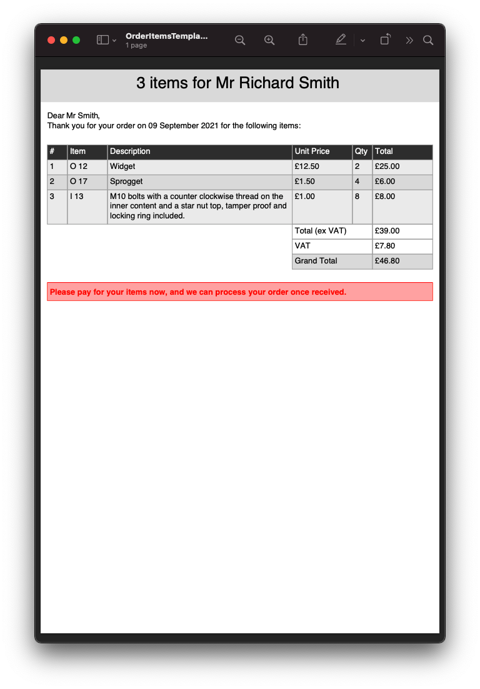
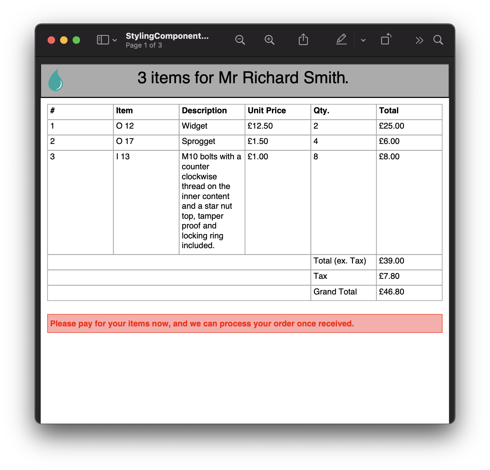
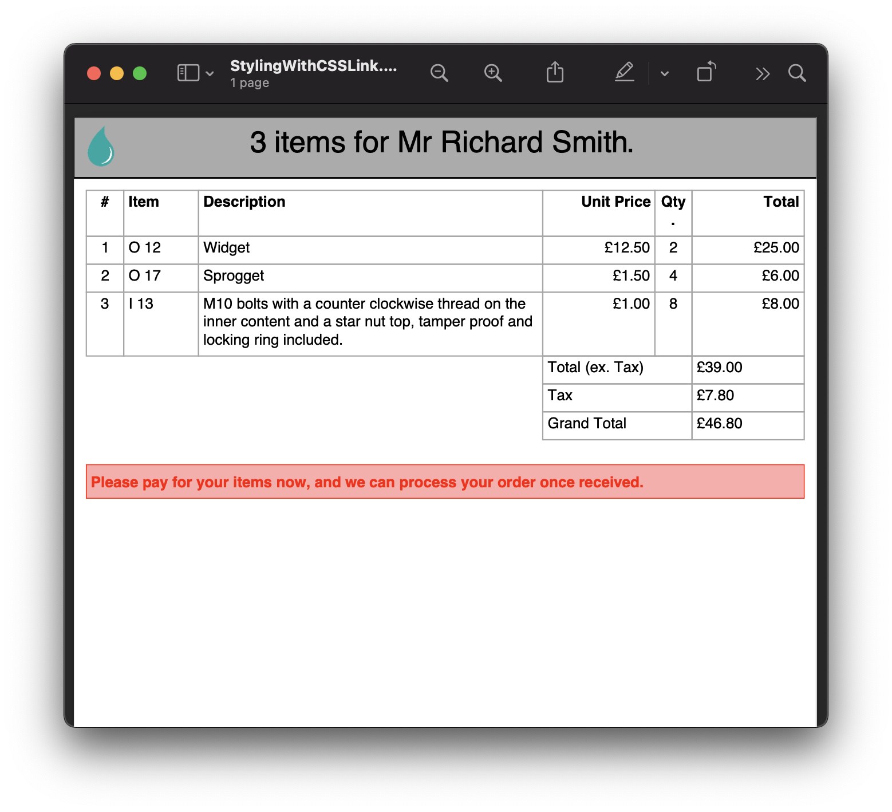
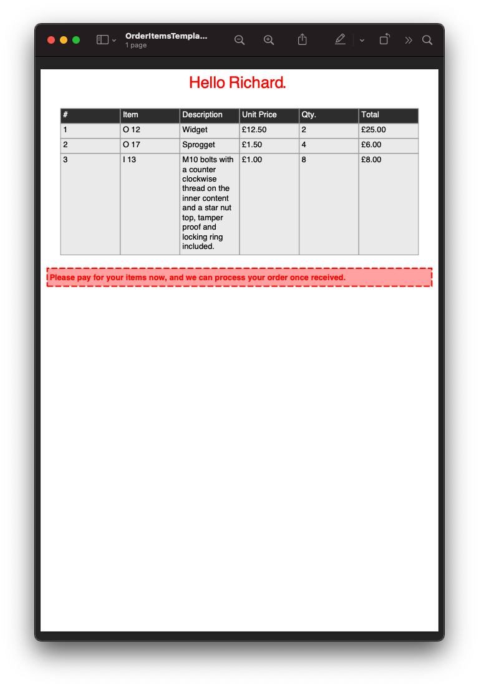

===================================
1.8. Styles, Classes and selectors
===================================

Scryber supports full cascading styles on all visual components.
It also supports declaration of classes and styles within either the html head or as referenced stylesheets.
And the use of ``var()`` and ``calc()`` for expressions.

1.8.1 Orders with style
------------------------

From our previous example (:doc:`7_parameters_and_expressions`) we can declare some styles inside the document head.

.. code:: html

    <!DOCTYPE HTML>
    <html lang='en' xmlns='http://www.w3.org/1999/xhtml'>
    <head>
        <title>{{concat('Hello ', model.user.FirstName)}}</title>
        
    </head>
    <body>
        <!-- our heading has explicit styles -->
        

            {{count(model.order.Items)}} items for {{join(' ',model.user.Salutation, model.user.FirstName, model.user.LastName)}}.
        

        

            <table style='width:100%'>
                <thead>
                    <tr>
                        <td>#</td>
                        <td>Item</td>
                        <td>Description</td>
                        <td>Unit Price</td>
                        <td>Qty.</td>
                        <td>Total</td>
                    </tr>
                </thead>
                <tbody>
                    <template data-bind='{{model.order.Items}}'>
                        <tr>
                            <td>{{index() + 1}}</td>
                            <td>{{.ItemNo}}</td>
                            <td>{{.ItemName}}</td>
                            <td>
                                <num value='{{.ItemPrice}}' data-format='{{model.order.CurrencyFormat}}' />
                            </td>
                            <td>{{.Quantity}}</td>
                            <td>
                                <num value='{{.ItemPrice * .Quantity}}' data-format='{{model.order.CurrencyFormat}}' />
                            </td>
                        </tr>
                    </template>
                </tbody>
                <tfoot>
                    <tr>
                        <td colspan="4"></td>
                        <td>Total (ex. Tax)</td>
                        <td><num value='{{model.order.Total}}' data-format='{{model.order.CurrencyFormat}}' /></td>
                    </tr>
                    <tr>
                        <td colspan="4"></td>
                        <td>Tax</td>
                        <!-- Caclulate the tax -->
                        <td><num value='{{model.order.Total * model.order.TaxRate}}' data-format='{{model.order.CurrencyFormat}}' /></td>
                    </tr>
                    <tr>
                        <td colspan="4"></td>
                        <td>Grand Total</td>
                        <!-- Calculate the grand total with tax -->
                        <td><num value='{{model.order.Total * (1 + model.order.TaxRate)}}' data-format='{{model.order.CurrencyFormat}}' /></td>
                    </tr>
                </tfoot>
            </table>
            

                

                    
Thank you for pre-paying for these items. They will be shipped immediately

                

                

                    
Please pay for your items now, and  we can process your order once received.

                

                

                    
Your items will be shipped immediately, please ensure you pay our invoice within <b> {{model.order.PaymentTerms}} days</b>

                

            

        

    </body>
    </html>

.. code:: csharp

    public void ComponentStyles()
    {
        var path = GetTemplatePath("Overview", "StylingComponents.html");

        using (var doc = Document.ParseDocument(path))
        {
            //Use mock service 2
            var service = new OrderMockService2();

            var user = new User() { Salutation = "Mr", FirstName = "Richard", LastName = "Smith" };
            var order = service.GetOrder(1);
            

            doc.Params["model"] = new
            {
                user = user,
                order = order
            };

            using (var stream = GetOutputStream("Overview", "StylingComponents.pdf"))
            {
                doc.SaveAsPDF(stream);
            }
        }
    }

Now we can set up our theme and apply styles to the .header, .orderlist table and #payNow box.
We were also able to remove the dependency on the `theme` parameter.

`Full size version <../_images/samples_overviewStyledVars.png>`_

In the same way as css, the font size of the #terms div is cascaded to the #payNow div, and the #payNow styles are applied over the top, overriding where appropriate. 

The .header takes a number of css variables declared at the `:root` and applies them to the top div. These can be changed within selectors, can fallback, and as we will see later can be changed in code.

.. code:: css

    color: var(--theme_color, #000);

1.8.2 Allowed style selectors.
------------------------------

Scyber does **not** support the full set of selectors or the `!important` modifier (at the moment). 
We only support the use of 

* Chained selectors on tags, classes and id. 
* The > direct descendant selector.
* The :root selector
* The @font-face, @media and @page rules.

Other unsupported selectors and rules will be ignored.

.. code:: css

    /* these are supported */

    .classname { }
    #id { }
    tag { }

    tag.classname { }

    tag.classname .inner { }
    tag.classname tag.inner {  }

    tag.classname > .direct.descendant { }

    @media print {

        tag.mediaoverrides {

        }
    }

    /* these and other pseudo classes will not be supported 

    td:first {}
    td::last {}

    */

    /* Or these other rules

    @import {}

    @supports () {}

    */

1.8.3. Supported css properties
------------------------

For a complete list of all the supported style properties see :doc:`../4_styles/1_document_styles`, but as an overview scyber currently supports.

* Fills - Colors, images, positions, repeats and gradients.
* Strokes - Widths, dashes, colors and joins.
* Backgrounds - Colors, images, positions, repeats and gradients.
* Borders - Width, dashes, colors and individual sides.
* Text - Fonts, alignment, spacing, wrapping
* Size - Explicit width, height, minimum and maximum widths and heights.
* Positions - Block, Inline, Relative to parents, Absolute to the current page, 100% width.
* Spacing - Margins, padding including individual sides
* Lists - style, groups, number formats and labels.
* Page - sizes, orientations, numbers and formats.
* Columns - count, widths, gutter/alleys.

.. note:: All dimensions in scryber are based on actual sizes, rather than relative sizes. We are hoping to implement relative sizes, but for the moment units should be in Points (pt), Millimeters (mm) and Inches (in).

1.8.4. Caclulation in styles
-------------------------------

As already seen using the ``cacl()`` function on css styles and classes is fully supported.
This will respont to model content and also css values.

We can add a linked stylesheet with some table layout options, some calculated from a standard variable.

.. code:: css

    /* /Templates/Overview/Fragments/orderStyles.css */

    body {
        --std-width: 30pt;
    }

    td.w1 {
        width: var(--std-width);
    }

    td.w2 {
        width: calc(var(--std-width) * 2.0);
    }

    td.w3 {
        width: calc(var(--std-width) * 3.0);
    }

    td.empty {
        border: none;
    }

    td.num {
        text-align: center;
    }

    td.curr {
        text-align:right;
    }

We can reference this stylesheet in our html and apply the styles to the content including support for multiple classes.

.. code:: html

    <!--  /Templates/Overview/StylingWithCSSLink -->

    <!DOCTYPE HTML>
    <html lang='en' xmlns='http://www.w3.org/1999/xhtml'>
    <head>
        <title>{{concat('Hello ', model.user.FirstName)}}</title>
        <!-- reference the stylesheet -->
        <link rel="stylesheet" href="./Fragments/orderStyles.css" />
        
    </head>
    <body>
        

            {{count(model.order.Items)}} items for {{join(' ',model.user.Salutation, model.user.FirstName, model.user.LastName)}}.
        

        

            <table style='width:100%'>
                <thead>
                    <tr>
                        <td class="num">#</td>
                        <td>Item</td>
                        <td>Description</td>
                        <td class="curr">Unit Price</td>
                        <td class="num">Qty.</td>
                        <td class="curr">Total</td>
                    </tr>
                </thead>
                <tbody>
                    <!-- apply the widths and alignment styles to the rows -->
                    <template data-bind='{{model.order.Items}}'>
                        <tr>
                            <td class="w1 num">{{index() + 1}}</td>
                            <td class="w2">{{.ItemNo}}</td>
                            <td>{{.ItemName}}</td>
                            <td class="w3 curr">
                                <num value='{{.ItemPrice}}' data-format='{{model.order.CurrencyFormat}}' />
                            </td>
                            <td class="w1 num">{{.Quantity}}</td>
                            <td class="w3 curr">
                                <num value='{{.ItemPrice * .Quantity}}' data-format='{{model.order.CurrencyFormat}}' />
                            </td>
                        </tr>
                    </template>
                </tbody>
                <tfoot>
                    <tr>
                        <td class="empty" colspan="3"></td>
                        <td colspan="2">Total (ex. Tax)</td>
                        <td><num value='{{model.order.Total}}' data-format='{{model.order.CurrencyFormat}}' /></td>
                    </tr>
                    <tr>
                        <td class="empty" colspan="3"></td>
                        <td colspan="2">Tax</td>
                        <!-- Caclulate the tax -->
                        <td><num value='{{model.order.Total * model.order.TaxRate}}' data-format='{{model.order.CurrencyFormat}}' /></td>
                    </tr>
                    <tr>
                        <td class="empty" colspan="3"></td>
                        <td colspan="2">Grand Total</td>
                        <!-- Calculate the grand total with tax -->
                        <td><num value='{{model.order.Total * (1 + model.order.TaxRate)}}' data-format='{{model.order.CurrencyFormat}}' /></td>
                    </tr>
                </tfoot>
            </table>
            

                

                    
Thank you for pre-paying for these items. They will be shipped immediately

                

                

                    
Please pay for your items now, and  we can process your order once received.

                

                

                    
Your items will be shipped immediately, please ensure you pay our invoice within <b> {{model.order.PaymentTerms}} days</b>

                

            

        

    </body>
    </html>

And using the same method generate our document.

.. code:: csharp

    // Scryber.UnitSamples/OverviewSamples.cs

    public void StylesWithCSSLink()
    {
        var path = GetTemplatePath("Overview", "StylingWithCSSLink.html");

        using (var doc = Document.ParseDocument(path))
        {
            //Use mock service 2
            var service = new OrderMockService2();

            var user = new User() { Salutation = "Mr", FirstName = "Richard", LastName = "Smith" };
            var order = service.GetOrder(1);

            doc.Params["model"] = new
            {
                user = user,
                order = order
            };

            using (var stream = GetOutputStream("Overview", "StylingWithCSSLink.pdf"))
            {
                doc.SaveAsPDF(stream);
            }
        }
    }

`Full size version <../_images/samples_overviewLinkedCSS.png>`_

1.8.5. Style values in code
-----------------------------

Remember that all content parsed is converted to an object graph? This applies to styles as well.

All visual components (generally anything on a page) has a range of properties for setting styles, as well as a ``Style`` property itself. So we could apply some values to the style directly from our generation method.

We can even define our own styles in the document to override

.. code:: csharp

    //using Scryber.Components
    //using Scryber.Drawing
    //using Scryber.Styles

    var doc = Document.ParseDocument("MyFile.html");

    var service = new OrderMockService();
    var user = new User() { Salutation = "Mr", FirstName = "Richard", LastName = "Smith" };
    var order = service.GetOrder(1);
    order.PaymentTerms = 30;

    doc.Params["model"] = new {
                user =  user,
                order = order
    };

    var grid = doc.FindAComponentById("orders") as TableGrid;
    var pay = doc.FindAComponentById("payNow") as Div;
    
   
    //Properties directly on the visual component.
    grid.BackgroundColor = "#EEE";

    //Using the style property
    grid.Style.Margins.Right = 20;
    grid.Style.Margins.Left = 20;

    //Using style keys
    pay.Style.SetValue(StyleKeys.BorderStyleKey, LineType.Dash);
    pay.Style.SetValue(StyleKeys.BorderDashKey, PDFDashes.LongDash);

    //A new style to the document
    StyleDefn style = new StyleDefn("#terms div#payNow");
    style.Border.Width = 2;
    doc.Styles.Add(style);

    doc.SaveAsPDF("OutputPath.pdf");

`Full size version <../_images/doc_coded_styles.png>`_

.. note:: We had to set the Border Style to dash, as well as providing a dash value, as our css styles had defined the border as solid. 

All the style properties are strongly typed, even the ``Style.SetValue`` as the style keys are strongly typed. However most of the values used have an explicit or implicit conversion from numbers or strings, or a simple constructor.
The main classes (and structs) used in styles are

* PDFUnit - a basic dimension with units. Implicit conversion from a number, along with parsing and constructors. See :doc:`drawing_units`
* PDFColor - a standard color in either RGB, CMYK or Gray scale. Implicit conversion from a string, along with parsing and constructors. See :doc:`drawing_colors`
* PDFThickness - 4 PDFUnits in a top, right, bottom and left order. Parsing and constructors. See :doc:`drawing_units`
* PDFFontSelector - A chained list of names of fonts, e.g "Arial" sans-serif. Explicit conversion along with parsing and constructor. See :doc:`drawing_fonts`
* Various Enumerations - Used for setting style types such as line caps, background styles, etc.

Base components styles
----------------------

Each component has a standard base style applied. For example the Div has a position mode of block. The paragraph also has a position mode of block, but includes a top margin of 4 points. The table cell has a standard gray 1 point border.
By defining these there is a consistant appearance, but these can be easily overriden using css styles in your document or referenced css stylesheet.

.. code:: css

    td { border: none; }

Using calc() and binding dynamic values.
-----------------------------------------

Along with support for ``var()`` for looking up css variables, scryber supports ``calc()``.
This enables styles to be completely dynamic as well as the data.

The functions can either be on the css classes or wthin the style attribute itself.

In our linked orderStyles.css file we can set up some standard widths.

.. code:: css

    :root {
        --std-width: 30pt;
    }

    .td_w1 {
        width: var(--std-width);
    }

    .td_w2 {
        width: calc(var(--std-width) * 2.0);
    }

    .td_w3 {
        width: calc(var(--std-width) * 3.0);
    }

And in our code we can create a style parameter.

.. code:: csharp

    //using Scryber.Components
    //using Scryber.Drawing

    var doc = Document.ParseDocument("MyFile.html");

    var service = new OrderMockService2();
    var user = new User() { Salutation = "Mr", FirstName = "Richard", LastName = "Smith" };
    var order = service.GetOrder(1);
    order.PaymentTerms = 30;

    doc.Params["model"] = new {
                user =  user,
                order = order
    };

    //new style document parameter
    doc.Params["style"] = new
    {
        rowColor = (PDFColor)"#EEE",
        altColor = (PDFColor)"#DDD",
        dateFormat ="dd MMMM yyyy",
        currencyFormat = "£##0.00"
    };

    doc.SaveAsPDF("OutputPath.pdf");

And finally we can update our template to use the new styles and add a bit more juice to the template.

.. code:: html

    <!DOCTYPE HTML>
    <html lang='en' xmlns='http://www.w3.org/1999/xhtml'>
    <head>
        <title>{{concat('Orders for ', model.user.FirstName)}}</title>
        <link rel="stylesheet" href="./css/orderStyles.css" />
        
    </head>
    <body>
        <!-- setting the background color to the style -->
        

            {{count(model.order.Items)}} items for {{join(' ', model.user.Salutation, model.user.FirstName, model.user.LastName)}}
        

        <!-- a preamble paragraph with concatenated values and a date -->
        

            

                Dear {{concat(model.user.Salutation, ' ', model.user.LastName)}}, 
                Thank you for your order on <time data-format="{{var(style.dateFormat, 'dd MMM yyyy')}}" /> for the following items:
            

        

        

            <!-- classes on the header cells define the width of the table cells
                relative to the variable in the css stylesheet. -->
            <table id="orders" class="orderlist">
                <thead>
                    <tr>
                        <td class="td_w1">#</td>
                        <td class="td_w2">Item</td>
                        <td >Description</td>
                        <td class="td_w3">Unit Price</td>
                        <td class="td_w1">Qty</td>
                        <td class="td_w3">Total</td>
                    </tr>
                </thead>
                <tbody>
                    <!-- Changing the row color for alternates -->
                    <template data-bind='{{model.order.Items}}'>
                        <tr style="background-color: calc(if(index() % 2 == 1, style.altColor, style.rowColor));">
                            <!-- The indexing of the loop + 1 -->
                            <td>{{index() + 1}}</td>
                            <td>{{.ItemNo}}</td>
                            <td>{{.ItemName}}</td>
                            <td>
                                <!-- Data format is now coming from the style parameter -->
                                <num value='{{.ItemPrice}}' data-format='{{style.currencyFormat}}' />
                            </td>
                            <td>{{.Quantity}}</td>
                            <td>
                                <num value='{{.ItemPrice * .Quantity}}' data-format='{{style.currencyFormat}}' />
                            </td>
                        </tr>
                    </template>
                </tbody>
                <!-- Added some footer rows for calculations with fallback values -->
                <tfoot>
                    <tr>
                        <td class="noborder" colspan="3"></td>
                        <td colspan="2">Total (ex VAT)</td>
                        <td colspan="1">
                            <num value='{{model.order.Total}}' data-format='{{style.currencyFormat}}' />
                        </td>
                    </tr>
                    <tr>
                        <td class="noborder" colspan="3"></td>
                        <td colspan="2">VAT</td>
                        <td colspan="1">
                            <num value='{{model.order.Total * var(model.order.TaxRate,0.2)}}' data-format='{{style.currencyFormat}}' />
                        </td>
                    </tr>
                    <tr>
                        <td class="noborder" colspan="3"></td>
                        <td colspan="2" style="background-color: calc(style.altColor);">Grand Total </td>
                        <td colspan="1" style="background-color: calc(style.altColor);">
                            <num value='{{model.order.Total + (model.order.Total * var(model.order.TaxRate, 0.2))}}' data-format='{{style.currencyFormat}}' />
                        </td>
                    </tr>
                </tfoot>
            </table>
            

                

                    
Thank you for pre-paying for these items. They will be shipped immediately

                

                

                    
Please pay for your items now, and we can process your order once received.

                

                

                    
Your items will be shipped immediately, please ensure you pay our invoice within <b>{{model.order.PaymentTerms}} days</b>

                

            

        

    </body>
    </html>

And our output should now look something similar to this.

`Full size version <../_images/doc_styled_orders.png>`_

There is a lot going on here, but...

* The heading is counting the number of order items and joining some strings together with the alt style
* The table head is setting the widths of the columns that the content flows into, leaving description to fill the rest of the space.
* The table body has a ``template`` and is looping over the ``model.order.items`` collection, and creating a row for each of the items.
* The ``index()`` function is returning the *zero-based* index in the collection.
* The ``if(calc, true, false)`` function is setting the style for alternate rows.
* Inside the template row we are referring to the current item with the dot prefix.
* Inside the template row we can still reference the global document parameters without the dot prefix.
* The I 13 item has a long desciption that is flowing across multiple line in the cell.
* The ``footer`` rows are performing some calculations based on the summary information, and outputting the total values.
* The ``model.order.TaxRate`` is being looked for, but is not available, so the fallback var() value is being used.
* The ``num @data-format`` and ``time @data-format`` are changing the output text to a formatted value within the style

Next Steps
---------------

See :doc:`1_overview/9_document_output` to understand more on the options for outputting a document to a stream or a file

See :doc:`4_styles/1_document_styles` for a more detailed explation of each of the styling options within scryber.

See :doc:`6_binding/4_css_calc_reference` to get a deep dive into the calc() and var() support in scryber.

See :doc:`2_document/3_drawing_units`, :doc:`2_document/4_drawing_colors` and :doc:`2_document/5_drawing_fonts` for more on the support for measurements, colors and fonts.

.. note:: Remember, all of this is part of an object instance. The options to build a document are completely dynamic.