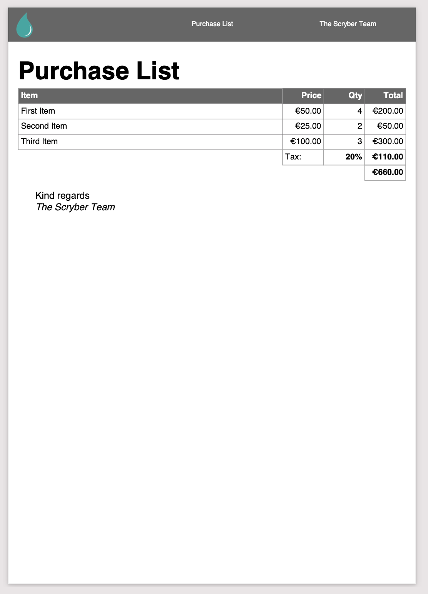

======================================
Dynamic content in your template
======================================

**This is where it get's exciting**

A document template is just that, a template.
You can add any source of information to be included.

* As a discreet value
* As an object with properties
* An array or dictionary
* As a template to use.
* To make decisions on layout

And they can be used in your document in many locations

* Within the document content
* On styles and classes
* In templates and loops
* Referenced content

The notation for an binding on an attribute or content is 
based on the { and } with a method (@ for the built model), a colon ':', and then finally the selector.

e.g. `attribute='{@:paramName}'` for values or `attribute='{@:paramName.property[index].value}'` for objects or even in textual content.

Document parameters
---------------------

Every Document can have parameters associated with it, and these can simply be bound to the content.
This includes style and value properties as well as text, and can be set after parsing the content.

.. code-block:: html

    <?xml version="1.0" encoding="utf-8" ?>
    <!DOCTYPE HTML PUBLIC "-//W3C//DTD HTML 4.01//EN"
            "http://www.w3.org/TR/html4/strict.dtd">

    <html xmlns='http://www.w3.org/1999/xhtml'>
    <head>
        <title>{@:DocTitle}</title>
        <meta name="author" content="{@:DocAuthor}" />
    </head>
    <body style="margin:20pt; font-size:20pt">
        <header>
            {@:DocAuthor}
        </header>    
        

            <h1 class="title" >{@:DocTitle}</h1>
            {@:DocContent}
        

    </body>
    </html>

And the value can be set or changed at runtime

.. code-block:: csharp

        using (var doc = Document.ParseDocument(path))
        {
            //pass paramters as needed, supporting simple values, arrays or complex classes.

            using (var stream = DocStreams.GetOutputStream("documentation.pdf"))
            {
                doc.Params["DocTitle"] = "Binding Title";
                doc.Params["DocAuthor"] = "Binding Name";
                doc.Params["ThemeHeader"] = "background-color:#EEE;padding:5pt";
                doc.Params["DocContent"] = "This is the content of the document";

                doc.SaveAsPDF(stream);
            }

        }

And this will be used in the output.

Using objects
--------------

Simple values work well, but with complex entries it will start to get extremely complex.
Scryber supports the standard object notations for properties arrays and dictionaries to help divide up the binding.

As a use case, we may need some purchase details.

.. code-block:: html

    <?xml version="1.0" encoding="utf-8" ?>
    <!DOCTYPE HTML PUBLIC "-//W3C//DTD HTML 4.01//EN" "http://www.w3.org/TR/html4/strict.dtd">

    <html xmlns='http://www.w3.org/1999/xhtml'>
    <head>
        <title>{@:Content.Title}</title>
        <meta name="author" content="{@:DocAuthor}" />
        
    </head>
    <body style="font-size:20pt">
        <!-- Page header with theme logo and content -->
        <header>
            

                
                
{@:Content.Title}

                
{@:Content.Author}

            

        </header>    
        

            <h1 class="title" >{@:Content.Title}</h1>
            <!-- A table of contents using the same theme for static headers -->
            <table class="list" >
                <thead>
                    <tr style="{@:Theme.Header}">
                        <td>Item</td>
                        <td class="item price">Price</td>
                        <td class="item qty">Qty</td>
                        <td class="item value">Total</td>
                    </tr>
                </thead>
                <tbody>
                    <!-- and a template for the table rows looping over each of the items -->
                    <template data-bind="{@:Model.Items}">
                        <tr>
                            <!-- each one is bound with a . prefix for the current item -->
                            <td class="item name">
                                {@:.Item}
                            </td>
                            <td class="item price" >
                                {@:.Price}
                            </td>
                            <td class="item qty" >
                                {@:.Quantity}
                            </td>
                            <td class="item value" >
                                {@:.Value}
                            </td>
                        </tr>
                    </template>
                </tbody>
                <tfoot>
                    <!-- Footer rows for the titles -->
                    <tr>
                        <td class="total empty" style="border:none;"></td>
                        <td>Tax:</td>
                        <td class="total vat" style="width:60pt; text-align:right;">
                            {@:Model.Tax.Rate}
                        </td>
                        <td class="total vat" style="width:60pt; text-align:right;">
                            {@:Model.Tax.Value}
                        </td>
                    </tr>
                    <tr>
                        <td colspan="3" class="total empty" style="border:none;" ></td>
                        <td class="total grand" style="width:60pt; text-align:right;">
                            {@:Model.Total.Value}
                        </td>
                    </tr>
                </tfoot>
            </table>
        

        

            Kind regards 
            <i>{@:Content.Author}</i>
        

    </body>
    </html>

And with that we can bind the source into the document

.. code-block:: xml

    using (var doc = Document.ParseDocument(path))
    {
        //pass paramters as needed, supporting simple values, arrays or complex classes.

        using (var stream = DocStreams.GetOutputStream("documentation.pdf"))
        {
            doc.Params["Theme"] = new {
                            Header = "background-color:#666; color: white;padding:5pt",
                            Logo = "./images/ScyberLogo2_alpha_small.png"
            };

            doc.Params["Content"] = new {
                Title = "Purchase List",
                Author = "The Scryber Team"
            };

            doc.Params["Model"] = new
            {
                Items = new[] {
                        new { Item = "First Item", Quantity = "4", Price = "€50.00", Value = "€200.00" },
                        new { Item = "Second Item", Quantity = "2", Price = "€25.00", Value = "€50.00" },
                        new { Item = "Third Item", Quantity = "3", Price = "€100.00", Value = "€300.00" }
                    },
                Tax = new { Rate = "20%", Value = "€110.00" },
                Total = new { Value = "€660.00" }
            };
            

            doc.SaveAsPDF(stream);
        }

    }

Injecting content
------------------

If it is needed to inject some dynamic content within the document then it is easy to look up elements and then add the content either as html or as code.
Let's say the ask was to add an optional foot note to our Purchase list for the high demand items, and also a custom footer to the pages. 
We can do this in our code, without changing the template.

.. code-block:: csharp

        if (IsHighDemandItem())
        {
            //Add the content to the footnote

            var div = doc.FindAComponentById("footnote") as Div;

            //Lets do this via conversion of dynamic xhtml into a component
            //Still needs to be valid XHTML
            var footnoteContent = "
Warmest regards from all the scryber team " +
                "<i>" + System.Environment.UserName + "</i>  " +
                "<b>Your order is for a high demand item. Please allow 6 weeks for delivery</b>
";

            var content = doc.ParseTemplate(doc, new System.IO.StringReader(footnoteContent)) as Component;

            //Remove the old content, as we want to
            div.Contents.Clear();
            div.Contents.Add(content);
        }

The string content is parsed, so needs to be xhtml, but then simply added to an existing div with a matching ID.

And for the footer, we use the IPDFTemplate that is used for all dynamic content building - Headers, Footers, HTMLTemplates, etc.

.. code-block:: csharp

    //Add the custom footer 
    doc.Pages[0].Footer = new CustomFooter(); 

    /// 

    /// Implements the IPDFTemplate for a custom footer.
    /// 

    public class CustomFooter : IPDFTemplate
    {
        /// 

        /// Returns the object content (may be called multiple times).
        /// 

        public IEnumerable<IPDFComponent> Instantiate(int index, IPDFComponent owner)
        {
            //Wrap it all in a div so we can set the style

            Div div = new Div() { StyleClass = "footer", FontSize = 10,
                                    Padding = new PDFThickness(10),
                                    HorizontalAlignment = HorizontalAlignment.Center };

            div.Contents.AddRange(new Component[]
            {
                new TextLiteral("Page Number "),
                new PageNumberLabel() { DisplayFormat = "{0} of {1}"}
            });

            return new IPDFComponent[] { div };
        }
    }

As you can see, pretty much anything can be data bound and the output can be altered 
in any way using the combination of styles, declarative html content, data objects and code.

.. image:: ./images/databinding3.png