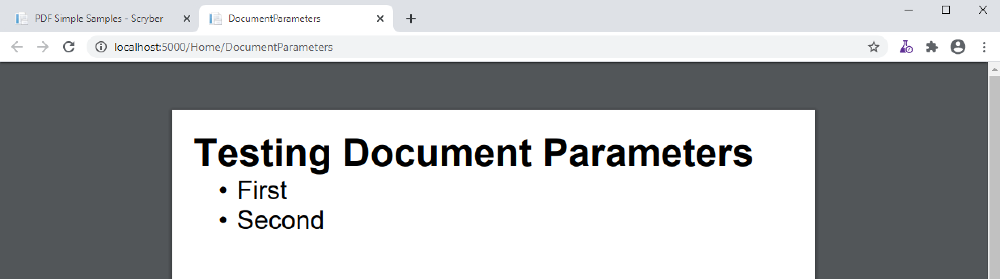
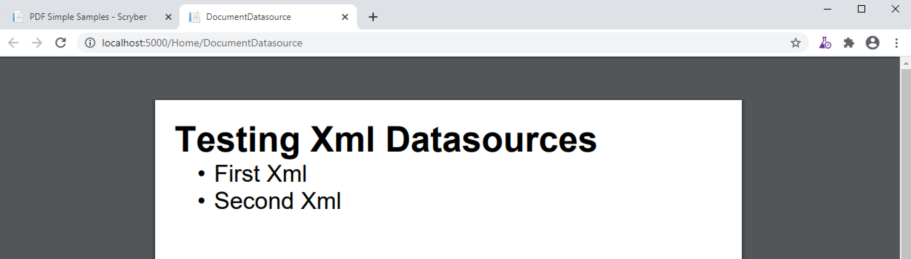
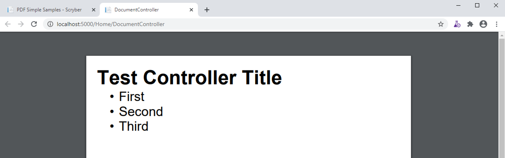

======================================
Passing data to your template
======================================

A document template is just that, a template.
In your code you can add any source of information to be included.

* As an value or model for the parameters
* Bound to an XML datasource (xml, sql or object)
* As a Controller with an event method
* Just in code

And they can be used in your document with many of the data controls

* The document itself
* A Data Grid
* A Data List
* `With` a single entry
* `ForEach` loop

And the content supports as default both object and xpath binding. The notation for an binding on an attribute is 
based on the { and } with a method (@ or xpath for the built in binders), a colon ':', and then finally the selector.

e.g. `attribute='{@:paramName}'` for objects or `attribute='{xpath:selector}'` for xml

The Document parameters
=======================

Every Document can have parameters associated with it.
These should be declared at the top of the Document, in the Params element, for clarity to other developers
(even if the default value is empty).

.. code-block:: xml

    <?xml version="1.0" encoding="utf-8" ?>

    <doc:Document xmlns:doc="http://www.scryber.co.uk/schemas/core/release/v1/Scryber.Components.xsd"
                xmlns:styles="http://www.scryber.co.uk/schemas/core/release/v1/Scryber.Styles.xsd"
                xmlns:data="http://www.scryber.co.uk/schemas/core/release/v1/Scryber.Data.xsd" >
    <Params>
        <!-- Declare a complex object parameter -->
        <doc:Object-Param id="Model" />
    </Params>
    
    <Pages>
        <!-- Use the models 'DocTitle' property for the outline. -->
        <doc:Page outline-title="{@:Model.DocTitle}" styles:margins="20pt">
        <Content>
            <!-- And use it as the text on the heading -->
            <doc:H1 styles:class="title" text="{@:Model.DocTitle}" > </doc:H1>
            
            <doc:Ul>
            <!-- now we loop through the 'Entries' property -->
            <data:ForEach value="{@:Model.Entries}" >
                <Template>
                <doc:Li>
                    <!-- and create a list item for each entry (. prefix) with the name property. -->
                    <doc:Text value="{@:.Name}" />
                </doc:Li>
                </Template>
            </data:ForEach>
            </doc:Ul>
            
        </Content>
        </doc:Page>
    </Pages>
    
    </doc:Document>

And the value can be set or changed at runtime

.. code-block:: csharp

        var model = new { 
            DocTitle = "Testing Document Parameters",
            Entries = new[] {
                    new { Name = "First", Id = "FirstID"},
                    new { Name = "Second", Id = "SecondID" }
                }
        };

        var pdfDoc = PDFDocument.ParseDocument(path);
        pdfDoc.Params["Model"] = model;

        pdfDoc.ProcessDocument(output);

Or passed as the Model in the MVC methods

.. code-block:: csharp

     public IActionResult DocumentParameters()
    {
        var path = _env.ContentRootPath;
        path = System.IO.Path.Combine(path,"Views", "PDF", "DocumentParameters.pdfx");
        
        // This could be any object dynamically built or strongly typed.
        var model = new
        {
            DocTitle = "Testing Document Parameters",
            Entries = new[] {
                    new { Name = "First", Id = "FirstID"},
                    new { Name = "Second", Id = "SecondID" }
                }
        };

        //This method always stores the passed model as the `Model` parameter
        return this.PDF(path, model);
    }

And this will be used in the output.

See :doc:`document_parameters` for full details. 

The Datasources
===============

Putting the document more in control of the data it uses, is supported from the available DataSources and Commands that sit in the `Data` element of the document.

This element should contain all the datasources required by the document.
They can be an XML file, or XML Http request, a SQL database call, an object call, or a json request

e.g. This document has an xml content reference from a remote source (in this case a local host controller method). 
That returns the following content..

.. code-block:: xml

    <?xml version="1.0" encoding="utf-8" ?>
    <DataSources title="Testing Xml Datasources">
        <Entries>
            <Entry Name="First Xml" Id="FirstID" />
            <Entry Name="Second Xml" Id="SecondID" />
        </Entries>
    </DataSources>

And with that we can bind the source into the document

.. code-block:: xml

    <?xml version="1.0" encoding="utf-8" ?>
    <doc:Document xmlns:doc="http://www.scryber.co.uk/schemas/core/release/v1/Scryber.Components.xsd"
                xmlns:styles="http://www.scryber.co.uk/schemas/core/release/v1/Scryber.Styles.xsd"
                xmlns:data="http://www.scryber.co.uk/schemas/core/release/v1/Scryber.Data.xsd" >
        <Data>
            <!-- This is a data source declared witin the document, that pulls the xml from the feed -->
            <data:XMLDataSource id="XmlSource" source-path="http://localhost:5000/Home/Xml" ></data:XMLDataSource>
        </Data>
        <Pages>
            
            <doc:Page styles:margins="20pt">
            <Content>
                <!-- Use the `data:With` component to specify a source and path within the xml as a starting point. -->
                <data:With datasource-id="XmlSource" select="//DataSources" >

                <!-- And use it as the text on the heading -->
                <doc:H1 styles:class="title" text="{xpath:@title}" > </doc:H1>
                
                <doc:Ul>
                    <!-- now we loop through the 'Entries' property -->
                    <data:ForEach value="{xpath:Entries/Entry}" >
                    <Template>
                        <doc:Li>
                        <!-- and create a list item for each entry (. prefix) with the name property. -->
                        <doc:Text value="{xpath:@Name}" />
                        </doc:Li>
                    </Template>
                    </data:ForEach>
                </doc:Ul>
                </data:With>
                
            </Content>
            </doc:Page>
        </Pages>

    </doc:Document>

With the result of the output showing the content.

We could have specified the source on the `data:ForEach`, and alternatively we could have used a Json DataSource to return an object binding.
See :doc:`document_databinding` for more details.

The Document Controller
=======================

The most complex, but utlimately most adaptable is specifying a controller class on your template

The document file or referenced files have Controllers associated with them to handle events and properties.
This gives complete control back to your code during the lifecycle of the document.

It is based on providing a type on the scryber processing instruction 

.. code-block:: xml

    <?scryber controller='Full.Type.Name, Assembly.Name' ?>
    
.. note:: More details of the scryber processing instruction can be found in the :doc:document_structure document.

A full document file example is below.

.. code-block:: xml

    <?xml version="1.0" encoding="utf-8" ?>
    <?scryber controller='Scryber.Core.Samples.Web.Controllers.DocumentControllerInstance, Scryber.Core.Samples.Web' ?>
    <doc:Document xmlns:doc="http://www.scryber.co.uk/schemas/core/release/v1/Scryber.Components.xsd"
                xmlns:styles="http://www.scryber.co.uk/schemas/core/release/v1/Scryber.Styles.xsd"
                xmlns:data="http://www.scryber.co.uk/schemas/core/release/v1/Scryber.Data.xsd"
                on-loaded="LoadDocument" >
    <Pages>

        <doc:Page styles:margins="20pt">
        <Content>
            
            <!-- This will automatically be set on the controller instance property -->
            <doc:H1 id="Title" > </doc:H1>
            
            <doc:Ul>
                <!-- now we call the BindForEach method to set the data value -->
                <data:ForEach on-databinding="BindingForEach" >
                <Template>
                    <!-- and finally we use the item data bound to set the
                        content of the list item for each entry -->
                    <doc:Li on-databound="BoundListItem"></doc:Li>
                </Template>
                </data:ForEach>
            </doc:Ul>

        </Content>
        </doc:Page>
    </Pages>

    </doc:Document>

The document has declared:

* The on-loaded event for LoadDocument.
* It has a heading with ID of Title. 
* A ForEach with a databinding handler
* And a List item inside the template which has binding mapped to another handler.

In our controller we declare explicitly our outlets (properties) and actions (methods).

.. code-block:: csharp

    namespace Scryber.Core.Samples.Web.Controllers
    {
        public class DocumentControllerInstance
        {
            /// 

            /// The Heading will be set on a controller instance from the parser
            /// 

            [PDFOutlet()]
            public PDFHead1 Title
            {
                get;set;
            }

            /// 

            /// Parameterless constructor
            /// 

            public DocumentControllerInstance()
            {
            }

            [PDFAction()]
            public void LoadDocument(object sender, PDFLoadEventArgs args)
            {
                //Document loaded, so set the title text
                this.Title.Text = "Test Controller Title";
            }

            //Just some sample data.
            string[] data = new[] { "First", "Second", "Third" };

            /// 

            /// Happens just before the ForEach is DataBound, so that we can assign the data value, and that will be used.
            /// 

            [PDFAction()]
            public void BindingForEach(object sender, PDFDataBindEventArgs args)
            {
                //Dynamically set the data on the ForEach component - so it will loop through
                var forEach = (Data.PDFForEach)sender;
                forEach.Value = data;
            }

            /// 

            /// Happens 3 times for each of the list items created in the template from the data source.
            /// 

            [PDFAction()]
            public void BoundListItem(object sender, PDFDataBindEventArgs args)
            {
                var listItem = (PDFListItem)sender;
                var index = args.Context.CurrentIndex;
                var text = data[index];
                //Create a new text literal and add it to the listitem
                PDFTextLiteral literal = new PDFTextLiteral(text);
                listItem.Contents.Add(literal);
            }
        }
    }

Generating the file is exaclty the same process but the parser will discover the controller class, apply the outlets and actions, and then execute.
The result should come out with the content dynamically assigned.

.. code-block:: csharp

    public IActionResult DocumentController()
    {
        var path = _rootPath;
        path = System.IO.Path.Combine(path, "Views", "PDF", "DocumentController.pdfx");

        return this.PDF(path);
    }

For more information on controllers and the event model see :doc:`document_controllers` and :doc:`document_lifecycle`

Which should I use?
===================

All 3 methods of generating dynamic content within your template have their own benefits, and they are not mutually exclusive.

* The simplest is using parameters but the model can become too complex. 
    * :doc:`document_parameters`
* Moving the model to one or more data sources can be a quick solution as complexity increases 
    * :doc:`document_databinding`
* Adding a controller gives complete 'control' for complex business logic. 
    * :doc:`document_controllers`
