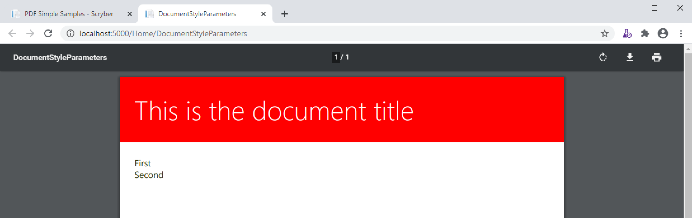
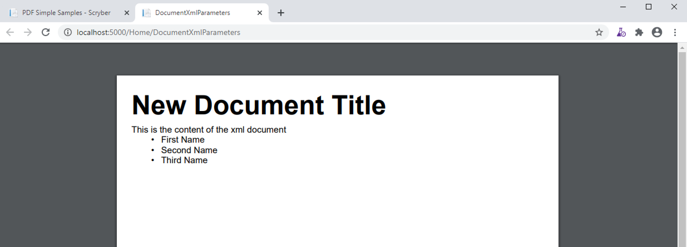
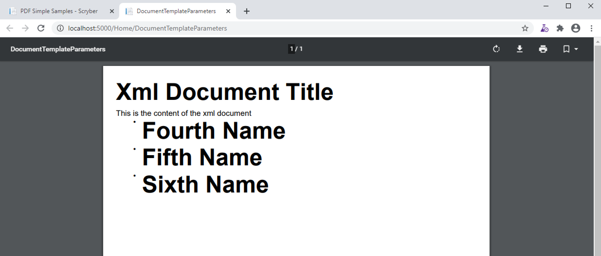

======================================
Parameters and object binding
======================================

The document parameters are values that can be set within the template or in code.
They are able to hold values used through out the generation process (see :doc:`document_lifecycle`) and are passed via the Context to any event handlers.

Declaring and Using in Documents
================================

Document parameters are declared within the `<Params>` element of 
Declaring a parameter in a document is not required for it to be used later on, but is best practice.
It is more readable and supports default values if they do not change.

When referring to a parameter within your document template use the @: binding syntax (or item: syntax) e.g. `{@:MyParamName}`
Then the parser finds a binding reference with this syntax it will create a binding expression that will be evaulated in the :doc:`document_lifecycle` Databinding phase 
and the value applied to the property it was set on.

.. code-block:: xml

    <?xml version="1.0" encoding="utf-8" ?>
    <doc:Document xmlns:doc="http://www.scryber.co.uk/schemas/core/release/v1/Scryber.Components.xsd"
                xmlns:styles="http://www.scryber.co.uk/schemas/core/release/v1/Scryber.Styles.xsd" >
        <Params>
            <!-- Declare the parameters -->
            <doc:Bool-Param id="ShowTitle" value="true" />
            <doc:String-Param id="MyTitle" value="Document Title" />
            <doc:Color-Param id="TitleBg" value="#AAAAAA" />
        </Params>
        
        <Pages>
            <!-- Use the 'MyTitle' parameter for the outline. -->
            <doc:Page outline-title="{@:MyTitle}" styles:margins="20pt" styles:font-size="12pt">
            <Content>
                <!-- And use it as the text on the heading -->
                <doc:H1 visible="{@:ShowTitle}" styles:bg-color="{@:TitleBg}"  text="{@:MyTitle}" > </doc:H1>
                <doc:Para >This is the content of the document</doc:Para>
            </Content>
            </doc:Page>
        </Pages>
    
    </doc:Document>

Generating this document the parameter values are applied to the final output and rendered.

.. code-block:: csharp

    [HttpGet]
    public IActionResult DocumentParameters()
    {
        var path = _rootPath;
        path = System.IO.Path.Combine(path,"Views", "PDF", "DocumentParameters.pdfx");
        var doc = PDFDocument.ParseDocument(path);

        return this.PDF(doc);
    }

And this then output as follows

.. image:: images/documentparameters.png

Changing the values
===================

Parameters are evaluated during the data binding stage of a document creation, so once bound, any changes to the parameters will not be evaluated.
The best time to change the values of a parameters are once it has been parsed, or on the loaded event.

.. code-block:: csharp

    [HttpGet]
    public IActionResult DocumentParameters()
    {
        var path = _rootPath;
        path = System.IO.Path.Combine(path,"Views", "PDF", "DocumentParameters.pdfx");
        var doc = PDFDocument.ParseDocument(path);

        doc.Params["MyTitle"] = "New Document Title";
        doc.Params["TitleBg"] = new PDFColor(255,0,0);

        return this.PDF(doc);
    }

Generating the file will then apply the vaules at binding time to the content and rendering will produce the following output.

.. image:: images/documentparametersupdated.png

It is perfectly acceptable to assign a parameter in the document that is not declared, nor does it have to be typed.

e.g.

.. code-block:: csharp

    [HttpGet]
    public IActionResult DocumentParameters()
    {
        var path = _rootPath;
        path = System.IO.Path.Combine(path,"Views", "PDF", "DocumentParameters.pdfx");
        var doc = PDFDocument.ParseDocument(path);

        doc.Params["MyTitle"] = "New Document Title";
        doc.Params["TitleBg"] = new PDFColor(255,0,0);
        //Undeclared parameter
        doc.Params["Size"] = (PDFUnit)30;
        return this.PDF(doc);
    }

And the used in your template

.. code-block:: xml

    <doc:H1 visible="{@:ShowTitle}" styles:font-size="{@:Size}" styles:bg-color="{@:TitleBg}"  text="{@:MyTitle}" > </doc:H1>

But it will not be co-erced into the correct type, nor will it have a clear initial value.

Simple Parameter Types
======================

Scryber is strongly typed. The xml templates are defined as classes in namespaces and assemblies, and so are the **parameter** declarations.

There are a range of types available, and options for using complex types (see below).

* String-Param: Any string value, the default if not set is null.
* Int-Param: Single integer value, the defult if not set is 0.
* Guid-Param: A GUID value, the default is an empty guid.
* Double-Param: Holds double values, the default is 0.0
* Bool-Param: Boolean (True, False) values, the default is false.
* Date-Param: Date and time values, the default is minimum date time and values are culture sensitive.
* Unit-Param: Holds a :doc:`reference/pdf_unit` value, see :doc:`component_positioning` for more info. The default is empty (zero) unit.
* Color-Param: Holds a :doc:`reference/pdf_color` value, the default is transparent.
* Thickness-Param: Holds a :doc:`reference/pdf_thickness` value (used in padding, margins, clipping etc.). The default is empty (zero) thickness.
* Enum-Param: Has a specific `type` attribute that specifies the type of enum that should be stored. The default is null.

There are 3 other parameter types available XML, Template and Object which are discussed later on in this document.

Complex Object Parameters
=========================

Whilst Scryber Parameters can be simple types, it also supports complex objects that can be traversed.

Our previous example could have been written with a single parameter rather than the 3 individual ones, 
an the values retrieved from the properties on that object.

.. code-block:: xml

    <?xml version="1.0" encoding="utf-8" ?>
    <doc:Document xmlns:doc="http://www.scryber.co.uk/schemas/core/release/v1/Scryber.Components.xsd"
                xmlns:styles="http://www.scryber.co.uk/schemas/core/release/v1/Scryber.Styles.xsd" >
        <Params>
            <!-- Declare the parameters -->
            <doc:Object-Param id="Heading" />
        </Params>
        
        <Pages>
            <!-- Use the 'MyTitle' parameter for the outline. -->
            <doc:Page outline-title="{@:Heading.Title}" styles:margins="20pt" styles:font-size="12pt">
            <Content>
                <!-- And use it as the text on the heading -->
                <doc:H1 visible="{@:Heading.Visible}" styles:bg-color="{@:Heading.Background}"  text="{@:Heading.Title}" > </doc:H1>
                <doc:Para >This is the content of the document</doc:Para>
            </Content>
            </doc:Page>
        </Pages>
    
    </doc:Document>

The dot notation is evaluated at runtime to bind the appropriate value.

.. code-block:: csharp

        [HttpGet]
        public IActionResult DocumentParameters()
        {
            var path = _rootPath;
            path = System.IO.Path.Combine(path,"Views", "PDF", "DocumentParameters.pdfx");
            var doc = PDFDocument.ParseDocument(path);

            //Set the heading param to a new dynamic type.
            doc.Params["Heading"] = new
            {
                Title = "Model Document Title",
                Visible = true,
                Background = "#FF0000"
            };

            return this.PDF(doc);
        }

It is also possible to stronly type the object parameter by specifying the expected **full** type name, so you can be sure the content coming into the template matches.
Inherited types will be acceptable as will interfaces.

.. code-block:: xml

    <Params>
        <!-- Declare the parameters -->
        <doc:Object-Param id="Heading" type="MyNamespace.MyType, MyAssembly" />
    </Params>

.. code-block:: csharp

    doc.Params["Heading"] = new MyNamespace.MyType("Title",true, "#FF0000");

.. note:: If you provide a class that is not assignable to the parameter type a PDFDataException will be raised directly on assignment, so easily troubleshooted.

The MVC model
=============

In the scryber.core.mvc project, there is a special extension method on the controller that accepts not just the document, but also an object as the model.
Within this extension method, the `Model` parameter value will directly be assigned, even if it does not exist.

.. code-block:: csharp

    [HttpGet]
    public IActionResult DocumentParameters()
    {
        var path = _rootPath;
        path = System.IO.Path.Combine(path,"Views", "PDF", "DocumentParameters.pdfx");
        var doc = PDFDocument.ParseDocument(path);

        //Set the heading param to a new dynamic type.
        var model = new MyNamespace.MyType("Title",true, "#FF0000");
        
        return this.PDF(doc, model);
    }

And in your template, you can specify the model type you are expecting.

.. code-block:: xml

    <?xml version="1.0" encoding="utf-8" ?>
    <doc:Document xmlns:doc="http://www.scryber.co.uk/schemas/core/release/v1/Scryber.Components.xsd"
                xmlns:styles="http://www.scryber.co.uk/schemas/core/release/v1/Scryber.Styles.xsd" >
        <Params>
            <!-- Declare the parameters -->
            <doc:Object-Param id="Model" type="MyNamespace.MyType, MyAssembly" />
        </Params>
        
        <Pages>
            <!-- Use the 'MyTitle' parameter for the outline. -->
            <doc:Page outline-title="{@:Model.Title}" styles:margins="20pt" styles:font-size="12pt">
            <Content>
                <!-- And use it as the text on the heading -->
                <doc:H1 visible="{@:Model.Visible}" styles:bg-color="{@:Model.Background}"  text="{@:Model.Title}" > </doc:H1>
                <doc:Para >This is the content of the document</doc:Para>
            </Content>
            </doc:Page>
        </Pages>
    
    </doc:Document>

Combining selector paths
========================

The object selectors support complex notation for retrieving values.

* {@:*dotnotation*} for binding to a paramter passed to the document. This supports complex paths
    * {@:ParamName} for the direct value.
    * {@:ParamName.Property} for getting a property value.
    * {@:ParamName[n]} for getting the n'th value from an array
    * {@:ParamName['key']} for geting a dictionary value based on key.

* The statements can be chained together as long as needed.
    * {@:Model.Property[0].Property['key'].Value}
    * If one of the properties evaluates to null, then the chain will no longer be evaluated, and no value will be set.

Binding to Collections
======================

With complex objects it is possible to bind to object arrays or any other type of collection.
The object that is extracted from the collection at that time will become the current `context`.

To refer to the properties in the current context simply precede the property with a dot (.)

.. code-block:: xml

    <?xml version='1.0' encoding='utf-8' ?>
        <doc:Document xmlns:doc = 'http://www.scryber.co.uk/schemas/core/release/v1/Scryber.Components.xsd'
                    xmlns:styles = 'http://www.scryber.co.uk/schemas/core/release/v1/Scryber.Styles.xsd'
                    xmlns:data = 'http://www.scryber.co.uk/schemas/core/release/v1/Scryber.Data.xsd'
                        >
        <Params>
            <doc:Object-Param id='Model' ></doc:Object-Param>
        </Params>

        <Pages>

        <doc:Section>
            <Content>

                <data:ForEach value='{@:Model.List}' >
                    <Template>
                        <!-- Here we can refer to the current object and set values from properties. -->
                        <doc:Label id='{@:.Id}' text='{@:.Name}' ></doc:Label>
                        <doc:Br/>
                    </Template>
                </data:ForEach>

            </Content>
        </doc:Section>

        </Pages>
    </doc:Document>

And when we are providing the value we can add an array or list.

.. code-block:: csharp

    doc.Params["Model"] = new
    {
        Color = Scryber.Drawing.PDFColors.Aqua,
        List = new[] {
            new { Name = "First", Id = "FirstID"},
            new { Name = "Second", Id = "SecondID" }
        }
    };

For more on looping through content and the available data components see :doc:`document_databinding`

Binding Styles to Parameters
============================

As styles are full qualified members of the document object, they also support databinding to values.

.. code-block:: xml

    <?xml version='1.0' encoding='utf-8' ?>
    <doc:Document xmlns:doc = 'http://www.scryber.co.uk/schemas/core/release/v1/Scryber.Components.xsd'
                    xmlns:styles = 'http://www.scryber.co.uk/schemas/core/release/v1/Scryber.Styles.xsd'
                    xmlns:data = 'http://www.scryber.co.uk/schemas/core/release/v1/Scryber.Data.xsd' >
    <Params>
        <doc:Object-Param id='Model' ></doc:Object-Param>
    </Params>

    <Styles>
        <!-- Bind the head and body styles to the Theme -->
        <styles:Style applied-class='head'>
        <styles:Padding all='20pt'/>
        <styles:Background color='{@:Model.Theme.TitleBg}' />
        <styles:Fill color='{@:Model.Theme.TitleColor}'/>
        <styles:Font family='{@:Model.Theme.TitleFont}' bold='false' italic='false' />
        </styles:Style>

        <styles:Style applied-class='body'>
        <styles:Font family='{@:Model.Theme.BodyFont}' size='{@:Model.Theme.BodySize}' />
        <styles:Fill color='#333300'/>
        <styles:Padding all='20pt'/>
        </styles:Style>

    </Styles>

    <Pages>

        <doc:Section>
        <Content>
            <!-- Specify the class names on the components to use the styles -->
            <doc:H1 styles:class='head' text='{@:Model.Title}' ></doc:H1>
            <doc:Div styles:class='body' >
            <!-- and then loop through -->
            <data:ForEach value='{@:Model.List}' >
                <Template>
                <doc:Label id='{@:.Id}' text='{@:.Name}' ></doc:Label>
                <doc:Br/>
                </Template>
            </data:ForEach>
            </doc:Div>
        </Content>
        </doc:Section>

    </Pages>
    </doc:Document>

And we can generate this content by providing the Theme as well as the List.

.. code-block:: xml

    [HttpGet]
    public IActionResult DocumentStyleParameters()
    {
        var path = _rootPath;
        path = System.IO.Path.Combine(path, "Views", "PDF", "DocumentStyleParameters.pdfx");
        var doc = PDFDocument.ParseDocument(path);

        var model = new
        {
            Title = "This is the document title",
            List = new[] {
                new { Name = "First", Id = "FirstID" },
                new { Name = "Second", Id = "SecondID" }
            },
            Theme = new
            {
                TitleBg = new PDFColor(1,0,0),
                TitleColor = new PDFColor(1,1,1),
                TitleFont = "Segoe UI Light",
                BodyFont = "Segoe UI",
                BodySize = (PDFUnit)12
            }
        };

        return this.PDF(doc, model);
    }

These styles should then be used in the creation of the document

Very quickly our document complexity can grow and then it becomes more important to split the data from the content, and we can do that using the
:doc:`document_datasources` and :doc:`document_controllers`

XML parameters
===============

Along with the object parameters, scryber supports the use of XML as a parameter.
These are just as poweful as objects.

The xml data parameter, similar to the object parameter supports full xpath deep binding, and functions such as substring and concat.
For more details on the xpath syntax see the :doc:`document_datasources`

.. code-block:: xml

    <?xml version="1.0" encoding="utf-8" ?>
    <doc:Document xmlns:doc="http://www.scryber.co.uk/schemas/core/release/v1/Scryber.Components.xsd"
                    xmlns:styles="http://www.scryber.co.uk/schemas/core/release/v1/Scryber.Styles.xsd"
                xmlns:data="http://www.scryber.co.uk/schemas/core/release/v1/Scryber.Data.xsd">
    <Params>
        <!-- Declare the parameters -->
        <doc:String-Param id="MyTitle" value="Document Title" />
        
        <!-- This is the xml content that will be used by default -->
        <doc:Xml-Param id="MyData" >
        <Root>
            <Entry id="First">First Name</Entry>
            <Entry id="Second">Second Name</Entry>
            <Entry id="Third">Third Name</Entry>
        </Root>
        </doc:Xml-Param>
        
    </Params>

    <Pages>
        <!-- Use the 'MyTitle' parameter for the outline. -->
        <doc:Page outline-title="{@:MyTitle}" styles:margins="20pt" styles:font-size="12pt">
        <Content>
            <!-- And use it as the text on the heading with a visble flag and background -->
            <doc:H1  text="{@:MyTitle}" > </doc:H1>
            <doc:Para >This is the content of the xml document</doc:Para>
            
            <doc:Ul>
                <!-- Now bind the content of the MyData parameter into a foreach, with the selector of //Root/Entry 
                    to loop through each one in turn -->
                <data:ForEach value="{@:MyData}" select="//Root/Entry" >
                <Template>
                    <doc:Li >
                    <doc:Text value="{xpath:text()}" />
                    </doc:Li>
                </Template>
                </data:ForEach>
            </doc:Ul>
            
        </Content>
        </doc:Page>
    </Pages>

    </doc:Document>

If we generate this content as is the xml will be bound to the unordered list and created.

.. code-block:: csharp

    [HttpGet]
    public IActionResult DocumentXmlParameters()
    {
        var path = _rootPath;
        path = System.IO.Path.Combine(path, "Views", "PDF", "DocumentXmlParameters.pdfx");
        var doc = PDFDocument.ParseDocument(path);

        doc.Params["MyTitle"] = "New Document Title";

        return this.PDF(doc);
    }

By using the xml data as a template we can generate this dynamically too, or load it from a file, or pull from a service.
The xml parameter will accept XmlNode values, XPathNavigators, and Linq XElements for values, along with strings.

.. code-block:: csharp

    [HttpGet]
    public IActionResult DocumentXmlParameters()
    {
        var path = _rootPath;
        path = System.IO.Path.Combine(path, "Views", "PDF", "DocumentXmlParameters.pdfx");
        var doc = PDFDocument.ParseDocument(path);

        doc.Params["MyTitle"] = "Xml Document Title";

        //Replace the xml content in the MyData parameter
        var ele = new XElement("Root",
            new XElement("Entry", new XAttribute("id", "Fourth"), new XText("Fourth Name")),
            new XElement("Entry", new XAttribute("id", "Fifth"), new XText("Fifth Name")),
            new XElement("Entry", new XAttribute("id", "Sixth"), new XText("Sixth Name"))
            );
        doc.Params["MyData"] = ele;

        return this.PDF(doc);
    }

Generating this file again will render the content with the new xml data.

.. image:: images/documentxmlparameters2.png

Template Parameters
===================

Along with the XML parameter, scryber supports the Template parameter, which is xml content of scryber components.
So you can provide both dynamic data, and dynamic structure to your document at generation time.

.. code-block:: xml

    <?xml version="1.0" encoding="utf-8" ?>
    <doc:Document xmlns:doc="http://www.scryber.co.uk/schemas/core/release/v1/Scryber.Components.xsd"
                    xmlns:styles="http://www.scryber.co.uk/schemas/core/release/v1/Scryber.Styles.xsd"
                xmlns:data="http://www.scryber.co.uk/schemas/core/release/v1/Scryber.Data.xsd">
    <Params>
        <!-- Declare the parameters -->
        <doc:String-Param id="MyTitle" value="Document Title" />
        
        <!-- This is the xml content that will be used by default -->
        <doc:Xml-Param id="MyData" >
        <Root>
            <Entry id="First">First Name</Entry>
            <Entry id="Second">Second Name</Entry>
            <Entry id="Third">Third Name</Entry>
        </Root>
        </doc:Xml-Param>

        <!-- this is the template content. -->
        <doc:Template-Param id="MyContent" >
            <doc:Li><doc:Text value="{xpath:text()}" /></doc:Li>
        </doc:Template-Param>

    </Params>

    <Pages>
        <!-- Use the 'MyTitle' parameter for the outline. -->
        <doc:Page outline-title="{@:MyTitle}" styles:margins="20pt" styles:font-size="12pt">
        <Content>
            <!-- And use it as the text on the heading with a visble flag and background -->
            <doc:H1  text="{@:MyTitle}" > </doc:H1>
            <doc:Para >This is the content of the xml document</doc:Para>
            
            <doc:Ul>
                <!-- Now we specify the template content from the parameter -->
                <data:ForEach value="{@:MyData}" select="//Root/Entry" template="{@:MyContent}" ></data:ForEach>
            </doc:Ul>

            
        </Content>
        </doc:Page>
    </Pages>

    </doc:Document>

Creating this document at runtime pulls the template data from the parameter `MyContent`

We can then change the value in code to use a different template as well as the xml (including any binding statements).

.. code-block:: csharp

     [HttpGet]
    public IActionResult DocumentTemplateParameters()
    {
        var path = _rootPath;
        path = System.IO.Path.Combine(path, "Views", "PDF", "DocumentTemplateParameters.pdfx");
        var doc = PDFDocument.ParseDocument(path);

        doc.Params["MyTitle"] = "Xml Document Title";
        var ele = new XElement("Root",
            new XElement("Entry", new XAttribute("id", "Fourth"), new XText("Fourth Name")),
            new XElement("Entry", new XAttribute("id", "Fifth"), new XText("Fifth Name")),
            new XElement("Entry", new XAttribute("id", "Sixth"), new XText("Sixth Name"))
            );
        doc.Params["MyData"] = ele;

        //Just a simple example to change the template.
        doc.Params["MyTemplate"] = "<doc:Li><doc:H1 text='{xpath:text()}' /></doc:Li>";

        return this.PDF(doc);
    }

The document will then be generated with headings as the content of the list items, rather than just text values.

The following components support the use of the template attrobute to pull the value from a parameter.

* ForEach (see :doc:`reference/data_foreach`)
* PlaceHolder (see :doc:`reference/pdf_placeholder`)
* DataTemplateColumn (see :doc:`reference/data_templatecolumn`)
* Choose When (see :doc:`reference/data_choose`)
* Choose Otherwise (see :doc:`reference/data_choose`)
* If (see :doc:`reference/data_if`)

Passing parameters to References
================================

The final capability for discussion is the use of the parameters when loading referenced files.

This is discussed in detail in the `Overriding and passing data` section of :doc:`referencing_files` and any type of data can be passed
including templates and objects.

It starts to get really fun what you can do!

