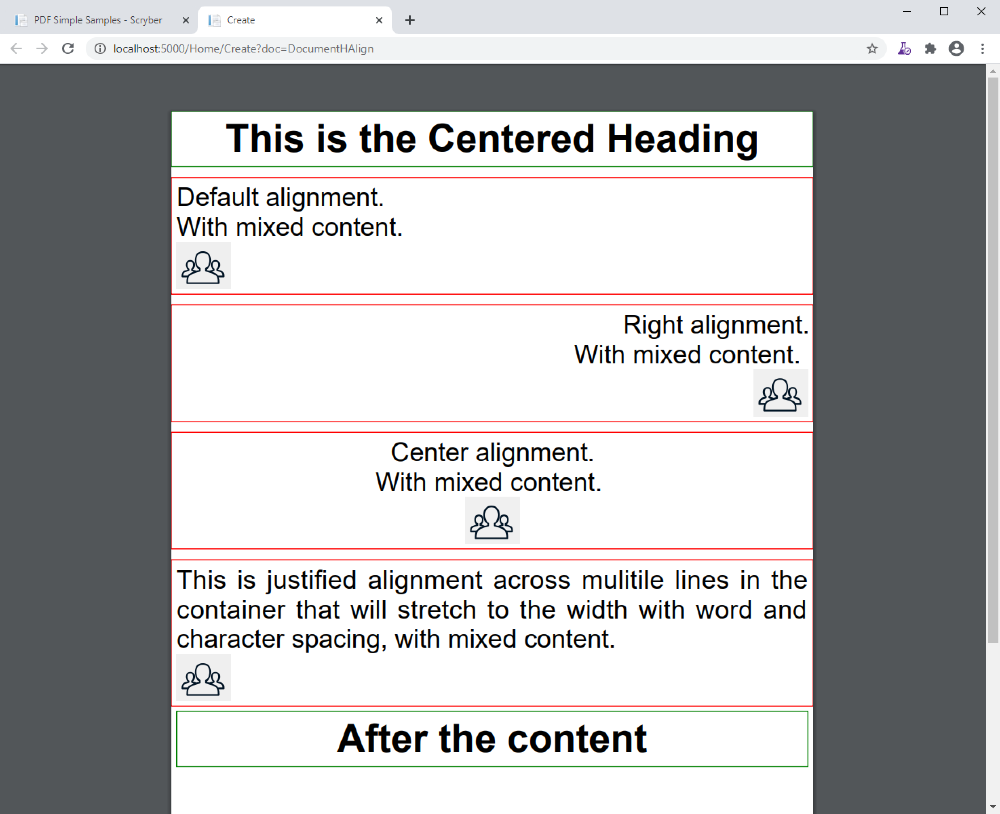

==============================
Aligning your content - td
==============================

Alignment of components in pages, containers and tables is fully supported, as is text alignment.

Unlike html, the alignment is set on the container, rather than the element. So if you set left align on a div, all the content within
the div will be aligned to the left.

Also unlike html, vertical alignment is fully supported, without hacks or fixes. This is because we have a known height of a page or container.

Horizontal Allignment
======================

The alignment of content within a page or container can either be set as the standard values:

* Left (default)
* Right
* Center
* Justified

.. code-block:: xml

    <?xml version="1.0" encoding="utf-8" ?>
    <pdf:Document xmlns:pdf="http://www.scryber.co.uk/schemas/core/release/v1/Scryber.Components.xsd"
                xmlns:styles="http://www.scryber.co.uk/schemas/core/release/v1/Scryber.Styles.xsd"
                xmlns:data="http://www.scryber.co.uk/schemas/core/release/v1/Scryber.Data.xsd" >
    <Styles>
        <styles:Style applied-type="pdf:H1" >
            <styles:Position h-align="Center"/>
            <styles:Border color="green" width="1pt"/>
            <styles:Padding all="5pt"/>
        </styles:Style>

        <styles:Style applied-type="pdf:Div" >
            <styles:Border color="red" width="1pt" />
            <styles:Padding all="5pt"/>
            <styles:Margins top="10pt"/>
        </styles:Style>
    </Styles>
    <Pages>
        <pdf:Section >
            <Content>
                <pdf:H1 >This is the Centered Heading</pdf:H1>
                <pdf:Div>
                    Default alignment.<pdf:Br/>
                    With mixed content.
                    <pdf:Image src="../../content/images/group.png" styles:width="50pt" />
                </pdf:Div>
                <pdf:Div styles:h-align="Right">
                    Right alignment.<pdf:Br/>
                    With mixed content.
                    <pdf:Image src="../../content/images/group.png" styles:width="50pt" />
                </pdf:Div>
                <pdf:Div styles:h-align="Center">
                    Center alignment.<pdf:Br/>
                    With mixed content.
                    <pdf:Image src="../../content/images/group.png" styles:width="50pt" />
                </pdf:Div>
                <pdf:Div styles:h-align="Justified">
                    This is justified alignment across mulitile lines in the container that 
                    will stretch to the width with word and character spacing, with mixed content.
                    <pdf:Image src="../../content/images/group.png" styles:width="50pt" />
                </pdf:Div>
                <pdf:H1 styles:margins="5pt" styles:border-width="1pt" styles:border-color="green" >
                    After the content
                </pdf:H1>
            </Content>
        </pdf:Section>
    </Pages>
    
    </pdf:Document>

