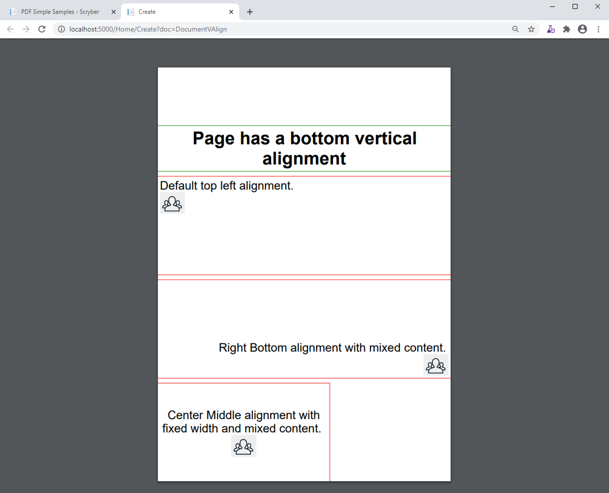
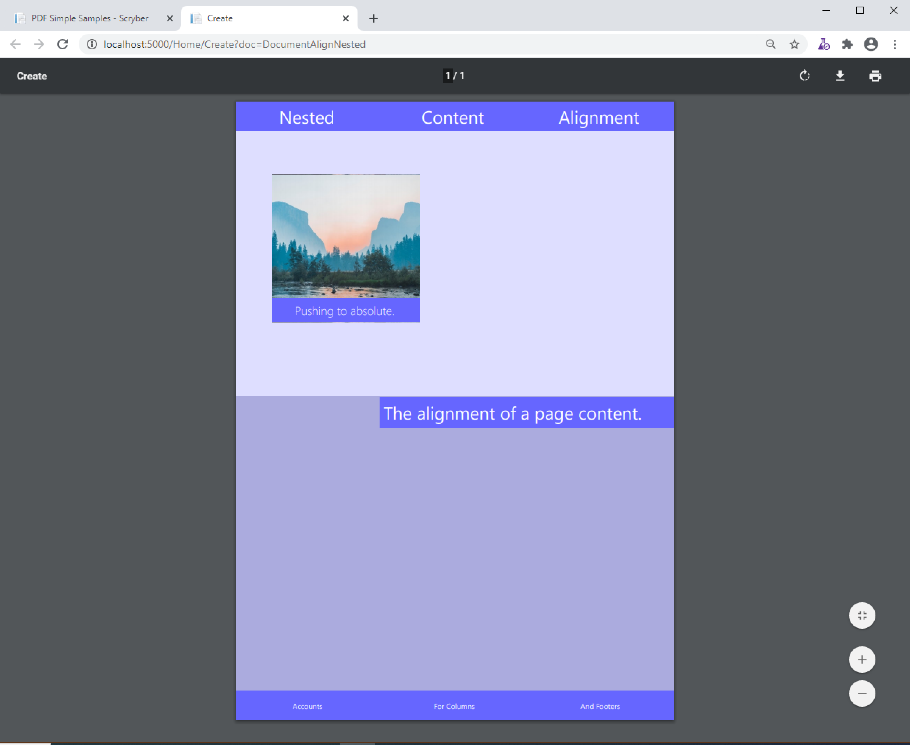

==============================
Aligning your content
==============================

Alignment of components in pages, containers and tables is fully supported, as is text alignment.

Unlike html, the alignment is set on the container, rather than the element. So if you set left align on a div, all the content within
the div will be aligned to the left.

Also unlike html, vertical alignment is fully supported, without hacks or fixes. This is because we have a known height of a page or container.

Horizontal Allignment
======================

The alignment of content within a page or container can either be set as the standard values:

* Left (default)
* Right
* Center
* Justified

.. code-block:: xml

    <?xml version="1.0" encoding="utf-8" ?>
    <pdf:Document xmlns:pdf="http://www.scryber.co.uk/schemas/core/release/v1/Scryber.Components.xsd"
                xmlns:styles="http://www.scryber.co.uk/schemas/core/release/v1/Scryber.Styles.xsd"
                xmlns:data="http://www.scryber.co.uk/schemas/core/release/v1/Scryber.Data.xsd" >
    <Styles>
        <styles:Style applied-type="pdf:H1" >
            <styles:Position h-align="Center"/>
            <styles:Border color="green" width="1pt"/>
            <styles:Padding all="5pt"/>
        </styles:Style>

        <styles:Style applied-type="pdf:Div" >
            <styles:Border color="red" width="1pt" />
            <styles:Padding all="5pt"/>
            <styles:Margins top="10pt"/>
        </styles:Style>
    </Styles>
    <Pages>
        <pdf:Section >
            <Content>
                <pdf:H1 >This is the Centered Heading</pdf:H1>
                <pdf:Div>
                    Default alignment.<pdf:Br/>
                    With mixed content.
                    <pdf:Image src="../../content/images/group.png" styles:width="50pt" />
                </pdf:Div>
                <pdf:Div styles:h-align="Right">
                    Right alignment.<pdf:Br/>
                    With mixed content.
                    <pdf:Image src="../../content/images/group.png" styles:width="50pt" />
                </pdf:Div>
                <pdf:Div styles:h-align="Center">
                    Center alignment.<pdf:Br/>
                    With mixed content.
                    <pdf:Image src="../../content/images/group.png" styles:width="50pt" />
                </pdf:Div>
                <pdf:Div styles:h-align="Justified">
                    This is justified alignment across multiple lines in the container that 
                    will stretch to the width with word and character spacing, with mixed content.
                    <pdf:Image src="../../content/images/group.png" styles:width="50pt" />
                </pdf:Div>
                <pdf:H1>After the content</pdf:H1>
            </Content>
        </pdf:Section>
    </Pages>
    
    </pdf:Document>

.. image:: images/documenthalign.png

Vertical alignment
==================

Along with horizontal alignment vertical alignment can be applied to the page or containers.

.. code-block:: xml

    <?xml version="1.0" encoding="utf-8" ?>
    <pdf:Document xmlns:pdf="http://www.scryber.co.uk/schemas/core/release/v1/Scryber.Components.xsd"
                xmlns:styles="http://www.scryber.co.uk/schemas/core/release/v1/Scryber.Styles.xsd"
                xmlns:data="http://www.scryber.co.uk/schemas/core/release/v1/Scryber.Data.xsd" >
    <Styles>
        <styles:Style applied-type="pdf:H1" >
            <styles:Position h-align="Center"/>
            <styles:Border color="green" width="1pt"/>
            <styles:Padding all="5pt"/>
        </styles:Style>

        <styles:Style applied-type="pdf:Div" >
            <styles:Border color="red" width="1pt" />
            <styles:Padding all="5pt"/>
            <styles:Margins top="10pt"/>
        </styles:Style>
    </Styles>
    <Pages>

        <pdf:Section styles:v-align="Bottom" >
        <Content>
            <pdf:H1 >Page has a bottom vertical alignment</pdf:H1>
            <pdf:Div styles:height="200pt">
                Default top left alignment.
                <pdf:Image src="../../content/images/group.png" styles:width="50pt" />
            </pdf:Div>
            <pdf:Div styles:h-align="Right" styles:v-align="Bottom" styles:height="200pt">
                Right Bottom alignment with mixed content.
                <pdf:Image src="../../content/images/group.png" styles:width="50pt" />
            </pdf:Div>
            <pdf:Div styles:h-align="Center" styles:v-align="Middle" styles:width="350pt" styles:height="200pt">
                Center Middle alignment with fixed width and mixed content.
                <pdf:Image src="../../content/images/group.png" styles:width="50pt" />
            </pdf:Div>
        </Content>
        </pdf:Section>

    </Pages>
    
    </pdf:Document>

.. note:: With containers unless they have a specific height there gerenally will not be any vertical change, because they shrink to their respective heights. However actual heights will support the alligment.

Nested Alignment in containers
==============================

Alignment applies to the containers individually. 
Nesting various alignment attributes on content within a page can be done, 
and also applied to positioned components. 

So complex layouts can be achieved with minimal .

.. code-block:: xml

    <?xml version="1.0" encoding="utf-8" ?>
    <pdf:Document xmlns:pdf="http://www.scryber.co.uk/schemas/core/release/v1/Scryber.Components.xsd"
                xmlns:styles="http://www.scryber.co.uk/schemas/core/release/v1/Scryber.Styles.xsd"
                xmlns:data="http://www.scryber.co.uk/schemas/core/release/v1/Scryber.Data.xsd" >
    <Styles>
        <styles:Style applied-type="pdf:H1" >
            <styles:Position h-align="Center"/>
            <styles:Background color="#6666FF"/>
            <styles:Fill color="white"/>
            <styles:Font size="24pt" family="Segoe UI" bold="false" />
            <styles:Padding all="5pt"/>
        </styles:Style>

        <styles:Style applied-type="pdf:Section" >
            <styles:Font family="Segoe UI Light"/>
        </styles:Style>

        <styles:Style applied-class="floating" >
            <styles:Position mode="Absolute" x="50pt" y="100pt" h-align="Center" v-align="Bottom"/>
            <styles:Size width="200pt" height="200pt"/>
            <styles:Background color="#6666FF" img-src="../../content/images/landscape.jpg" repeat="Fill"/>
            <styles:Fill color="white"/>
        </styles:Style>

    </Styles>
    <Pages>
        <pdf:Section styles:v-align="Bottom" styles:bg-color="#DDDDFF" >
        <Header>
            <pdf:H1 styles:column-count="3" >
            Nested
            <pdf:ColumnBreak/>
            Content
            <pdf:ColumnBreak/>
            Alignment
            </pdf:H1>
        </Header>
        <Content>
            <pdf:Div styles:height="400pt" styles:h-align="Right" styles:bg-color="#AAAADD">
            <pdf:H1 styles:width="400pt" styles:h-align="Left">
                The alignment of a page content.
            </pdf:H1>
            </pdf:Div>

            <pdf:Div styles:class="floating">
            <pdf:Div styles:bg-color="#6666FF" styles:font-size="16pt" styles:h-align="Center" styles:padding="5pt">
                Pushing to absolute.
            </pdf:Div>
            </pdf:Div>
        </Content>
        <Footer>
            <pdf:H1 styles:column-count="3" styles:font-size="10pt" styles:height="40pt" styles:v-align="Middle" >
                Accounts
                <pdf:ColumnBreak/>
                For Columns
                <pdf:ColumnBreak/>
                And Footers
            </pdf:H1>
        </Footer>
        </pdf:Section>
    </Pages>
    
    </pdf:Document>

