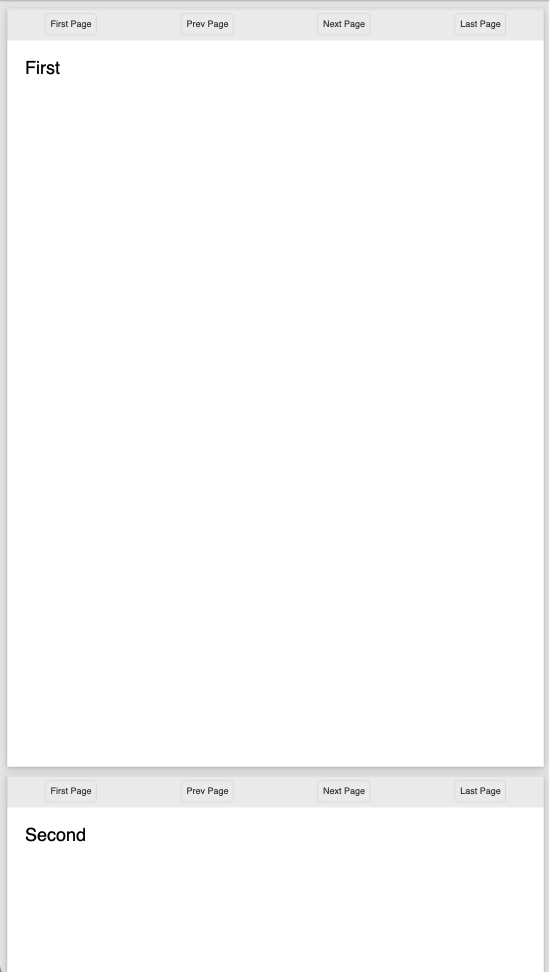
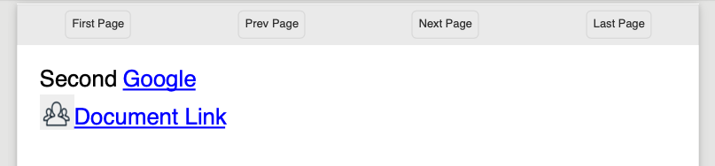

======================================
Links in  and out of documents
======================================

Within a document, it's easy to add a link to another component, another page, 
another document, or remote web link.

The Anchor Component
----------------------

An `a`nchor tag is an invisible component (although styles will be applied to content within it) that allows linking to other components.
The href attribute supports 3 types of content.

* Named Action - These are the standard links to and from pages (see below).
* #id - If set, then the link is an action for a different document or Url. Effectively like the href of an anchor tag in html.
* url - If set then this is the location within the current or other file to show. Like the #name on a Url

The content within a link can be anything, including images; text; svg components and more. 
There can also be more than one component within the link.

Page Named Action
=====================

The simplest link type is navigational. The possible actions are (case insensitive) as follows:

* FirstPage
* PrevPage
* NextPage
* LastPage

These are self-evident in their purpose, and no other attributes need defining.
It does not matter what page they are put on, they will perform the action if possible.

.. code-block:: html

    <a href='nextpage' >Next Page Link</a>

For example we can create a navigation header.

.. code-block:: xml

    <?xml version="1.0" encoding="utf-8" ?>
    <!DOCTYPE HTML PUBLIC "-//W3C//DTD HTML 4.01//EN"
          "http://www.w3.org/TR/html4/strict.dtd">

    <html xmlns='http://www.w3.org/1999/xhtml'>
    <head>
        <title>Navigation Links</title>
        <meta name="author" content="Scryber" />
        
    </head>
    <body style="font-size:20pt;">
        <header>
            <!-- navigation on the header -->
            <nav class="header">
                <a id="first" href="FirstPage">First Page</a>
                <a id="prev" href="PrevPage">Prev Page</a>
                <a id="next" href="NextPage">Next Page</a>
                <a id="last" href="LastPage">Last Page</a>
            </nav>
        </header>
        <!-- Each on it's own page -->
        
First

        
Second

        
Third

        
Fourth

        
Fifth

    </body>
    </html>

.. note:: Some of the browser pdf readers do not support the naviagional links. Readers do.

Linking within documents
===========================

When navigating around the documment, scryber supports the direct linking to a specific page or component using the `destination` attribute.
When using ID's as the destination reference, prefix with a #. Otherwise any desinations will be treated as a name.

It is also possible to assign a destination-fit value, to indicate how the page or component should be presented on the reader window when navigated to.
The supported values are

* FullPage - the entire page will be visible.
* PageWidth - the whole width of the page will be shown, and the destination visible within that window.
* PageHeight - the whole height of the page will be shown, and the destination visible within that window.
* BoundingBox - the bounding box of the component referenced will fill the window as fully as possible.

The below example is quite complex, but shows how to build a basic table of contents. It could also be databound.

.. code-block:: xml

    <?xml version="1.0" encoding="utf-8" ?>
 
    <doc:Document xmlns:doc="http://www.scryber.co.uk/schemas/core/release/v1/Scryber.Components.xsd"
                xmlns:styles="http://www.scryber.co.uk/schemas/core/release/v1/Scryber.Styles.xsd"
                xmlns:data="http://www.scryber.co.uk/schemas/core/release/v1/Scryber.Data.xsd">

    <Styles>

        <styles:Style applied-type="doc:Link" >
            <styles:Font bold="true"/>
            <styles:Fill color="navy"/>
        </styles:Style>

        <styles:Style applied-class="tab-fill" >
            <styles:Stroke dash="Sparse-Dot"/>
            <styles:Position mode="Inline" />
            <!-- hack to push the line down to the baseline -->
            <styles:Padding top="12pt"/>
        </styles:Style>

        <styles:Style applied-type="doc:Cell">
            <styles:Border style="None"/>
            <styles:Padding left="0" right="0"/>
        </styles:Style>

        <styles:Style applied-class="pg-num" >
            <styles:Position h-align="Left" />
            <styles:Padding left="0"/>
        </styles:Style>
    </Styles>
    
        <Pages>
            <doc:Page styles:padding="20pt" styles:font-size="12pt" >
            <Content>
                <doc:H1 styles:margins="0 0 30pt 0">Title Page</doc:H1>
                
                <doc:Table styles:full-width="true">
                    <!-- Just a header cell spanning both columns -->
                    <doc:Header-Row styles:class="toc-head" >
                        <doc:Header-Cell styles:column-span="2" >
                        Table of Contents
                        </doc:Header-Cell>
                    </doc:Header-Row>
                    
                    <!-- First content page by ID -->
                    <doc:Row>
                        <doc:Cell>
                            First Page
                            <doc:Line styles:class="tab-fill" ></doc:Line>
                        </doc:Cell>
                        <doc:Cell styles:width="50pt">
                            <doc:Link destination="#Page1" >
                                <doc:PageOf component="#Page1" />
                            </doc:Link>
                        </doc:Cell>
                    </doc:Row>

                    <!-- Second content page by name (full width) -->
                    <doc:Row>
                        <doc:Cell>
                            Second Page
                            <doc:Line styles:class="tab-fill" ></doc:Line>
                        </doc:Cell>
                        <doc:Cell>
                            <doc:Link destination="SecondPage" destination-fit="FullPage" >
                                <doc:PageOf component="SecondPage" />
                            </doc:Link>
                        </doc:Cell>
                    </doc:Row>

                    <!-- Adding a link directly to a component within the page
                        that will navigate to fill the screen -->
                    <doc:Row>
                        <doc:Cell>
                            Specific Content
                            <doc:Line styles:class="tab-fill" ></doc:Line>
                        </doc:Cell>
                        <doc:Cell>
                            <doc:Link destination="#Div3" destination-fit="BoundingBox" >
                                <doc:PageOf component="#Div3" />
                            </doc:Link>
                        </doc:Cell>
                    </doc:Row>
                
                </doc:Table>
                
            </Content>
            </doc:Page>

            <!-- Reset the page numbering index -->
            <doc:Section styles:page-number-start-index="1">
            <Content>
                <doc:Span id="Page1"  >Content on page 1</doc:Span>
                <doc:PageBreak/>
                
                <doc:Span id="Page2" name="SecondPage" >Content on page 2</doc:Span>
                <doc:PageBreak/>
                
                <!-- A small div relatively positioned on the page-->
                Content 3
                <doc:Div id="Div3" styles:width="100" styles:height="100" styles:x="100" styles:y="100"
                        styles:bg-color="black" styles:fill-color="white" styles:font-size="10pt"
                        styles:padding="20pt">
                    Small Content on the page
                </doc:Div>
            </Content>
            </doc:Section>
    
    </Pages>
    
    </doc:Document>

.. image:: images/documentLinksDestination.png

.. note:: Some of the browser pdf readers do not support the naviagional links. Reader applications generally do.

External Links to Urls
======================

Using the file attribute a remote link can be made to any url.

.. code-block:: xml

    <?xml version="1.0" encoding="utf-8" ?>

    <doc:Document xmlns:doc="http://www.scryber.co.uk/schemas/core/release/v1/Scryber.Components.xsd"
                xmlns:styles="http://www.scryber.co.uk/schemas/core/release/v1/Scryber.Styles.xsd"
                xmlns:data="http://www.scryber.co.uk/schemas/core/release/v1/Scryber.Data.xsd">
    <Params>
        <doc:String-Param id="url2" value="https://www.google.com" />
    </Params>

    <Styles>
        
        <styles:Style applied-type="doc:Link" >
            <styles:Text decoration="Underline"/>
            <styles:Fill color="navy"/>
        </styles:Style>
        
        <styles:Style applied-type="doc:Image" >
            <styles:Border color="navy"/>
            <styles:Padding all="4pt"/>
            <styles:Margins all="10pt"/>
            <styles:Size width="100pt"/>
        </styles:Style>
        
    </Styles>
    
    <Pages>
        
        <doc:Page styles:margins="20pt" styles:font-size="12pt">
        <Content>
            
            <!-- Explicit url on the file attribute, with an action of Uri -->
            <doc:Link action="Uri" file="http://localhost:5000/Home" >
                <doc:Image src="../../Content/Images/Toroid32.png" />
                Link to local host
            </doc:Link>
            
            <doc:Br/>
            <doc:Br/>
            
            <!-- the action will attempt to be dermined if not defined -->
            <doc:Link file="{@:url2}" >
                <doc:Image src="../../Content/Images/Toroid32.png" />
                Link bound to parameter
            </doc:Link>
        </Content>
        </doc:Page>

    </Pages>
    
    </doc:Document>

