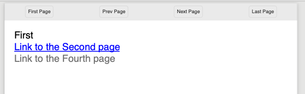

======================================
Links in  and out of documents
======================================

Within a document, it's easy to add a link to another component, another page, 
another document, or remote web link.

The Anchor Component
----------------------

An `a`nchor tag is an invisible component (although styles will be applied to content within it) that allows linking to other components.
The href attribute supports 3 types of content.

* Named Action - These are the standard links to and from pages (see below).
* #id - If set, then the link is an action for a different document or Url. Effectively like the href of an anchor tag in html.
* url - If set then this is the location within the current or other file to show. Like the #name on a Url

The content within a link can be anything, including images; text; svg components and more. 
There can also be more than one component within the link.

Page Named Action
=====================

The simplest link type is navigational. The possible actions are (case insensitive) as follows:

* FirstPage
* PrevPage
* NextPage
* LastPage

These are self-evident in their purpose, and no other attributes need defining.
It does not matter what page they are put on, they will perform the action if possible.

.. code-block:: html

    <a href='nextpage' >Next Page Link</a>

For example we can create a navigation header.

.. code-block:: xml

    <?xml version="1.0" encoding="utf-8" ?>
    <!DOCTYPE HTML PUBLIC "-//W3C//DTD HTML 4.01//EN"
          "http://www.w3.org/TR/html4/strict.dtd">

    <html xmlns='http://www.w3.org/1999/xhtml'>
    <head>
        <title>Navigation Links</title>
        <meta name="author" content="Scryber" />
        
    </head>
    <body style="font-size:20pt;">
        <header>
            <!-- navigation on the header -->
            <nav class="header">
                <a href="FirstPage">First Page</a>
                <a href="PrevPage">Prev Page</a>
                <a href="NextPage">Next Page</a>
                <a href="LastPage">Last Page</a>
            </nav>
        </header>
        <!-- Each on it's own page -->
        
First

        
Second

        
Third

        
Fourth

        
Fifth

    </body>
    </html>

.. image:: images/documentLinksNav.png

.. note:: Some of the browser pdf readers do not support the naviagional links. Readers do.

Linking within documents
------------------------

When navigating around the documment, scryber supports the direct linking to a specific page or component 
using the id being referenced attribute. Prefix with a # to identify the tag .

By default anchor links will be underlined and in blue. But can be styled as needed.

.. code-block:: html

    <?xml version="1.0" encoding="utf-8" ?>
 
    

        First  
        <a href="#second" >Link to the Second page</a>
         
        <a href="#fourth" style="text-decoration:none; color:gray;" >Link to the Fourth page</a>
    

    
Second

    
Third

    

        Fourth  
        <a href="#first" >Link to the first page</a>
    

    
Fifth

External Links to Urls
-----------------------

Using the href attribute a remote link can be made to any url or local document.
Links can also contain images or any other content, and can use the target='_blank' to open in a new tab.

.. code-block:: xml

     <!-- A web link to the google home page -->
    <a href="https://www.google.com" target="_blank" >Google</a> 

    <!-- a link to a local pdf that will open in a new readr tab or window -->
    <a alt="Document Link" href="ReadMeSample.pdf" target="_blank" >
        Document Link</a>
    

.. image:: images/documentLinksUrls.png

.. note:: Some of the browser pdf readers do not support the full navigaional links capabilities (or allow them). Reader applications generally do.