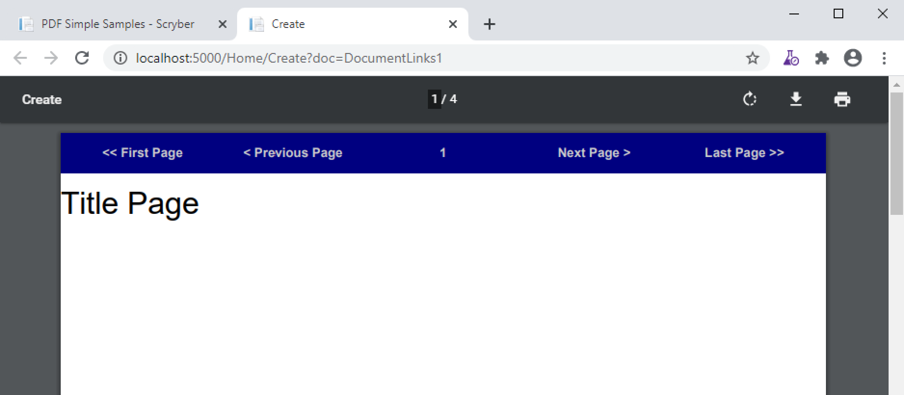

======================================
Links in  and out of documents
======================================

Within a document, it's easy to add a link to another component, another page, 
another document, or remote web link.

The Link Component
==================

A `pdf:Link` is an invisible component, although styles will be applied to content within it.
There are 4 properties that determine what happens when the content within the link is clicked.

* action - This defines the primary type of link action to perform, each section below describes each type of action.
* file - If set, then the link is an action for a different document or Url. Effectively like the href of an anchor tag in html.
* destination - If set then this is the location within the current or other file to show. Like the #name on a Url
* destination-fit - If set, it defines the fit type for the link (full page, width, height, or bounds).

The content within a link can be anything, including images; text; canvas(es) and more. There can also be more than one component within the link.

Page Navigation Link
=====================

The simplest link type is navigational. The possible actions are as follows:

* FirstPage
* PrevPage
* NextPage
* LastPage

These are self-evident in their purpose, and no other attributes need defining.
It does not matter what page they are put on, they will perform the action if possible.

.. code-block:: xml

    <?xml version="1.0" encoding="utf-8" ?>

    <pdf:Document xmlns:pdf="http://www.scryber.co.uk/schemas/core/release/v1/Scryber.Components.xsd"
                xmlns:styles="http://www.scryber.co.uk/schemas/core/release/v1/Scryber.Styles.xsd"
                xmlns:data="http://www.scryber.co.uk/schemas/core/release/v1/Scryber.Data.xsd">
    <Params>
        <pdf:String-Param id="search" value="https://www.google.com" />
    </Params>

    <Styles>

        <styles:Style applied-class="nav" >
        <styles:Background color="navy"/>
        <styles:Font size="10pt" bold="true"/>
        <styles:Position h-align="Center"/>
        <styles:Fill color="#CCC"/>
        <styles:Padding all="10pt"/>
        <styles:Margins bottom="10pt"/>
        <styles:Columns count="5"/>
        </styles:Style>
        
    </Styles>
    <Pages>

        <pdf:PageGroup>
        <Header>
            <!-- Shared header across all pages with 5 columns -->
            <pdf:Div styles:class="nav" >
                <pdf:Link action="FirstPage" >&lt;&lt; First Page</pdf:Link>
                <pdf:ColumnBreak/>
                <pdf:Link action="PrevPage">&lt; Previous Page</pdf:Link>
                <pdf:ColumnBreak/>
                <pdf:PageNumber />
                <pdf:ColumnBreak/>
                <pdf:Link action="NextPage" > Next Page &gt;</pdf:Link>
                <pdf:ColumnBreak/>
                <pdf:Link action="LastPage">Last Page &gt;&gt;</pdf:Link>
            </pdf:Div>
        </Header>
        <Pages>
            <!-- Title page and 3 following pages -->
            <pdf:Page >
            <Content>Title Page</Content>
            </pdf:Page>

            <pdf:Section>
            <Content>
                Content 1
                <pdf:PageBreak/>
                Content 2
                <pdf:PageBreak/>
                Content 3
            </Content>
            </pdf:Section>
        </Pages>
        </pdf:PageGroup>

    
    </Pages>
    
    </pdf:Document>

.. note:: Some of the browser pdf readers do not support the naviagional links. Readers do.

Linking within documents
===========================

When navigating around the documment, scryber supports the direct linking to a specific page or component using the `destination` attribute.
When using ID's as the destination reference, prefix with a #. Otherwise any desinations will be treated as a name.

It is also possible to assign a destination-fit value, to indicate how the page or component should be presented on the reader window when navigated to.
The supported values are

* FullPage - the entire page will be visible.
* PageWidth - the whole width of the page will be shown, and the destination visible within that window.
* PageHeight - the whole height of the page will be shown, and the destination visible within that window.
* BoundingBox - the bounding box of the component referenced will fill the window as fully as possible.

The below example is quite complex, but shows how to build a basic table of contents. It could also be databound.

.. code-block:: xml

    <?xml version="1.0" encoding="utf-8" ?>
 
    <pdf:Document xmlns:pdf="http://www.scryber.co.uk/schemas/core/release/v1/Scryber.Components.xsd"
                xmlns:styles="http://www.scryber.co.uk/schemas/core/release/v1/Scryber.Styles.xsd"
                xmlns:data="http://www.scryber.co.uk/schemas/core/release/v1/Scryber.Data.xsd">

    <Styles>

        <styles:Style applied-type="pdf:Link" >
            <styles:Font bold="true"/>
            <styles:Fill color="navy"/>
        </styles:Style>

        <styles:Style applied-class="tab-fill" >
            <styles:Stroke dash="Sparse-Dot"/>
            <styles:Position mode="Inline" />
            <!-- hack to push the line down to the baseline -->
            <styles:Padding top="12pt"/>
        </styles:Style>

        <styles:Style applied-type="pdf:Cell">
            <styles:Border style="None"/>
            <styles:Padding left="0" right="0"/>
        </styles:Style>

        <styles:Style applied-class="pg-num" >
            <styles:Position h-align="Left" />
            <styles:Padding left="0"/>
        </styles:Style>
    </Styles>
    
        <Pages>
            <pdf:Page styles:padding="20pt" styles:font-size="12pt" >
            <Content>
                <pdf:H1 styles:margins="0 0 30pt 0">Title Page</pdf:H1>
                
                <pdf:Table styles:full-width="true">
                    <!-- Just a header cell spanning both columns -->
                    <pdf:Header-Row styles:class="toc-head" >
                        <pdf:Header-Cell styles:column-span="2" >
                        Table of Contents
                        </pdf:Header-Cell>
                    </pdf:Header-Row>
                    
                    <!-- First content page by ID -->
                    <pdf:Row>
                        <pdf:Cell>
                            First Page
                            <pdf:Line styles:class="tab-fill" ></pdf:Line>
                        </pdf:Cell>
                        <pdf:Cell styles:width="50pt">
                            <pdf:Link destination="#Page1" >
                                <pdf:PageOf component="#Page1" />
                            </pdf:Link>
                        </pdf:Cell>
                    </pdf:Row>

                    <!-- Second content page by name (full width) -->
                    <pdf:Row>
                        <pdf:Cell>
                            Second Page
                            <pdf:Line styles:class="tab-fill" ></pdf:Line>
                        </pdf:Cell>
                        <pdf:Cell>
                            <pdf:Link destination="SecondPage" destination-fit="FullPage" >
                                <pdf:PageOf component="SecondPage" />
                            </pdf:Link>
                        </pdf:Cell>
                    </pdf:Row>

                    <!-- Adding a link directly to a component within the page
                        that will navigate to fill the screen -->
                    <pdf:Row>
                        <pdf:Cell>
                            Specific Content
                            <pdf:Line styles:class="tab-fill" ></pdf:Line>
                        </pdf:Cell>
                        <pdf:Cell>
                            <pdf:Link destination="#Div3" destination-fit="BoundingBox" >
                                <pdf:PageOf component="#Div3" />
                            </pdf:Link>
                        </pdf:Cell>
                    </pdf:Row>
                
                </pdf:Table>
                
            </Content>
            </pdf:Page>

            <!-- Reset the page numbering index -->
            <pdf:Section styles:page-number-start-index="1">
            <Content>
                <pdf:Span id="Page1"  >Content on page 1</pdf:Span>
                <pdf:PageBreak/>
                
                <pdf:Span id="Page2" name="SecondPage" >Content on page 2</pdf:Span>
                <pdf:PageBreak/>
                
                <!-- A small div relatively positioned on the page-->
                Content 3
                <pdf:Div id="Div3" styles:width="100" styles:height="100" styles:x="100" styles:y="100"
                        styles:bg-color="black" styles:fill-color="white" styles:font-size="10pt"
                        styles:padding="20pt">
                    Small Content on the page
                </pdf:Div>
            </Content>
            </pdf:Section>
    
    </Pages>
    
    </pdf:Document>

.. image:: images/documentLinksDestination.png

.. note:: Some of the browser pdf readers do not support the naviagional links. Reader applications generally do.

External Links to Urls
======================

Using the file attribute a remote link can be made to any url.

.. code-block:: xml

    <?xml version="1.0" encoding="utf-8" ?>

    <pdf:Document xmlns:pdf="http://www.scryber.co.uk/schemas/core/release/v1/Scryber.Components.xsd"
                xmlns:styles="http://www.scryber.co.uk/schemas/core/release/v1/Scryber.Styles.xsd"
                xmlns:data="http://www.scryber.co.uk/schemas/core/release/v1/Scryber.Data.xsd">
    <Params>
        <pdf:String-Param id="url2" value="https://www.google.com" />
    </Params>

    <Styles>
        
        <styles:Style applied-type="pdf:Link" >
            <styles:Text decoration="Underline"/>
            <styles:Fill color="navy"/>
        </styles:Style>
        
        <styles:Style applied-type="pdf:Image" >
            <styles:Border color="navy"/>
            <styles:Padding all="4pt"/>
            <styles:Margins all="10pt"/>
            <styles:Size width="100pt"/>
        </styles:Style>
        
    </Styles>
    
    <Pages>
        
        <pdf:Page styles:margins="20pt" styles:font-size="12pt">
        <Content>
            
            <!-- Explicit url on the file attribute, with an action of Uri -->
            <pdf:Link action="Uri" file="http://localhost:5000/Home" >
                <pdf:Image src="../../Content/Images/Toroid32.png" />
                Link to local host
            </pdf:Link>
            
            <pdf:Br/>
            <pdf:Br/>
            
            <!-- the action will attempt to be dermined if not defined -->
            <pdf:Link file="{@:url2}" >
                <pdf:Image src="../../Content/Images/Toroid32.png" />
                Link bound to parameter
            </pdf:Link>
        </Content>
        </pdf:Page>

    </Pages>
    
    </pdf:Document>

.. image:: images/documentLinksUrls.png

