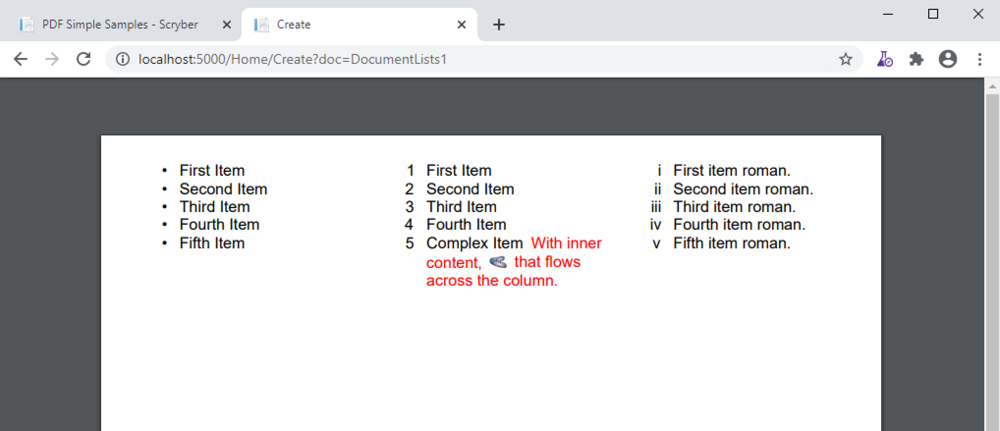
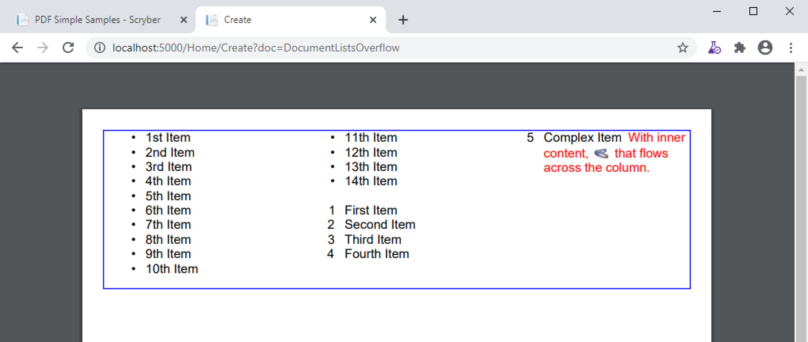
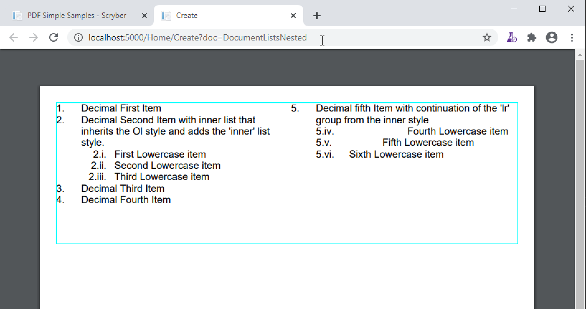
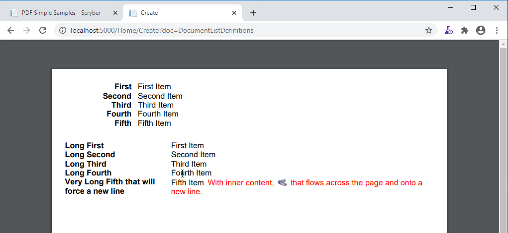
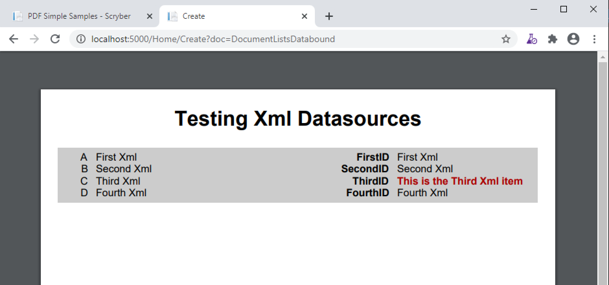

=======================================
Unordered, Ordered and Definition Lists
=======================================

Scryber supports the use of lists both ordered and unordered and allows nesting, overflow, and definition lists.
It also supports the use of binding and repeating.

Unordered and ordered lists
===========================

Scryber uses the pdf:List as the generic component with a default bullet style, but same 
tags as Html for the Ordered Lists (pdf:Ol) and Unordered Lists (pdf:Ul) as short hand for these variants.

The contents of a list item (pdf:Li) can be any form of content (inline or otherwise).
The entire list item will move.

.. code-block:: xml

    <?xml version="1.0" encoding="utf-8" ?>

    <pdf:Document xmlns:pdf="http://www.scryber.co.uk/schemas/core/release/v1/Scryber.Components.xsd"
                xmlns:styles="http://www.scryber.co.uk/schemas/core/release/v1/Scryber.Styles.xsd"
                xmlns:data="http://www.scryber.co.uk/schemas/core/release/v1/Scryber.Data.xsd">
    <Pages>

        <pdf:Page styles:margins="20pt" styles:font-size="12pt" styles:column-count="3">
            <Content>
                
                <pdf:Ul>
                    <pdf:Li >First Item</pdf:Li>
                    <pdf:Li >Second Item</pdf:Li>
                    <pdf:Li >Third Item</pdf:Li>
                    <pdf:Li >Fourth Item</pdf:Li>
                    <pdf:Li >Fifth Item</pdf:Li>
                </pdf:Ul>

                <pdf:ColumnBreak/>

                <pdf:Ol>
                    <pdf:Li >First Item</pdf:Li>
                    <pdf:Li >Second Item</pdf:Li>
                    <pdf:Li >Third Item</pdf:Li>
                    <pdf:Li >Fourth Item</pdf:Li>
                    <pdf:Li >
                        Complex Item
                        <pdf:Span styles:fill-color="red">
                        With inner content,
                        <pdf:Image src="../../Content/Images/Toroid24.png" styles:width="18pt" styles:position-mode="Inline" />
                        that flows across the column.
                        </pdf:Span>
                    </pdf:Li>
                </pdf:Ol>

                <pdf:ColumnBreak/>

                <pdf:List styles:number-style="LowercaseRoman">
                    <pdf:Li>First item roman.</pdf:Li>
                    <pdf:Li>Second item roman.</pdf:Li>
                    <pdf:Li>Third item roman.</pdf:Li>
                    <pdf:Li>Fourth item roman.</pdf:Li>
                    <pdf:Li>Fifth item roman.</pdf:Li>
                </pdf:List>
                
            </Content>
        </pdf:Page>

    
    </Pages>
    
    </pdf:Document>

Overflowing list items
======================

As with table rows (see :doc:`component_tables`) the list items are not designed to be split across columns or pages.
They will attempt to keep together and bring any numbers, bullets or defitions with them.

.. code-block:: xml

    <?xml version="1.0" encoding="utf-8" ?>

    <pdf:Document xmlns:pdf="http://www.scryber.co.uk/schemas/core/release/v1/Scryber.Components.xsd"
                xmlns:styles="http://www.scryber.co.uk/schemas/core/release/v1/Scryber.Styles.xsd"
                xmlns:data="http://www.scryber.co.uk/schemas/core/release/v1/Scryber.Data.xsd">
    <Pages>

        <pdf:Page styles:margins="20pt" styles:font-size="12pt" >
            <Content>

                <pdf:Div styles:column-count="3" styles:height="150" styles:border-color="blue">
                <pdf:Ul>
                    <pdf:Li >1st Item</pdf:Li>
                    <pdf:Li >2nd Item</pdf:Li>
                    <pdf:Li >3rd Item</pdf:Li>
                    <pdf:Li >4th Item</pdf:Li>
                    <pdf:Li >5th Item</pdf:Li>
                    <pdf:Li >6th Item</pdf:Li>
                    <pdf:Li >7th Item</pdf:Li>
                    <pdf:Li >8th Item</pdf:Li>
                    <pdf:Li >9th Item</pdf:Li>
                    <pdf:Li >10th Item</pdf:Li>
                    <pdf:Li >11th Item</pdf:Li>
                    <pdf:Li >12th Item</pdf:Li>
                    <pdf:Li >13th Item</pdf:Li>
                    <pdf:Li >14th Item</pdf:Li>
                </pdf:Ul>
                
                <pdf:Br/>
                
                <pdf:Ol>
                    <pdf:Li >First Item</pdf:Li>
                    <pdf:Li >Second Item</pdf:Li>
                    <pdf:Li >Third Item</pdf:Li>
                    <pdf:Li >Fourth Item</pdf:Li>
                    <pdf:Li >
                    Complex Item
                    <pdf:Span styles:fill-color="red">
                        With inner content,
                        <pdf:Image src="../../Content/Images/Toroid24.png" styles:width="18pt" styles:position-mode="Inline" />
                        that flows across the column.
                    </pdf:Span>
                    </pdf:Li>
                </pdf:Ol>
                
                </pdf:Div>

                
            </Content>
        </pdf:Page>

    
    </Pages>
    
    </pdf:Document>

List styles and grouping
========================

The list number-style supports the following options.

* Decimals (1, 2, 3, 4)
* LowercaseRoman (i, ii, iii, iv)
* UppercaseRoman (I, II, III, IV)
* LowercaseLetters (a, b, c, d)
* UppercaseLetters (A, B, C, D)
* Bullets (•, •, •, •)
* Labels (see `Definition Lists`_ below)
* None

Along with the style of the list entries, the pdf:List; pdf:Ol; pdf:Ul also support the following style options.

* number-alignment - Left, Middle, Right (default), Justify. Specifies the horizontal alignment of the number based on the content.
* number-concat - true or false. If the list is nested, a true value will concatenate the list number with the previous list.
* number-group - A group name. Number groups follow consecutively in the whole document. By default this is blank (and not used), but can be set to any value.
* number-inset - The space allowed to the left of the item for the bullet, number or label.
* number-prefix - A string that appears before the number in the list item.
* number-postfix - A string that appears after the number in the list item.

For nested lists, the prefix and postfix will be honoured in any concatenation. (see below)

The number-alignment and number-inset can also be applied to individual list items within any of the lists.

Nesting Lists
=============

Lists can be nested to any level, but the overflow rule still applies. The top level item cannot be split.

Using the number-concat and prefix / postfix the numbers can be built up within the lists.

.. code-block:: xml

    <?xml version="1.0" encoding="utf-8" ?>

    <pdf:Document xmlns:pdf="http://www.scryber.co.uk/schemas/core/release/v1/Scryber.Components.xsd"
                xmlns:styles="http://www.scryber.co.uk/schemas/core/release/v1/Scryber.Styles.xsd"
                xmlns:data="http://www.scryber.co.uk/schemas/core/release/v1/Scryber.Data.xsd">
    <Styles>
        <styles:Style applied-type="pdf:Ol" >
            <styles:List number-style="Decimals" number-postfix="."/>
        </styles:Style>
        
        <styles:Style applied-class="inner" >
            <styles:List number-style="LowercaseRoman" number-concat="true" number-group="lr"/>
        </styles:Style>
    </Styles>
    <Pages>

        <pdf:Page styles:margins="20pt" styles:font-size="12pt" >
            <Content>

                <pdf:Div styles:column-count="2" styles:height="170pt" styles:border-color="aqua">
                
                <pdf:Ol styles:number-alignment="Left" styles:number-inset="20pt">
                    <pdf:Li >Decimal First Item</pdf:Li>
                    <pdf:Li >
                        Decimal Second Item with inner list that inherits the Ol style and adds the 'inner' list style.
                        <pdf:Ol styles:class="inner" >
                            <pdf:Li>First Lowercase item</pdf:Li>
                            <pdf:Li>Second Lowercase item</pdf:Li>
                            <pdf:Li>Third Lowercase item</pdf:Li>
                        </pdf:Ol>
                    </pdf:Li>
                    <pdf:Li >Decimal Third Item</pdf:Li>
                    <pdf:Li >Decimal Fourth Item 
                </pdf:Li>
                    <pdf:Li>
                        Decimal fifth Item with continuation of the 'lr' group from the inner style
                        <pdf:Ol styles:class="inner" >
                            <pdf:Li styles:number-alignment="Left" styles:number-inset="100pt">Fourth Lowercase item</pdf:Li>
                            <pdf:Li styles:number-alignment="Left" styles:number-inset="70pt">Fifth Lowercase item</pdf:Li>
                            <pdf:Li styles:number-alignment="Left" styles:number-inset="30pt">Sixth Lowercase item</pdf:Li>
                        </pdf:Ol>
                    </pdf:Li>
                </pdf:Ol>
                </pdf:Div>
                
            </Content>
         </pdf:Page>

    </Pages>
    
    </pdf:Document>

Definition Lists
================

Definition lists are slightly different as they use the pdf:Dl and pdf:Di components, with the item-label style value rather than a bullet or number.
They also have a default inset of 100pt, rather than 30pt to fit the label content. 

This can be changed using the number inset, and number alignment.

.. code-block:: xml

    <?xml version="1.0" encoding="utf-8" ?>

    <pdf:Document xmlns:pdf="http://www.scryber.co.uk/schemas/core/release/v1/Scryber.Components.xsd"
                xmlns:styles="http://www.scryber.co.uk/schemas/core/release/v1/Scryber.Styles.xsd"
                xmlns:data="http://www.scryber.co.uk/schemas/core/release/v1/Scryber.Data.xsd">
    <Pages>

        <pdf:Page styles:margins="20pt" styles:font-size="12pt" >
            <Content>
                
                <pdf:Dl styles:margins="0 0 20 0">
                    <pdf:Di styles:item-label="First" >First Item</pdf:Di>
                    <pdf:Di styles:item-label="Second" >Second Item</pdf:Di>
                    <pdf:Di styles:item-label="Third" >Third Item</pdf:Di>
                    <pdf:Di styles:item-label="Fourth" >Fourth Item</pdf:Di>
                    <pdf:Di styles:item-label="Fifth" >Fifth Item</pdf:Di>
                </pdf:Dl>

                <pdf:Dl styles:number-inset="150pt" styles:number-alignment="Left">
                    <pdf:Di styles:item-label="Long First" >First Item</pdf:Di>
                    <pdf:Di styles:item-label="Long Second" >Second Item</pdf:Di>
                    <pdf:Di styles:item-label="Long Third" >Third Item</pdf:Di>
                    <pdf:Di styles:item-label="Long Fourth" >Fourth Item</pdf:Di>
                    <pdf:Di styles:item-label="Very Long Fifth that will force a new line" >
                        Fifth Item
                        <pdf:Span styles:fill-color="red">
                        With inner content,
                        <pdf:Image src="../../Content/Images/Toroid24.png" styles:width="18pt" styles:position-mode="Inline" />
                        that flows across the page and onto a new line.
                        </pdf:Span>
                    </pdf:Di>
                </pdf:Dl>
                
            </Content>
        </pdf:Page>

    
    </Pages>
    
    </pdf:Document>

Binding List items
==================

Just as with tables and any other content , lists fully support data binding (at any level),
 and can take data from eitehr the parameters or and explicit datasource.

See :doc:`binding_databinding` for more on how to set up sources and get data into a document.

.. code-block:: xml

    <?xml version="1.0" encoding="utf-8" ?>

    <pdf:Document xmlns:pdf="http://www.scryber.co.uk/schemas/core/release/v1/Scryber.Components.xsd"
                xmlns:styles="http://www.scryber.co.uk/schemas/core/release/v1/Scryber.Styles.xsd"
                xmlns:data="http://www.scryber.co.uk/schemas/core/release/v1/Scryber.Data.xsd">
    
        <Styles>

            <styles:Style applied-class="first">
                <styles:Position h-align="Center"/>
                <styles:Size width="300pt"/>
            </styles:Style>
            
        </Styles>
        <Data>
            
            <!-- Custom data source that will provide the data. -->
            <data:XMLDataSource id="Content" source-path="http://localhost:5000/Home/Xml" ></data:XMLDataSource>
        </Data>
        <Pages>

            <pdf:Section styles:margins="20pt" styles:font-size="12pt">
            <Content>
                
                <data:With datasource-id="Content"  select="DataSources">
                
                <pdf:H3 styles:h-align="Center" styles:margins="0 0 20 0" text="{xpath:@title}" />
                
                <pdf:Div styles:column-count="2" styles:padding="4pt" styles:bg-color="#CCC" >
                    
                    <!-- simple list binding on the Name attribute of each of the Entry(s) -->
                    <pdf:Ol styles:number-style="UppercaseLetters" >
                        <data:ForEach value="{xpath:Entries/Entry}" >
                            <Template>
                            <pdf:Li >
                                <pdf:Text value="{xpath:@Name}" />
                            </pdf:Li>
                            </Template>
                        </data:ForEach>
                    </pdf:Ol>

                    <pdf:ColumnBreak />
                    <!-- Using a definition list with the binding. -->
                    <pdf:Dl>
                    <data:ForEach value="{xpath:Entries/Entry}" >
                        <Template>
                        <data:Choose>

                            <!-- Set up the test for then we have an Id of 'ThirdID'-->
                            <data:When test="{xpath:@Id = 'ThirdID'}" >
                                <Template>

                                    <!-- Complex content for this item -->
                                    <pdf:Di styles:item-label="{xpath:@Id}" >
                                        <pdf:Span styles:font-bold="true" styles:fill-color="#AA0000" >
                                            <pdf:Text value="{xpath:concat('This is the ',@Name,' item')}" />
                                        </pdf:Span>
                                    </pdf:Di>
                                </Template>
                            </data:When>

                            <!-- Just a simple item otherwise -->
                            <data:Otherwise>
                                <Template>
                                    <pdf:Di styles:item-label="{xpath:@Id}" >
                                        <pdf:Text value="{xpath:@Name}" />
                                    </pdf:Di>
                                </Template>
                            </data:Otherwise>

                        </data:Choose>
                        </Template>
                    </data:ForEach>

                    </pdf:Dl>
                </pdf:Div>
                
                </data:With>

            </Content>
            </pdf:Section>

    </Pages>
    
    </pdf:Document>

And a datasource response that results as follows

.. code-block:: csharp

        public IActionResult Xml()
        {
            var xml = new XDocument(
                new XElement("DataSources",
                    new XAttribute("title", "Testing Xml Datasources"),
                    new XElement("Entries",
                        new XElement("Entry", new XAttribute("Name", "First Xml"), new XAttribute("Id", "FirstID")),
                        new XElement("Entry", new XAttribute("Name", "Second Xml"), new XAttribute("Id", "SecondID")),
                        new XElement("Entry", new XAttribute("Name", "Third Xml"), new XAttribute("Id", "ThirdID")),
                        new XElement("Entry", new XAttribute("Name", "Fourth Xml"), new XAttribute("Id", "FourthID"))
                        )
                    )
                );
            return Content(xml.ToString(), "text/xml");
        }

.. note:: Scryber also includes the pdf:DataList component that can easily create ordered and unordered lists from datasources MUCH faster. But the pdf:ForEach and pdf:Choice allow full control where needed.