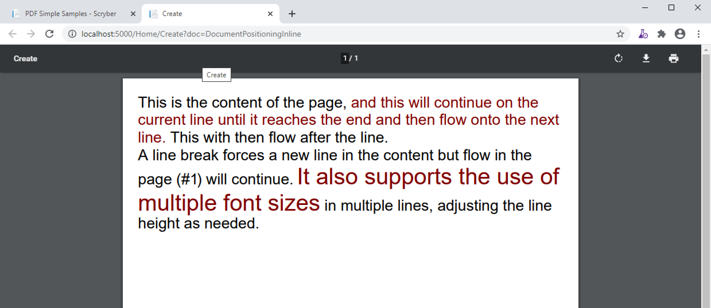
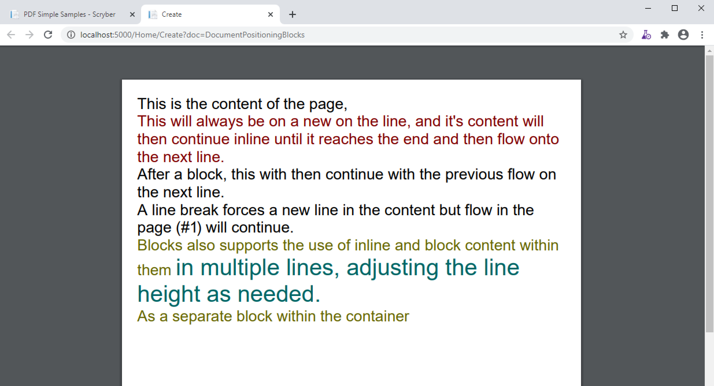
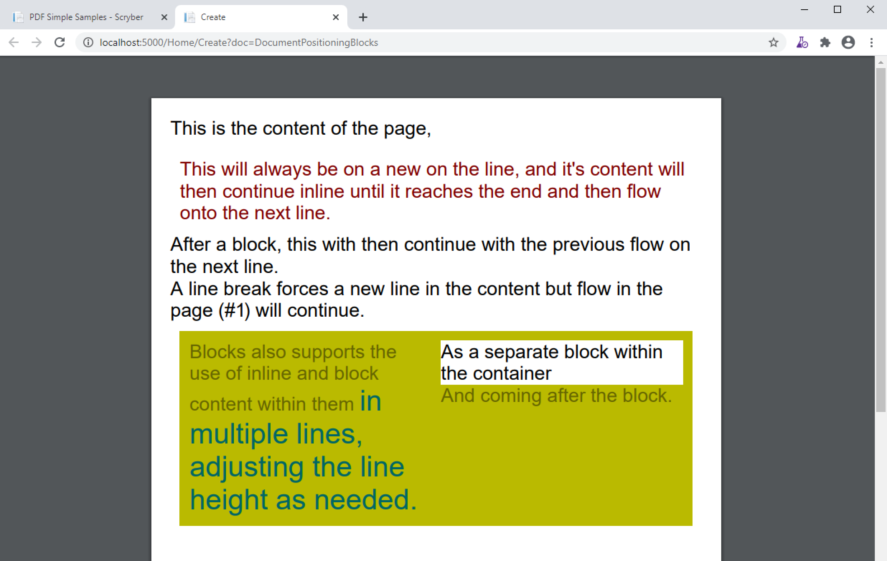
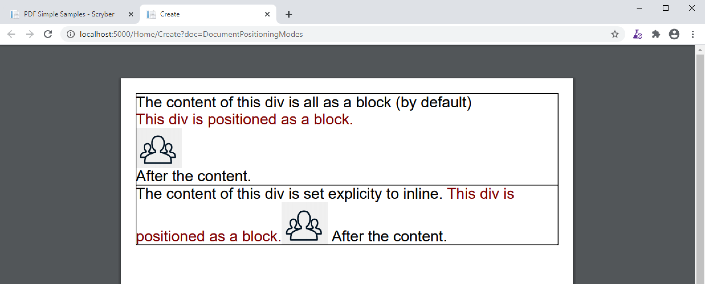
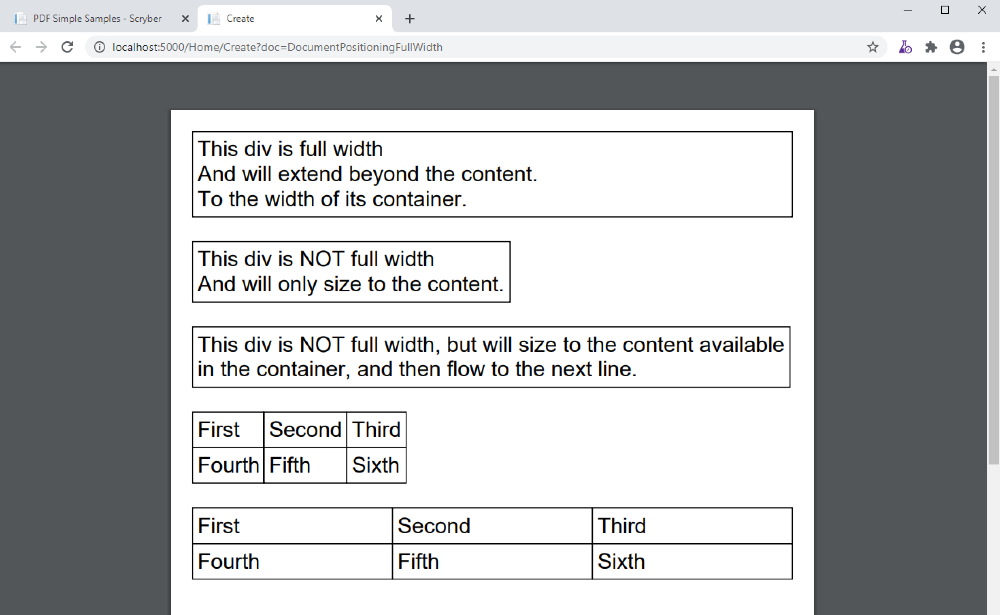
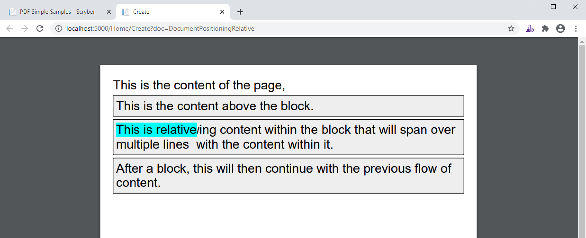
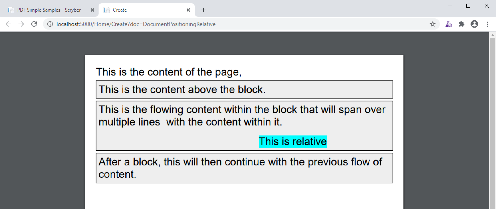
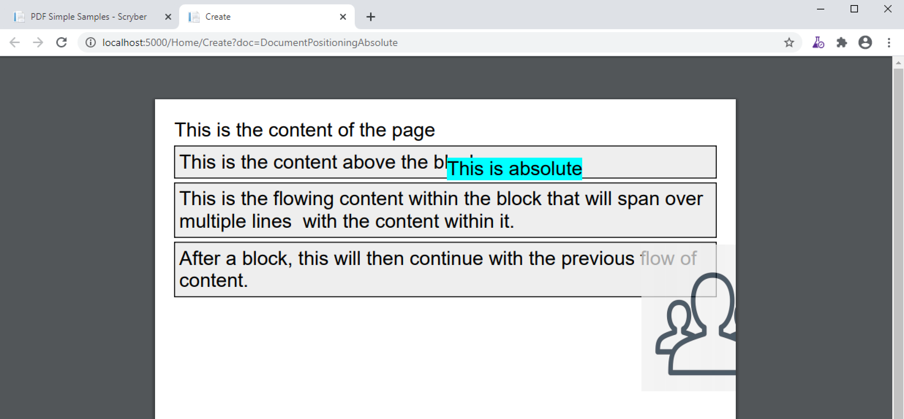
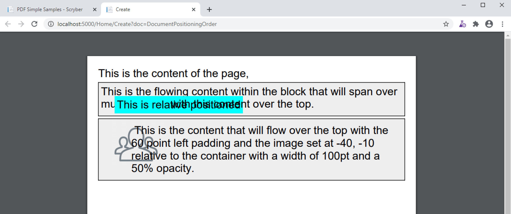

==============================
Positioning your content
==============================

Scryber has an intelligent layout engine. By default eveything will be laid out as per the flowing layout of the document Pages and columns.
Each component, be it block level or inline will have a position next to its siblings and move and following content along in the document.
If the content comes to the end of the page and cannot be fitted, then if allowed, it will be moved to the next page.

Inline Positioning
==================

Inline components such as text and spans will continue on the current line, and if they do not fit all the contnet, then they will 
flow onto the next line (or column or page). If the content moves, so the inline content will move with the container.

Carriager returns within the content of the xml file are ignored by default, 
as per html (see :doc:`reference/pdf_pre` if you don't want them to be.).

Examples of inline components are spans, labels, text literals, page numbers,

.. code-block:: xml

    <?xml version="1.0" encoding="utf-8" ?>
    <doc:Document xmlns:doc="http://www.scryber.co.uk/schemas/core/release/v1/Scryber.Components.xsd"
                    xmlns:styles="http://www.scryber.co.uk/schemas/core/release/v1/Scryber.Styles.xsd" >

    <Pages>
    
        <doc:Page styles:margins="20pt" styles:font-size="20pt">
            <Content>
                This is the content of the page, 
                <doc:Span styles:fill-color="maroon" >and this will continue on the current line until it reaches the end
                and then flow onto the next line.</doc:Span> 
                This with then flow after the line.<doc:Br/>
                A line break forces a new line in the content but flow in the page (#<doc:PageNumber />) will continue. 
                <doc:Span styles:fill-color="maroon" styles:font-size="30pt" >It also supports the use of multiple font sizes</doc:Span> in multiple lines, 
                adjusting the line height as needed.
            </Content>
        </doc:Page>
    </Pages>

    </doc:Document>

Generating this document will create the following output 
(see :doc:`mvc_controller_full` or :doc:`gui_controller_full` to understand how to do this).

For more information on laying out textual content see :doc:`documenttextlayout`

Block Positioning
=================

A block starts on a new line in the content of the page. Children will be laid out within the block (unless absolutely positioned), and
content after the block will also begin a new line.

Examples of blocks are Div's, Paragraphs, Tables, BlockQuotes, Headings, Images, and Shapes.

.. code-block:: xml

    <?xml version="1.0" encoding="utf-8" ?>
    <doc:Document xmlns:doc="http://www.scryber.co.uk/schemas/core/release/v1/Scryber.Components.xsd"
                    xmlns:styles="http://www.scryber.co.uk/schemas/core/release/v1/Scryber.Styles.xsd" >

        <Pages>
        
            <doc:Page styles:margins="20pt" styles:font-size="20pt">
                <Content>
                    This is the content of the page, 
                    
                    <doc:Div styles:fill-color="maroon" >This will always be on a new on the line, and it's content will then continue inline until it reaches the end
                    and then flow onto the next line.</doc:Div> 
                    
                    After a block, this with then continue with the previous flow on the next line.<doc:Br/>
                    A line break forces a new line in the content but flow in the page (#<doc:PageNumber />) will continue. 
                    
                    <doc:Div styles:fill-color="#666600" >
                    Blocks also supports the use of inline and block content within them
                    <doc:Span styles:fill-color="#006666"  styles:font-size="30pt">in multiple lines, adjusting the line height as needed.</doc:Span>
                    <doc:Div >As a separate block within the container</doc:Div>
                    </doc:Div>
                    
                </Content>
            </doc:Page>
        </Pages>

    </doc:Document>

Blocks also support the use of backgrounds, borders, margins and padding.
They also support :doc:`document_columns`

.. code-block:: xml

    <?xml version="1.0" encoding="utf-8" ?>
    <doc:Document xmlns:doc="http://www.scryber.co.uk/schemas/core/release/v1/Scryber.Components.xsd"
                  xmlns:styles="http://www.scryber.co.uk/schemas/core/release/v1/Scryber.Styles.xsd" >

    <Pages>
    
        <doc:Page styles:margins="20pt" styles:font-size="20pt">
        <Content>
            This is the content of the page, 
            
            <doc:Div styles:fill-color="maroon" styles:margins="20pt 10pt 10pt 10pt" >This will always 
                be on a new on the line, and it's content will then continue inline 
                until it reaches the end and then flow onto the next line.
            </doc:Div> 
            
            After a block, this with then continue with the previous flow on the next line.<doc:Br/>
            A line break forces a new line in the content but flow in the page (#<doc:PageNumber />) will continue. 
            
            <doc:Div styles:fill-color="#666600" styles:bg-color="#BBBB00" styles:padding="10pt"
                     styles:margins="10pt" styles:column-count="2">
                Blocks also supports the use of inline and block content within them

                <doc:Span styles:fill-color="#006666"  styles:font-size="30pt">in multiple lines, 
                    adjusting the line height as needed.</doc:Span>

                <!-- breaking onto a new column-->
                <doc:ColumnBreak />

                <doc:Div styles:fill-color="black" styles:bg-color="white" >As a separate block within the container</doc:Div>
                And coming after the child block.
            </doc:Div>
            
        </Content>
        </doc:Page>
    </Pages>

    </doc:Document>

Changing the position-mode
==========================

It is posible to change the default position mode for many components on the page. A span can be a block and a div can be a span.
Images and shapes (see :doc:`document_images` and :doc:`drawing_paths`) also support the use of the the position mode.

.. code-block:: xml

    <?xml version="1.0" encoding="utf-8" ?>
    <doc:Document xmlns:doc="http://www.scryber.co.uk/schemas/core/release/v1/Scryber.Components.xsd"
                  xmlns:styles="http://www.scryber.co.uk/schemas/core/release/v1/Scryber.Styles.xsd" >

    <Pages>
    
        <doc:Page styles:margins="20pt" styles:font-size="20pt">
            <Content>
                <doc:Div styles:border-color="black" styles:border-width="1pt" >
                    The content of this div is all as a block (by default)
                    
                    <doc:Div styles:fill-color="maroon" >This div is positioned as a block.</doc:Div>

                    <!-- Images are by detault displayed as blocks -->
                    <doc:Image styles:width="60pt" src="../../Content/Images/group.png" />
                    
                    After the content.
                </doc:Div>

                <doc:Div styles:border-color="black" styles:border-width="1pt" >
                    The content of this div is set explicity to inline.
                    
                    <doc:Div styles:position-mode="Inline" styles:fill-color="maroon">This div is positioned as a block.</doc:Div>

                    <!-- Image is also set to inline and will increase the line height automatically -->
                    <doc:Image styles:position-mode="Inline" styles:width="60pt"  src="../../Content/Images/group.png" />

                    After the content.
                </doc:Div>
                
            
            </Content>
        </doc:Page>
    </Pages>

    </doc:Document>

The full-width attribute
========================

The attribute full-width makes any block component automatically fill the available width of the region. Even if the inner content does not need it.
It's effectivly set as 100% width.

If it's set to false, the block will be as wide as needed (without going beyond the boundaries of it's own containing region).
This applies to the page, or a column containing the block.

By default Div's and Paragraphs are set to full width. BlockQuotes, Tables and Lists are not.

.. code-block:: xml

    <?xml version="1.0" encoding="utf-8" ?>
    <doc:Document xmlns:doc="http://www.scryber.co.uk/schemas/core/release/v1/Scryber.Components.xsd"
                    xmlns:styles="http://www.scryber.co.uk/schemas/core/release/v1/Scryber.Styles.xsd" >

    <Styles>
        <!-- Using a style to repeat the border is easier -->
        <styles:Style applied-class="bordered" >
            <styles:Border color="black" style="Solid" width="1pt"/>
            <styles:Padding all="5pt"/>
        </styles:Style>
    </Styles>
    <Pages>
    
        <doc:Page styles:margins="20pt" styles:font-size="20pt">
        <Content>
            <doc:Div styles:class="bordered" >
                This div is full width<doc:Br/>
                And will extend beyond the content.<doc:Br/>
                To the width of its container.
            </doc:Div>
            <doc:Br/>
            <doc:Div styles:class="bordered" styles:full-width="false" >
                This div is NOT full width<doc:Br/>
                And will only size to the content.<doc:Br/>
            </doc:Div>
            <doc:Br/>
            <doc:Div styles:class="bordered" styles:full-width="false" >
                This div is NOT full width,
                but will  size to the content available in the container,
                and then flow to the next line.
            </doc:Div>
            <doc:Br/>
            <!-- Tables are not by default full width-->
            <doc:Table>
                <doc:Row>
                    <doc:Cell styles:class="bordered">First</doc:Cell>
                    <doc:Cell styles:class="bordered">Second</doc:Cell>
                    <doc:Cell styles:class="bordered">Third</doc:Cell>
                </doc:Row>
                <doc:Row>
                    <doc:Cell styles:class="bordered">Fourth</doc:Cell>
                    <doc:Cell styles:class="bordered">Fifth</doc:Cell>
                    <doc:Cell styles:class="bordered">Sixth</doc:Cell>
                </doc:Row>
            </doc:Table>
            <doc:Br/>
            <!-- But can be set to full width explicitly or in styles -->
            <doc:Table styles:full-width="true">
                <doc:Row>
                    <doc:Cell styles:class="bordered">First</doc:Cell>
                    <doc:Cell styles:class="bordered">Second</doc:Cell>
                    <doc:Cell styles:class="bordered">Third</doc:Cell>
                </doc:Row>
                <doc:Row>
                    <doc:Cell styles:class="bordered">Fourth</doc:Cell>
                    <doc:Cell styles:class="bordered">Fifth</doc:Cell>
                    <doc:Cell styles:class="bordered">Sixth</doc:Cell>
                </doc:Row>
            </doc:Table>
        </Content>
        </doc:Page>
    </Pages>

    </doc:Document>

For more on styles see :doc:`document_styles`

Flowing around components
=========================

At the moment scryber does not support flowing content around other components.
It is something we are looking at supporting. If you want to help, please get in touch.

Relative Positioning
====================

When you set the position-mode to Relative, it declares the position of that component relative to the block parent.
The component will no longer be in the flow of any inline content, nor alter the layout of the following components.

.. code-block:: xml

    <?xml version="1.0" encoding="utf-8" ?>
    <doc:Document xmlns:doc="http://www.scryber.co.uk/schemas/core/release/v1/Scryber.Components.xsd"
                    xmlns:styles="http://www.scryber.co.uk/schemas/core/release/v1/Scryber.Styles.xsd" >
    <Styles>
        <styles:Style applied-class="bordered">
        <styles:Border color="black" style="Solid" width="1pt"/>
        <styles:Padding all="5pt"/>
        <styles:Background color="#AAAAAA" />
        <styles:Margins top="5pt"/>
        </styles:Style>
    </Styles>
    <Pages>
    
        <doc:Page styles:margins="20pt" styles:font-size="20pt">
        <Content>
            This is the content of the page, 
            
            <doc:Div styles:class="bordered" >This is the content above the block.</doc:Div>

            <doc:Div styles:class="bordered" >This is the flowing content within the block that will span over multiple lines
                <doc:Span styles:position-mode="Relative" styles:bg-color="aqua" >This is relative</doc:Span>
                with the content within it.
            </doc:Div>

            <doc:Div styles:class="bordered">
            After a block, this will then continue with the previous flow of content.
            </doc:Div>

        </Content>
        </doc:Page>
    </Pages>

    </doc:Document>

By default the position will be 0,0 (top, left), but using the x and y attributes it can be altered.
The parent block will grow to accomodate the content including any of it's relatively positioned content.
And push any content after the block down.

.. code-block:: xml

    <?xml version="1.0" encoding="utf-8" ?>
    <doc:Document xmlns:doc="http://www.scryber.co.uk/schemas/core/release/v1/Scryber.Components.xsd"
                    xmlns:styles="http://www.scryber.co.uk/schemas/core/release/v1/Scryber.Styles.xsd" >
    <Styles>
        <styles:Style applied-class="bordered">
        <styles:Border color="black" style="Solid" width="1pt"/>
        <styles:Padding all="5pt"/>
        <styles:Background color="#AAAAAA"/>
        <styles:Margins top="5pt"/>
        </styles:Style>
    </Styles>
    <Pages>
    
        <doc:Page styles:margins="20pt" styles:font-size="20pt">
        <Content>
            This is the content of the page, 
            
            <doc:Div styles:class="bordered" >This is the content above the block.</doc:Div>

            <doc:Div styles:class="bordered" >This is the flowing content within the block that will span over multiple lines
                <doc:Span styles:position-mode="Relative" styles:bg-color="aqua" styles:x="300pt" styles:y="60pt" >This is relative</doc:Span>
                with the content within it.
            </doc:Div>

            <doc:Div styles:class="bordered">
            After a block, this will then continue with the previous flow of content.
            </doc:Div>

        </Content>
        </doc:Page>
    </Pages>

    </doc:Document>

Absolute Positioning
====================

Changing the positioning mode to Absolute makes the positioning relative to the current page being rendered.
The component will no longer be in the flow of any content, nor alter the layout of following components.

The parent block will NOT grow to accomodate the content.
The content within the absolutely positioned component will be flowed within the available width and height of the page,
but if a size is specified, then this will be honoured over and above the page size.

.. code-block:: xml

    <?xml version="1.0" encoding="utf-8" ?>
    <doc:Document xmlns:doc="http://www.scryber.co.uk/schemas/core/release/v1/Scryber.Components.xsd"
                    xmlns:styles="http://www.scryber.co.uk/schemas/core/release/v1/Scryber.Styles.xsd" >
    <Styles>
        <styles:Style applied-class="bordered">
        <styles:Border color="black" style="Solid" width="1pt"/>
        <styles:Padding all="5pt"/>
        <styles:Background color="#AAAAAA" />
        <styles:Margins top="5pt"/>
        </styles:Style>
    </Styles>
    <Pages>
    
        <doc:Page styles:margins="20pt" styles:font-size="20pt">
        <Content>
            This is the content of the page
            
            <doc:Div styles:class="bordered" >This is the content above the block.</doc:Div>

            <doc:Div styles:class="bordered" >This is the flowing content within the block that will span over multiple lines
                <!-- Absolutely positioned content -->
                <doc:Span styles:position-mode="Absolute" styles:bg-color="aqua" styles:x="300pt" styles:y="60pt" >This is absolute</doc:Span>
                with the content within it.
            </doc:Div>

            <doc:Div styles:class="bordered">
                After a block, this will then continue with the previous flow of content.
            </doc:Div>
            
            <!-- Absolute postitioning can be applied to any component, and size can be specified. -->
            <doc:Image styles:position-mode="Absolute" src="../../Content/Images/group.png" styles:fill-opacity="0.7"
                    styles:x="500pt" styles:y="150pt" styles:width="150pt" styles:height="150pt" />
        </Content>
        </doc:Page>
    </Pages>

    </doc:Document>

Numeric Positioning
===================

All content positioning is from the top left corner of the page or parent. 
This is a natural positioning mechanism for most cultures and developers. 
(unlike PDF, which is bottom left to top right).

Units of position can either be specified in 

* points (1/72 of an inch) e.g `36pt`, 
* inches e.g. `0.5in` or 
* millimeters e.g. `12.7mm`

If no units are specified then the default is points. See :doc:`drawing_units` for more information.

Rendering Order
===============

All relative or absolutely positioned content will be rendered to the output in the order it appears in the document.
If a block is relatively positioned, it will overlay any content that preceded it, but anything coming after will be over the top.

.. code-block:: xml

    <?xml version="1.0" encoding="utf-8" ?>
    <doc:Document xmlns:doc="http://www.scryber.co.uk/schemas/core/release/v1/Scryber.Components.xsd"
                    xmlns:styles="http://www.scryber.co.uk/schemas/core/release/v1/Scryber.Styles.xsd" >
    <Styles>
        <styles:Style applied-class="bordered">
        <styles:Border color="black" style="Solid" width="1pt"/>
        <styles:Padding all="5pt"/>
        <styles:Background color="#AAAAAA" opacity="0.2"/>
        <styles:Margins top="5pt"/>
        </styles:Style>
    </Styles>
    <Pages>
    
        <doc:Page styles:margins="20pt" styles:font-size="20pt">
        <Content>
            This is the content of the page, 
            
            <doc:Div styles:class="bordered" >This is the flowing content within the block that 
                will span over multiple lines
                <doc:Span styles:position-mode="Relative" styles:bg-color="aqua" styles:x="25pt" 
                            styles:y="20pt" styles:padding="4pt" >This is relative positioned</doc:Span>
                with this content over the top.
            </doc:Div>

            <doc:Div styles:class="bordered" styles:padding="10 60 10 10">
                <doc:Image src="../../Content/Images/group.png" styles:position-mode="Relative" 
                            styles:x="-40pt" styles:y="-10pt" styles:width="100pt" styles:fill-opacity="0.5" />
                This is the content that will flow over the top with the 60 point left padding and the 
                image set at -40, -10 relative to the container with a width of 100pt
                and a 50% opacity.
            </doc:Div>

        </Content>
        </doc:Page>
    </Pages>

    </doc:Document>

By using this rule interesting effects can be designed.

Position z-index
================

It's not currently supported, within scryber to specify a z-index on components. It may be supported in future.

Positioned components
======================

There are 2 components that take advantage of the positioning within Scryber.

1. :doc:`reference/pdf_canvas` positions all direct child components in the canvas as relative, whether they have been decared as such or not.
2. :doc:`reference/pdf_layergroup` has a collection of child Layers. These will be relatively positioned to the group.