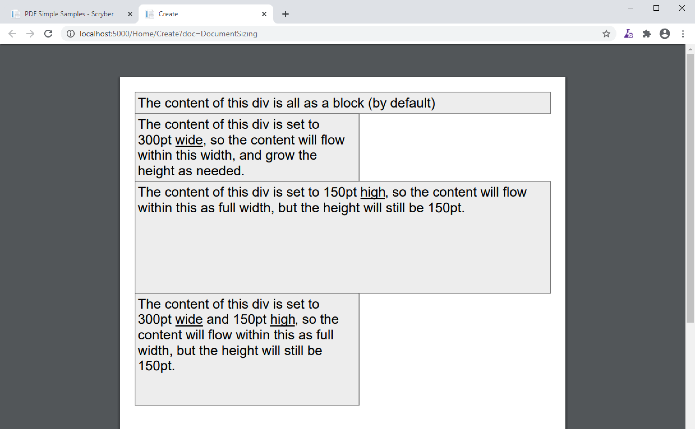
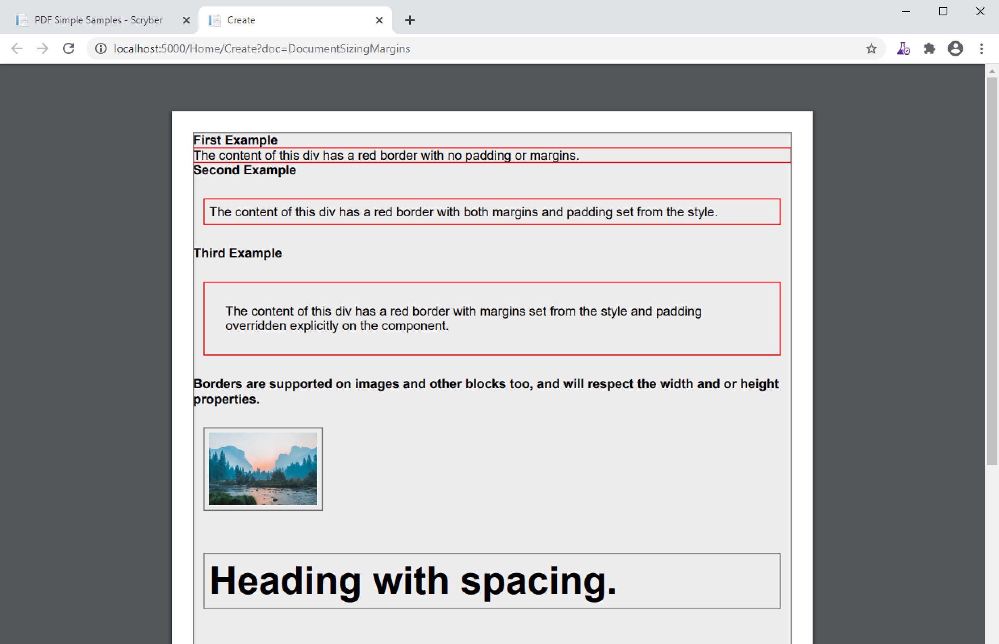
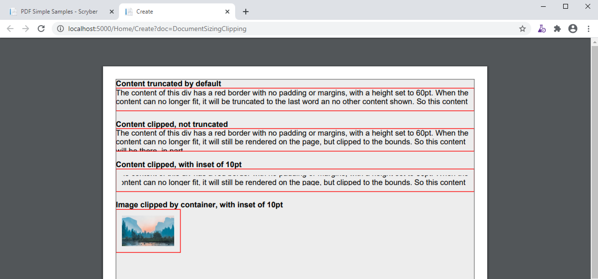
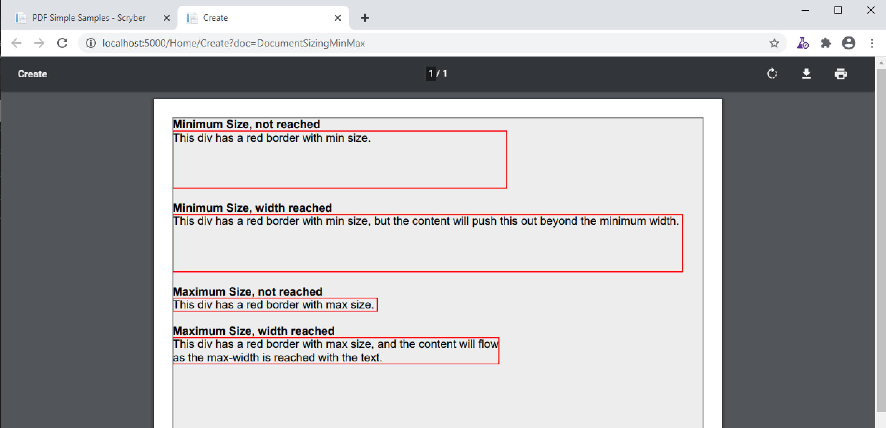

==============================
Sizing your content
==============================

Scryber has an intelligent layout engine. By default eveything will be laid out as per the flowing layout of the document Pages and columns.
Each component, be it block level or inline will have a position next to its siblings and move and following content along in the document.
If the content comes to the end of the page and cannot be fitted, then if allowed, it will be moved to the next page.

However it is very easy to size and position (see :doc:`component_positioning`) the content. All measusements are using the scryber unit and thickness
(see :doc:`drawing_units` for more on the use of measurements and dimensions).

Width and Height
================

All block components support an explicit width and / or height value. If it's width is set, then any full-width style will be ignored.

.. code-block:: xml

    <?xml version="1.0" encoding="utf-8" ?>
    <pdf:Document xmlns:pdf="http://www.scryber.co.uk/schemas/core/release/v1/Scryber.Components.xsd"
                    xmlns:styles="http://www.scryber.co.uk/schemas/core/release/v1/Scryber.Styles.xsd" >

    <Styles>
        <styles:Style applied-class="bordered" >
            <styles:Border color="#777" width="1pt" style="Solid"/>
            <styles:Background color="#EEE"/>
            <styles:Padding all="4pt"/>
        </styles:Style>
    </Styles>
    <Pages>
    
        <pdf:Page styles:margins="20pt" styles:font-size="18pt">
            <Content>
                <pdf:Div styles:class="bordered" >
                The content of this div is all as a block (by default)
                </pdf:Div>

                <pdf:Div styles:class="bordered" styles:width="300pt" >
                The content of this div is set to 300pt <pdf:U>wide</pdf:U>, so the content will flow within this width,
                and grow the height as needed.
                </pdf:Div>

                <pdf:Div styles:class="bordered" styles:height="150pt" >
                The content of this div is set to 150pt <pdf:U>high</pdf:U>, so the content will flow within this
                as full width, but the height will still be 150pt.
                </pdf:Div>

                <pdf:Div styles:class="bordered" styles:width="300pt" styles:height="150pt" >
                The content of this div is set to 300pt <pdf:U>wide</pdf:U> and 150pt <pdf:U>high</pdf:U>, so the content will flow within this
                as full width, but the height will still be 150pt.
                </pdf:Div>    
            
            </Content>
        </pdf:Page>
    </Pages>

    </pdf:Document>

Images with width and height
==============================

Scryber handles the sizing of images based on the natural size of the image. If no explicit size or positioning is provided, then it will be rendered
at the native size for the image.

If the available space within the container is not sufficuent to hold the image at it's natural size, then the image render size will be reduced
proportionally to fit the space available.

If either a width **or** height is assigned, then this will be used to proportionally resize the image to that height or width.

If both a width **and** height are assigned, then they will both be used to fit the image to that space. No matter what the originals' proportions are.

.. code-block:: xml

    <?xml version="1.0" encoding="utf-8" ?>
    <pdf:Document xmlns:pdf="http://www.scryber.co.uk/schemas/core/release/v1/Scryber.Components.xsd"
                    xmlns:styles="http://www.scryber.co.uk/schemas/core/release/v1/Scryber.Styles.xsd" >
    <Pages>
        <pdf:Page styles:margins="20pt" styles:font-size="12pt" >
            <Content>
                
                <pdf:Span >An image will natually size to it's dimensions without space restriction.</pdf:Span>
                <pdf:Image src="../../Content/Images/landscape.jpg" />

                <pdf:Div styles:column-count="4" styles:margins="10 0 0 0" >
                    <pdf:B>First Column</pdf:B><pdf:Br/>
                    An image will fit to it's container if no explicit size is set.
                    <pdf:Image src="../../Content/Images/landscape.jpg" />
                    <pdf:ColumnBreak/>
                    <pdf:B>Second Column</pdf:B><pdf:Br/>
                    If a width is set, then the sizing will be proportional.
                    <pdf:Image src="../../Content/Images/landscape.jpg" styles:width="100pt" />
                    <pdf:ColumnBreak/>
                    <pdf:B>Third Column</pdf:B><pdf:Br/>
                    If a height is set, then the sizing will be proportional.
                    <pdf:Image src="../../Content/Images/landscape.jpg" styles:height="50pt" />
                    
                    <pdf:ColumnBreak/>
                    <pdf:B>Third Column</pdf:B><pdf:Br/>
                    If a width and height are set these will be used explicitly.
                    <pdf:Image src="../../Content/Images/landscape.jpg" styles:width="100pt" styles:height="50pt" />
                </pdf:Div>

                <!-- Photo by Bailey Zindel on Unsplash -->
            </Content>
        </pdf:Page>
    </Pages>

    </pdf:Document>

.. image:: images/documentsizingimages.png

Page Sizes
==========

Pages are generally sized differently to components on a page, as they use the standard ISO and Imperial page enumeration.
But they can also be a custom size. See :doc:`document_pages` for details on how to alter the size of pages.

Margins and Padding
====================

All block level elements support padding and margins.
Unlike html, scryber does not count the width of the border as part of the box dimensions (on purpose).

Dimensions can be set either directly on the component, or on a style applied to the components (see: :doc:`document_styles`).

The `Margins` and `Padding` style have 5 properties that can be set.

* All
* Top
* Right
* Bottom
* and Left

If an individual side property is set, then this will override any value set on all.

The margins or padding attributes on elements can be set with 1, 2 or 4 values. If only one is provided it will be applied to each.
If 4 are provided, they will be applied to each individual value in the `top`, `right`, `bottom`, `left` (as per html padding). If 
2 are provided the first will be applied to the top and bottom, the second to the left and right.

.. note:: If any margins or padding attribute is set on the component, it will override ALL values set in any style.

If not set then the values will be zero.

.. code-block:: xml

    <?xml version="1.0" encoding="utf-8" ?>
    <pdf:Document xmlns:pdf="http://www.scryber.co.uk/schemas/core/release/v1/Scryber.Components.xsd"
                    xmlns:styles="http://www.scryber.co.uk/schemas/core/release/v1/Scryber.Styles.xsd" >

    <Styles>
        
        <styles:Style applied-type="pdf:Page" >
            <styles:Font size="12pt"/>
            <styles:Margins all="20pt"/>
        </styles:Style>
        
        <styles:Style applied-class="bordered" >
            <styles:Border color="#777" width="1pt" style="Solid"/>
            <styles:Background color="#EEE"/>
        </styles:Style>

        <styles:Style applied-class="red">
            <styles:Border color="red"/>
        </styles:Style>
        
        <styles:Style applied-class="spaced" >
            <styles:Margins all="20pt" left="10pt" right="10pt"/>
            <styles:Padding all="5pt"/>
        </styles:Style>

    </Styles>
    <Pages>
    
        <pdf:Page styles:class="bordered" > <!--Styles applied to the page type -->
            <Content>
                <pdf:B>First Example</pdf:B>
                <pdf:Div styles:class="bordered red" >
                    The content of this div has a red border with no padding or margins.
                </pdf:Div>

                <pdf:B>Second Example</pdf:B>
                <pdf:Div styles:class="bordered red spaced" >
                    The content of this div has a red border with both margins and padding set from the style.
                </pdf:Div>

                <pdf:B>Third Example</pdf:B>
                <pdf:Div styles:class="bordered red spaced" styles:padding="20pt" >
                    The content of this div has a red border with margins set from the style and padding overridden explicitly on the component.
                </pdf:Div>

                <pdf:B>Borders are supported on images and other blocks too, and will respect the width and or height properties.</pdf:B>
                <pdf:Image src="../../Content/Images/landscape.jpg" styles:class="bordered spaced" styles:width="100pt" />
                <pdf:H1 styles:class="bordered spaced">Heading with spacing.</pdf:H1>
            </Content>
        </pdf:Page>
    </Pages>

    </pdf:Document>

Clipping
========

The block level components also support the use of a clipping (with overflow action) to reduce the size of the visible area within the block
By default, content is truncated when an explicit size is reached. It cannot overflow, because of the size, so is truncated.
When the overflow action is set to Clip, however, all the inner content of the block will be rendered, but effectively in a window on top of the content.
The content outside the view of the window is still there, but not visible.

Along with the overflow action on a style a clipping can be applied in the same way as margins and padding.
This will alter the 'size of the window' that content is seen through.

.. code-block:: xml

    <?xml version="1.0" encoding="utf-8" ?>
    <pdf:Document xmlns:pdf="http://www.scryber.co.uk/schemas/core/release/v1/Scryber.Components.xsd"
                    xmlns:styles="http://www.scryber.co.uk/schemas/core/release/v1/Scryber.Styles.xsd" >

    <Styles>
        
        <styles:Style applied-type="pdf:Page" >
            <styles:Font size="12pt"/>
            <styles:Margins all="20pt"/>
        </styles:Style>
        
        <styles:Style applied-class="bordered" >
            <styles:Border color="#777" width="1pt" style="Solid"/>
            <styles:Background color="#EEE"/>
        </styles:Style>

        <styles:Style applied-class="red">
            <styles:Border color="red"/>
        </styles:Style>

        <!-- Our clipping style applies 10pt all around. 
             It's NOT the same as padding.  -->

        <styles:Style applied-class="clipped" >
            <styles:Clipping all="10pt"/>
            <styles:Overflow action="Clip"/>
        </styles:Style>

    </Styles>
    <Pages>
    
        <pdf:Page styles:class="bordered" > <!--Styles applied to the page type -->
            <Content>
                <pdf:B>Content truncated by default</pdf:B>
                <pdf:Div styles:class="bordered red" styles:height="35pt" >
                    The content of this div has a red border with no padding or margins, with a height set to 60pt. When the content can no longer fit, 
                    it will be truncated to the last word an no other content shown. So this content will not be visible, as it cannot be completely laid out.
                </pdf:Div>
                <pdf:Br/>
                <pdf:B>Content clipped, not truncated</pdf:B>
                <pdf:Div styles:class="bordered red" styles:height="35pt" styles:overflow-action="Clip" >
                    The content of this div has a red border with no padding or margins, with a height set to 60pt. When the content can no longer fit,
                    it will still be rendered on the page, but clipped to the bounds. So this content will be there, in part.
                </pdf:Div>

                <pdf:Br/>
                <pdf:B>Content clipped, with inset of 10pt</pdf:B>
                <pdf:Div styles:class="bordered red clipped" styles:height="35pt" >
                    The content of this div has a red border with no padding or margins, with a height set to 60pt. When the content can no longer fit,
                    it will still be rendered on the page, but clipped to the bounds. So this content will be there, in part.
                </pdf:Div>

                <pdf:Br/>
                <pdf:B>Image clipped by container, with inset of 10pt</pdf:B>
                <pdf:Div styles:class="bordered red clipped" styles:width="100pt" >
                    <pdf:Image src="../../Content/Images/landscape.jpg" />
                </pdf:Div>
            </Content>
        </pdf:Page>
    </Pages>

    </pdf:Document>

.. note:: The clipping only applies to the inner content. It's effectively drawn and then clipped to shape. This means that clipping directly on images is not supported.

Minimum and Maximum size
========================

Along with the use of width and height, scryber also supports the use of minimum height/width and maximum height/width.

As you might expect, the minimum will ensure that a container is at least as big as the specified value, and that the maximum will 
ensure the content, never grows beyond that specified value.

.. code-block:: xml

    <?xml version="1.0" encoding="utf-8" ?>
    <pdf:Document xmlns:pdf="http://www.scryber.co.uk/schemas/core/release/v1/Scryber.Components.xsd"
                    xmlns:styles="http://www.scryber.co.uk/schemas/core/release/v1/Scryber.Styles.xsd" >

    <Styles>
        
        <styles:Style applied-type="pdf:Page" >
            <styles:Font size="12pt"/>
            <styles:Margins all="20pt"/>
        </styles:Style>
        
        <styles:Style applied-class="bordered" >
            <styles:Border color="#777" width="1pt" style="Solid"/>
            <styles:Background color="#EEE"/>
        </styles:Style>

        <styles:Style applied-class="red">
            <styles:Border color="red"/>
        </styles:Style>

        <styles:Style applied-class="sized" >
            <styles:Size full-width="false" max-height="60pt" max-width="350pt"/>
        </styles:Style>

    </Styles>
    <Pages>
    
        <pdf:Page styles:class="bordered" > <!--Styles applied to the page type -->
        <Content>
            <pdf:B>Minimum Size, not reached</pdf:B>
            <pdf:Div styles:class="bordered red" styles:full-width="false" styles:min-height="60pt" styles:min-width="350pt" >
                This div has a red border with min size.
            </pdf:Div>

            <pdf:Br/>
            <pdf:B>Minimum Size, width reached</pdf:B>
            <pdf:Div styles:class="bordered red" styles:full-width="false" styles:min-height="60pt" styles:min-width="350pt" >
                This div has a red border with min size, but the content will push this out beyond the minimum width.
            </pdf:Div>

            <pdf:Br/>
            <pdf:B>Minimum Size, width reached</pdf:B>
            <pdf:Div styles:class="bordered red" styles:full-width="false" styles:min-height="60pt" styles:min-width="350pt" >
                This div has a red border with min size, but the content will push this out beyond the minimum width to the
                space in the container, and then flow as normal.
            </pdf:Div>

            <pdf:Br/>
            <pdf:B>Maximum Size, not reached</pdf:B>
            <pdf:Div styles:class="bordered red sized" >
                This div has a red border with max size.
            </pdf:Div>

            <pdf:Br/>
            <pdf:B>Maximum Size, width reached</pdf:B>
            <pdf:Div styles:class="bordered red sized" >
                This div has a red border with max size, and the content will flow as the max-width is reached with the text.
            </pdf:Div>

        </Content>
        </pdf:Page>
    </Pages>

    </pdf:Document>

Sizing Grid
=============

In order to visually measure your sizes, position and content - Scryber supports the use of an overlay grid.
This can only be set on a style, rather than inline to components. But it does have the ability for position,
spacing and offsets.

.. code-block:: xml

    <styles:Style applied-type="pdf:Page" >
      <styles:Font size="12pt"/>
      <styles:Margins all="20pt"/>
      <styles:Overlay-Grid color="aqua" spacing="50pt" show="true"/>
    </styles:Style>

.. image:: images/documentsizinggrid.png