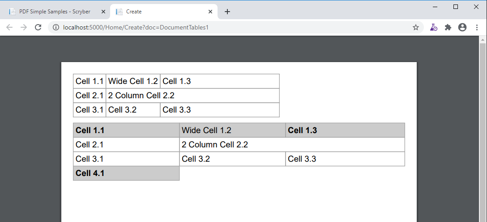
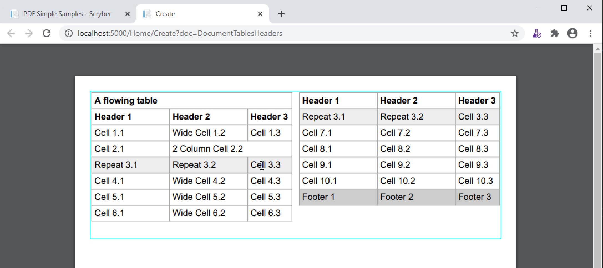
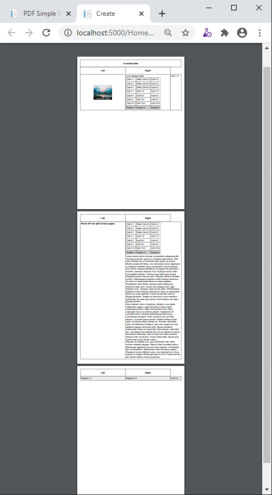

==========================
Tables, Row and Cells - td
==========================

Scryber supports the use of tables with rows, cells and allows nesting, overflow, headings, footers and 
column-spans.

It also supports the use of binding and repeating.

Simple Tables
=============

A simple table with no style or formatting will be output with a single point gray border and 4pt padding on each cell.
The cells support a column-span attribute to allow multiple column content.

Each column will take up as much room as needed (or possible).
Applying the full-width addtibute will make the table use all available space, obeying any fixed column widths.

Rows and cells also support individual styles.

.. code-block:: xml

    <?xml version="1.0" encoding="utf-8" ?>

    <pdf:Document xmlns:pdf="http://www.scryber.co.uk/schemas/core/release/v1/Scryber.Components.xsd"
                xmlns:styles="http://www.scryber.co.uk/schemas/core/release/v1/Scryber.Styles.xsd"
                xmlns:data="http://www.scryber.co.uk/schemas/core/release/v1/Scryber.Data.xsd">
    
    <Styles>

        <styles:Style applied-type="pdf:Cell" applied-class="strong" >
            <styles:Font bold="true"/>
        </styles:Style>
    </Styles>
    <Pages>

        <pdf:Page styles:margins="20pt" styles:font-size="14pt">
            <Content>

                <!-- Basic unstyled Table -->

                <pdf:Table styles:margins="0 0 10 0">
                    <pdf:Row>
                        <pdf:Cell>Cell 1.1</pdf:Cell>
                        <pdf:Cell>Wide Cell 1.2</pdf:Cell>
                        <pdf:Cell>Cell 1.3</pdf:Cell>
                    </pdf:Row>
                    <pdf:Row>
                        <pdf:Cell>Cell 2.1</pdf:Cell>
                        <pdf:Cell styles:column-span="2">2 Column Cell 2.2</pdf:Cell>
                    </pdf:Row>
                    <pdf:Row>
                        <pdf:Cell>Cell 3.1</pdf:Cell>
                        <pdf:Cell>Cell 3.2</pdf:Cell>
                        <pdf:Cell styles:width="200pt">Cell 3.3</pdf:Cell>
                    </pdf:Row>
                </pdf:Table>

                <!-- Table with full width and styles -->

                <pdf:Table styles:margins="0 0 10 0" styles:full-width="true">
                <pdf:Row styles:bg-color="#CCC">
                    <pdf:Cell styles:class="strong">Cell 1.1</pdf:Cell>
                    <pdf:Cell>Wide Cell 1.2</pdf:Cell>
                    <pdf:Cell styles:class="strong">Cell 1.3</pdf:Cell>
                </pdf:Row>
                <pdf:Row>
                    <pdf:Cell>Cell 2.1</pdf:Cell>
                    <pdf:Cell styles:column-span="2">2 Column Cell 2.2</pdf:Cell>
                </pdf:Row>
                <pdf:Row>
                    <pdf:Cell>Cell 3.1</pdf:Cell>
                    <pdf:Cell>Cell 3.2</pdf:Cell>
                    <pdf:Cell styles:width="200pt">Cell 3.3</pdf:Cell>
                </pdf:Row>
                <pdf:Row>
                    <pdf:Cell styles:class="strong" styles:bg-color="#CCC">Cell 4.1</pdf:Cell>
                </pdf:Row>
                </pdf:Table>

            </Content>
        </pdf:Page>

    </Pages>
    
    </pdf:Document>

Headers, Footers and overflow
=============================

Tables support both header and footer rows (single or multiple) along with header and footer cells.
The header cells by default will repeat across columns and or pages, but can be set not to repeat.
(Alternatively, rows can simply be set to repeat, and will do so after they are initially been laid out).

Rows support the block styles, except margins, padding and positioning.

.. code-block:: xml

    <?xml version="1.0" encoding="utf-8" ?>
    <pdf:Document xmlns:pdf="http://www.scryber.co.uk/schemas/core/release/v1/Scryber.Components.xsd"
                xmlns:styles="http://www.scryber.co.uk/schemas/core/release/v1/Scryber.Styles.xsd"
                xmlns:data="http://www.scryber.co.uk/schemas/core/release/v1/Scryber.Data.xsd">
    
    <Styles>

        <styles:Style applied-type="pdf:Cell" >
        </styles:Style>

        <styles:Style applied-type="pdf:Cell" applied-class="strong" >
        <styles:Font bold="true"/>
        </styles:Style>

        <styles:Style applied-class="table-title" >
        <styles:Table row-repeat="None"/>
        </styles:Style>
    </Styles>
    <Pages>

            <pdf:Page styles:margins="20pt" styles:font-size="12pt">
            <Content>

                <pdf:Div styles:column-count="2" styles:max-height="200pt" styles:border-color="aqua" styles:padding="2pt" >

                <pdf:Table styles:margins="0 0 10 0" styles:full-width="true">
                    
                    <!-- Header that will not repeat based on style-->
                    <pdf:Header-Row styles:class="table-title" >
                    <pdf:Header-Cell styles:column-span="3" >A flowing table</pdf:Header-Cell>
                    </pdf:Header-Row>
                    
                    <!-- Header that will repeat -->
                    <pdf:Header-Row>
                    <pdf:Header-Cell>Header 1</pdf:Header-Cell>
                    <pdf:Header-Cell>Header 2</pdf:Header-Cell>
                    <pdf:Header-Cell>Header 3</pdf:Header-Cell>
                    </pdf:Header-Row>
                    
                    <pdf:Row>
                    <pdf:Cell>Cell 1.1</pdf:Cell>
                    <pdf:Cell>Wide Cell 1.2</pdf:Cell>
                    <pdf:Cell>Cell 1.3</pdf:Cell>
                    </pdf:Row>
                    <pdf:Row>
                    <pdf:Cell>Cell 2.1</pdf:Cell>
                    <pdf:Cell styles:column-span="2">2 Column Cell 2.2</pdf:Cell>
                    </pdf:Row>
                    
                    <!-- Standard row, that will repeat after
                    it has been initially laid out -->
                    <pdf:Row styles:repeat="RepeatAtTop" styles:bg-color="#EEE">
                    <pdf:Cell>Repeat 3.1</pdf:Cell>
                    <pdf:Cell>Repeat 3.2</pdf:Cell>
                    <pdf:Cell styles:width="60pt">Cell 3.3</pdf:Cell>
                    </pdf:Row>
                    
                    <pdf:Row><pdf:Cell>Cell 4.1</pdf:Cell><pdf:Cell>Wide Cell 4.2</pdf:Cell><pdf:Cell>Cell 4.3</pdf:Cell></pdf:Row>
                    <pdf:Row><pdf:Cell>Cell 5.1</pdf:Cell><pdf:Cell>Wide Cell 5.2</pdf:Cell><pdf:Cell>Cell 5.3</pdf:Cell></pdf:Row>
                    <pdf:Row><pdf:Cell>Cell 6.1</pdf:Cell><pdf:Cell>Wide Cell 6.2</pdf:Cell><pdf:Cell>Cell 6.3</pdf:Cell></pdf:Row>
                    <pdf:Row><pdf:Cell>Cell 7.1</pdf:Cell><pdf:Cell>Cell 7.2</pdf:Cell><pdf:Cell>Cell 7.3</pdf:Cell></pdf:Row>
                    <pdf:Row><pdf:Cell>Cell 8.1</pdf:Cell><pdf:Cell>Cell 8.2</pdf:Cell><pdf:Cell>Cell 8.3</pdf:Cell></pdf:Row>
                    <pdf:Row><pdf:Cell>Cell 9.1</pdf:Cell><pdf:Cell>Cell 9.2</pdf:Cell><pdf:Cell>Cell 9.3</pdf:Cell></pdf:Row>
                    <pdf:Row><pdf:Cell>Cell 10.1</pdf:Cell><pdf:Cell>Cell 10.2</pdf:Cell><pdf:Cell>Cell 10.3</pdf:Cell></pdf:Row>
                    
                    <pdf:Footer-Row styles:bg-color="#CCC" >
                    <pdf:Footer-Cell>Footer 1</pdf:Footer-Cell>
                    <pdf:Footer-Cell>Footer 2</pdf:Footer-Cell>
                    <pdf:Footer-Cell>Footer 3</pdf:Footer-Cell>
                    </pdf:Footer-Row>
                </pdf:Table>
                
                </pdf:Div>

            </Content>
            </pdf:Page>

    </Pages>
    
    </pdf:Document>

.. note:: Consistency can easily be created with the use of styles on the applied types of pdf:Cell, pdf:HeaderCell and pdf:FooterCell across all documents.

Mixed content and nesting
=========================

All teble cells can contain any content, just like other block components, including other tables, 
and they also support sizing and alignment of content.

A table row however is designated at not being allowed to split across columns or 
pages (even if it's got a nested table. It will probably just mess up the layout.

.. code-block:: xml

    <?xml version="1.0" encoding="utf-8" ?>

    <pdf:Document xmlns:pdf="http://www.scryber.co.uk/schemas/core/release/v1/Scryber.Components.xsd"
                xmlns:styles="http://www.scryber.co.uk/schemas/core/release/v1/Scryber.Styles.xsd"
                xmlns:data="http://www.scryber.co.uk/schemas/core/release/v1/Scryber.Data.xsd">
    
    <Styles>

        <styles:Style applied-type="pdf:Header-Cell" >
        <styles:Position h-align="Center" v-align="Middle"/>
        <styles:Size height="40pt"/>
        </styles:Style>

        <styles:Style applied-class="table-title">
        <styles:Table row-repeat="None"/>
        </styles:Style>
        
        <styles:Style applied-class="img-footer" >
        <styles:Font family="Helvetica"  size="10pt" italic="true"/>
        <styles:Position h-align="Center"/>
        <styles:Background color="black"/>
        <styles:Fill color="white"/>
        </styles:Style>
    </Styles>
    <Pages>

            <pdf:Section styles:margins="20pt" styles:font-size="12pt">
            <Content>

                <pdf:Table styles:margins="0 0 10 0" styles:full-width="true">
                    
                    <!-- Header that will not repeat based on style-->
                    <pdf:Header-Row styles:class="table-title" >
                    <pdf:Header-Cell styles:column-span="3" >A nested table</pdf:Header-Cell>
                    </pdf:Header-Row>
                    
                    <!-- Header that will repeat -->
                    <pdf:Header-Row>
                    <pdf:Header-Cell>Left</pdf:Header-Cell>
                    <pdf:Header-Cell>Right</pdf:Header-Cell>
                    </pdf:Header-Row>
                    
                    <pdf:Row>
                    
                    <pdf:Cell styles:v-align="Middle" styles:h-align="Center">
                        <pdf:Image src="../../Content/Images/landscape.jpg" styles:width="100pt" />
                        <pdf:Div styles:class="img-footer" styles:width="100pt">Landscape Image</pdf:Div>
                    </pdf:Cell>
                    
                    <pdf:Cell>
                        Inner Nested table
                        <pdf:Table>
                        <pdf:Row><pdf:Cell>Cell 4.1</pdf:Cell><pdf:Cell>Wide Cell 4.2</pdf:Cell><pdf:Cell>Cell 4.3</pdf:Cell></pdf:Row>
                        <pdf:Row><pdf:Cell>Cell 5.1</pdf:Cell><pdf:Cell>Wide Cell 5.2</pdf:Cell><pdf:Cell>Cell 5.3</pdf:Cell></pdf:Row>
                        <pdf:Row><pdf:Cell>Cell 6.1</pdf:Cell><pdf:Cell>Wide Cell 6.2</pdf:Cell><pdf:Cell>Cell 6.3</pdf:Cell></pdf:Row>
                        <pdf:Row><pdf:Cell>Cell 7.1</pdf:Cell><pdf:Cell>Cell 7.2</pdf:Cell><pdf:Cell>Cell 7.3</pdf:Cell></pdf:Row>
                        <pdf:Row><pdf:Cell>Cell 8.1</pdf:Cell><pdf:Cell>Cell 8.2</pdf:Cell><pdf:Cell>Cell 8.3</pdf:Cell></pdf:Row>
                        <pdf:Row><pdf:Cell>Cell 9.1</pdf:Cell><pdf:Cell>Cell 9.2</pdf:Cell><pdf:Cell>Cell 9.3</pdf:Cell></pdf:Row>
                        <pdf:Row><pdf:Cell>Cell 10.1</pdf:Cell><pdf:Cell>Cell 10.2</pdf:Cell><pdf:Cell>Cell 10.3</pdf:Cell></pdf:Row>
                        <pdf:Footer-Row styles:bg-color="#CCC" ><pdf:Footer-Cell>Footer 1</pdf:Footer-Cell><pdf:Footer-Cell>Footer 2</pdf:Footer-Cell><pdf:Footer-Cell>Footer 3</pdf:Footer-Cell></pdf:Footer-Row>
                        </pdf:Table>

                    </pdf:Cell>
                    <pdf:Cell>
                        Cell 1.3
                    </pdf:Cell>
                    </pdf:Row>
                    
                    <pdf:Row>
                        <pdf:Cell>
                            <pdf:B>Rows will not split across pages.</pdf:B>
                        </pdf:Cell>
                        <pdf:Cell styles:column-span="2">
                            <pdf:Table>
                            <pdf:Row><pdf:Cell>Cell 4.1</pdf:Cell><pdf:Cell>Wide Cell 4.2</pdf:Cell><pdf:Cell>Cell 4.3</pdf:Cell></pdf:Row>
                            <pdf:Row><pdf:Cell>Cell 5.1</pdf:Cell><pdf:Cell>Wide Cell 5.2</pdf:Cell><pdf:Cell>Cell 5.3</pdf:Cell></pdf:Row>
                            <pdf:Row><pdf:Cell>Cell 6.1</pdf:Cell><pdf:Cell>Wide Cell 6.2</pdf:Cell><pdf:Cell>Cell 6.3</pdf:Cell></pdf:Row>
                            <pdf:Row><pdf:Cell>Cell 7.1</pdf:Cell><pdf:Cell>Cell 7.2</pdf:Cell><pdf:Cell>Cell 7.3</pdf:Cell></pdf:Row>
                            <pdf:Row><pdf:Cell>Cell 8.1</pdf:Cell><pdf:Cell>Cell 8.2</pdf:Cell><pdf:Cell>Cell 8.3</pdf:Cell></pdf:Row>
                            <pdf:Row><pdf:Cell>Cell 9.1</pdf:Cell><pdf:Cell>Cell 9.2</pdf:Cell><pdf:Cell>Cell 9.3</pdf:Cell></pdf:Row>
                            <pdf:Row><pdf:Cell>Cell 10.1</pdf:Cell><pdf:Cell>Cell 10.2</pdf:Cell><pdf:Cell>Cell 10.3</pdf:Cell></pdf:Row>
                            <pdf:Footer-Row styles:bg-color="#CCC" ><pdf:Footer-Cell>Footer 1</pdf:Footer-Cell><pdf:Footer-Cell>Footer 2</pdf:Footer-Cell><pdf:Footer-Cell>Footer 3</pdf:Footer-Cell></pdf:Footer-Row>
                            </pdf:Table>
                            <pdf:Para>
                            Lorem ipsum dolor sit amet, consectetur adipiscing elit. Vivamus pulvinar, ipsum eu molestie elementum, nibh ante ultricies dui, et euismod nulla sapien ac purus. Morbi suscipit elit tellus, nec elementum lacus dignissim a. Aliquam molestie turpis consectetur rutrum pretium. Orci varius natoque penatibus et magnis dis parturient montes, nascetur ridiculus mus. Quisque varius vitae erat sagittis facilisis. Vivamus quis tellus quis augue fringilla posuere vitae ac ante. Aliquam ultricies sodales cursus. Pellentesque habitant morbi tristique senectus et netus et malesuada fames ac turpis egestas.
                            <pdf:Br/>
                            Vestibulum dolor libero, faucibus quis tristique at, euismod vitae nunc. Donec vel volutpat urna, eget tristique nunc. Quisque vitae iaculis dolor. Pellentesque habitant morbi tristique senectus et netus et malesuada fames ac turpis egestas. Fusce fermentum odio ac feugiat pharetra. Integer sit amet elit a urna maximus sollicitudin sit amet sed mauris. Proin finibus nec diam blandit porttitor.
                            <pdf:Br/>
                            Nunc laoreet, enim in faucibus volutpat, nunc ligula sollicitudin magna, eget fermentum nulla neque scelerisque lectus. Nulla vel tincidunt enim. Nam vulputate eros a mi ultrices aliquet. Vestibulum et convallis tortor. Aenean pellentesque libero quis consectetur tincidunt. Proin maximus leo non felis tempor, ut iaculis ipsum iaculis. Nullam tristique justo diam, at ultricies diam ultrices ac. Aenean venenatis, lorem vel bibendum tristique, sem nisi congue ex, sed eleifend magna nisl luctus velit. Donec hendrerit malesuada neque eu imperdiet. Duis tempor venenatis leo, sed aliquet sem aliquet sed. Ut nec ligula non lacus fermentum bibendum sed sit amet est. Nam pharetra tempor tortor vel auctor. Fusce metus felis, lacinia quis mauris sed, porta iaculis metus.
                            <pdf:Br/>
                            Aliquam et sodales orci, quis sollicitudin velit. Nam ornare molestie aliquam. Mauris vitae convallis metus. Maecenas dignissim dui quis enim pretium, id interdum leo condimentum. Maecenas rutrum faucibus sapien. Praesent rutrum efficitur lorem, nec hendrerit dui. Ut ac massa ut magna ultricies gravida ut in mi. Fusce sed leo elit. Donec finibus rhoncus pulvinar.
                            </pdf:Para>
                        </pdf:Cell>
                    </pdf:Row>
                    
                    <!-- Standard row, that will repeat after
                    it has been initially laid out -->
                    <pdf:Row styles:repeat="RepeatAtTop" styles:bg-color="#EEE">
                        <pdf:Cell>Repeat 3.1</pdf:Cell>
                        <pdf:Cell>Repeat 3.2</pdf:Cell>
                    <pdf:Cell styles:width="60pt">Cell 3.3</pdf:Cell>
                </pdf:Row>
                    
            </pdf:Table>
                

            </Content>
        </pdf:Section>

    </Pages>
    
    </pdf:Document>

.. note:: In future we might be able to work on getting table rows to overflow across pages, but there are always other ways of achieving a similar layout.

Binding to Data
===============

