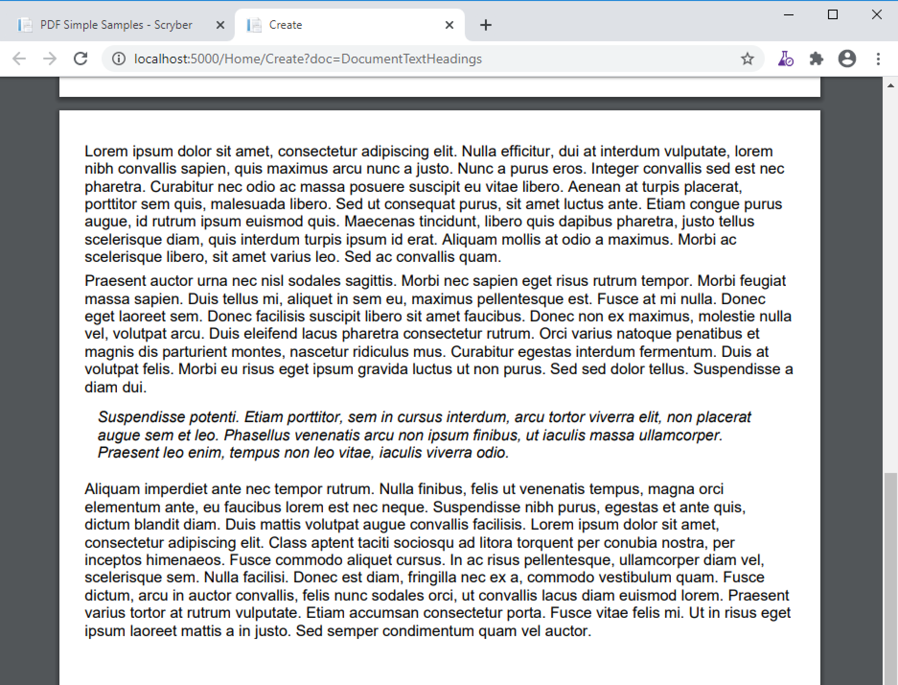
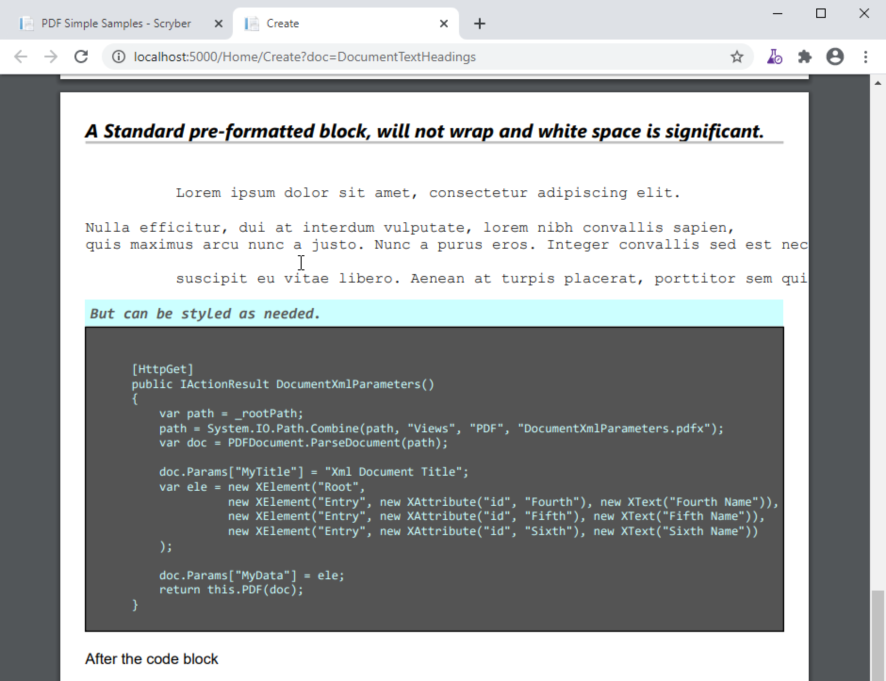

=========================================
Headings, Paragraphs, Quotes and Pre
=========================================

Scryber supports a full complement of block level textual components.

Headings
=========

The following headings are supported with their default size and style

* H1 - 36pt bold
* H2 - 30pt bold italic
* H3 - 24pt bold
* H4 - 20pt bold italic
* H5 - 17pt bold
* H6 - 15pt bold italic

All headings are set to full width and not to split over columns or pages. It is of course 
possible to change the defaults, either for all components of that type, or explicitly 
applied style:class(es)

Scryber also supports the applied-type of pdf:Heading, from which all the H1 to H6 components inherit 
that can be used to style all headings at once (e.g. Font family, colour, margins etc.).

Headings allso support the convenience property for `text` which can be data bound to any value.
See :doc:`binding_databinding` for more information on sources and parameters.

.. code-block:: xml

    <?xml version="1.0" encoding="utf-8" ?>

    <pdf:Document xmlns:pdf="http://www.scryber.co.uk/schemas/core/release/v1/Scryber.Components.xsd"
                xmlns:styles="http://www.scryber.co.uk/schemas/core/release/v1/Scryber.Styles.xsd"
                xmlns:data="http://www.scryber.co.uk/schemas/core/release/v1/Scryber.Data.xsd">
    <Styles>

        <!-- Style that is applied to all headings -->
        <styles:Style applied-type="pdf:Heading">
            <styles:Border color="silver" width="2pt" sides="Bottom" />
            <styles:Font family="Segoe UI"/>
            <styles:Margins bottom="20pt"/>
        </styles:Style>

        <!-- Just for the H4 components -->
        <styles:Style applied-type="pdf:H4" >
            <styles:Fill color="red" />
        </styles:Style>
        
        <!-- For the red components -->
        <styles:Style applied-class="red" >
            <styles:Border color="red" sides="Bottom"/>
        </styles:Style>
        
    </Styles>
    <Pages>

            <pdf:Page styles:margins="20pt" styles:font-size="12pt" >
            <Content>

                <pdf:H1 text="Top level heading 1"></pdf:H1>

                <pdf:H2 >Heading 2 with inner content</pdf:H2>

                <pdf:H3>Heading 3 with inner content</pdf:H3>

                <pdf:H4>Heading 5 with inner content</pdf:H4>

                <pdf:H5 styles:padding="0 0 4 0">
                    <pdf:Div styles:bg-color="silver" styles:class="red" styles:padding="4pt">
                    Heading 4 with mixed content
                    <pdf:Image src="../../content/images/toroid32.png" styles:width="30pt" styles:position-mode="Inline" />
                    </pdf:Div>
                </pdf:H5>
                
                <pdf:H6 styles:class="red">Heading 6 with mixed content</pdf:H6>
            </Content>
            </pdf:Page>

    
    </Pages>
    
    </pdf:Document>

.. image:: images/documentTextHeadings.png

Paragraphs and Quotes
=====================

Paragraphs are simply full width containers, the same as Divs, but with a top margin by default.
Whilst they are intended to contain text, they support the same mixed content as any other container.

Block quotes are the same, but with 10pt margins all around, and a default font style of italic.

.. code-block:: xml

    <?xml version="1.0" encoding="utf-8" ?>

    <pdf:Document xmlns:pdf="http://www.scryber.co.uk/schemas/core/release/v1/Scryber.Components.xsd"
                xmlns:styles="http://www.scryber.co.uk/schemas/core/release/v1/Scryber.Styles.xsd"
                xmlns:data="http://www.scryber.co.uk/schemas/core/release/v1/Scryber.Data.xsd">
    <Styles>

        <!-- Style that is applied to all headings -->
        <styles:Style applied-type="pdf:Heading">
            <styles:Border color="silver" width="2pt" sides="Bottom" />
            <styles:Font family="Segoe UI"/>
            <styles:Margins bottom="20pt"/>
        </styles:Style>

        <!-- Just for the H4 components -->
        <styles:Style applied-type="pdf:H4" >
            <styles:Fill color="red" />
        </styles:Style>
        
        <!-- For the red components -->
        <styles:Style applied-class="red" >
            <styles:Border color="red" sides="Bottom"/>
        </styles:Style>
        
    </Styles>
    <Pages>

        <pdf:Page styles:margins="20pt" styles:font-size="12pt" >
        <Content>

            <pdf:Para>
                Lorem ipsum dolor sit amet, consectetur adipiscing elit. Nulla efficitur, dui at interdum vulputate, lorem nibh convallis sapien,
                quis maximus arcu nunc a justo. Nunc a purus eros. Integer convallis sed est nec pharetra. Curabitur nec odio ac massa posuere 
                suscipit eu vitae libero. Aenean at turpis placerat, porttitor sem quis, malesuada libero. Sed ut consequat purus, sit amet luctus ante.
                Etiam congue purus augue, id rutrum ipsum euismod quis. Maecenas tincidunt, libero quis dapibus pharetra, justo tellus scelerisque diam,
                quis interdum turpis ipsum id erat. Aliquam mollis at odio a maximus.
                Morbi ac scelerisque libero, sit amet varius leo. Sed ac convallis quam.
            </pdf:Para>
            <pdf:Para>
                Praesent auctor urna nec nisl sodales sagittis. Morbi nec sapien eget risus rutrum tempor. Morbi feugiat massa sapien. Duis tellus mi, 
                aliquet in sem eu, maximus pellentesque est. Fusce at mi nulla. Donec eget laoreet sem. Donec facilisis suscipit libero sit amet faucibus.
                Donec non ex maximus, molestie nulla vel, volutpat arcu. Duis eleifend lacus pharetra consectetur rutrum. Orci varius natoque penatibus
                et magnis dis parturient montes, nascetur ridiculus mus. Curabitur egestas interdum fermentum. Duis at volutpat felis. Morbi eu risus
                eget ipsum gravida luctus ut non purus. Sed sed dolor tellus. Suspendisse a diam dui.
            </pdf:Para>
            <pdf:Blockquote>
                Suspendisse potenti. Etiam porttitor, sem in cursus interdum, arcu tortor viverra elit, non placerat augue sem et leo. 
                Phasellus venenatis arcu non ipsum finibus, ut iaculis massa ullamcorper. 
                Praesent leo enim, tempus non leo vitae, iaculis viverra odio.
            </pdf:Blockquote>
            <pdf:Para>
                Aliquam imperdiet ante nec tempor rutrum. Nulla finibus, felis ut venenatis tempus, magna orci elementum ante, eu faucibus lorem est nec neque. 
                Suspendisse nibh purus, egestas et ante quis, dictum blandit diam. Duis mattis volutpat augue convallis facilisis. Lorem ipsum dolor sit amet,
                consectetur adipiscing elit. Class aptent taciti sociosqu ad litora torquent per conubia nostra, per inceptos himenaeos. 
                Fusce commodo aliquet cursus. 
            </pdf:Para>
            
        </Content>
        
        </pdf:Page>
    
    </Pages>
    
    </pdf:Document>

Again these can be adjusted with styles to match requirements or designs.

Pre(formattted)
===============

The Pre component is another text container, but the content within is laid out with white space as significant (not ignored).
The default style is to use Courier (mono-spaced) font, and not to wrap text but overflow the container clipped to the boundaries.

This can be changed however is felt appropriate.

.. code-block:: xml

    <?xml version="1.0" encoding="utf-8" ?>

    <pdf:Document xmlns:pdf="http://www.scryber.co.uk/schemas/core/release/v1/Scryber.Components.xsd"
                xmlns:styles="http://www.scryber.co.uk/schemas/core/release/v1/Scryber.Styles.xsd"
                xmlns:data="http://www.scryber.co.uk/schemas/core/release/v1/Scryber.Data.xsd">
    <Styles>

        <!-- Style that is applied to all headings -->
        <styles:Style applied-type="pdf:Heading">
            <styles:Border color="silver" width="2pt" sides="Bottom" />
            <styles:Font family="Segoe UI"/>
            <styles:Margins bottom="20pt"/>
        </styles:Style>
        
        <!-- For the red components -->
        <styles:Style applied-class="red" >
            <styles:Border color="red" sides="Bottom"/>
        </styles:Style>

        <styles:Style applied-type="pdf:H6" applied-class="code">
            <styles:Background color="#CCFFFF"/>
            <styles:Padding all="4pt"/>
            <styles:Size full-width="true"/>
            <styles:Margins top="10pt" bottom="0pt"/>
            <styles:Fill color="#555"/>
            <styles:Font family="Consolas" size="12pt" />
        </styles:Style>
        
        <styles:Style applied-type="pdf:Pre" applied-class="code" >
            <styles:Background color="#555"/>
            <styles:Border color="black" width="1pt" />
            <styles:Padding all="4pt"/>
            <styles:Size full-width="true"/>
            <styles:Margins top="0pt" bottom="10pt"/>
            <styles:Fill color="#CCFFFF"/>
            <styles:Font family="Consolas" size="10pt" />
        </styles:Style>
        
    </Styles>
    <Pages>

        <pdf:Page styles:margins="20pt" styles:font-size="12pt" >
        <Content>

            <pdf:H6>A Standard pre-formatted block, will not wrap and white space is significant.</pdf:H6>
            <pdf:Pre>
            Lorem ipsum dolor sit amet, consectetur adipiscing elit. 
            
    Nulla efficitur, dui at interdum vulputate, lorem nibh convallis sapien,
    quis maximus arcu nunc a justo. Nunc a purus eros. Integer convallis sed est nec pharetra. Curabitur nec odio ac massa posuere

            suscipit eu vitae libero. Aenean at turpis placerat, porttitor sem quis, malesuada libero. Sed ut consequat purus, sit amet luctus ante.
            </pdf:Pre>

            <pdf:H6 styles:class="code">But can be styled as needed.</pdf:H6>
            <pdf:Pre styles:class="code">

    [HttpGet]
    public IActionResult DocumentXmlParameters()
    {
        var path = _rootPath;
        path = System.IO.Path.Combine(path, "Views", "PDF", "DocumentXmlParameters.pdfx");
        var doc = PDFDocument.ParseDocument(path);

        doc.Params["MyTitle"] = "Xml Document Title";
        var ele = new XElement("Root",
                    new XElement("Entry", new XAttribute("id", "Fourth"), new XText("Fourth Name")),
                    new XElement("Entry", new XAttribute("id", "Fifth"), new XText("Fifth Name")),
                    new XElement("Entry", new XAttribute("id", "Sixth"), new XText("Sixth Name"))
        );
        
        doc.Params["MyData"] = ele;
        return this.PDF(doc);
    }

            </pdf:Pre>
            <pdf:Para>After the code block</pdf:Para>

        </Content>

        </pdf:Page>
    
    </Pages>
    
    </pdf:Document>

