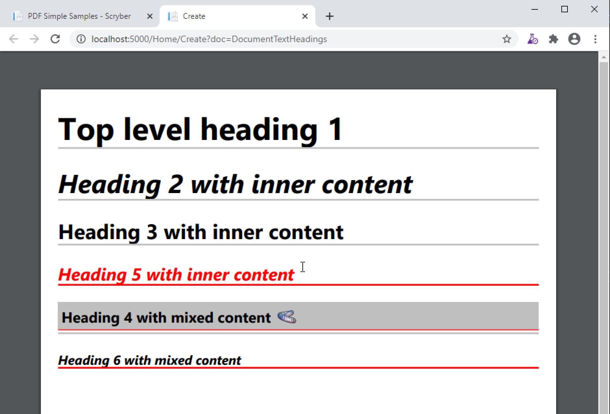

=========================================
Headings, Paragraphs, Quotes and Pre
=========================================

Scryber supports a full complement of block level textual components.

Headings
=========

The following headings are supported with their default size and style

* H1 - 36pt bold
* H2 - 30pt bold italic
* H3 - 24pt bold
* H4 - 20pt bold italic
* H5 - 17pt bold
* H6 - 15pt bold italic

All headings are set to full width and not to split over columns or pages. It is of course 
possible to change the defaults, either for all components of that type, or explicitly 
applied style:class(es)

Scryber also supports the applied-type of pdf:Heading, from which all the H1 to H6 components inherit 
that can be used to style all headings at once (e.g. Font family, colour, margins etc.).

Headings allso support the convenience property for `text` which can be data bound to any value.
See :doc:`binding_databinding` for more information on sources and parameters.

.. code-block:: xml

    <?xml version="1.0" encoding="utf-8" ?>

    <pdf:Document xmlns:pdf="http://www.scryber.co.uk/schemas/core/release/v1/Scryber.Components.xsd"
                xmlns:styles="http://www.scryber.co.uk/schemas/core/release/v1/Scryber.Styles.xsd"
                xmlns:data="http://www.scryber.co.uk/schemas/core/release/v1/Scryber.Data.xsd">
    <Styles>

        <!-- Style that is applied to all headings -->
        <styles:Style applied-type="pdf:Heading">
            <styles:Border color="silver" width="2pt" sides="Bottom" />
            <styles:Font family="Segoe UI"/>
            <styles:Margins bottom="20pt"/>
        </styles:Style>

        <!-- Just for the H4 components -->
        <styles:Style applied-type="pdf:H4" >
            <styles:Fill color="red" />
        </styles:Style>
        
        <!-- For the red components -->
        <styles:Style applied-class="red" >
            <styles:Border color="red" sides="Bottom"/>
        </styles:Style>
        
    </Styles>
    <Pages>

            <pdf:Page styles:margins="20pt" styles:font-size="12pt" >
            <Content>

                <pdf:H1 text="Top level heading 1"></pdf:H1>

                <pdf:H2 >Heading 2 with inner content</pdf:H2>

                <pdf:H3>Heading 3 with inner content</pdf:H3>

                <pdf:H4>Heading 5 with inner content</pdf:H4>

                <pdf:H5 styles:padding="0 0 4 0">
                    <pdf:Div styles:bg-color="silver" styles:class="red" styles:padding="4pt">
                    Heading 4 with mixed content
                    <pdf:Image src="../../content/images/toroid32.png" styles:width="30pt" styles:position-mode="Inline" />
                    </pdf:Div>
                </pdf:H5>
                
                <pdf:H6 styles:class="red">Heading 6 with mixed content</pdf:H6>
            </Content>
            </pdf:Page>

    
    </Pages>
    
    </pdf:Document>

Paragraphs
===========

