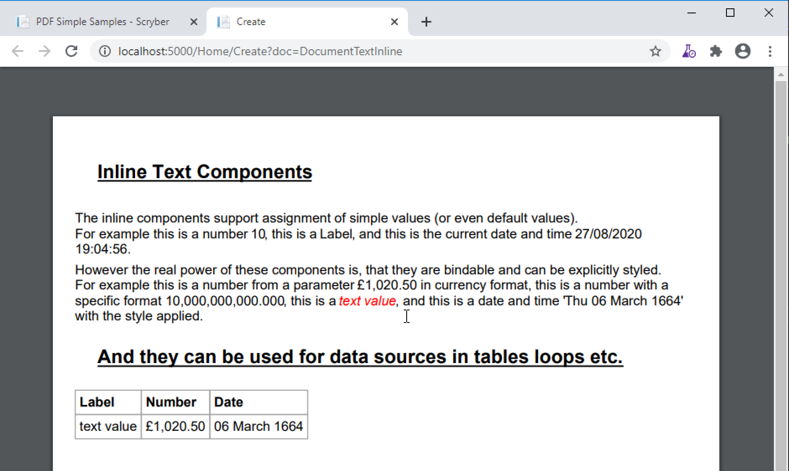

=====================================
Labels, Dates,  Numbers and Text
=====================================

Along with text containers, Scryber also supports a range of inline 
components for specific textual values.

These also support all the inline style attributes associated with components (and block positioning
excetera if their position-mode is changed.

.. code-block:: xml

    <?xml version="1.0" encoding="utf-8" ?>

    <pdf:Document xmlns:pdf="http://www.scryber.co.uk/schemas/core/release/v1/Scryber.Components.xsd"
                xmlns:styles="http://www.scryber.co.uk/schemas/core/release/v1/Scryber.Styles.xsd"
                xmlns:data="http://www.scryber.co.uk/schemas/core/release/v1/Scryber.Data.xsd">
    <Params>
        <pdf:Double-Param id="Currency" value="1020.50" />
        <pdf:Double-Param id="Long" value="10000000000"/>
        <pdf:Date-Param id="Eons" value="1664-03-06" />
        <pdf:String-Param id="label" value="text value" />
        <pdf:String-Param id="DateFormat" value="ddd dd MMMM yyyy" />
    </Params>
    
    <Styles>

        <styles:Style applied-type="pdf:H5" >
            <styles:Text decoration="Underline" />
        </styles:Style>

        <styles:Style applied-class="field" >
            <styles:Font italic="true" />
            <styles:Fill color="red"/>
        </styles:Style>

        <styles:Style applied-class="date" >
            <styles:Text date-format="{@:dateFormat}"/>
        </styles:Style>
    </Styles>
    <Pages>

        <pdf:Page styles:margins="20pt" styles:font-size="12pt">

        <Content>
            <pdf:H5 text="Inline Text Components" styles:margins="20" />
            <pdf:Para>
                The inline components support assignment of simple values (or even default values).<pdf:Br/>
                For example this is a number <pdf:Number value="10" />, this is a <pdf:Label text="Label"  />, and this is the current date and time <pdf:Date />.
            </pdf:Para>
            <pdf:Para>
                However the real power of these components is, that they are bindable and can be explicitly styled.<pdf:Br/>
                For example this is a number from a parameter <pdf:Number value="{@:Currency}" styles:number-format="C" /> in currency format,
                this is a number with a specific format <pdf:Number value="{@:Long}" styles:number-format="#,###,000.000" />,
                this is a <pdf:Label text="{@:Label}" styles:class="field"  />, and this is a date and time '<pdf:Date value="{@:Eons}" styles:class="date" />' with
                the style applied.
            </pdf:Para>

            <pdf:H5 text="And they can be used for data sources in tables, loops etc." styles:margins="20" />
            <pdf:Table>
                <pdf:Header-Row>
                    <pdf:Header-Cell>Label</pdf:Header-Cell>
                    <pdf:Header-Cell>Number</pdf:Header-Cell>
                    <pdf:Header-Cell>Date</pdf:Header-Cell>
                </pdf:Header-Row>
                <pdf:Row>
                    <pdf:Cell>
                        <pdf:Label text="{@:Label}" />
                    </pdf:Cell>
                    <pdf:Cell>
                        <pdf:Number value="{@:Currency}" styles:number-format="C" />
                    </pdf:Cell>
                    <pdf:Cell>
                        <pdf:Date value="{@:Eons}" styles:date-format="D" />
                    </pdf:Cell>
                </pdf:Row>
            </pdf:Table>
        </Content>
        </pdf:Page>
    
    </Pages>
    
    </pdf:Document>

Text Component
===============

The pdf:Text component is also available, and is **not** stylable. 
It will simply add text to a run of characters.

However, it too is fully bindable.

.. code-block:: xml

    <pdf:Text value="{@:Label}" />