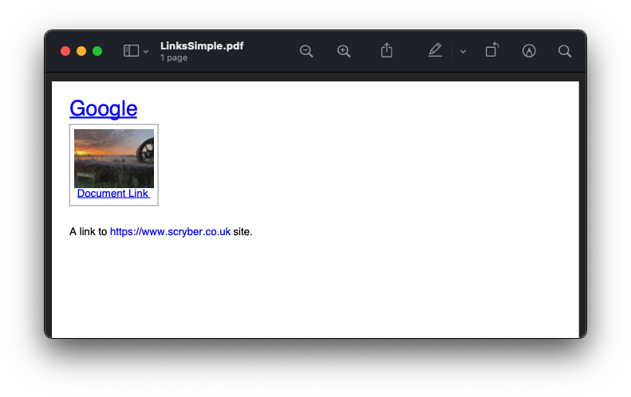
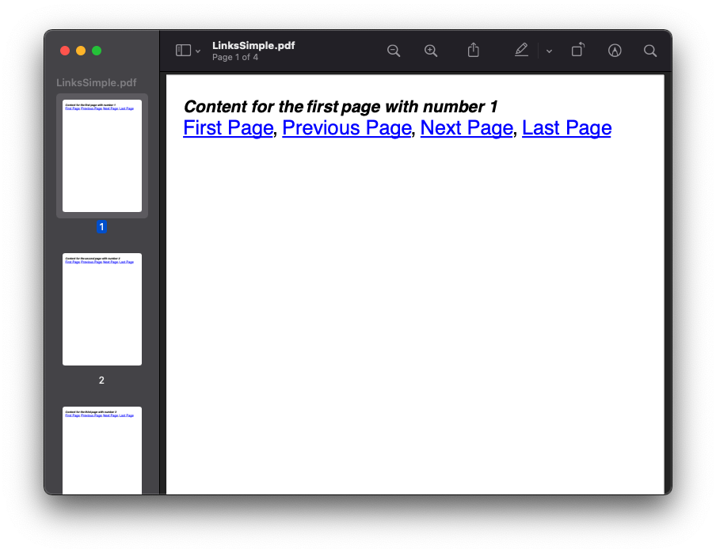
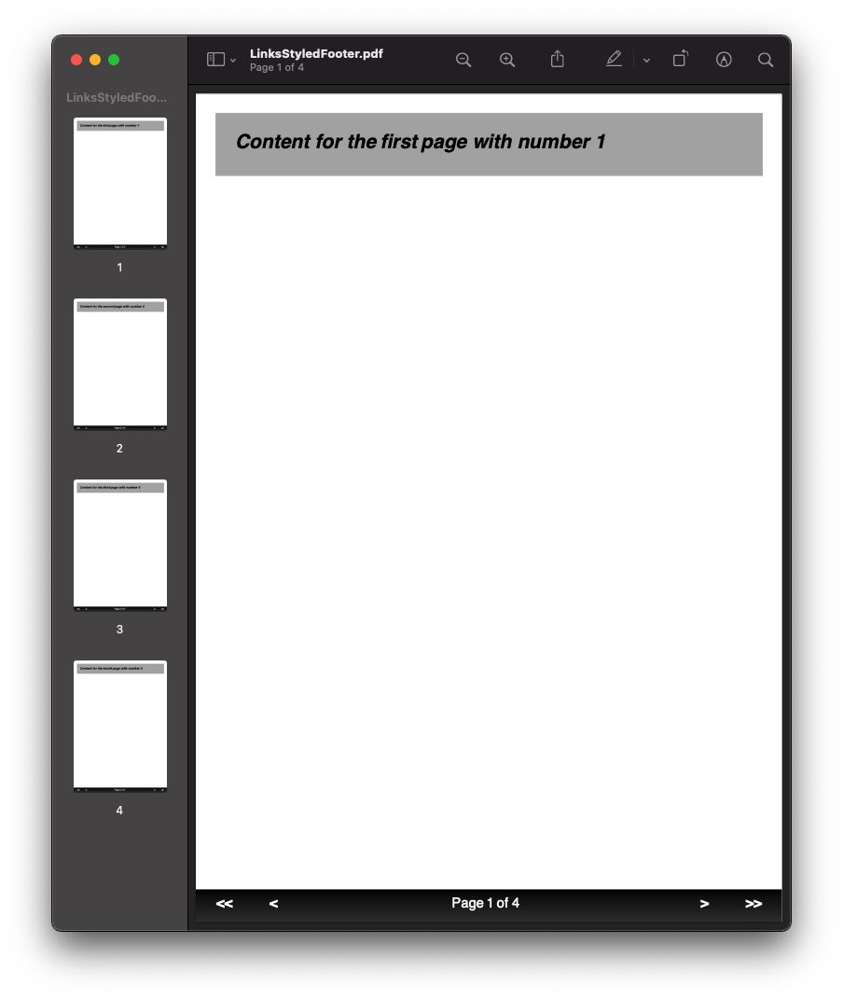
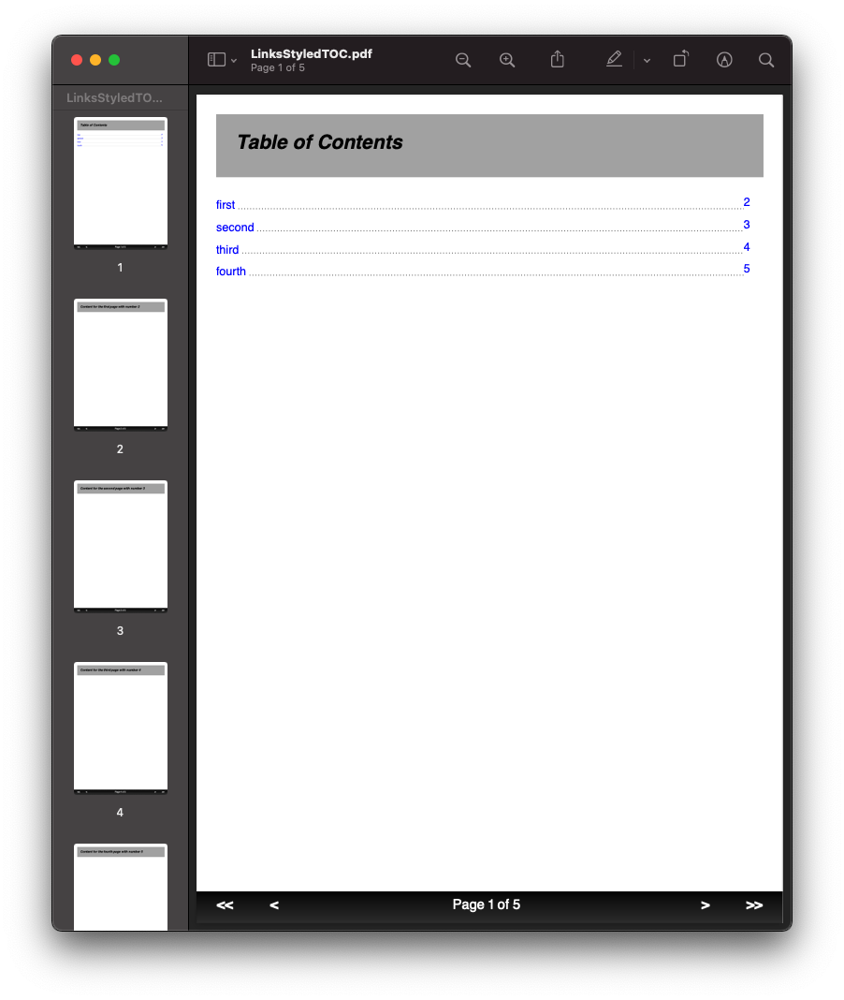
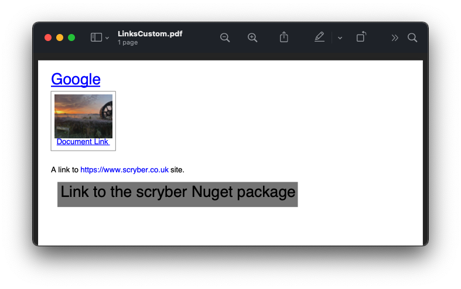
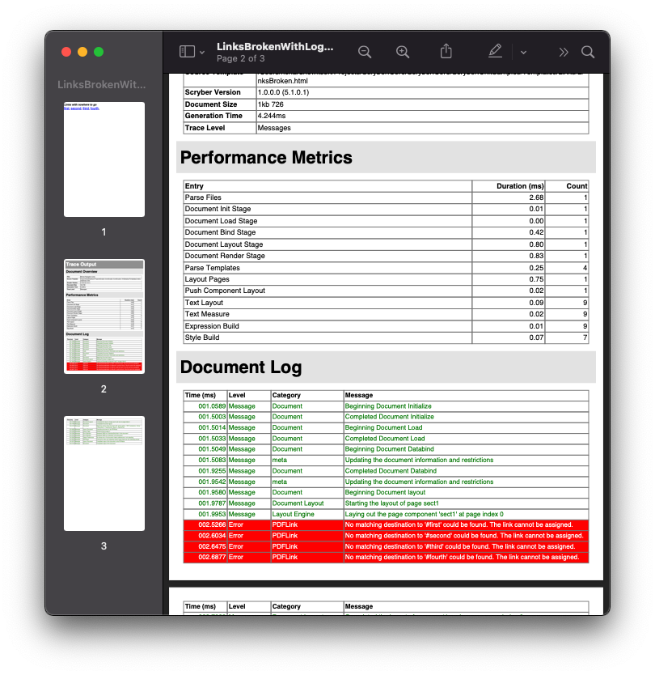

======================================
Links in  and out of documents
======================================

Within a document, it's easy to add a link to another component, another page, 
another document, or remote web link.

Scryber supports the standard ``a`` anchor tag with the ``href`` attribute for linking between items.

Generation methods
-------------------

All methods and files in these samples use the standard testing set up as outlined in :doc:`../overview/samples_reference`

The Anchor Component
----------------------

An `a`nchor tag is an invisible component (although styles will be applied to content within it) that allows linking to other components.
The href attribute supports 3 types of content.

* **url** - A relative or remote link to a document or webpage.
* **Named Action** - These are the standard links to and from pages (see below).
* **#id** - If set, then the link is an action for a different document or Url. Effectively like the href of an anchor tag in html.

The content within a link can be anything, including images; text; svg components and more. 
There can also be more than one component within the link.

By default the ``a`` tag is inline with a style applied for any inner text of underlined blue, 
but it does support the use of being positioned as a block and all other styling options.

Relative or Remote Links
-------------------------

Using the href attribute a remote link can be made to any url or local document.
Links can also contain images or any other content, and can use the target='_blank' to open in a new tab.

.. code-block:: html

    <!-- /Templates/Links/LinksSimple.html -->
    <!DOCTYPE html>
    <html xmlns="http://www.w3.org/1999/xhtml">
    <head>
        <title>Remote and Relative Links</title>
    </head>
    <body style="padding:20pt">

        <!-- A web link to the google home page -->
        <a href="https://www.google.com" target="_blank">Google</a> 

        <!-- a link to a local pdf that will open in a new reader tab or window -->
        <a href="AnotherDocument.pdf" target="_blank">
            

                Document Link
            

        </a> 
         
        <!-- binding the url to a document parameter -->
        A link to <a href="{{siteurl}}" style="text-decoration: none;">{{siteurl}}</a> site.
    </body>
    </html>

.. code:: csharp

    //Scryber.UnitSamples/LinkSamples.cs

    public void SimpleNavigationLinks()
    {
        var path = GetTemplatePath("Links", "LinksSimple.html");

        using (var doc = Document.ParseDocument(path))
        {
            using (var stream = GetOutputStream("Links", "LinksSimple.pdf"))
            {
                doc.Params["siteurl"] = "https://www.scryber.co.uk";
                doc.SaveAsPDF(stream);
            }

        }
    }

`Full size version <../_images/samples_linkshref.png>`_

.. note:: By the very nature of documents, they can be moved around. Relative links may not be appropriate, but can be bound and converted to absolute links as needed.

Page Named Action
------------------

Navigation within a document can be done using a predefined action for the reader to take. The possible actions are (case insensitive) as follows:

* FirstPage
* PrevPage
* NextPage
* LastPage

These are self-evident in their purpose, and no other attributes need defining.
It does not matter what page they are put on, they will perform the action if possible.

.. code-block:: html

    <a href='nextpage' >Next Page Link</a>

For example we can create a navigation set of links.

.. code-block:: xml

    <!-- /Templates/Links/LinksNamedActions.html -->
    <!DOCTYPE html>
    <html xmlns="http://www.w3.org/1999/xhtml">
    <head>
        <meta charset="utf-8" />
        <title>Simple Links</title>
        
    </head>
    <body style="padding:20pt">
        <template data-bind="{{pages}}">
            
 0, 'break-before', 'break-none')}}">
                <h4>Content for the {{.Id}} page with number <page /></h4>
                <a href="FirstPage">First Page</a>,
                <a href="PreviousPage">Previous Page</a>,
                <a href="NextPage">Next Page</a>,
                <a href="LastPage">Last Page</a>
            

        </template>
    </body>
    </html>

.. code:: csharp

    //Scryber.UnitSamples/LinkSamples.cs

    public void NamedActionLinks()
    {
        var path = GetTemplatePath("Links", "LinksNamedActions.html");

        using (var doc = Document.ParseDocument(path))
        {
            var pages = new[] { new { Id = "first" }, new { Id = "second" }, new { Id = "third" }, new { Id = "fourth" } };
            doc.Params["pages"] = pages;

            using (var stream = GetOutputStream("Links", "LinksNamedActions.pdf"))
            {
                doc.SaveAsPDF(stream);
            }

        }
    }

`Full size version <../_images/samples_linkssimple.png>`_

**In this sample we are binding to an array of strings, and then setting the class on an outer div, so that there is a page break before the div on every itteration *except* the first**

See :doc:`../overview/parameters_and_expressions` for more information on binding to data and objects.

Styling Links
--------------

Although the default style is inline with blue text and underline. Links can be styled independently.

In this example we use a footer template for the navigation links between pages (see :doc:`../overview/pages_and_sections` for more on page headers and footers).

We style the footer with a table where the links are set in 50pt wide cells, and the centre cell takes up the rest of the space for a Page N of Total.

.. code:: html

    <!-- /Templates/Links/LinksStyledFooter.html -->
    <!DOCTYPE html>
    <html xmlns="http://www.w3.org/1999/xhtml">
    <head>
        <meta charset="utf-8" />
        <title>Navigation Links</title>
        
    </head>
    <body>
        
        <template data-bind="{{pages}}">
            
 0, 'break-before', 'break-none')}}">
                <h4>Content for the {{.Id}} page with number <page /></h4>
            

        </template>

        <footer>
            <table class="nav">
                <tr>
                    <td class="nav-item">
                        <a href="FirstPage">&lt;&lt;</a>
                    </td>
                    <td class="nav-item">
                        <a href="PreviousPage">&lt;</a>
                    </td>
                    <td>
                        Page <page /> of <page property="total" />
                    </td>
                    <td class="nav-item">
                        <a href="NextPage">&gt;</a>
                    </td>
                    <td class="nav-item" >
                        <a href="LastPage">&gt;&gt;</a>
                    </td>
                </tr>
            </table>
        </footer>
    </body>
    </html>

.. code:: csharp

    //Scryber.UnitSamples/LinkSamples.cs

    public void StyledFooterNavigationLinks()
    {
        var path = GetTemplatePath("Links", "LinksStyledFooter.html");

        using (var doc = Document.ParseDocument(path))
        {
            var pages = new[] { new { Id = "first" }, new { Id = "second" }, new { Id = "third" }, new { Id = "fourth" } };
            doc.Params["pages"] = pages;

            using (var stream = GetOutputStream("Links", "LinksStyledFooter.pdf"))
            {
                doc.SaveAsPDF(stream);
            }

        }
    }

`Full size version <../_images/samples_linksstyled.png>`_

.. note:: The white color is applied to the `a`nchor tag as well as the cell, because the default style of blue would override the inherited white color from the cell class.

(H)Over Styles
--------------

There is no support for hover, down, over, clicked within the scryber pdf support. At the moment the use of the pointer cursor over a link and it's default style is what is available.

Linking within documents
------------------------

When navigating around the document, scryber supports the direct linking to a specific page or component 
using the id being referenced attribute. Prefix with a # (hash) to identify it is an element witin the document.

.. code:: html

    <a href='#Id'>Link to item</a>

    
Content to link to

This can also be data bound, so with our data we can add a first page for a table of contents linking to each of the headings in the following pages.
(Removing the need to check for a first page on the breaks.)

A Table of Contents
---------------------

.. code-block:: html

    <!-- /Templates/Links/LinksStyledTOC.html -->

    <!DOCTYPE html>
    <html xmlns="http://www.w3.org/1999/xhtml">
    <head>
        <meta charset="utf-8" />
        <title>Table of contents Links</title>
        
    </head>
    <body>

        <h4>Table of Contents</h4>
        <table class="toc">
            <!-- Loop over the items for the content of the table -->
            <template data-bind="{{pages}}">
                <tr>
                    <td class="name">
                        <!-- The link is set to the concatenation of # and Id in the data
                            We also use a hr spacer with a dotted style -->
                        <a href="{{concat('#',.Id)}}">{{.Id}} </a> 

                    </td>
                    <td class="page-num" style="width:20pt;">
                        <!-- The page for will look up the page number of the item referenced too -->
                        <a href="{{concat('#',.Id)}}"><page for="{{concat('#',.Id)}}" /></a>
                    </td>
                </tr>
            </template>
        </table>

        <template data-bind="{{pages}}">
            <!-- Each heading wrapper has the id from the pages data -->
            

                <h4>Content for the {{.Id}} page with number <page /></h4>
            

        </template>

        <footer>
            <table class="nav">
                <tr>
                    <td class="nav-item">
                        <a href="FirstPage">&lt;&lt;</a>
                    </td>
                    <td class="nav-item">
                        <a href="PreviousPage">&lt;</a>
                    </td>
                    <td>
                        Page <page /> of <page property="total" />
                    </td>
                    <td class="nav-item">
                        <a href="NextPage">&gt;</a>
                    </td>
                    <td class="nav-item" >
                        <a href="LastPage">&gt;&gt;</a>
                    </td>
                </tr>
            </table>
        </footer>
    </body>
    </html>

.. code:: csharp

    //Scryber.UnitSamples/LinkSamples.cs

    public void StyledFooterWithTOCLinks()
    {
        var path = GetTemplatePath("Links", "LinksStyledTOC.html");

        using (var doc = Document.ParseDocument(path))
        {
            var pages = new[] { new { Id = "first" }, new { Id = "second" }, new { Id = "third" }, new { Id = "fourth" } };
            doc.Params["pages"] = pages;

            using (var stream = GetOutputStream("Links", "LinksStyledTOC.pdf"))
            {
                doc.SaveAsPDF(stream);
            }

        }
    }

`Full size version <../_images/samples_linkstoc.png>`_

Adding links in code
-----------------------

The component class for using links in code is ``Scryber.Components.Link``
There are 3 primary properties to use for setting what is done when the link is clicked.

To perform one of the Named actions use the ``Action`` property, setting to the pre-defined ``NextPage``, ``PrevPage`` etc.

.. code:: csharp

    var link = new Link()
    {
        Action = LinkAction.NextPage
    };

To link to a component within the current document set the ``Destination`` property value to the id of the component to look for.

.. code:: csharp

    var link = new Link()
    {
        Action = LinkAction.Destination,
        Destination = "#ComponentID",
    };

To link to a remote page or site set the ``File`` property to the required url.

.. code:: csharp

    var link = new Link()
    {
        Action = LinkAction.Uri,
        Destination = "https://www.scryber.co.uk",
    };

As a container, links can still have any content inside them, and be placed anywhere in the visual content of the document.

.. code:: csharp

    //Scryber.UnitSamples/LinkSamples.cs

    public void SimpleLinksWithCustomAddition()
    {
        //template from our first example
        var path = GetTemplatePath("Links", "LinksSimple.html");

        using (var doc = Document.ParseDocument(path))
        {
            doc.Params["siteurl"] = "https://www.scryber.co.uk";

            //create a new link

            var link = new Link()
            {
                Action = LinkAction.Uri,
                File = "https://www.nuget.org/packages/Scryber.Core/",
                Margins = new PDFThickness(10),
                Padding = new PDFThickness(5),
                BackgroundColor = PDFColors.Gray,
                PositionMode = PositionMode.Block
            };

            //add some inner content

            link.Contents.Add(new TextLiteral("Link to the scryber Nuget package"));

            //add it to the page (at the end)

            var pg = doc.Pages[0] as Page;
            pg.Contents.Add(link);

            using (var stream = GetOutputStream("Links", "LinksCustom.pdf"))
            {
                doc.SaveAsPDF(stream);
            }

        }
    }
    

`Full size version <../_images/samples_linksCustom.png>`_

.. note:: The base link class does not add the blue underlined default style to the output. This can either be added as needed, or styled in any other way.

Fixing Broken Links
--------------------

By default, when a link is not found for a destination, then it will not be enabled however the style and the output will still be honoured.
If links are not working in a document then the, as always, the output trace log can be inspected to see if an error is reported, or change the document parsing mode to strict.

This can all be done either with the ``<?scryber append-log='true' ?>`` processing instruction or on the document itself ``doc.ConformanceMode = ParserConformanceMode.Strict``.

.. code:: html

    <!DOCTYPE html>
    <?scryber append-log='true' ?>
    <html xmlns="http://www.w3.org/1999/xhtml">
    <head>
        <title>Broken Navigation Links</title>
    </head>
    <body>

        <h4>Links with nowhere to go</h4>
        

            <!-- Loop over the items for the content of the table -->
            <template data-bind="{{pages}}">
            <a href="{{concat('#',.Id)}}">{{.Id}}</a>, 
            </template>
        

    </body>
    </html>

`Full version <../samples/Links/LinksBrokenWithLog.pdf>`_

See :doc:`../overview/scryber_output` for more about the tracing and logging in document output.