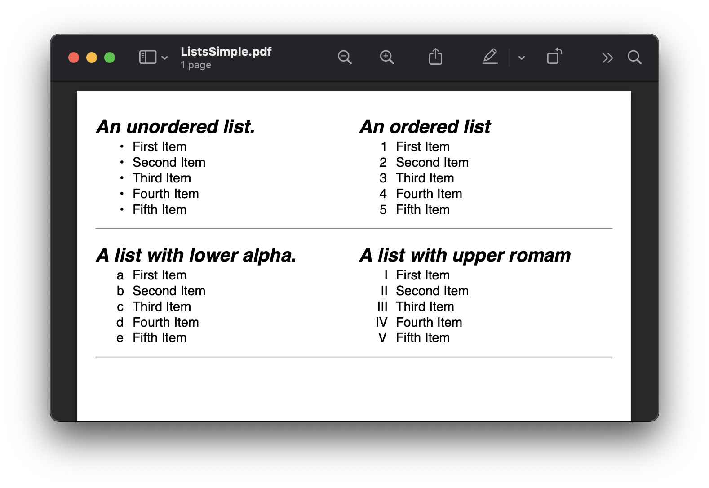
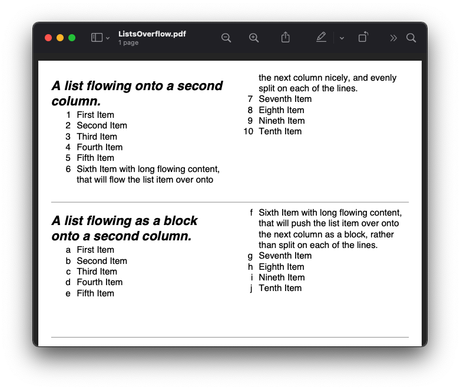
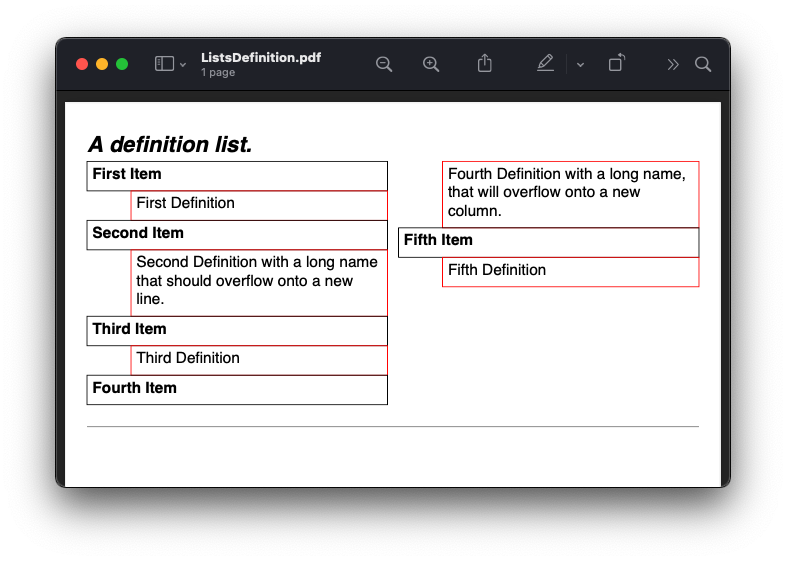
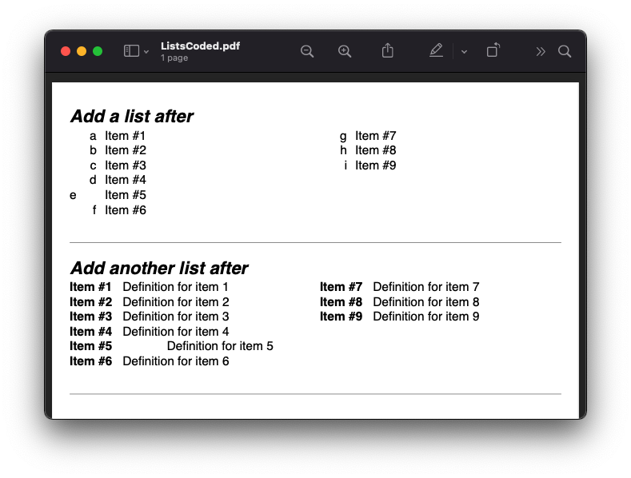

=======================================
Unordered, Ordered and Definition Lists
=======================================

Scryber supports the use of lists both ordered and unordered and allows nesting, overflow, and definition lists.
It also supports the use of binding and repeating on list items.

A list item is just a container for other content, and can contain any children.

Generation methods
-------------------

All methods and files in these samples use the standard testing set up as outlined in :doc:`../overview/samples_reference`

Unordered and ordered lists
----------------------------

Scryber uses the same  tags as Html for the Ordered Lists ``ol`` and Unordered Lists ``ul`` as per html, this is also possible
to alter the list style type using the ``list-style`` option.

The contents of a list item ``li`` can be any form of content (inline or otherwise).

.. code-block:: html

    <!-- /Templates/Lists/ListsSimple.html -->

    <!DOCTYPE html>
    <html xmlns="http://www.w3.org/1999/xhtml">
    <head>
        <meta charset="utf-8" />
        <title>Simple Lists</title>
        
    </head>
    <body style="padding:20pt; font-size: 14pt;">
        

            <h4>An unordered list.</h4>
            <ul style="break-after: always;">
                <li>First Item</li>
                <li>Second Item</li>
                <li>Third Item</li>
                <li>Fourth Item</li>
                <li>Fifth Item</li>
            </ul>

            <h4>An ordered list</h4>
            <ol>
                <li>First Item</li>
                <li>Second Item</li>
                <li>Third Item</li>
                <li>Fourth Item</li>
                <li>Fifth Item</li>
            </ol>
        

        

            <h4>A list with lower alpha.</h4>
            <ul style="break-after: always; list-style:lower-alpha;">
                <li>First Item</li>
                <li>Second Item</li>
                <li>Third Item</li>
                <li>Fourth Item</li>
                <li>Fifth Item</li>
            </ul>

            <h4>A list with upper romam</h4>
            <ol style="list-style: upper-roman;">
                <li>First Item</li>
                <li>Second Item</li>
                <li>Third Item</li>
                <li>Fourth Item</li>
                <li>Fifth Item</li>
            </ol>
        

    </body>
    </html>

.. code:: csharp

    //Scryber.UnitSamples/ListSamples.cs

    public void SimpleList()
    {
        var path = GetTemplatePath("Lists", "ListsSimple.html");

        using (var doc = Document.ParseDocument(path))
        {
            using (var stream = GetOutputStream("Lists", "ListsSimple.pdf"))
            {
                doc.SaveAsPDF(stream);
            }

        }
    }

`Full size version <../_images/samples_listsSimple.png>`_

Supported list numbering types
------------------------------

The following types of numbering are supported for lists. This is based on the numbering supported in the PDF Specification.

* disc or circle - this will be a bulleted list.
* decimal - this will be a number 1,2,3,4, etc.
* upper-roman - Roman numerals I, II, III, IV, etc.
* lower-roman - Roman numerals i, ii, iii, iv, etc.
* upper-alpha - Letters A, B, C, D, etc.
* lower-alpha - Letters a, b, c, d, etc.

Any other values will be output as  decimals.

Overflowing list items
-----------------------

As with table rows (see :doc:`tables_reference`) the list items are not designed to be split across columns or pages.
They will attempt to keep together and bring any numbers, bullets or defitions with them.

.. code:: html

    <!-- /Templates/Lists/ListsOverflow.html -->

    <!DOCTYPE html>
    <html xmlns="http://www.w3.org/1999/xhtml">
    <head>
        <meta charset="utf-8" />
        <title>Simple Lists</title>
        
    </head>
    <body style="padding:20pt; font-size: 14pt;">
        

            <h4>A list flowing onto a second column.</h4>
            <ul>
                <li>First Item</li>
                <li>Second Item</li>
                <li>Third Item</li>
                <li>Fourth Item</li>
                <li>Fifth Item</li>
                <li>Sixth Item</li>
                <li>Seventh Item</li>
                <li>Eighth Item</li>
                <li>Nineth Item</li>
                <li>Tenth Item</li>
                <li>Eleventh Item</li>
                <li>Twelveth Item</li>
                <li>Thirteenth Item</li>
                <li>Fourteenth Item</li>
                <li>Fifteenth Item</li>
            </ul>
        

        

            <h4>A list flowing as a block onto a second column.</h4>
            <ul style="break-after: always; list-style:lower-alpha;">
                <li>First Item</li>
                <li>Second Item</li>
                <li>Third Item</li>
                <li>Fourth Item</li>
                <li>Fifth Item</li>
                <li>Sixth Item with long flowing content, that will push the
                list item over onto the next column as a block, rather than
                split on each of the lines.</li>
                <li>Seventh Item</li>
                <li>Eighth Item</li>
                <li>Nineth Item</li>
                <li>Tenth Item</li>
            </ul>
        

    </body>
    </html>

.. code:: csharp

    //Scryber.UnitSamples/ListSamples.cs

    public void OverflowingList()
    {
        var path = GetTemplatePath("Lists", "ListsOverflow.html");

        using (var doc = Document.ParseDocument(path))
        {
            using (var stream = GetOutputStream("Lists", "ListsOverflow.pdf"))
            {
                doc.SaveAsPDF(stream);
            }

        }
    }

`Full size version <../_images/samples_listsOverflowing.png>`_

Definition Lists
-----------------

Definition lists allow terms and contents to be set out with a term and a definition.
Whilst not expressly a list, they are covered here as part of our list building.

The ``<dl></dt>`` top level tag defines the list, and the inner ``<dt></dt>`` terms and ``<dd></dd>`` definitions supporting any inner content. 
The definitions are margins inset by 100pt's to the left.

As the definitions are simply blocks, they support all style and class properties of :doc:`block_styles`

.. code:: html

    <!DOCTYPE html>
    <?scryber append-log=false parser-log=true ?>
    <html xmlns="http://www.w3.org/1999/xhtml">
    <head>
        <meta charset="utf-8" />
        <title>Definition Lists</title>
        
    </head>
    <body style="padding:20pt; font-size: 14pt;">
        <h4>A definition list.</h4>
        

            <dl id="dl1">
                <dt>First Item</dt>
                <dd id="def1">First Definition</dd>
                <dt id="term1">Second Item</dt>
                <dd id="def2">Second Definition with a long name that should overflow onto a new line.</dd>
                <dt>Third Item</dt>
                <dd>Third Definition</dd>
                <dt id="dt4">Fourth Item</dt>
                <dd id="dd4">Fourth Definition with a long name, that will overflow onto a new column.</dd>
                <dt>Fifth Item</dt>
                <dd>Fifth Definition</dd>
            </dl>
        

    </body>
    </html>

.. code:: csharp

    //cryber.UnitSamples/ListSamples.cs

    public void DefinitionList()
    {
        var path = GetTemplatePath("Lists", "ListsDefinition.html");

        using (var doc = Document.ParseDocument(path))
        {
            using (var stream = GetOutputStream("Lists", "ListsDefinition.pdf"))
            {
                doc.SaveAsPDF(stream);
            }

        }
    }

`Full size version <../_images/samples_listsDefinition.png>`_

Nested Lists
------------

Lists can be nested within each other, and the numbers can also be concatenated.

List grouping
------------------------

Building Lists in code
----------------------

Lists and list items are just as easy to define in code. The base class in the ``Scryber.Components`` namespace is 
``List``, with ``ListOrdered``, ``ListUnordered`` and ``ListDefinition``  inheriting from the base class and applying 
their own base style.

The list items ``Scryber.Components.ListItem`` can be added to the list ``Items`` collection, and adds some extra style properties
for the ItemLabelText (for definition lists), the NumberAlignment and the NumberInset.

.. code:: html

    <!-- /Templates/Lists/ListsCoded.html -->

    <!DOCTYPE html>
    <html xmlns="http://www.w3.org/1999/xhtml">
    <head>
        <meta charset="utf-8" />
        <title>Coded Lists</title>
        
    </head>
    <body style="padding:20pt; font-size: 14pt;">

        <h4>Add a list after</h4>
        

        

        <h4>Add another list after</h4>
        

        

    </body>
    </html>

.. code:: csharp

    // Scryber.UnitSamples/ListSamples.cs

    public void CodedList()
    {
        var path = GetTemplatePath("Lists", "ListsCoded.html");

        using (var doc = Document.ParseDocument(path))
        {
            
            if (doc.TryFindAComponentById("TopDiv", out Div top))
            {
                ListOrdered ol = new ListOrdered() { NumberingStyle = ListNumberingGroupStyle.LowercaseLetters };
                for(var i = 1; i < 10; i ++)
                {
                    ListItem li = new ListItem();
                    li.Contents.Add(new TextLiteral("Item #" + i));

                    //Setting the item number alignment to left individually
                    if (i == 5)
                        li.NumberAlignment = HorizontalAlignment.Left;

                    ol.Items.Add(li);
                }
                top.Contents.Add(ol);
            }

            if (doc.TryFindAComponentById("SecondDiv", out Div second))
            {
                ListDefinition dl = new ListDefinition();
                
                for (var i = 1; i < 10; i++)
                {
                    ListDefinitionTerm term = new ListDefinitionTerm();
                    term.Contents.Add(new TextLiteral("Term " + i));
                    dl.Items.Add(term);

                    ListDefinitionItem def = new ListDefinitionItem();
                    def.Contents.Add(new TextLiteral("Definition for term " + i));

                    //Setting the item number inset to 100 individually
                    if (i == 5)
                        def.Style.Margins.Left = 100;
                    
                    dl.Items.Add(def);

                }
                second.Contents.Add(dl);
            }

            using (var stream = GetOutputStream("Lists", "ListsCoded.pdf"))
            {
                doc.SaveAsPDF(stream);
            }

        }

        }
    }

`Full size version <../_images/samples_listsCoded.png>`_

The list number-style supports the following options.

* Decimals (1, 2, 3, 4)
* LowercaseRoman (i, ii, iii, iv)
* UppercaseRoman (I, II, III, IV)
* LowercaseLetters (a, b, c, d)
* UppercaseLetters (A, B, C, D)
* Bullets (•, •, •, •)
* Labels (see `Definition Lists`_ below)
* None

Along with the style of the list entries, the doc:List; doc:Ol; doc:Ul also support the following style options.

* number-alignment - Left, Middle, Right (default), Justify. Specifies the horizontal alignment of the number based on the content.
* number-concat - true or false. If the list is nested, a true value will concatenate the list number with the previous list.
* number-group - A group name. Number groups follow consecutively in the whole document. By default this is blank (and not used), but can be set to any value.
* number-inset - The space allowed to the left of the item for the bullet, number or label.
* number-prefix - A string that appears before the number in the list item.
* number-postfix - A string that appears after the number in the list item.

For nested lists, the prefix and postfix will be honoured in any concatenation. (see below)

The number-alignment and number-inset can also be applied to individual list items within any of the lists.

Nesting Lists
-------------

Lists can be nested to any level, but the overflow rule still applies. The top level item cannot be split.

Using the number-concat and prefix / postfix the numbers can be built up within the lists.

.. code-block:: xml

    <?xml version="1.0" encoding="utf-8" ?>

    <doc:Document xmlns:doc="http://www.scryber.co.uk/schemas/core/release/v1/Scryber.Components.xsd"
                xmlns:styles="http://www.scryber.co.uk/schemas/core/release/v1/Scryber.Styles.xsd"
                xmlns:data="http://www.scryber.co.uk/schemas/core/release/v1/Scryber.Data.xsd">
    <Styles>
        <styles:Style applied-type="doc:Ol" >
            <styles:List number-style="Decimals" number-postfix="."/>
        </styles:Style>
        
        <styles:Style applied-class="inner" >
            <styles:List number-style="LowercaseRoman" number-concat="true" number-group="lr"/>
        </styles:Style>
    </Styles>
    <Pages>

        <doc:Page styles:margins="20pt" styles:font-size="12pt" >
            <Content>

                <doc:Div styles:column-count="2" styles:height="170pt" styles:border-color="aqua">
                
                <doc:Ol styles:number-alignment="Left" styles:number-inset="20pt">
                    <doc:Li >Decimal First Item</doc:Li>
                    <doc:Li >
                        Decimal Second Item with inner list that inherits the Ol style and adds the 'inner' list style.
                        <doc:Ol styles:class="inner" >
                            <doc:Li>First Lowercase item</doc:Li>
                            <doc:Li>Second Lowercase item</doc:Li>
                            <doc:Li>Third Lowercase item</doc:Li>
                        </doc:Ol>
                    </doc:Li>
                    <doc:Li >Decimal Third Item</doc:Li>
                    <doc:Li >Decimal Fourth Item 
                </doc:Li>
                    <doc:Li>
                        Decimal fifth Item with continuation of the 'lr' group from the inner style
                        <doc:Ol styles:class="inner" >
                            <doc:Li styles:number-alignment="Left" styles:number-inset="100pt">Fourth Lowercase item</doc:Li>
                            <doc:Li styles:number-alignment="Left" styles:number-inset="70pt">Fifth Lowercase item</doc:Li>
                            <doc:Li styles:number-alignment="Left" styles:number-inset="30pt">Sixth Lowercase item</doc:Li>
                        </doc:Ol>
                    </doc:Li>
                </doc:Ol>
                </doc:Div>
                
            </Content>
         </doc:Page>

    </Pages>
    
    </doc:Document>

.. image:: images/documentListNested.png

Definition Lists
----------------

Definition lists are slightly different as they use the doc:Dl and doc:Di components, with the item-label style value rather than a bullet or number.
They also have a default inset of 100pt, rather than 30pt to fit the label content. 

This can be changed using the number inset, and number alignment.

.. code-block:: xml

    <?xml version="1.0" encoding="utf-8" ?>

    <doc:Document xmlns:doc="http://www.scryber.co.uk/schemas/core/release/v1/Scryber.Components.xsd"
                xmlns:styles="http://www.scryber.co.uk/schemas/core/release/v1/Scryber.Styles.xsd"
                xmlns:data="http://www.scryber.co.uk/schemas/core/release/v1/Scryber.Data.xsd">
    <Pages>

        <doc:Page styles:margins="20pt" styles:font-size="12pt" >
            <Content>
                
                <doc:Dl styles:margins="0 0 20 0">
                    <doc:Di styles:item-label="First" >First Item</doc:Di>
                    <doc:Di styles:item-label="Second" >Second Item</doc:Di>
                    <doc:Di styles:item-label="Third" >Third Item</doc:Di>
                    <doc:Di styles:item-label="Fourth" >Fourth Item</doc:Di>
                    <doc:Di styles:item-label="Fifth" >Fifth Item</doc:Di>
                </doc:Dl>

                <doc:Dl styles:number-inset="150pt" styles:number-alignment="Left">
                    <doc:Di styles:item-label="Long First" >First Item</doc:Di>
                    <doc:Di styles:item-label="Long Second" >Second Item</doc:Di>
                    <doc:Di styles:item-label="Long Third" >Third Item</doc:Di>
                    <doc:Di styles:item-label="Long Fourth" >Fourth Item</doc:Di>
                    <doc:Di styles:item-label="Very Long Fifth that will force a new line" >
                        Fifth Item
                        <doc:Span styles:fill-color="red">
                        With inner content,
                        <doc:Image src="../../Content/Images/Toroid24.png" styles:width="18pt" styles:position-mode="Inline" />
                        that flows across the page and onto a new line.
                        </doc:Span>
                    </doc:Di>
                </doc:Dl>
                
            </Content>
        </doc:Page>

    
    </Pages>
    
    </doc:Document>

.. image:: images/documentListDefinitions.png

Binding List items
------------------

Just as with tables and any other content , lists fully support data binding (at any level),
 and can take data from eitehr the parameters or and explicit datasource.

See :doc:`binding_databinding` for more on how to set up sources and get data into a document.

.. code-block:: xml

    <?xml version="1.0" encoding="utf-8" ?>

    <doc:Document xmlns:doc="http://www.scryber.co.uk/schemas/core/release/v1/Scryber.Components.xsd"
                xmlns:styles="http://www.scryber.co.uk/schemas/core/release/v1/Scryber.Styles.xsd"
                xmlns:data="http://www.scryber.co.uk/schemas/core/release/v1/Scryber.Data.xsd">
    
        <Styles>

            <styles:Style applied-class="first">
                <styles:Position h-align="Center"/>
                <styles:Size width="300pt"/>
            </styles:Style>
            
        </Styles>
        <Data>
            
            <!-- Custom data source that will provide the data. -->
            <data:XMLDataSource id="Content" source-path="http://localhost:5000/Home/Xml" ></data:XMLDataSource>
        </Data>
        <Pages>

            <doc:Section styles:margins="20pt" styles:font-size="12pt">
            <Content>
                
                <data:With datasource-id="Content"  select="DataSources">
                
                <doc:H3 styles:h-align="Center" styles:margins="0 0 20 0" text="{xpath:@title}" />
                
                <doc:Div styles:column-count="2" styles:padding="4pt" styles:bg-color="#CCC" >
                    
                    <!-- simple list binding on the Name attribute of each of the Entry(s) -->
                    <doc:Ol styles:number-style="UppercaseLetters" >
                        <data:ForEach value="{xpath:Entries/Entry}" >
                            <Template>
                            <doc:Li >
                                <doc:Text value="{xpath:@Name}" />
                            </doc:Li>
                            </Template>
                        </data:ForEach>
                    </doc:Ol>

                    <doc:ColumnBreak />
                    <!-- Using a definition list with the binding. -->
                    <doc:Dl>
                    <data:ForEach value="{xpath:Entries/Entry}" >
                        <Template>
                        <data:Choose>

                            <!-- Set up the test for then we have an Id of 'ThirdID'-->
                            <data:When test="{xpath:@Id = 'ThirdID'}" >
                                <Template>

                                    <!-- Complex content for this item -->
                                    <doc:Di styles:item-label="{xpath:@Id}" >
                                        <doc:Span styles:font-bold="true" styles:fill-color="#AA0000" >
                                            <doc:Text value="{xpath:concat('This is the ',@Name,' item')}" />
                                        </doc:Span>
                                    </doc:Di>
                                </Template>
                            </data:When>

                            <!-- Just a simple item otherwise -->
                            <data:Otherwise>
                                <Template>
                                    <doc:Di styles:item-label="{xpath:@Id}" >
                                        <doc:Text value="{xpath:@Name}" />
                                    </doc:Di>
                                </Template>
                            </data:Otherwise>

                        </data:Choose>
                        </Template>
                    </data:ForEach>

                    </doc:Dl>
                </doc:Div>
                
                </data:With>

            </Content>
            </doc:Section>

    </Pages>
    
    </doc:Document>

And a datasource response that results as follows

.. code-block:: csharp

        public IActionResult Xml()
        {
            var xml = new XDocument(
                new XElement("DataSources",
                    new XAttribute("title", "Testing Xml Datasources"),
                    new XElement("Entries",
                        new XElement("Entry", new XAttribute("Name", "First Xml"), new XAttribute("Id", "FirstID")),
                        new XElement("Entry", new XAttribute("Name", "Second Xml"), new XAttribute("Id", "SecondID")),
                        new XElement("Entry", new XAttribute("Name", "Third Xml"), new XAttribute("Id", "ThirdID")),
                        new XElement("Entry", new XAttribute("Name", "Fourth Xml"), new XAttribute("Id", "FourthID"))
                        )
                    )
                );
            return Content(xml.ToString(), "text/xml");
        }

.. image:: images/documentListsBinding.png

.. note:: Scryber also includes the doc:DataList component that can easily create ordered and unordered lists from datasources MUCH faster. But the doc:ForEach and doc:Choice allow full control where needed.