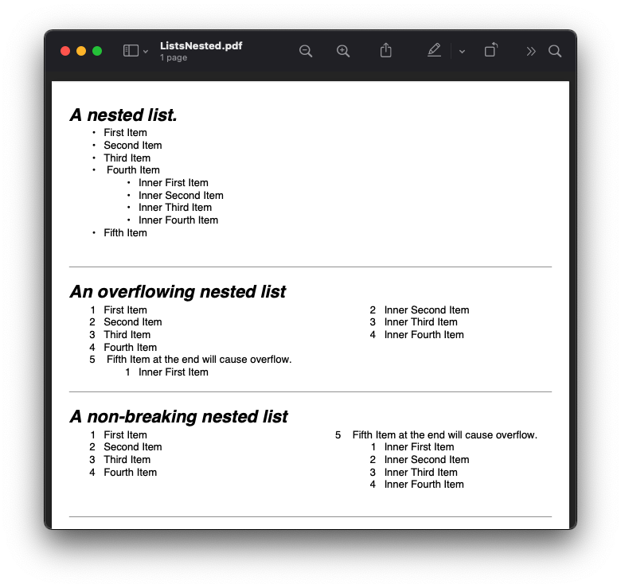
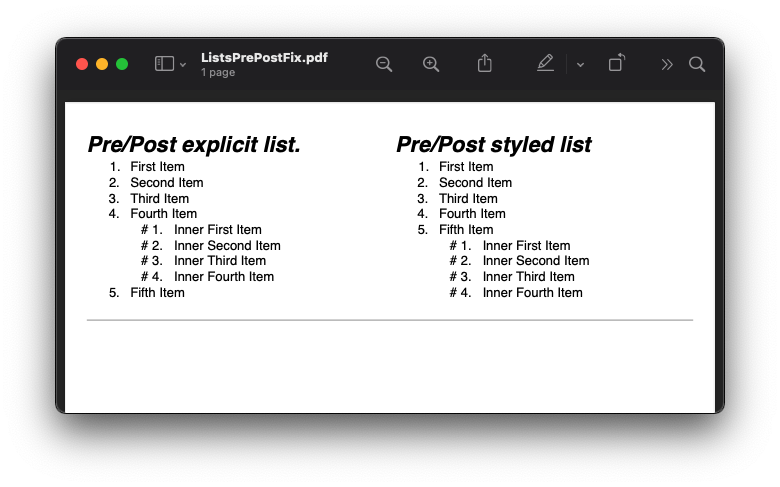
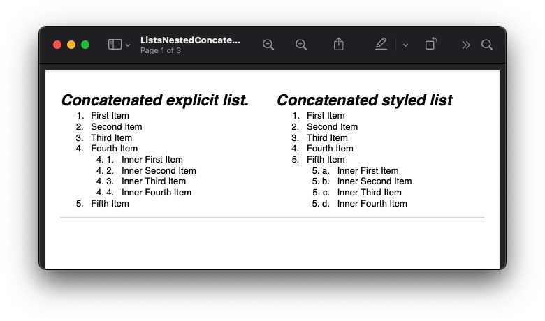
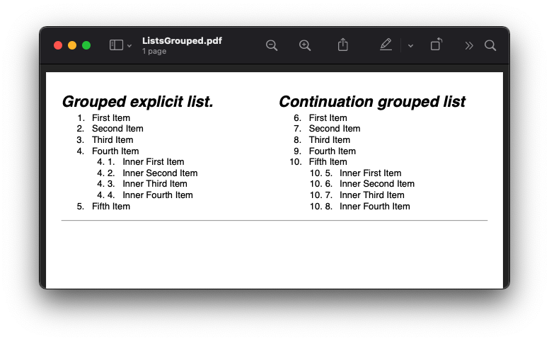
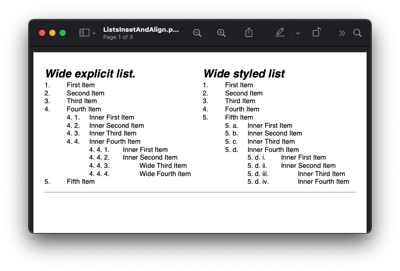

=======================================
Unordered, Ordered and Definition Lists
=======================================

Scryber supports the use of lists both ordered and unordered and allows nesting, overflow, and definition lists.
It also supports the use of binding and repeating on list items.

A list item is just a container for other content, and can contain any children.

Generation methods
-------------------

All methods and files in these samples use the standard testing set up as outlined in :doc:`../overview/samples_reference`

Unordered and ordered lists
----------------------------

Scryber uses the same  tags as Html for the Ordered Lists ``ol`` and Unordered Lists ``ul`` as per html, this is also possible
to alter the list style type using the ``list-style`` option.

The contents of a list item ``li`` can be any form of content (inline or otherwise).

.. code-block:: html

    <!-- /Templates/Lists/ListsSimple.html -->

    <!DOCTYPE html>
    <html xmlns="http://www.w3.org/1999/xhtml">
    <head>
        <meta charset="utf-8" />
        <title>Simple Lists</title>
        
    </head>
    <body style="padding:20pt; font-size: 14pt;">
        

            <h4>An unordered list.</h4>
            <ul style="break-after: always;">
                <li>First Item</li>
                <li>Second Item</li>
                <li>Third Item</li>
                <li>Fourth Item</li>
                <li>Fifth Item</li>
            </ul>

            <h4>An ordered list</h4>
            <ol>
                <li>First Item</li>
                <li>Second Item</li>
                <li>Third Item</li>
                <li>Fourth Item</li>
                <li>Fifth Item</li>
            </ol>
        

        

            <h4>A list with lower alpha.</h4>
            <ul style="break-after: always; list-style:lower-alpha;">
                <li>First Item</li>
                <li>Second Item</li>
                <li>Third Item</li>
                <li>Fourth Item</li>
                <li>Fifth Item</li>
            </ul>

            <h4>A list with upper romam</h4>
            <ol style="list-style: upper-roman;">
                <li>First Item</li>
                <li>Second Item</li>
                <li>Third Item</li>
                <li>Fourth Item</li>
                <li>Fifth Item</li>
            </ol>
        

    </body>
    </html>

.. code:: csharp

    //Scryber.UnitSamples/ListSamples.cs

    public void SimpleList()
    {
        var path = GetTemplatePath("Lists", "ListsSimple.html");

        using (var doc = Document.ParseDocument(path))
        {
            using (var stream = GetOutputStream("Lists", "ListsSimple.pdf"))
            {
                doc.SaveAsPDF(stream);
            }

        }
    }

.. figure:: ../images/samples_listsSimple.png
    :target: ../_images/samples_listsSimple.png
    :alt: Simple lists.
    :width: 600px

`Full size version <../_images/samples_listsSimple.png>`_

Supported list numbering types
------------------------------

The following types of numbering are supported for lists. This is based on the numbering supported in the PDF Specification.

* disc or circle - this will be a bulleted list.
* decimal - this will be a number 1,2,3,4, etc.
* upper-roman - Roman numerals I, II, III, IV, etc.
* lower-roman - Roman numerals i, ii, iii, iv, etc.
* upper-alpha - Letters A, B, C, D, etc.
* lower-alpha - Letters a, b, c, d, etc.
* none - No list numbering will be shown.

Any other values will be output as  decimals.

Overflowing list items
-----------------------

As with table rows (see :doc:`tables_reference`) the list items are not designed to be split across columns or pages.
They will attempt to keep together and bring any numbers, bullets or defitions with them.

.. code:: html

    <!-- /Templates/Lists/ListsOverflow.html -->

    <!DOCTYPE html>
    <html xmlns="http://www.w3.org/1999/xhtml">
    <head>
        <meta charset="utf-8" />
        <title>Simple Lists</title>
        
    </head>
    <body style="padding:20pt; font-size: 14pt;">
        

            <h4>A list flowing onto a second column.</h4>
            <ul>
                <li>First Item</li>
                <li>Second Item</li>
                <li>Third Item</li>
                <li>Fourth Item</li>
                <li>Fifth Item</li>
                <li>Sixth Item</li>
                <li>Seventh Item</li>
                <li>Eighth Item</li>
                <li>Nineth Item</li>
                <li>Tenth Item</li>
                <li>Eleventh Item</li>
                <li>Twelveth Item</li>
                <li>Thirteenth Item</li>
                <li>Fourteenth Item</li>
                <li>Fifteenth Item</li>
            </ul>
        

        

            <h4>A list flowing as a block onto a second column.</h4>
            <ul style="break-after: always; list-style:lower-alpha;">
                <li>First Item</li>
                <li>Second Item</li>
                <li>Third Item</li>
                <li>Fourth Item</li>
                <li>Fifth Item</li>
                <li>Sixth Item with long flowing content, that will push the
                list item over onto the next column as a block, rather than
                split on each of the lines.</li>
                <li>Seventh Item</li>
                <li>Eighth Item</li>
                <li>Nineth Item</li>
                <li>Tenth Item</li>
            </ul>
        

    </body>
    </html>

.. code:: csharp

    //Scryber.UnitSamples/ListSamples.cs

    public void OverflowingList()
    {
        var path = GetTemplatePath("Lists", "ListsOverflow.html");

        using (var doc = Document.ParseDocument(path))
        {
            using (var stream = GetOutputStream("Lists", "ListsOverflow.pdf"))
            {
                doc.SaveAsPDF(stream);
            }

        }
    }

.. figure:: ../images/samples_listsOverflowing.png
    :target: ../_images/samples_listsOverflowing.png
    :alt: Overflowing lists.
    :width: 600px

`Full size version <../_images/samples_listsOverflowing.png>`_

Definition Lists
-----------------

Definition lists allow terms and contents to be set out with a term and a definition.
Whilst not expressly a list, they are covered here as part of our list building.

The ``<dl></dt>`` top level tag defines the list, and the inner ``<dt></dt>`` terms and ``<dd></dd>`` definitions supporting any inner content. 
The definitions are margins inset by 100pt's to the left.

As the definitions are simply blocks, they support all style and class properties of :doc:`block_styles`

.. code:: html

    <!-- /Templates/Lists/ListsDefinition.html -->

    <!DOCTYPE html>
    <?scryber append-log=false parser-log=true ?>
    <html xmlns="http://www.w3.org/1999/xhtml">
    <head>
        <meta charset="utf-8" />
        <title>Definition Lists</title>
        
    </head>
    <body style="padding:20pt; font-size: 14pt;">
        <h4>A definition list.</h4>
        

            <dl id="dl1">
                <dt>First Item</dt>
                <dd id="def1">First Definition</dd>
                <dt id="term1">Second Item</dt>
                <dd id="def2">Second Definition with a long name that should overflow onto a new line.</dd>
                <dt>Third Item</dt>
                <dd>Third Definition</dd>
                <dt id="dt4">Fourth Item</dt>
                <dd id="dd4">Fourth Definition with a long name, that will overflow onto a new column.</dd>
                <dt>Fifth Item</dt>
                <dd>Fifth Definition</dd>
            </dl>
        

    </body>
    </html>

.. code:: csharp

    //cryber.UnitSamples/ListSamples.cs

    public void DefinitionList()
    {
        var path = GetTemplatePath("Lists", "ListsDefinition.html");

        using (var doc = Document.ParseDocument(path))
        {
            using (var stream = GetOutputStream("Lists", "ListsDefinition.pdf"))
            {
                doc.SaveAsPDF(stream);
            }

        }
    }

.. figure:: ../images/samples_listsDefinition.png
    :target: ../_images/samples_listsDefinition.png
    :alt: Definition lists.
    :width: 600px

`Full size version <../_images/samples_listsDefinition.png>`_

Nested Lists
------------

Scryber supports the nesting of lists within each other. The number type and style can change with inner lists.

.. note:: The rules still apply for keeing items together. A list item should not break across columns or pages. See the end of this section for further information.

.. code:: html

    <!-- /Templates/Lists/ListsNested.html -->

    <!DOCTYPE html>
    <html xmlns="http://www.w3.org/1999/xhtml">
    <head>
        <meta charset="utf-8" />
        <title>Simple Lists</title>
        
    </head>
    <body style="padding:20pt; font-size: 14pt;">
        

            <h4>An nested list.</h4>
            <ul style="break-after: always;">
                <li>First Item</li>
                <li>Second Item</li>
                <li>Third Item</li>
                <li>
                    Fourth Item
                    <ul>
                        <li>Inner First Item</li>
                        <li>Inner Second Item</li>
                        <li>Inner Third Item</li>
                        <li>Inner Fourth Item</li>
                    </ul>
                </li>
                <li>Fifth Item</li>
            </ul>

            <h4>An overflowing nested list</h4>
            <ol class="top">
                <li>First Item</li>
                <li>Second Item</li>
                <li>Third Item</li>
                <li>Fourth Item</li>
                <li>
                    Fifth Item at the end will cause overflow.
                    <ol class="inner">
                        <li>Inner First Item</li>
                        <li>Inner Second Item</li>
                        <li>Inner Third Item</li>
                        <li>Inner Fourth Item</li>
                    </ol>
                </li>
            </ol>
        

    </body>
    </html>

.. codde:: csharp

    //Scryber.UnitSamples/ListSamples.cs

    public void NestedList()
    {
        var path = GetTemplatePath("Lists", "ListsNested.html");

        using (var doc = Document.ParseDocument(path))
        {
            using (var stream = GetOutputStream("Lists", "ListsNested.pdf"))
            {
                doc.SaveAsPDF(stream);
            }

        }
    }

`Full version <../_images/samples_listsNested.png>`_

*We hope to make the keeping together an optional style in the next release (5.1+)*

Prefix and postfix
--------------------

Lists support a pre-fix, and a post-fix string that can be applied to the numbering. This will add a string value to either
before the list number and/or after the list number.

The values can be specified in 2 ways:

1. As an attribute on the list itself with the ``data-li-prefix`` and ``data-li-posfix`` values.
2. As a custom css property with the ``-pdf-li-prefix`` and ``-pdf-li-postfix`` values either on the tag style, or on the CSS `styles`.

If it is set in the css, then the value can be wrapped in single or double quotes, so preceding or trailing spaces are not removed.
This can also be combined with nesting, concatenation and grouping, as in the examples below.

.. code:: html

    <!-- /Templates/Lists/ListsPrePostFix.html -->

    <!DOCTYPE html>
    <html xmlns="http://www.w3.org/1999/xhtml">
    <head>
        <meta charset="utf-8" />
        <title>Simple Lists</title>
        
    </head>
    <body style="padding:20pt; font-size: 14pt;">
        

            <h4>Pre/Post explicit list.</h4>
            <ol data-li-postfix="." style="break-after: always;">
                <li>First Item</li>
                <li>Second Item</li>
                <li>Third Item</li>
                <li>
                    Fourth Item
                    <ol data-li-prefix="# " data-li-postfix=".">
                        <li>Inner First Item</li>
                        <li>Inner Second Item</li>
                        <li>Inner Third Item</li>
                        <li>Inner Fourth Item</li>
                    </ol>
                </li>
                <li>Fifth Item</li>
            </ol>

            <h4>Pre/Post styled list</h4>
            <ol class="top">
                <li>First Item</li>
                <li>Second Item</li>
                <li>Third Item</li>
                <li>Fourth Item</li>
                <li>
                    Fifth Item
                    <ol class="inner">
                        <li>Inner First Item</li>
                        <li>Inner Second Item</li>
                        <li>Inner Third Item</li>
                        <li>Inner Fourth Item</li>
                    </ol>
                </li>
            </ol>
        

    </body>
    </html>

.. code:: csharp

    //Scryber.UnitSamples/ListSamples.cs

    public void PrePostFixList()
    {
        var path = GetTemplatePath("Lists", "ListsPrePostFix.html");

        using (var doc = Document.ParseDocument(path))
        {
            using (var stream = GetOutputStream("Lists", "ListsPrePostFix.pdf"))
            {
                doc.SaveAsPDF(stream);
            }

        }
    }

`Full version <../_images/samples_listsPrePostFix.png>`_

Concatenated List numbers
--------------------------

The ``-pdf-li-concat`` css property or ``data-li-concat`` attribute control if nested list numbers are concatenated with their parents.
The concatenation value can be true, 1, or `concatenate` in the css property. **Any** other value will be treated as false.

For the data attribute, the concatenation value can only be `true` or `false` (as it is directly on the boolean class property - see :doc:`../overview/scryber_parsing`).

.. code:: html

    <!-- /Templates/Lists/ListsNestedConcatenated.html -->

    <!DOCTYPE html>
    <html xmlns="http://www.w3.org/1999/xhtml">
    <head>
        <meta charset="utf-8" />
        <title>Simple Lists</title>
        
    </head>
    <body style="padding:20pt; font-size: 14pt;">
        

            <h4>Concatenated explicit list.</h4>
            <ol data-li-postfix="." style="break-after: always;">
                <li>First Item</li>
                <li>Second Item</li>
                <li>Third Item</li>
                <li>
                    Fourth Item
                    <ol data-li-prefix=" " data-li-concat="true" data-li-postfix=".">
                        <li>Inner First Item</li>
                        <li>Inner Second Item</li>
                        <li>Inner Third Item</li>
                        <li>Inner Fourth Item</li>
                    </ol>
                </li>
                <li>Fifth Item</li>
            </ol>

            <h4>Concatenated styled list</h4>
            <ol class="top">
                <li>First Item</li>
                <li>Second Item</li>
                <li>Third Item</li>
                <li>Fourth Item</li>
                <li>
                    Fifth Item
                    <ol class="inner">
                        <li>Inner First Item</li>
                        <li>Inner Second Item</li>
                        <li>Inner Third Item</li>
                        <li>Inner Fourth Item</li>
                    </ol>
                </li>
            </ol>
        

    </body>
    </html>

.. code:: csharp

    //Scryber.UnitSamples/ListSamples.cs

    public void ConcatenatedList()
    {
        var path = GetTemplatePath("Lists", "ListsNestedConcatenated.html");

        using (var doc = Document.ParseDocument(path))
        {
            using (var stream = GetOutputStream("Lists", "ListsNestedConcatenated.pdf"))
            {
                doc.SaveAsPDF(stream);
            }

        }
    }

`Full size version <../_images/samples_listsConcatenated.png>`_

List grouping
---------------

Number groups can be used so the values increment outside of the list using the ``-pdf-li-group`` css property, or if
preferred, the ``data-li-group`` attribute on the list tag itself. Group names can be any valid string, but *are* case sensitive

A group will maintain the index number across the whole document, and each list item will increment the number.

When grouped the style type can still be updated, without affecting the numbering.

.. code:: html

    <!-- /Templates/Lists/ListsGrouped.html -->

    <!DOCTYPE html>
    <html xmlns="http://www.w3.org/1999/xhtml">
    <head>
        <meta charset="utf-8" />
        <title>Simple Lists</title>
        
    </head>
    <body style="padding:20pt; font-size: 14pt;">
        

            <h4>Grouped explicit list.</h4>
            <!-- start group 'one' -->
            <ol data-li-group="one" data-li-postfix="." style="break-after: always;">
                <li>First Item</li>
                <li>Second Item</li>
                <li>Third Item</li>
                <li>
                    Fourth Item
                    <!-- Start group 'two' -->
                    <ol data-li-group="two" data-li-prefix=" " data-li-concat="true" data-li-postfix=".">
                        <li>Inner First Item</li>
                        <li>Inner Second Item</li>
                        <li>Inner Third Item</li>
                        <li>Inner Fourth Item</li>
                    </ol>
                </li>
                <li>Fifth Item</li>
            </ol>

            <h4>Continuation grouped list</h4>
            <!-- continue group 'one' -->
            <ol class="top">
                <li>First Item</li>
                <li>Second Item</li>
                <li>Third Item</li>
                <li>Fourth Item</li>
                <li>
                    Fifth Item
                    <!-- continues group 'two' -->
                    <ol class="inner">
                        <li>Inner First Item</li>
                        <li>Inner Second Item</li>
                        <li>Inner Third Item</li>
                        <li>Inner Fourth Item</li>
                    </ol>
                </li>
            </ol>
        

    </body>
    </html>

.. code:: csharp

    //Scryber.UnitSamples/ListSamples.cs

    public void NumberGroupedList()
    {
        var path = GetTemplatePath("Lists", "ListsGrouped.html");

        using (var doc = Document.ParseDocument(path))
        {
            using (var stream = GetOutputStream("Lists", "ListsGrouped.pdf"))
            {
                doc.SaveAsPDF(stream);
            }

        }
    }

`Full size version <../_images/samples_listsGrouped.png>`_

.. note:: This is now similar to the css counter-reset and counter-increment options. It may be implemented in the future to allow numbering on any tag, but both counted and -pdf-li- options can be used together as needed.

Number alignment and inset.
----------------------------

The list items number block is right align by default with a width of 30pts with an alley of 10pt (between the number and the content).
If lists numbers are concatenated, are deeply nested, or have long pre-fixes etc. then this may cause the numbers to flow onto multiple lines.

As such the ``data-li-inset`` (or ``-pdf-li-inset``) will take a unit value as the effective width of the number, and then at 10pt for the start of the item content block.

If needed, then the number can be aligned with ``data-li-align`` (or ``-pdf-li-align``) to alter the alignment of the number text to `left` or even `center`.

The inset is available for list items as well, to affect the layout and ensure items can fit.

.. code:: html

    <!-- /Templates/Lists/ListsInsetAndAlign.html -->

    <!DOCTYPE html>
    <html xmlns="http://www.w3.org/1999/xhtml">
    <head>
        <meta charset="utf-8" />
        <title>Simple Lists</title>
        
    </head>
    <body style="padding:20pt; font-size: 14pt;">
        

            <h4>Wide explicit list.</h4>
            <ol data-li-align="Left"  data-li-postfix="." style="break-after: always;">
                <li>First Item</li>
                <li>Second Item</li>
                <li>Third Item</li>
                <li>
                    Fourth Item
                    <ol data-li-align="Left" data-li-prefix=" "
                        data-li-concat="true" data-li-postfix=".">
                        <li>Inner First Item</li>
                        <li>Inner Second Item</li>
                        <li>Inner Third Item</li>
                        <li>Inner Fourth Item
                            <ol data-li-inset="50pt" data-li-align="Left"
                                data-li-prefix=" " data-li-concat="true"
                                data-li-postfix=".">
                                <li>Inner First Item</li>
                                <li>Inner Second Item</li>
                                <li data-li-inset="80pt">Wide Third Item</li>
                                <li data-li-inset="80pt">Wide Fourth Item</li>
                            </ol>
                        </li>
                    </ol>
                </li>
                <li>Fifth Item</li>
            </ol>

            <h4>Wide styled list</h4>
            <ol class="top left" >
                <li>First Item</li>
                <li>Second Item</li>
                <li>Third Item</li>
                <li>Fourth Item</li>
                <li>
                    Fifth Item
                    <ol class="inner left">
                        <li>Inner First Item</li>
                        <li>Inner Second Item</li>
                        <li>Inner Third Item</li>
                        <li>Inner Fourth Item
                            <ol class="inner left wide">
                                <li>Inner First Item</li>
                                <li>Inner Second Item</li>
                                <li class="v-wide">Inner Third Item</li>
                                <li class="v-wide">Inner Fourth Item</li>
                            </ol>
                        </li>
                    </ol>
                </li>
            </ol>
        

    </body>
    </html>

.. code:: csharp

    //Scryber.UnitSamples/ListSamples.cs

    public void NumberInsetAndAlignList()
    {
        var path = GetTemplatePath("Lists", "ListsInsetAndAlign.html");

        using (var doc = Document.ParseDocument(path))
        {
            using (var stream = GetOutputStream("Lists", "ListsInsetAndAlign.pdf"))
            {
                doc.SaveAsPDF(stream);
            }

        }
    }

`Full size version <../_images/samples_listsInsetAlign.png>`_

Building Lists in code
----------------------

Lists and list items are just as easy to define in code. The base class in the ``Scryber.Components`` namespace is 
``List``, with ``ListOrdered``, ``ListUnordered`` and ``ListDefinition``  inheriting from the base class and applying 
their own base style.

The list items ``Scryber.Components.ListItem`` can be added to the list ``Items`` collection, and adds some extra style properties
for the ItemLabelText (for definition lists), the NumberAlignment and the NumberInset.

The properties for the specific list styles on the ``List`` class are

* NumberingStyle
* NumberingGroup
* NumberPrefix
* NumberPostfix
* NumberInset
* NumberAlignment

or they can be set on the components ``Style`` property, or on a ``StyleDefn`` properties. (see: :doc:`../overview/styles_and_classes`)

* comp.Style.List.NumberingStyle
* comp.Style.List.NumberingGroup
* comp.Style.List.NumberPrefix
* comp.Style.List.NumberPostfix
* comp.Style.List.NumberInset
* comp.Style.List.NumberAlignment
  

.. code:: html

    <!-- /Templates/Lists/ListsCoded.html -->

    <!DOCTYPE html>
    <html xmlns="http://www.w3.org/1999/xhtml">
    <head>
        <meta charset="utf-8" />
        <title>Coded Lists</title>
        
    </head>
    <body style="padding:20pt; font-size: 14pt;">

        <h4>Add a list after</h4>
        

        

        <h4>Add another list after</h4>
        

        

    </body>
    </html>

.. code:: csharp

    // Scryber.UnitSamples/ListSamples.cs

    public void CodedList()
    {
        var path = GetTemplatePath("Lists", "ListsCoded.html");

        using (var doc = Document.ParseDocument(path))
        {
            
            if (doc.TryFindAComponentById("TopDiv", out Div top))
            {
                ListOrdered ol = new ListOrdered() { NumberingStyle = ListNumberingGroupStyle.LowercaseLetters };
                for(var i = 1; i < 10; i ++)
                {
                    ListItem li = new ListItem();
                    li.Contents.Add(new TextLiteral("Item #" + i));

                    //Setting the item number alignment to left individually
                    if (i == 5)
                        li.NumberAlignment = HorizontalAlignment.Left;

                    ol.Items.Add(li);
                }
                top.Contents.Add(ol);
            }

            if (doc.TryFindAComponentById("SecondDiv", out Div second))
            {
                ListDefinition dl = new ListDefinition();
                
                for (var i = 1; i < 10; i++)
                {
                    ListDefinitionTerm term = new ListDefinitionTerm();
                    term.Contents.Add(new TextLiteral("Term " + i));
                    dl.Items.Add(term);

                    ListDefinitionItem def = new ListDefinitionItem();
                    def.Contents.Add(new TextLiteral("Definition for term " + i));

                    //Setting the item number inset to 100 with margins
                    if (i == 5)
                        def.Style.Margins.Left = 100;
                    
                    dl.Items.Add(def);

                }
                second.Contents.Add(dl);
            }

            using (var stream = GetOutputStream("Lists", "ListsCoded.pdf"))
            {
                doc.SaveAsPDF(stream);
            }

        }

        }
    }

.. figure:: ../images/samples_listsCoded.png
    :target: ../_images/samples_listsCoded.png
    :alt: Overflowing lists.
    :width: 600px
    :class: with-shadow

`Full size version <../_images/samples_listsCoded.png>`_

Any list contents
------------------

So far all list content has been text (or other list items), 
however the content for a list item can be any visual content. 
Tables, paragraphs, images, divs, spans etc are all supported.

Scryber will attempt to lay them out appropriately.

.. code-block:: xml

    <?xml version="1.0" encoding="utf-8" ?>

    <doc:Document xmlns:doc="http://www.scryber.co.uk/schemas/core/release/v1/Scryber.Components.xsd"
                xmlns:styles="http://www.scryber.co.uk/schemas/core/release/v1/Scryber.Styles.xsd"
                xmlns:data="http://www.scryber.co.uk/schemas/core/release/v1/Scryber.Data.xsd">
    
    
    </doc:Document>

.. image:: images/documentListNested.png

Inline-BLock None Style
-----------------------

A common scenario with html list items is to use them as navigation elements.

We are getting there with our html support for design of content, but at the moment fixed width and floating is probably the best available option for this scenario.

Binding List items
------------------

Just as with tables and any other content, lists fully support data binding (at any level),
and can take data from either the parameters or the current data.

See :doc:`binding_databinding` for more on how to set up sources and get data into a document.

.. code-block:: xml

    <?xml version="1.0" encoding="utf-8" ?>

    <doc:Document xmlns:doc="http://www.scryber.co.uk/schemas/core/release/v1/Scryber.Components.xsd"
                xmlns:styles="http://www.scryber.co.uk/schemas/core/release/v1/Scryber.Styles.xsd"
                xmlns:data="http://www.scryber.co.uk/schemas/core/release/v1/Scryber.Data.xsd">
    
        <Styles>

            <styles:Style applied-class="first">
                <styles:Position h-align="Center"/>
                <styles:Size width="300pt"/>
            </styles:Style>
            
        </Styles>
        <Data>
            
            <!-- Custom data source that will provide the data. -->
            <data:XMLDataSource id="Content" source-path="http://localhost:5000/Home/Xml" ></data:XMLDataSource>
        </Data>
        <Pages>

            <doc:Section styles:margins="20pt" styles:font-size="12pt">
            <Content>
                
                <data:With datasource-id="Content"  select="DataSources">
                
                <doc:H3 styles:h-align="Center" styles:margins="0 0 20 0" text="{xpath:@title}" />
                
                <doc:Div styles:column-count="2" styles:padding="4pt" styles:bg-color="#CCC" >
                    
                    <!-- simple list binding on the Name attribute of each of the Entry(s) -->
                    <doc:Ol styles:number-style="UppercaseLetters" >
                        <data:ForEach value="{xpath:Entries/Entry}" >
                            <Template>
                            <doc:Li >
                                <doc:Text value="{xpath:@Name}" />
                            </doc:Li>
                            </Template>
                        </data:ForEach>
                    </doc:Ol>

                    <doc:ColumnBreak />
                    <!-- Using a definition list with the binding. -->
                    <doc:Dl>
                    <data:ForEach value="{xpath:Entries/Entry}" >
                        <Template>
                        <data:Choose>

                            <!-- Set up the test for then we have an Id of 'ThirdID'-->
                            <data:When test="{xpath:@Id = 'ThirdID'}" >
                                <Template>

                                    <!-- Complex content for this item -->
                                    <doc:Di styles:item-label="{xpath:@Id}" >
                                        <doc:Span styles:font-bold="true" styles:fill-color="#AA0000" >
                                            <doc:Text value="{xpath:concat('This is the ',@Name,' item')}" />
                                        </doc:Span>
                                    </doc:Di>
                                </Template>
                            </data:When>

                            <!-- Just a simple item otherwise -->
                            <data:Otherwise>
                                <Template>
                                    <doc:Di styles:item-label="{xpath:@Id}" >
                                        <doc:Text value="{xpath:@Name}" />
                                    </doc:Di>
                                </Template>
                            </data:Otherwise>

                        </data:Choose>
                        </Template>
                    </data:ForEach>

                    </doc:Dl>
                </doc:Div>
                
                </data:With>

            </Content>
            </doc:Section>

    </Pages>
    
    </doc:Document>

And a datasource response that results as follows

.. code-block:: csharp

        public IActionResult Xml()
        {
            var xml = new XDocument(
                new XElement("DataSources",
                    new XAttribute("title", "Testing Xml Datasources"),
                    new XElement("Entries",
                        new XElement("Entry", new XAttribute("Name", "First Xml"), new XAttribute("Id", "FirstID")),
                        new XElement("Entry", new XAttribute("Name", "Second Xml"), new XAttribute("Id", "SecondID")),
                        new XElement("Entry", new XAttribute("Name", "Third Xml"), new XAttribute("Id", "ThirdID")),
                        new XElement("Entry", new XAttribute("Name", "Fourth Xml"), new XAttribute("Id", "FourthID"))
                        )
                    )
                );
            return Content(xml.ToString(), "text/xml");
        }

.. image:: images/documentListsBinding.png

.. note:: Scryber also includes the doc:DataList component that can easily create ordered and unordered lists from datasources MUCH faster. But the doc:ForEach and doc:Choice allow full control where needed.