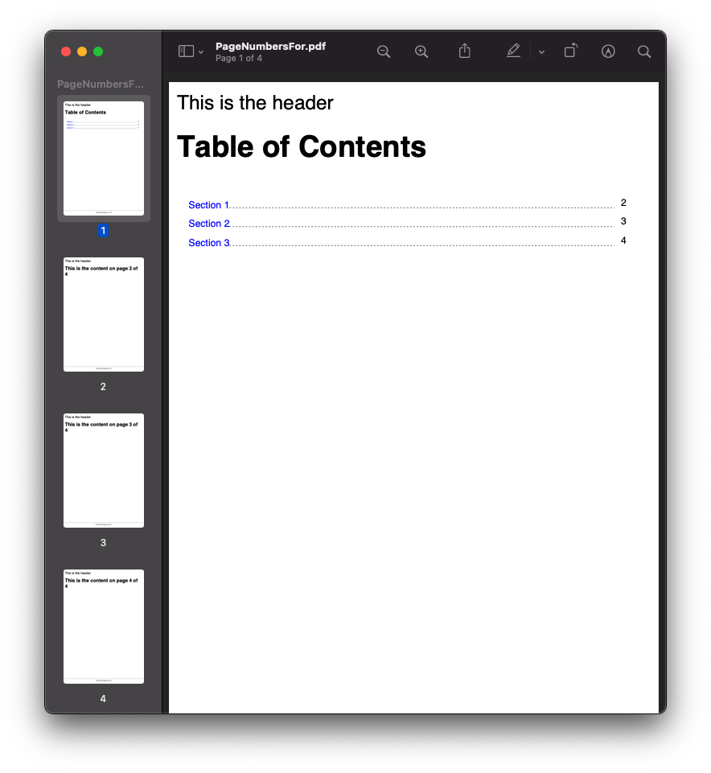
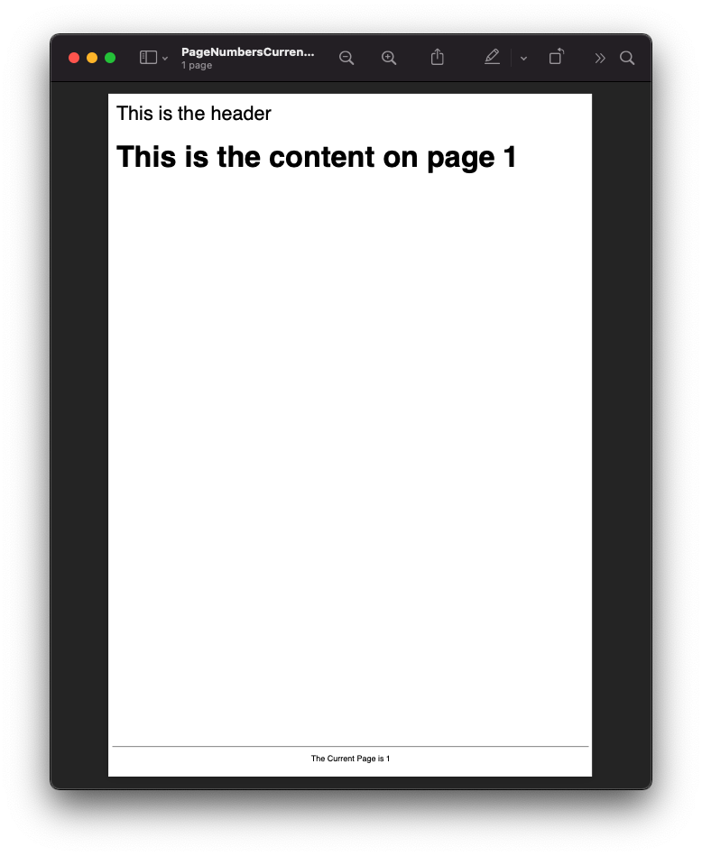
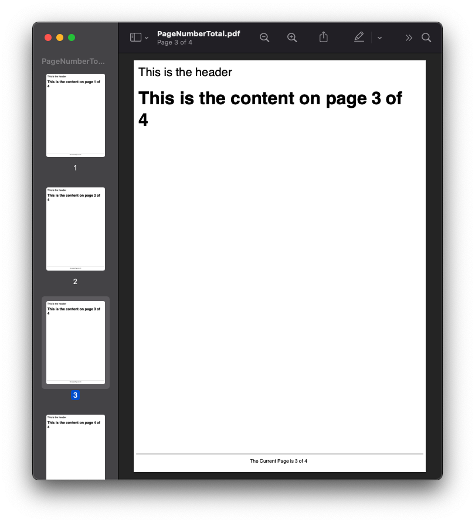
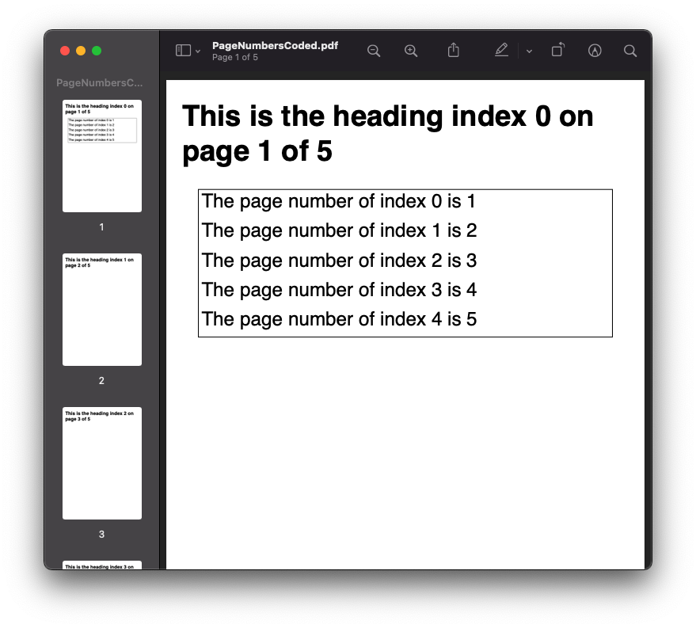

================================
Pages Numbers
================================

Putting numbers in pages is often a requirement, but honestly we have never liked the CSS approach.

At scryber we have taken a slightly more declarative approach with the 'page' tag. Browsers do not understand this tag, and will ignore it.
The scryber engine will understand and output the current page number

.. code:: html

    <!-- xmlns='http://www.w3.org/1999/xhtml' -->

    <!-- current page number -->
    <page />

    <!-- total number of pages -->
    <page property='total'>

    <!-- page number of another component -->
    <page for='#id' />

    <!-- page with custom format -->
    <page data-format='Page {0} of {1}' />

The page number component classes are ``PageNumberLabel`` and ``PageOfLabel`` in the 
``Scryber.Components`` namespace.

.. code:: csharp

    //using Scryber.Components

    var pgNum = new PageNumberLabel(){ DisplayFormat = "{0} of {1}" };

    var pgOf = new PageOfLabel() { ComponentName = "#id", NotFoundText = "Oops!" };

Generation methods
-------------------

All methods and files in these samples use the standard testing set up as outlined in :doc:`../overview/samples_reference`

Current Page Numbers
---------------------

The <page/> tag can be placed anywhere within the text of a document, and will render in the current style. Although it does also support the 
inline style options from as with any other span.

.. code-block:: html

    <?xml version="1.0" encoding="utf-8" ?>
    <html xmlns='http://www.w3.org/1999/xhtml'>
    <head>
        <title>My Document</title>
        
    </head>
    <body>
        <header>
            
This is the header

        </header>

        <!-- Page number within the content -->
        <h1>This is the content on page <page /></h1>

        <footer>
            <!-- a page number using the current font style in a footer -->
            
 The Current Page is <page />

        </footer>

    </body>

    </html>

.. code:: csharp

    public void CurrentPageNumber()
    {
        var path = GetTemplatePath("PageNumbers", "PageNumbersCurrent.html");

        using (var doc = Document.ParseDocument(path))
        {
            using (var stream = GetOutputStream("Links", "PageNumbersCurrent.pdf"))
            {
                doc.SaveAsPDF(stream);
            }

        }
    }

`Full size version <../_images/samples_pagenumberCurrent.png>`_

Total number of pages
---------------------

The page tag also supports the property attribute for displaying the 'total' number of pages.

.. code-block:: html

    <?xml version="1.0" encoding="utf-8" ?>
    <html xmlns='http://www.w3.org/1999/xhtml'>
    <head>
        <title>My Document</title>
        
    </head>
    <body>
        <header>
            
This is the header

        </header>
        <h1 id='First'>This is the content on page <page /> of <page property='total' /></h1>
        <h1 id='Second' class='break'>This is the content on page <page /> of <page property='total' /></h1>
        <h1 id='Third' class='break'>This is the content on page <page /> of <page property='total' /></h1>
        <h1 id='Fourth' class='break'>This is the content on page <page /> of <page property='total' /></h1>
        <footer>
            
 The Current Page is <page /> of <page property='total' />

        </footer>

    </body>

    </html>

.. code:: csharp

    public void TotalPageNumbers()
    {
        var path = GetTemplatePath("PageNumbers", "PageNumberTotal.html");

        using (var doc = Document.ParseDocument(path))
        {
            using (var stream = GetOutputStream("PageNumbers", "PageNumberTotal.pdf"))
            {
                doc.SaveAsPDF(stream);
            }

        }
    }

`Full size version <../_images/samples_pagenumberTotal.png>`_

The page *for* another component
------------------------------

Conversly to the current page number, it is also possible to get the page number of another element.
By using the ``for`` attribute.

The example below is a table of contents with links to sections based on their 
ID and a line leading to the page numbers on the right cell.

.. note:: The for referenced component can be following the current content, and not yet laid out. It is only once everything is laid out would the page numbers for another component be evaluated.

.. code-block:: html

    <?xml version="1.0" encoding="utf-8" ?>
    <html xmlns='http://www.w3.org/1999/xhtml'>
    <head>
        <title>My Document</title>
        
    </head>
    <body>
        <header>
            
This is the header

        </header>
        <h1 id='First'>Table of Contents</h1>
        <table class="toc" style="margin:20pt; width:100%;">
            <tr>
                <td><a href="#Second">Section 1</a>
</td>
                <td class="pg-num"><page for="#Second" /></td>
            </tr>
            <tr>
                <td><a href="#Third">Section 2</a>
</td>
                <td class="pg-num"><page for="#Third" /></td>
            </tr>
            <tr>
                <td><a href="#Fourth">Section 3</a>
</td>
                <td class="pg-num"><page for="#Fourth" /></td>
            </tr>
        </table>
        <h1 id='Second' class='break'>This is the content on page <page /> of <page property='total' /></h1>
        <h1 id='Third' class='break'>This is the content on page <page /> of <page property='total' /></h1>
        <h1 id='Fourth' class='break'>This is the content on page <page /> of <page property='total' /></h1>
        <footer>
            
 The Current Page is <page /> of <page property='total' />

        </footer>

    </body>

    </html>

.. code:: csharp

    public void ForComponentPageNumbers()
    {
        var path = GetTemplatePath("PageNumbers", "PageNumbersFor.html");

        using (var doc = Document.ParseDocument(path))
        {
            using (var stream = GetOutputStream("PageNumbers", "PageNumbersFor.pdf"))
            {
                doc.SaveAsPDF(stream);
            }

        }
    }

Is is also possible to use also databinding to achieve this (see :doc:`links_reference` in the next section for an example of this).

`Full size version <../_images/samples_pagenumberFor.png>`_

.. note:: The page index of a component can be forward as in this case, as well as backward looking, 
          but will always be the very first page the component is laid out at, even if it overflows onto another page.

Page Numbers in code
---------------------

The use of the ``PageNumberLabel`` and ``PageOfLabel`` in coded documents is just the same as in templates.

Creating a five page document with headings on each and a reference to each of the the headings on the first page.
The spans are added as individual blocks, showing the page numbers of following headings.

.. code:: csharp

    public void CodedPageNumbers()
    {
        

        using (var doc = new Document())
        {
            for(var i = 0; i < 5; i++)
            {
                var pg = new Page();
                var head = new Head1() { ID = "Item" + i };
                var lit = new TextLiteral() { Text = "This is the heading index " + i + " on page " };
                var num = new PageNumberLabel() { DisplayFormat = "{0} of {1}" };
                pg.Style.Margins.All = 20;

                doc.Pages.Add(pg);
                pg.Contents.Add(head);
                head.Contents.Add(lit);
                head.Contents.Add(num);

                if(i == 0) //First page add links to components on the nex
                {
                    var div = new Div();
                    div.Style.Margins.All = 20;
                    div.Style.Border.Color = PDFColors.Black;
                    pg.Contents.Add(div);

                    for (int j = 0; j < 5; j++)
                    {
                        var span = new Span() { PositionMode = PositionMode.Block, Padding = new PDFThickness(4) };
                        span.Contents.Add(new TextLiteral("The page number of index " + j + " is "));
                        span.Contents.Add(new PageOfLabel() { ComponentName = "#Item" + j });
                        div.Contents.Add(span);
                    }
                }

            }

            
            using (var stream = GetOutputStream("PageNumbers", "PageNumbersCoded.pdf"))
            {
                doc.SaveAsPDF(stream);
            }

        }
    }

`Full size version <../_images/samples_pagenumberCoded.png>`_

Page number spacing
-------------------

Because the page numbers are calculated at the end of the layout, the spacing needed for the total number of pages (or the page number of a following component)
is deferred to the end of the layout. Before then a proxy value is used.

By default this is '99', so enough space will be left for the number '99' to be rendered in the content. For smaller numbers, very long documents, or very large font sizes
this may alter the layout too much and potentially casue character clashes.

The ``<page />`` element supports the `data-page-hint` attribute.

And the ``PageNumberLabel`` and ``PageOfLabel`` support the `TotalPageCountHint` properties that can be set to an integer value where clashes need to be fixed.

.. code:: html

    <page property='total' data-page-hint='9999' />

.. code:: csharp

    var pglbl = new PageOfLabel() { ComponentName = "#VeryLastComponent", TotalPageCountHint = 9999 };

