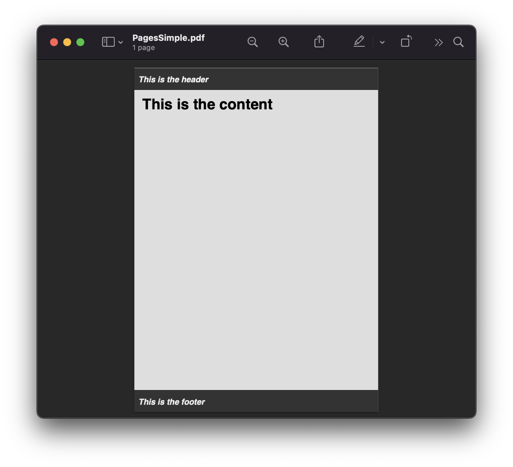
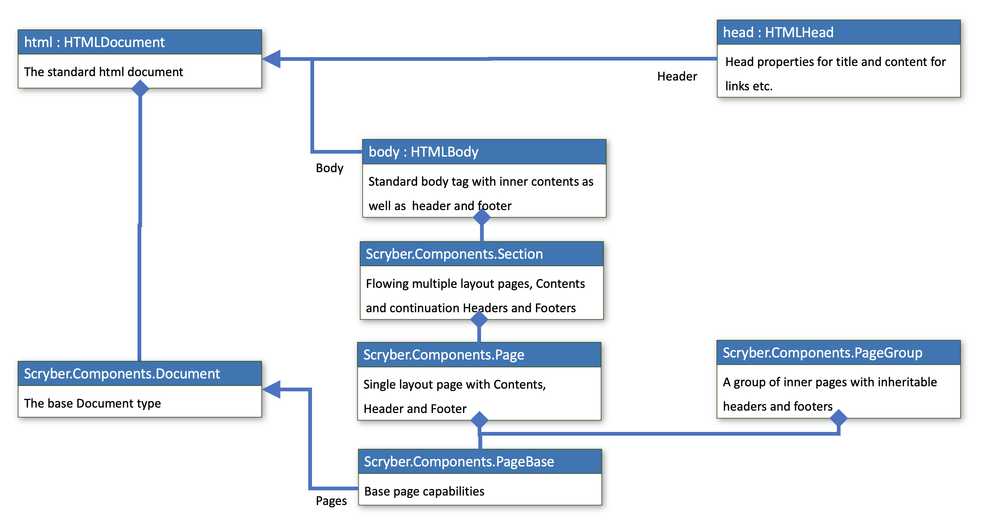
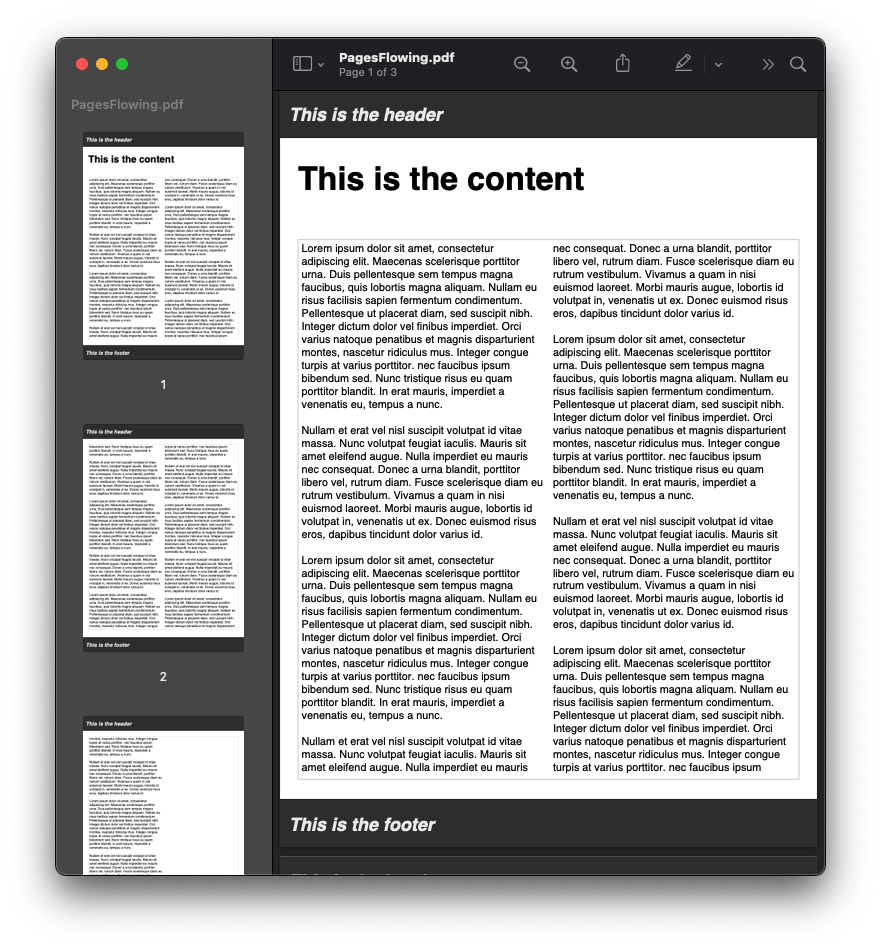
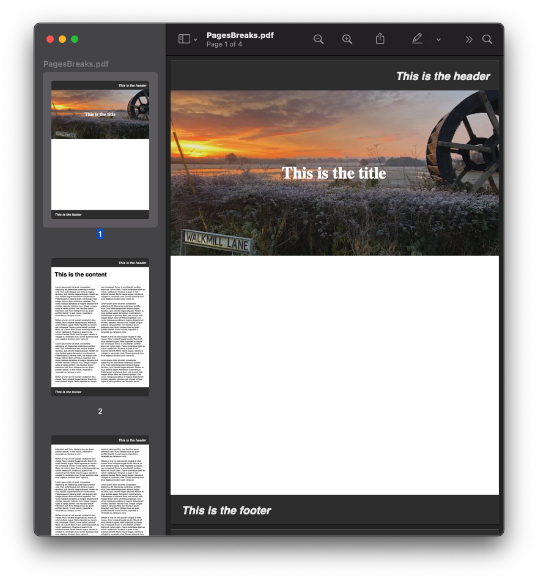

================================
Body, Pages and Sections - TD
================================

All the visual content in a document sits in pages. Scryber supports the use of both a single body with content within it, 
and also explicit flowing pages in a section.

The use of the page-break-before and after is supported on any content to force a new page is set to 'always' on a section, but can, along with page-break-after, be set and supported on any component tag

The body has an optional header and footer that will be used on every page if set.

Scryber also supports the use of the @page rule to be able to change the size and orientation of each of the pages either as a whole, or within a section or tag.

Generation methods
-------------------

All methods and files in these samples use the standard testing set up as outlined in :doc:`../overview/samples_reference`

The body and its content
--------------------------

A single page has a structure of optional elements

* header - Optional, but always sited at the top of a page
* Sited between the Header and Footer is any content to be included within the page.
* footer - Optional, but always sited at the bottom of a page

If a page has a header or footer the available space for the content will be reduced.

.. code-block:: html

    <?xml version="1.0" encoding="utf-8" ?>
    <html xmlns='http://www.w3.org/1999/xhtml'>
    <head>
        
    </head>
    <body>
        <header>
            <h4>This is the header</h4>
        </header>
        <h1>This is the content</h1>
        <footer>
            <h4>This is the footer</h4>
        </footer>

    </body>

    </html>

.. code:: csharp

    //Scryber.UnitSamples/PagesSamples.cs

    public void SimpleNavigationLinks()
    {
        var path = GetTemplatePath("Pages", "PagesSimple.html");

        using (var doc = Document.ParseDocument(path))
        {
            using (var stream = GetOutputStream("Pages", "PagesSimple.pdf"))
            {
                doc.SaveAsPDF(stream);
            }

        }
    }

`Full size version <../_images/samples_pagesSimple.png>`_

.. note:: Any styles set on the body will be applied to the header and footer as well. e.g. padding or margins.

Single body structure
---------------------

In the example above the ``html`` tag references the ``Scryber.Html.Components.HTMLDocument`` class that inherits from the
``Scryber.Components.Document`` class.

See :doc:`../overview/scryber_parsing` for more information on how instances are created from elements.

The ``HTMLDocumemt`` has 2 properties on it for the `head` (``HTMLHead``) and `body` (``HTMLBody``) that are matched to the content 
of the template.

The ``HTMLBody`` inherits from the ``Scryber.Components.Section`` which in itself inherits from 
the ``Scryber.Components.Page`` class.and supports multiple pages, and then the ``Scryber.Components.PageBase``
that all page components should inherit from.

The ``HTMLHead`` is a specific html component that wraps the title and `Contents` for links, styles etc.

`Full size version <../_images/diagrams_DocumentClasses.png>`_

Flowing Pages
---------------

If the size of the content is more than can fit on a page it will overflow onto another page. Repeating any header or footer.

.. code-block:: html

    <?xml version="1.0" encoding="utf-8" ?>
    <html xmlns='http://www.w3.org/1999/xhtml'>
    <head>
        
    </head>
    <body>
        <header>
            <h4>This is the header</h4>
        </header>
        <h1>This is the content</h1>
        <!-- main content in the document
            bound from the parameter 'content' -->
        
{{content}}

        <footer>
            <h4>This is the footer</h4>
        </footer>

    </body>

    </html>

Loading a long text file and binding to the `content` parameter, we use the ``white-space: pre-wrap`` style
so the carriage returns are preserved, but the text will flow in the columns and over multiple pages.

.. code:: csharp

    //Scryber.UnitSamples/PagesSamples.cs

    public void PagesFlowing()
    {
        var path = GetTemplatePath("Pages", "PagesFlowing.html");

        var txtPath = GetTemplatePath("Pages", "LongTextFile.txt");
        doc.Params["content"] = System.IO.File.ReadAllText(txtPath);

        using (var doc = Document.ParseDocument(path))
        {
            using (var stream = GetOutputStream("Pages", "PagesFlowing.pdf"))
            {
                doc.SaveAsPDF(stream);
            }

        }
    }

Here we can see that the content flows naturally onto the next pages, including the padding and borders.
And the header and footer are shown on the following pages.

`Full size version <../_images/samples_pagesFlowing.png>`_

Page breaks
------------

Using the `page-break-before: always` and `page-break-after: always` css properties, we can force content onto 
a new page in the flow.

In this example we have set up a ``h1`` to force the break after so the rest of the content will be on a new page.

The breaking can be at any depth, and borders; padding; margins; etc. should be preserved.

.. code:: html

    <?xml version="1.0" encoding="utf-8" ?>
    <html xmlns='http://www.w3.org/1999/xhtml'>
    <head>
        
    </head>
    <body>
        <header>
            <h4>This is the header</h4>
        </header>

        <!-- title content that forces a
        page break after -->
        <h1 class="title">
            This is the title
        </h1>

        <h1>This is the content</h1>
        
{{content}}

        <footer>
            <h4>This is the footer</h4>
        </footer>

    </body>

    </html>

.. code:: csharp

    public void PagesBreaks()
    {
        var path = GetTemplatePath("Pages", "PagesBreaks.html");

        using (var doc = Document.ParseDocument(path))
        {
            var txtPath = GetTemplatePath("Pages", "LongTextFile.txt");
            doc.Params["content"] = System.IO.File.ReadAllText(txtPath);

            using (var stream = GetOutputStream("Pages", "PagesBreaks.pdf"))
            {
                doc.SaveAsPDF(stream);
            }

        }
    }

`Full size version <../_images/samples_pageBreaks.png>`_

Creating pages in code.
-----------------------

As with everything else in scryber, it is simple and easy to create pages in code from the document and pagebase classes.

It is also possible to add pages, sections and page groups to an existing parsed template.

For headers and footers, these are supported through the ``IPDFTemplate`` interface. 
See :doc:`page_headers_reference` for an example of this.

Page breaks
-------------

When using a <section> it will, by default, force a break in the pages using the before the component, so that it flows
nicely onto a new page and begins the new content from there. (the default style is page-break-before:always)

This behaviour can can be stopped by applying the css attribute for 'page-break-before:avoid' value,
and a page break can also be applied to any element using the style 'page-break-before:always' (or 'page-break-after:always').

Margins, padding, boarder and depth should be preserved during the page break, and the engine 
will try and layout the content appropriately for breaks inside nested elements.

.. code-block:: html

    <?xml version="1.0" encoding="utf-8" ?>
    <html xmlns='http://www.w3.org/1999/xhtml'>
    <head>
        
    </head>
    <body>
        <header>
            <h4>This is the header</h4>
        </header>
        <h1>This is the content</h1>

        <!-- section that does not force a new page (so that it stays on the first page -->
        <section class='content' style="page-break-before:avoid">
            Lorem ipsum dolor sit amet, consectetur adipiscing elit. Maecenas scelerisque porttitor urna.
            <!-- Truncated for brevity -->
            Class aptent taciti sociosqu ad litora torquent per conubia nostra, per inceptos himenaeos.
            Praesent mollis tempor enim. 

        </section>

        <!-- This will be default appear on a new page -->
        <section class='content'>
            Nullam et erat vel nisl suscipit volutpat id vitae massa. Nunc volutpat feugiat iaculis.
            Mauris sit amet eleifend augue. Nulla imperdiet eu mauris nec consequat. Donec a urna blandit,
            <!-- Truncated for brevity -->
            sagittis dignissim volutpat. Integer efficitur euismod lectus at varius. Vestibulum euismod massa mauris.
            Mauris laoreet urna est, et tristique velit lobortis eu.
        </section>

        <!-- Any tag can force a new page within the document flow, and it does not have to be at the
            root level. Borders and spacing will be preserved as much as possible -->
        

            The inner content will be on a new page.
            

                Phasellus luctus dapibus nisi, et pulvinar neque ultrices vitae. Pellentesque quis purus felis.
                <!-- Truncated for brevity -->
                venenatis ut ex. Donec euismod risus eros, dapibus tincidunt dolor varius id.
            

            After the content.
        

        <footer>
            <h4>This is the footer</h4>
        </footer>

    </body>

    </html>

.. image:: images/SectionsOverflow.png

Page size and orientation
-------------------------

When outputting a page the default paper size is ISO A4 Portrait (210mm x 29.7mm), however Scryber supports setting the paper size 
either on the section or via styles to the standard ISO or Imperial page sizes, in landscape or portrait.

* ISO 216 Standard Paper sizes
    * `A0 to A9 <https://papersizes.io/a/>`_
    * `B0 to B9 <https://papersizes.io/b/>`_
    * `C0 to C9 <https://papersizes.io/c/>`_
* Imperial Paper Sizes
    * Quarto, Foolscap, Executive, GovermentLetter, Letter, Legal, Tabloid, Post, Crown, LargePost, Demy, Medium, Royal, Elephant, DoubleDemy, QuadDemy, Statement,

The body or a section can only be 1 size of paper, but different sections (or page breaks) can be different pages and can have different sizes.

An @page { ... } rule will apply to all pages in the document.

To specify an explicit named page size use the name after the @page rule, and then 
identify the rule with the page css declaration either on the tag style or in css. 
The same priories will be applied if multiple page values are matched.

To revert back to the default size use a value of auto or initial.

.. code-block:: html

    <?xml version="1.0" encoding="utf-8" ?>
    <html xmlns='http://www.w3.org/1999/xhtml'>
    <head>
        
    </head>
    <body>
        <header>
            <h4>This is the header</h4>
        </header>
        <h1>This is the content</h1>

        <!-- section that does not force a new page (so that it stays on the first page -->
        <section class='content' style="page-break-before:avoid">
            Lorem ipsum dolor sit amet, consectetur adipiscing elit. Maecenas scelerisque porttitor urna.
            Duis pellentesque sem tempus magna faucibus, quis lobortis magna aliquam. Nullam eu risus

            <!-- Truncated for brevity -->

            Praesent mollis tempor enim.
        </section>

        <!-- This will be on the A3 landscape page -->
        <section class='content big-page'>
            Nullam et erat vel nisl suscipit volutpat id vitae massa. Nunc volutpat feugiat iaculis.
            Mauris sit amet eleifend augue. Nulla imperdiet eu mauris nec consequat. Donec a urna blandit,

            <!-- Truncated for brevity -->

            Mauris laoreet urna est, et tristique velit lobortis eu.
        </section>

        <!-- The inner div of small-page will revert the size back to the default (initial) size  -->
        

        
            The inner content will be on a new page.

            

                Phasellus luctus dapibus nisi, et pulvinar neque ultrices vitae. Pellentesque quis purus felis.
                Aliquam feugiat efficitur sem quis placerat. Quisque viverra magna vitae elit eleifend, a porttitor
                enim vulputate. Quisque elit metus, aliquam eget purus at, blandit gravida diam.

                <!-- Truncated for brevity -->

                venenatis ut ex. Donec euismod risus eros, dapibus tincidunt dolor varius id.
            

            After the content.
        

        <footer>
            <h4>This is the footer</h4>
        </footer>

    </body>

    </html>

.. image:: images/SectionsPageSizes.png

Stopping overflow
-------------------

If overflowing onto a new page is not required or wanted then the 
page-break-inside='avoid' will block any overflow or new pages.

A section can be a single page, and never overflow.

