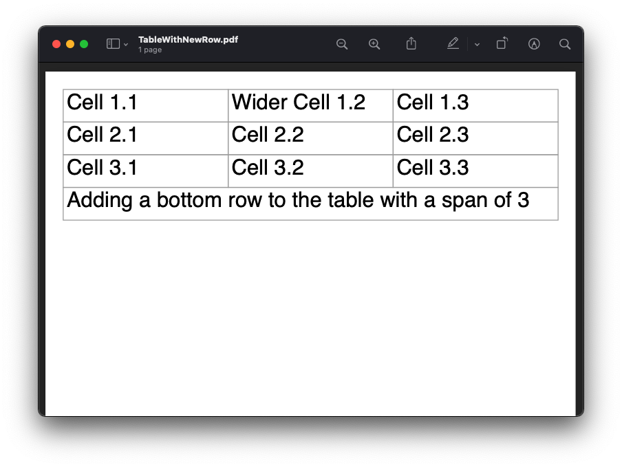
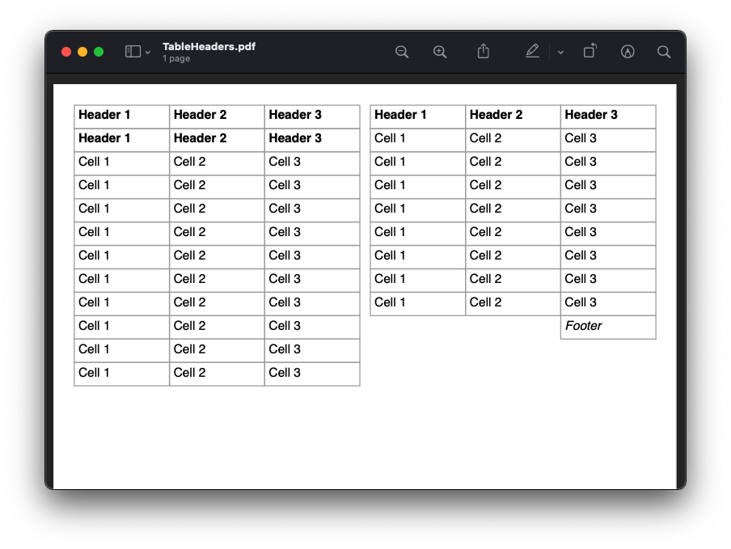
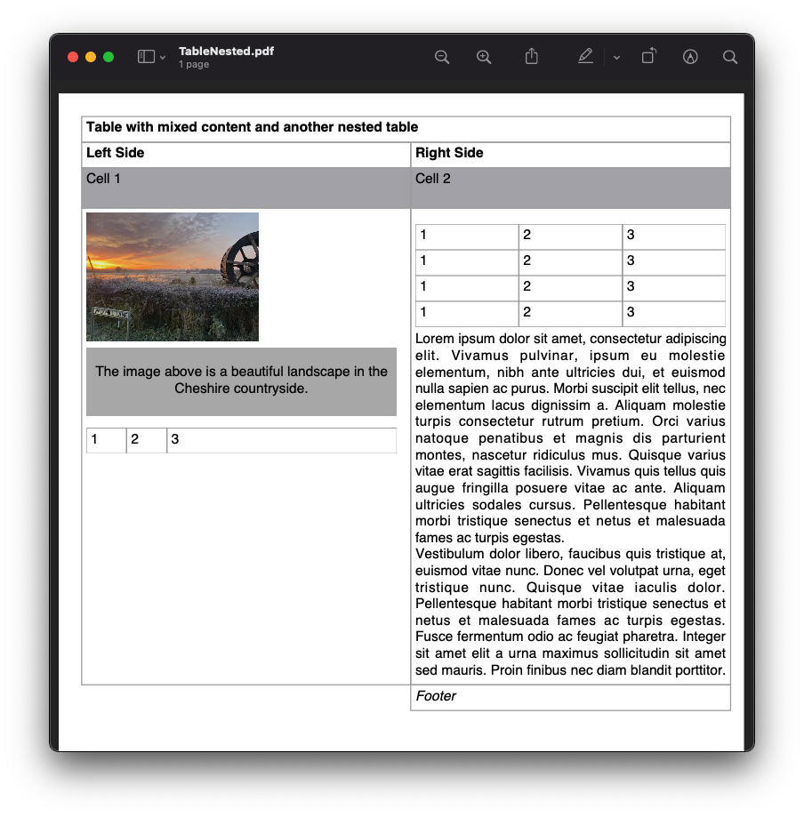
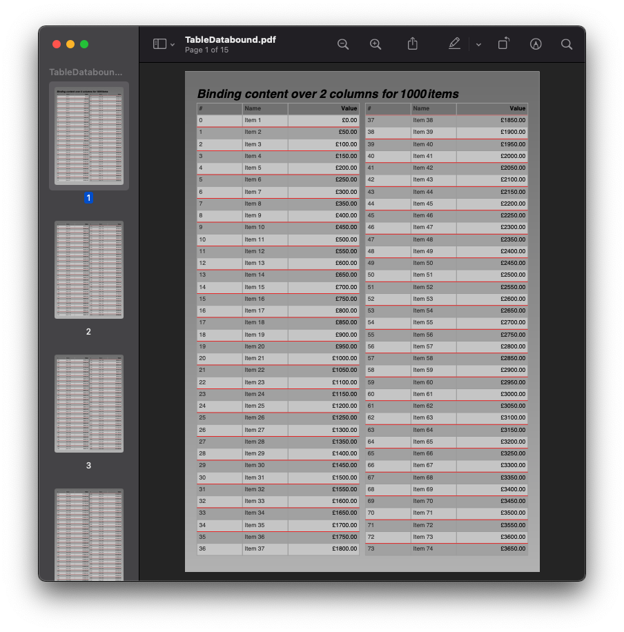

==========================
Tables, Rows and Cells
==========================

Scryber supports the use of tables with rows, cells and allows nesting, overflow, headings, footers and 
column-spans.

It also supports the use of binding and repeating at the row and/or the cell level.

Generation methods
-------------------

All methods and files in these samples use the standard testing set up as outlined in :doc:`overview/samples_reference`

Simple Tables
-------------

A simple table with no style or formatting will be output with a 
single point gray border and 4pt padding on each cell.

Each column will take up as much room as needed (or possible). And the table will be be sized for the widths. 

.. code-block:: html

    <!-- /Templates/Tables/TableSimple.html -->

    <!DOCTYPE html>
    <html xmlns="http://www.w3.org/1999/xhtml">
    <head>
        <meta charset="utf-8" />
        <title>Simple Tables</title>
    </head>
    <body style="padding:20pt">
        <table id='FirstTable' >
            <tr>
                <td>Cell 1.1</td>
                <td>Wider Cell 1.2</td>
                <td>Cell 1.3</td>
            </tr>
            <tr>
                <td>Cell 2.1</td>
                <td>Cell 2.2</td>
                <td>Cell 2.3</td>
            </tr>
            <tr>
                <td>Cell 3.1</td>
                <td>Cell 3.2</td>
                <td>Cell 3.3</td>
            </tr>
        </table>
    </body>
    </html>

.. code:: csharp

    //using Scryber.Components;
    //Scryber.UnitSamples/TableTests.cs

    public void Table1_SimpleTable()
    {
        var path = GetTemplatePath("Tables", "TableSimple.html");

        using (var doc = Document.ParseDocument(path))
        {
            using(var stream = GetOutputStream("Tables", "TableSimple.pdf"))
            {
                doc.SaveAsPDF(stream);
            }

        }
    }

.. figure:: ../images/samples_tables_simple.png
    :target: ../_images/samples_tables_simple.png
    :alt: Simple table.
    :width: 600px
    :class: with-shadow

`Full size version <../_images/samples_tables_simple.png>`_

For speed the first 5 rows are tested for desired width, if they are not explicitly set. 
This allows for giving good measurement of a desired layout without having to double measure an entire table.
If the 6th row on a table has a particularly large flowing content, then this will be ignored - set an explicit width on that column, or all the others.

Table width and cell spans
--------------------------

Applying the full-width (``width:100%``) will make the table use all available space in it's container, obeying any fixed column widths.
The cells support a column-span attribute to allow multiple column content.

.. code:: html

    <!-- /Templates/Tables/TableSpanned.html -->
    <!DOCTYPE html>
    <html xmlns="http://www.w3.org/1999/xhtml">
    <head>
        <meta charset="utf-8" />
        <title>Simple Tables</title>
    </head>
    <body style="padding:20pt">
        <table id='FirstTable' style="width:100%">
            <tr>
                <td>Cell 1.1</td>
                <td style="width: 300pt">Wider Cell 1.2</td>
                <td>Cell 1.3</td>
            </tr>
            <tr>
                <td>Cell 2.1</td>
                <td colspan="2">Cell 2.2</td>
            </tr>
            <tr>
                <td>Cell 3.1</td>
                <td>Cell 3.2</td>
                <td>Cell 3.3</td>
            </tr>
        </table>
    </body>
    </html>

.. code:: csharp

    //Scryber.UnitSamples/TableTests.cs

    public void SpannedTable()
    {
        var path = GetTemplatePath("Tables", "TableSpanned.html");

        using (var doc = Document.ParseDocument(path))
        {
            using (var stream = GetOutputStream("Tables", "TableSpanned.pdf"))
            {
                doc.SaveAsPDF(stream);
            }

        }
    }

.. figure:: ../images/samples_tables_spanned.png
    :target: ../_images/samples_tables_spanned.png
    :alt: Spanning full width tables.
    :width: 600px
    :class: with-shadow

`Full size version <../_images/samples_tables_spanned.png>`_

Tables in code
----------------

Tables can be created just as easily through code. The ``table`` has a ``Rows`` property and each ``row`` has a ``Cells`` property.
These properties wrap the protected ``InnerContent`` property from the ``PDFContainerComponent`` class.

.. code:: csharp

    //Scryber.UnitSamples/TableTests.cs

    public void CodedTable()
    {
        var doc = new Document();

        var pg = new Page();
        doc.Pages.Add(pg);
        pg.Padding = new PDFThickness(20);

        var tbl = new TableGrid();
        pg.Contents.Add(tbl);

        //Full width is equivalent to width:100%
        tbl.FullWidth = true;

        for (int i = 0; i < 3; i++)
        {
            var row = new TableRow();
            tbl.Rows.Add(row);

            for (int j = 0; j < 3; j++)
            {
                if (i == 1 && j == 2)
                {
                    //We make the previous cell 2 columns wide rather than add a new one.
                    row.Cells[1].CellColumnSpan = 2;
                    continue;
                }
                else
                {
                    var cell = new TableCell() { BorderColor = PDFColors.Aqua, FontItalic = true };
                    row.Cells.Add(cell);

                    var txt = new TextLiteral("Cell " + (i + 1) + "." + (j + 1));
                    cell.Contents.Add(txt);
                }
            }
        }

        using (var stream = DocStreams.GetOutputStream("Samples_TableInCode.pdf"))
        {
            doc.SaveAsPDF(stream);
        }
    }

.. figure:: ../images/samples_tableincode.png
    :target: ../_images/samples_tableincode.png
    :alt: Spanning full width tables.
    :width: 600px
    :class: with-shadow

`Full size version <../_images/samples_tableincode.png>`_

.. note:: The property for the number of columns spanned by a cell is CellColumnSpan. The ColumnCount property will refer to the number of columns to layout inner content with.

It is also possible to access a parsed table to alter the content as needed.

.. code:: csharp

    //Scryber.UnitSamples/TableTests.cs

    public void ModifyTable()
    {
        //Use the simple table sample
        var path = GetTemplatePath("Tables", "TableSimple.html");

        using (var doc = Document.ParseDocument(path))
        {
            //Make full width and add a footer to the table
            if(doc.TryFindAComponentByID("FirstTable", out TableGrid tbl))
            {
                tbl.FullWidth = true;

                var row = new TableRow();
                tbl.Rows.Add(row);

                var span = tbl.Rows[0].Cells.Count;

                var cell = new TableCell();
                cell.Contents.Add(new TextLiteral("Adding a bottom row to the table with a span of " + span));
                cell.CellColumnSpan = span;
                row.Cells.Add(cell);
            }

            using (var stream = GetOutputStream("Tables", "TableWithNewRow.pdf"))
            {
                doc.SaveAsPDF(stream);
            }

        }
    }

`Full size version <../_images/samples_tablewithnewrow.png>`_

Headers, Footers and overflow
-----------------------------

Tables support both headers and footers (single or multiple).
The header cells, by default, will repeat across columns and or pages and be in bold, but can be set not to repeat with the ``repeat='none'`` attribute.
(Alternatively, any row can simply be set to repeat with the ``repeat='RepeatAtTop'``, and will do so after they have initially been laid out).

Rows support the block styles, except margins, padding and positioning.

Empty cells will still show size and borders, but can be hidden with the ``border:none`` style.

.. code-block:: html

    <!-- /Templates/Tables/TableHeaders.html -->
    <!DOCTYPE html>
    <html xmlns="http://www.w3.org/1999/xhtml">
    <head>
        <meta charset="utf-8" />
        <title>Table Headers and Footers</title>
    </head>
    <body style="padding:20pt">
        <!-- put the table in a div with 2 columns and a maximum height of 270pt -->
        

            <table id='TableHead' style="width:100%">
                <thead>
                    <tr>
                        <td>Header 1</td>
                        <td>Header 2</td>
                        <td>Header 3</td>
                    </tr>
                    <!-- This row will not repeat across multiple columns -->
                    <tr repeat="none">
                        <td>Header 1</td>
                        <td>Header 2</td>
                        <td>Header 3</td>
                    </tr>
                </thead>
                <tbody>
                    <tr><td>Cell 1</td><td>Cell 2</td><td>Cell 3</td></tr>
                    <tr><td>Cell 1</td><td>Cell 2</td><td>Cell 3</td></tr>
                    <tr><td>Cell 1</td><td>Cell 2</td><td>Cell 3</td></tr>
                    <tr><td>Cell 1</td><td>Cell 2</td><td>Cell 3</td></tr>
                    <tr><td>Cell 1</td><td>Cell 2</td><td>Cell 3</td></tr>
                    <tr><td>Cell 1</td><td>Cell 2</td><td>Cell 3</td></tr>
                    <tr><td>Cell 1</td><td>Cell 2</td><td>Cell 3</td></tr>
                    <tr><td>Cell 1</td><td>Cell 2</td><td>Cell 3</td></tr>
                    <tr><td>Cell 1</td><td>Cell 2</td><td>Cell 3</td></tr>
                    <tr><td>Cell 1</td><td>Cell 2</td><td>Cell 3</td></tr>
                    <tr><td>Cell 1</td><td>Cell 2</td><td>Cell 3</td></tr>
                    <tr><td>Cell 1</td><td>Cell 2</td><td>Cell 3</td></tr>
                    <tr><td>Cell 1</td><td>Cell 2</td><td>Cell 3</td></tr>
                    <tr><td>Cell 1</td><td>Cell 2</td><td>Cell 3</td></tr>
                    <tr><td>Cell 1</td><td>Cell 2</td><td>Cell 3</td></tr>
                    <tr><td>Cell 1</td><td>Cell 2</td><td>Cell 3</td></tr>
                    <tr><td>Cell 1</td><td>Cell 2</td><td>Cell 3</td></tr>
                    <tr><td>Cell 1</td><td>Cell 2</td><td>Cell 3</td></tr>
                </tbody>
                <tfoot style="font-style: italic;">
                    <tr>
                        <td colspan="2" style="border:none;"></td>
                        <td>Footer</td>
                    </tr>
                </tfoot>
            </table>

        

    </body>
    </html>

.. code:: csharp

    //Scryber.UnitSamples/TableTests.cs

    public void TableHeaderAndFooter()
    {
        var path = GetTemplatePath("Tables", "TableHeaders.html");

        using (var doc = Document.ParseDocument(path))
        {
            using (var stream = GetOutputStream("Tables", "TableHeaders.pdf"))
            {
                doc.SaveAsPDF(stream);
            }

        }
    }

`Full size version <../_images/samples_tableheaders.png>`_

The Component classes for Header and Footer rows and cells are ``TableHeaderRow``, ``TableFooterRow``, ``TableHeaderCell`` and ``TableFooterCell``.
They simply inherit from ``TableRow`` and ``TableCell`` and can be added to a ``TableGrid`` and ``TableRow`` at any point.

.. note:: Because of the layout mechanism, repeating cells cannot be accessed or modified between layout itterations (columns or pages). The next table header is from the layout of the original.

Mixed content, styling and nesting
----------------------------------

All table cells can contain any content, just like other block components, including other tables, 
and they also support sizing and alignment of content.

.. code:: html

    <!-- /Templates/Tables/TableNested.html -->
    <!DOCTYPE html>
    <html xmlns="http://www.w3.org/1999/xhtml">
    <head>
        <meta charset="utf-8" />
        <title>Table Headers and Footers</title>
    </head>
    <body style="padding:20pt">
        

            <table id='TopTable' style="width:100%">
                <thead>
                    <tr>
                        <td colspan="2">Table with mixed content and another nested table</td>
                    </tr>
                    <tr>
                        <td>Left Side</td>
                        <td>Right Side</td>
                    </tr>
                </thead>
                <tbody>
                    <tr style="background-color: #AAAAAF;"><td style="min-height:35pt">Cell 1</td><td>Cell 2</td></tr>
                    <tr>
                        <td>
                            
                            
The image above is a beautiful landscape in the Cheshire countryside.

                            <table style="width:100%; margin-top: 10pt;">
                                <tr><td>1</td><td>2</td><td style="width:200pt">3</td></tr>
                            </table>
                        </td>
                        <td>
                            <table style="width:100%; margin-top: 10pt">
                                <tr><td>1</td><td>2</td><td>3</td></tr>
                                <tr><td>1</td><td>2</td><td>3</td></tr>
                                <tr><td>1</td><td>2</td><td>3</td></tr>
                                <tr><td>1</td><td>2</td><td>3</td></tr>
                            </table>
                            

                                Lorem ipsum dolor sit amet, consectetur adipiscing elit. Vivamus pulvinar, ipsum eu molestie elementum,
                                nibh ante ultricies dui, et euismod nulla sapien ac purus. Morbi suscipit elit tellus, nec elementum lacus dignissim a.
                                Aliquam molestie turpis consectetur rutrum pretium. Orci varius natoque penatibus et magnis dis parturient montes, nascetur ridiculus mus.
                                Quisque varius vitae erat sagittis facilisis. Vivamus quis tellus quis augue fringilla posuere vitae ac ante. Aliquam ultricies sodales cursus.
                                Pellentesque habitant morbi tristique senectus et netus et malesuada fames ac turpis egestas.
                                 
                                Vestibulum dolor libero, faucibus quis tristique at, euismod vitae nunc. Donec vel volutpat urna, eget tristique nunc.
                                Quisque vitae iaculis dolor. Pellentesque habitant morbi tristique senectus et netus et malesuada fames ac turpis egestas.
                                Fusce fermentum odio ac feugiat pharetra. Integer sit amet elit a urna maximus sollicitudin sit amet sed mauris.
                                Proin finibus nec diam blandit porttitor.
                            

                        </td>
                    </tr>
                </tbody>
                <tfoot style="font-style: italic;">
                    <tr>
                        <td style="border:none;"></td>
                        <td>Footer</td>
                    </tr>
                </tfoot>
            </table>

        

    </body>
    </html>

.. code:: csharp

    //Scryber.UnitSamples/TableTests.cs

    public void TableMixedNestedContent()
    {
        var path = GetTemplatePath("Tables", "TableNested.html");

        using (var doc = Document.ParseDocument(path))
        {
            using (var stream = GetOutputStream("Tables", "TableNested.pdf"))
            {
                doc.SaveAsPDF(stream);
            }

        }
    }

.. note:: A table row is designated to not being allowed to split across columns or pages (even if it's got a nested table). It will probably just mess up the layout. Use a div
    

`Full size version <../_images/samples_tablenested.png>`_

Binding to Data
---------------

As with all things in scryber. Tables, rows and cells are fully bindable.
It is very common to want to layout data in tables so that it can easily be compared.

Tables support the use of the data binding with the ``template`` tag and ``data-bind`` attribute.

See :doc:`binding_databinding` for more information on the data binding capabilities of scryber.

.. code:: html

    <!DOCTYPE html>
    <html xmlns="http://www.w3.org/1999/xhtml">
    <head>
        <title>Table data bound</title>
        
    </head>
    <body class="grey">
        <h4>Binding content over 2 columns for {{count(model)}} items</h4>
        

            <table id="largeTable" style="width:100%;">
                <thead style="font-weight:bold;">
                    <tr>
                        <td class="index">#</td>
                        <td class="key">Name</td>
                        <td class="value" style="width: 120pt">Value</td>
                    </tr>
                </thead>
                <template data-bind="{{model}}">
                    <tr class="{{if(index() % 2 == 1, 'odd', 'even')}}">
                        <td class="index">{{index()}}</td>
                        <td class="key">{{.Key}}</td>
                        <td class="value">
                            <num value="{{.Value}}" data-format="£##0.00" />
                        </td>
                    </tr>
                </template>
            </table>
        

    </body>
    </html>

.. code:: csharp

    public void TableBoundContent()
    {
        var path = GetTemplatePath("Tables", "TableDatabound.html");

        using (var doc = Document.ParseDocument(path))
        {
            List<dynamic> all = new List<dynamic>();
            for(int i = 0; i < 1000; i++)
            {
                all.Add(new { Key = "Item " + (i + 1).ToString(), Value = i * 50.0 });
            }

            doc.Params["model"] = all;

            using (var stream = GetOutputStream("Tables", "TableDatabound.pdf"))
            {
                doc.SaveAsPDF(stream);
            }

        }
    }

`Full size version <../_images/samples_tabledatabound.png>`_

.. note:: Scryber also includes the data-style-identifier which can improve the speed of output for data bound repeats