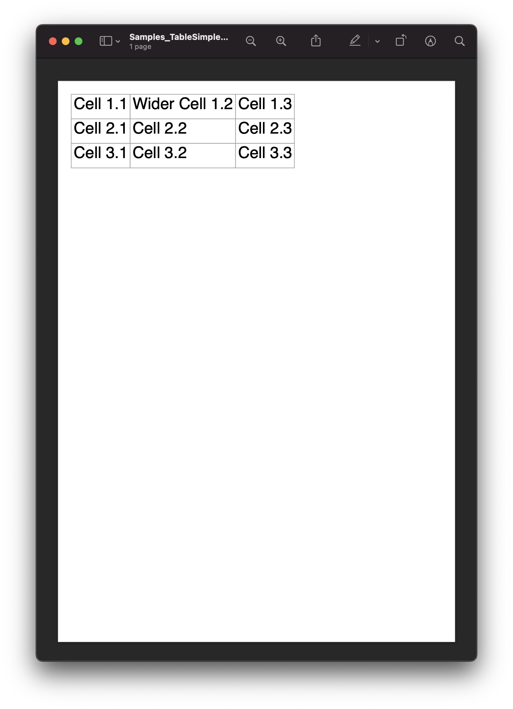
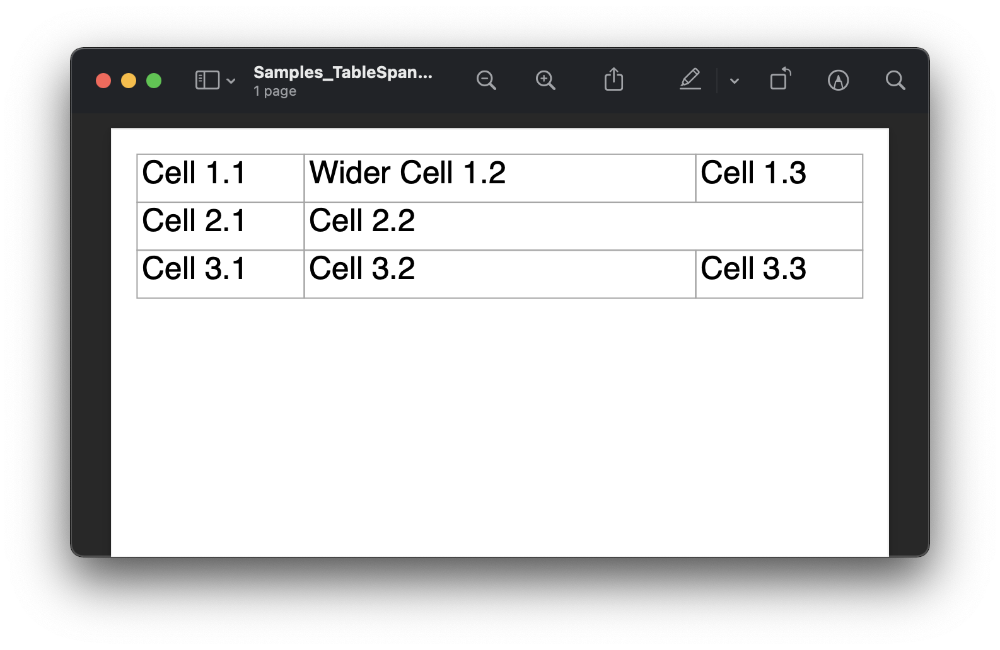
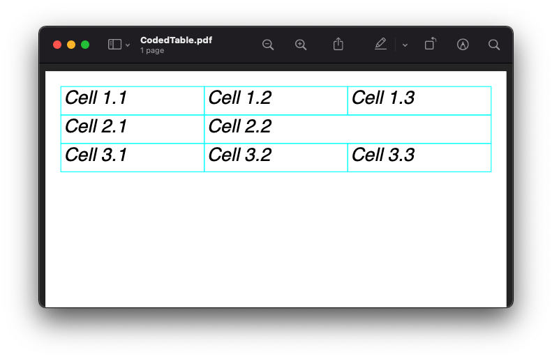

==========================
Tables, Rows and Cells
==========================

Scryber supports the use of tables with rows, cells and allows nesting, overflow, headings, footers and 
column-spans.

It also supports the use of binding and repeating at the row and/or the cell level.

Simple Tables
-------------

A simple table with no style or formatting will be output with a 
single point gray border and 4pt padding on each cell.

Each column will take up as much room as needed (or possible).

.. code-block:: html

    <!-- /Content/HTML/Samples/TableSimple.html -->
    <!DOCTYPE html>
    <html xmlns="http://www.w3.org/1999/xhtml">
    <head>
        <meta charset="utf-8" />
        <title>Simple Tables</title>
    </head>
    <body style="padding:20pt">
        <table id='FirstTable' >
            <tr>
                <td>Cell 1.1</td>
                <td>Wider Cell 1.2</td>
                <td>Cell 1.3</td>
            </tr>
            <tr>
                <td>Cell 2.1</td>
                <td>Cell 2.2</td>
                <td>Cell 2.3</td>
            </tr>
            <tr>
                <td>Cell 3.1</td>
                <td>Cell 3.2</td>
                <td>Cell 3.3</td>
            </tr>
        </table>
    </body>
    </html>

.. code:: csharp

    using Scryber;
    using Scryber.Drawing;
    using Scryber.Styles;
    using Scryber.Components
    
    /// 

    /// Returns a file stream in '/My Documents/Scryber Test Output' folder.
    /// If the document exists it will be overwritten
    /// 

    /// <param name="docName">The name of the file with extension</param>
    /// <returns>A new file stream</returns>
    public Stream GetOutputStream(string docName)
    {
        var path = System.Environment.GetFolderPath(Environment.SpecialFolder.MyDocuments);
        path = System.IO.Path.Combine(path, "Scryber Test Output");

        if (!System.IO.Directory.Exists(path))
            System.IO.Directory.CreateDirectory(path);

        var output = System.IO.Path.Combine(path, docName);

        return new System.IO.FileStream(output, System.IO.FileMode.Create);
    }

    /// 

    /// Returns the path to a template in the samples folder.
    /// 

    /// <param name="templateName"></param>
    /// <returns></returns>
    public string GetSampleTemplatePath(string templateName)
    {
        var path = System.Environment.CurrentDirectory;
        path = System.IO.Path.Combine(path, "../../../Content/HTML/Samples/", templateName);

        return path;
    }

    public void Table1_SimpleTable()
    {
        var path = System.Environment.CurrentDirectory;
        path = System.IO.Path.Combine(path, "../../../Content/HTML/Samples/TableSimple.html");

        using (var doc = Document.ParseDocument(path))
        {
            using (var stream = DocStreams.GetOutputStream("Samples_TableSimple.pdf"))
            {
                doc.SaveAsPDF(stream);
            }
        }
    }

`Full size version <../_images/samples_tables_simple.png>`_

Applying the full-width addtibute will make the table use all available space, obeying any fixed column widths.

The cells support a column-span attribute to allow multiple column content.

.. code:: html

    <!-- /Content/HTML/Samples/TableSimple.html -->
    <!DOCTYPE html>
    <html xmlns="http://www.w3.org/1999/xhtml">
    <head>
        <meta charset="utf-8" />
        <title>Simple Tables</title>
    </head>
    <body style="padding:20pt">
        <table id='FirstTable' style="width:100%">
            <tr>
                <td>Cell 1.1</td>
                <td style="width: 300pt">Wider Cell 1.2</td>
                <td>Cell 1.3</td>
            </tr>
            <tr>
                <td>Cell 2.1</td>
                <td colspan="2">Cell 2.2</td>
            </tr>
            <tr>
                <td>Cell 3.1</td>
                <td>Cell 3.2</td>
                <td>Cell 3.3</td>
            </tr>
        </table>
    </body>
    </html>

.. code:: csharp

    public void Table2_SimpleTableSpanned()
    {
        var path = System.Environment.CurrentDirectory;
        path = System.IO.Path.Combine(path, "../../../Content/HTML/Samples/TableSpanned.html");

        using (var doc = Document.ParseDocument(path))
        {
            using (var stream = GetOutputStream("Samples_TableSpanned.pdf"))
            {
                doc.SaveAsPDF(stream);
            }
        }
    }

`Full size version <../_images/samples_tables_spanned.png>`_

Tables in code
----------------

Tables can be created just as easily through code. The ``table`` has a ``Rows`` property and each ``row`` has a ``Cells`` property.
These properties wrap the protected ``InnerContent`` property from the ``PDFContainerComponent`` class.

.. code:: csharp

    var doc = new Document();

    var pg = new Page();
    doc.Pages.Add(pg);
    pg.Padding = new PDFThickness(20);

    var tbl = new TableGrid();
    pg.Contents.Add(tbl);
    tbl.FullWidth = true;

    for (int i = 0; i < 3; i++)
    {
        var row = new TableRow();
        tbl.Rows.Add(row);

        for (int j = 0; j < 3; j++)
        {
            if (i == 1 && j == 2)
            {
                //We make the previous cell 2 clolumns wide rather than add a new one.
                row.Cells[1].ColumnCount = 2;
                continue;
            }
            else
            {
                var cell = new TableCell() { BorderColor = PDFColors.Aqua, FontItalic = true };
                row.Cells.Add(cell);

                var txt = new TextLiteral("Cell " + (i + 1) + "." + (j + 1));
                cell.Contents.Add(txt);
            }
        }
    }

    using (var stream = DocStreams.GetOutputStream("Samples_TableInCode.pdf"))
    {
        doc.SaveAsPDF(stream);
    }

`Full size version <../_images/samples_tableincode.png>`_

It is also possible to access a parsed table to alter the content as needed.

Headers, Footers and overflow
=============================

Tables support both header and footer rows (single or multiple) along with header and footer cells.
The header cells by default will repeat across columns and or pages, but can be set not to repeat.
(Alternatively, rows can simply be set to repeat, and will do so after they are initially been laid out).

Rows support the block styles, except margins, padding and positioning.

.. code-block:: xml

    <?xml version="1.0" encoding="utf-8" ?>
    <doc:Document xmlns:doc="http://www.scryber.co.uk/schemas/core/release/v1/Scryber.Components.xsd"
                xmlns:styles="http://www.scryber.co.uk/schemas/core/release/v1/Scryber.Styles.xsd"
                xmlns:data="http://www.scryber.co.uk/schemas/core/release/v1/Scryber.Data.xsd">
    
    <Styles>

        <styles:Style applied-type="doc:Cell" >
        </styles:Style>

        <styles:Style applied-type="doc:Cell" applied-class="strong" >
        <styles:Font bold="true"/>
        </styles:Style>

        <styles:Style applied-class="table-title" >
        <styles:Table row-repeat="None"/>
        </styles:Style>
    </Styles>
    <Pages>

            <doc:Page styles:margins="20pt" styles:font-size="12pt">
            <Content>

                <doc:Div styles:column-count="2" styles:max-height="200pt" styles:border-color="aqua" styles:padding="2pt" >

                <doc:Table styles:margins="0 0 10 0" styles:full-width="true">
                    
                    <!-- Header that will not repeat based on style-->
                    <doc:Header-Row styles:class="table-title" >
                    <doc:Header-Cell styles:column-span="3" >A flowing table</doc:Header-Cell>
                    </doc:Header-Row>
                    
                    <!-- Header that will repeat -->
                    <doc:Header-Row>
                    <doc:Header-Cell>Header 1</doc:Header-Cell>
                    <doc:Header-Cell>Header 2</doc:Header-Cell>
                    <doc:Header-Cell>Header 3</doc:Header-Cell>
                    </doc:Header-Row>
                    
                    <doc:Row>
                    <doc:Cell>Cell 1.1</doc:Cell>
                    <doc:Cell>Wide Cell 1.2</doc:Cell>
                    <doc:Cell>Cell 1.3</doc:Cell>
                    </doc:Row>
                    <doc:Row>
                    <doc:Cell>Cell 2.1</doc:Cell>
                    <doc:Cell styles:column-span="2">2 Column Cell 2.2</doc:Cell>
                    </doc:Row>
                    
                    <!-- Standard row, that will repeat after
                    it has been initially laid out -->
                    <doc:Row styles:repeat="RepeatAtTop" styles:bg-color="#EEE">
                    <doc:Cell>Repeat 3.1</doc:Cell>
                    <doc:Cell>Repeat 3.2</doc:Cell>
                    <doc:Cell styles:width="60pt">Cell 3.3</doc:Cell>
                    </doc:Row>
                    
                    <doc:Row><doc:Cell>Cell 4.1</doc:Cell><doc:Cell>Wide Cell 4.2</doc:Cell><doc:Cell>Cell 4.3</doc:Cell></doc:Row>
                    <doc:Row><doc:Cell>Cell 5.1</doc:Cell><doc:Cell>Wide Cell 5.2</doc:Cell><doc:Cell>Cell 5.3</doc:Cell></doc:Row>
                    <doc:Row><doc:Cell>Cell 6.1</doc:Cell><doc:Cell>Wide Cell 6.2</doc:Cell><doc:Cell>Cell 6.3</doc:Cell></doc:Row>
                    <doc:Row><doc:Cell>Cell 7.1</doc:Cell><doc:Cell>Cell 7.2</doc:Cell><doc:Cell>Cell 7.3</doc:Cell></doc:Row>
                    <doc:Row><doc:Cell>Cell 8.1</doc:Cell><doc:Cell>Cell 8.2</doc:Cell><doc:Cell>Cell 8.3</doc:Cell></doc:Row>
                    <doc:Row><doc:Cell>Cell 9.1</doc:Cell><doc:Cell>Cell 9.2</doc:Cell><doc:Cell>Cell 9.3</doc:Cell></doc:Row>
                    <doc:Row><doc:Cell>Cell 10.1</doc:Cell><doc:Cell>Cell 10.2</doc:Cell><doc:Cell>Cell 10.3</doc:Cell></doc:Row>
                    
                    <doc:Footer-Row styles:bg-color="#CCC" >
                    <doc:Footer-Cell>Footer 1</doc:Footer-Cell>
                    <doc:Footer-Cell>Footer 2</doc:Footer-Cell>
                    <doc:Footer-Cell>Footer 3</doc:Footer-Cell>
                    </doc:Footer-Row>
                </doc:Table>
                
                </doc:Div>

            </Content>
            </doc:Page>

    </Pages>
    
    </doc:Document>

.. image:: images/documentTablesFlow.png

.. note:: Because of the layout mechanism, repeating cells cannot be accessed or modified between itterations. The next table header is from the layout of the original.

Mixed content and nesting
=========================

All teble cells can contain any content, just like other block components, including other tables, 
and they also support sizing and alignment of content.

A table row however is designated at not being allowed to split across columns or 
pages (even if it's got a nested table. It will probably just mess up the layout.

.. code-block:: xml

    <?xml version="1.0" encoding="utf-8" ?>

    <doc:Document xmlns:doc="http://www.scryber.co.uk/schemas/core/release/v1/Scryber.Components.xsd"
                xmlns:styles="http://www.scryber.co.uk/schemas/core/release/v1/Scryber.Styles.xsd"
                xmlns:data="http://www.scryber.co.uk/schemas/core/release/v1/Scryber.Data.xsd">
    
    <Styles>

        <styles:Style applied-type="doc:Header-Cell" >
        <styles:Position h-align="Center" v-align="Middle"/>
        <styles:Size height="40pt"/>
        </styles:Style>

        <styles:Style applied-class="table-title">
        <styles:Table row-repeat="None"/>
        </styles:Style>
        
        <styles:Style applied-class="img-footer" >
        <styles:Font family="Helvetica"  size="10pt" italic="true"/>
        <styles:Position h-align="Center"/>
        <styles:Background color="black"/>
        <styles:Fill color="white"/>
        </styles:Style>
    </Styles>
    <Pages>

            <doc:Section styles:margins="20pt" styles:font-size="12pt">
            <Content>

                <doc:Table styles:margins="0 0 10 0" styles:full-width="true">
                    
                    <!-- Header that will not repeat based on style-->
                    <doc:Header-Row styles:class="table-title" >
                    <doc:Header-Cell styles:column-span="3" >A nested table</doc:Header-Cell>
                    </doc:Header-Row>
                    
                    <!-- Header that will repeat -->
                    <doc:Header-Row>
                    <doc:Header-Cell>Left</doc:Header-Cell>
                    <doc:Header-Cell>Right</doc:Header-Cell>
                    </doc:Header-Row>
                    
                    <doc:Row>
                    
                    <doc:Cell styles:v-align="Middle" styles:h-align="Center">
                        <doc:Image src="../../Content/Images/landscape.jpg" styles:width="100pt" />
                        <doc:Div styles:class="img-footer" styles:width="100pt">Landscape Image</doc:Div>
                    </doc:Cell>
                    
                    <doc:Cell>
                        Inner Nested table
                        <doc:Table>
                        <doc:Row><doc:Cell>Cell 4.1</doc:Cell><doc:Cell>Wide Cell 4.2</doc:Cell><doc:Cell>Cell 4.3</doc:Cell></doc:Row>
                        <doc:Row><doc:Cell>Cell 5.1</doc:Cell><doc:Cell>Wide Cell 5.2</doc:Cell><doc:Cell>Cell 5.3</doc:Cell></doc:Row>
                        <doc:Row><doc:Cell>Cell 6.1</doc:Cell><doc:Cell>Wide Cell 6.2</doc:Cell><doc:Cell>Cell 6.3</doc:Cell></doc:Row>
                        <doc:Row><doc:Cell>Cell 7.1</doc:Cell><doc:Cell>Cell 7.2</doc:Cell><doc:Cell>Cell 7.3</doc:Cell></doc:Row>
                        <doc:Row><doc:Cell>Cell 8.1</doc:Cell><doc:Cell>Cell 8.2</doc:Cell><doc:Cell>Cell 8.3</doc:Cell></doc:Row>
                        <doc:Row><doc:Cell>Cell 9.1</doc:Cell><doc:Cell>Cell 9.2</doc:Cell><doc:Cell>Cell 9.3</doc:Cell></doc:Row>
                        <doc:Row><doc:Cell>Cell 10.1</doc:Cell><doc:Cell>Cell 10.2</doc:Cell><doc:Cell>Cell 10.3</doc:Cell></doc:Row>
                        <doc:Footer-Row styles:bg-color="#CCC" ><doc:Footer-Cell>Footer 1</doc:Footer-Cell><doc:Footer-Cell>Footer 2</doc:Footer-Cell><doc:Footer-Cell>Footer 3</doc:Footer-Cell></doc:Footer-Row>
                        </doc:Table>

                    </doc:Cell>
                    <doc:Cell>
                        Cell 1.3
                    </doc:Cell>
                    </doc:Row>
                    
                    <doc:Row>
                        <doc:Cell>
                            <doc:B>Rows will not split across pages.</doc:B>
                        </doc:Cell>
                        <doc:Cell styles:column-span="2">
                            <doc:Table>
                            <doc:Row><doc:Cell>Cell 4.1</doc:Cell><doc:Cell>Wide Cell 4.2</doc:Cell><doc:Cell>Cell 4.3</doc:Cell></doc:Row>
                            <doc:Row><doc:Cell>Cell 5.1</doc:Cell><doc:Cell>Wide Cell 5.2</doc:Cell><doc:Cell>Cell 5.3</doc:Cell></doc:Row>
                            <doc:Row><doc:Cell>Cell 6.1</doc:Cell><doc:Cell>Wide Cell 6.2</doc:Cell><doc:Cell>Cell 6.3</doc:Cell></doc:Row>
                            <doc:Row><doc:Cell>Cell 7.1</doc:Cell><doc:Cell>Cell 7.2</doc:Cell><doc:Cell>Cell 7.3</doc:Cell></doc:Row>
                            <doc:Row><doc:Cell>Cell 8.1</doc:Cell><doc:Cell>Cell 8.2</doc:Cell><doc:Cell>Cell 8.3</doc:Cell></doc:Row>
                            <doc:Row><doc:Cell>Cell 9.1</doc:Cell><doc:Cell>Cell 9.2</doc:Cell><doc:Cell>Cell 9.3</doc:Cell></doc:Row>
                            <doc:Row><doc:Cell>Cell 10.1</doc:Cell><doc:Cell>Cell 10.2</doc:Cell><doc:Cell>Cell 10.3</doc:Cell></doc:Row>
                            <doc:Footer-Row styles:bg-color="#CCC" ><doc:Footer-Cell>Footer 1</doc:Footer-Cell><doc:Footer-Cell>Footer 2</doc:Footer-Cell><doc:Footer-Cell>Footer 3</doc:Footer-Cell></doc:Footer-Row>
                            </doc:Table>
                            <doc:Para>
                            Lorem ipsum dolor sit amet, consectetur adipiscing elit. Vivamus pulvinar, ipsum eu molestie elementum, nibh ante ultricies dui, et euismod nulla sapien ac purus. Morbi suscipit elit tellus, nec elementum lacus dignissim a. Aliquam molestie turpis consectetur rutrum pretium. Orci varius natoque penatibus et magnis dis parturient montes, nascetur ridiculus mus. Quisque varius vitae erat sagittis facilisis. Vivamus quis tellus quis augue fringilla posuere vitae ac ante. Aliquam ultricies sodales cursus. Pellentesque habitant morbi tristique senectus et netus et malesuada fames ac turpis egestas.
                            <doc:Br/>
                            Vestibulum dolor libero, faucibus quis tristique at, euismod vitae nunc. Donec vel volutpat urna, eget tristique nunc. Quisque vitae iaculis dolor. Pellentesque habitant morbi tristique senectus et netus et malesuada fames ac turpis egestas. Fusce fermentum odio ac feugiat pharetra. Integer sit amet elit a urna maximus sollicitudin sit amet sed mauris. Proin finibus nec diam blandit porttitor.
                            <doc:Br/>
                            Nunc laoreet, enim in faucibus volutpat, nunc ligula sollicitudin magna, eget fermentum nulla neque scelerisque lectus. Nulla vel tincidunt enim. Nam vulputate eros a mi ultrices aliquet. Vestibulum et convallis tortor. Aenean pellentesque libero quis consectetur tincidunt. Proin maximus leo non felis tempor, ut iaculis ipsum iaculis. Nullam tristique justo diam, at ultricies diam ultrices ac. Aenean venenatis, lorem vel bibendum tristique, sem nisi congue ex, sed eleifend magna nisl luctus velit. Donec hendrerit malesuada neque eu imperdiet. Duis tempor venenatis leo, sed aliquet sem aliquet sed. Ut nec ligula non lacus fermentum bibendum sed sit amet est. Nam pharetra tempor tortor vel auctor. Fusce metus felis, lacinia quis mauris sed, porta iaculis metus.
                            <doc:Br/>
                            Aliquam et sodales orci, quis sollicitudin velit. Nam ornare molestie aliquam. Mauris vitae convallis metus. Maecenas dignissim dui quis enim pretium, id interdum leo condimentum. Maecenas rutrum faucibus sapien. Praesent rutrum efficitur lorem, nec hendrerit dui. Ut ac massa ut magna ultricies gravida ut in mi. Fusce sed leo elit. Donec finibus rhoncus pulvinar.
                            </doc:Para>
                        </doc:Cell>
                    </doc:Row>
                    
                    <!-- Standard row, that will repeat after
                    it has been initially laid out -->
                    <doc:Row styles:repeat="RepeatAtTop" styles:bg-color="#EEE">
                        <doc:Cell>Repeat 3.1</doc:Cell>
                        <doc:Cell>Repeat 3.2</doc:Cell>
                    <doc:Cell styles:width="60pt">Cell 3.3</doc:Cell>
                </doc:Row>
                    
            </doc:Table>
                

            </Content>
        </doc:Section>

    </Pages>
    
    </doc:Document>

.. image:: images/documentTablesNested.png

.. note:: In future we might be able to work on getting table rows to overflow across pages, but there are always other ways of achieving a similar layout.

Binding to Data
===============

As with all things in scryber. Tables, rows and cells are fully bindable.
It is very common to want to layout data in tables so that it can easily be compared.

Tables support the use of the data binding and also data choice flow  within their structure.
Giving a flexible, but segmented content to the document.

See :doc:`binding_databinding` for more information on the data binding capabilities of scryber.

.. code-block:: xml

    <?xml version="1.0" encoding="utf-8" ?>

    <doc:Document xmlns:doc="http://www.scryber.co.uk/schemas/core/release/v1/Scryber.Components.xsd"
                xmlns:styles="http://www.scryber.co.uk/schemas/core/release/v1/Scryber.Styles.xsd"
                xmlns:data="http://www.scryber.co.uk/schemas/core/release/v1/Scryber.Data.xsd">
    
    <Styles>

        <styles:Style applied-class="header">
            <styles:Size width="100pt"/>
            <styles:Position h-align="Center"/>
            <styles:Background color="black"/>
            <styles:Fill color="white"/>
        </styles:Style>

        <styles:Style applied-class="first">
            <styles:Position h-align="Center"/>
            <styles:Size width="300pt"/>
        </styles:Style>
        
    </Styles>
    <Data>
        
        <!-- Custom data source that will provide the data. -->
        <data:XMLDataSource id="Content" source-path="http://localhost:5000/Home/Xml" ></data:XMLDataSource>
    </Data>
    <Pages>

            <doc:Section styles:margins="20pt" styles:font-size="12pt">
            <Content>
                
                <!-- set the current context to the DataSources element of the xml source -->
                <data:With datasource-id="Content"  select="DataSources">
                
                <doc:Table styles:margins="0 0 10 0" styles:full-width="true">
                    <!-- Header row, not repeating -->
                    <doc:Header-Row styles:repeat="None"  >
                        <doc:Header-Cell styles:column-span="2" styles:h-align="Center" >
                            <doc:Image styles:class="header" src="../../Content/Images/landscape.jpg" />
                            <doc:Div styles:class="header" >
                            <doc:Text value="{xpath:@title}" />
                            </doc:Div>
                        </doc:Header-Cell>
                    </doc:Header-Row>
                    
                    <!-- Header that will repeat -->
                    <doc:Header-Row>
                        <doc:Header-Cell styles:class="first" styles:width="300pt" styles:h-align="Center">ID</doc:Header-Cell>
                        <doc:Header-Cell>Name</doc:Header-Cell>
                    </doc:Header-Row>
                    
                    <!-- Loop through each of the Entries/Entry values from the current context -->
                    <data:ForEach value="{xpath:Entries/Entry}" >
                    <Template>
                        
                        <!-- Add a choice if we have the Id attribute equal to 'ThirdID' -->
                        <data:Choose>
                            <data:When test="{xpath:@Id = 'ThirdID'}" >
                                <Template>

                                <doc:Row styles:bg-color="#CCC">
                                    <doc:Cell styles:column-span="2" >
                                    <doc:Text value="{xpath:concat('This is the ',@Name,' Row with the id ',@Id)}" />
                                    </doc:Cell>
                                </doc:Row>

                                </Template>
                            </data:When>
                            
                            <!-- Not 'ThirdID' then do this -->
                            <data:Otherwise>
                                <Template>
                                <!-- General row of 2 cells with databound content-->
                                <doc:Row>
                                    <doc:Cell styles:class="first" >
                                    <doc:Text value="{xpath:@Id}" />
                                    </doc:Cell>
                                    <doc:Cell>
                                    <doc:Text value="{xpath:@Name}" />
                                    </doc:Cell>
                                </doc:Row>

                                </Template>
                            </data:Otherwise>
                        </data:Choose>
                        
                    </Template>
                    </data:ForEach>
                </doc:Table>
                
                </data:With>

            </Content>
            </doc:Section>
    
    </Pages>
    
    </doc:Document>

And a datasource response that results as follows

.. code-block:: csharp

        public IActionResult Xml()
        {
            var xml = new XDocument(
                new XElement("DataSources",
                    new XAttribute("title", "Testing Xml Datasources"),
                    new XElement("Entries",
                        new XElement("Entry", new XAttribute("Name", "First Xml"), new XAttribute("Id", "FirstID")),
                        new XElement("Entry", new XAttribute("Name", "Second Xml"), new XAttribute("Id", "SecondID")),
                        new XElement("Entry", new XAttribute("Name", "Third Xml"), new XAttribute("Id", "ThirdID")),
                        new XElement("Entry", new XAttribute("Name", "Fourth Xml"), new XAttribute("Id", "FourthID"))
                        )
                    )
                );
            return Content(xml.ToString(), "text/xml");
        }

Content can be generated dynamically as per the output.

.. image:: images/documentTablesDatabound.png

.. note:: Scryber also includes the doc:DataGrid component that can easily create tables from datasources MUCH faster. But the doc:ForEach and doc:Choice allow full control where needed.