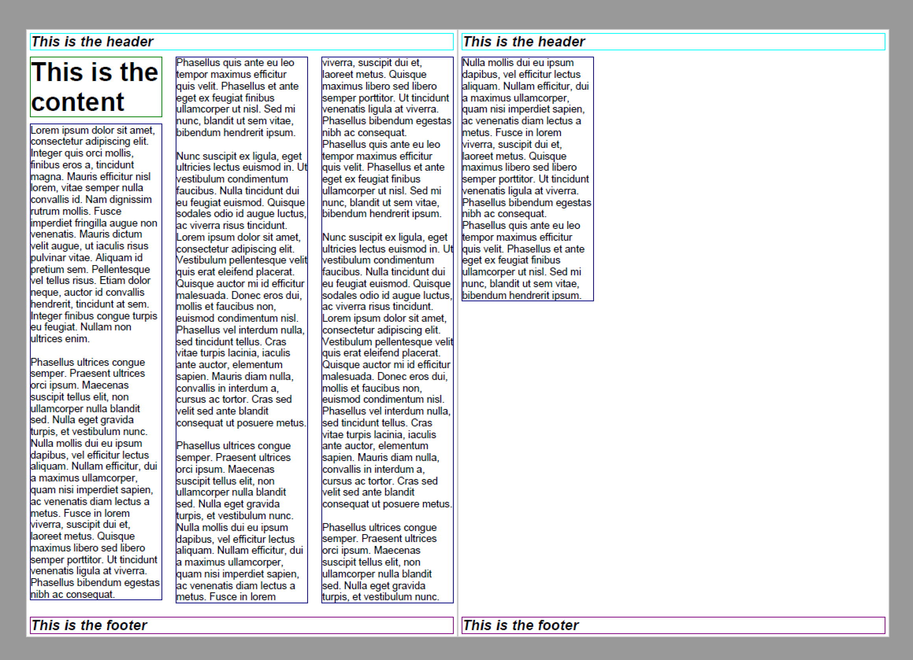
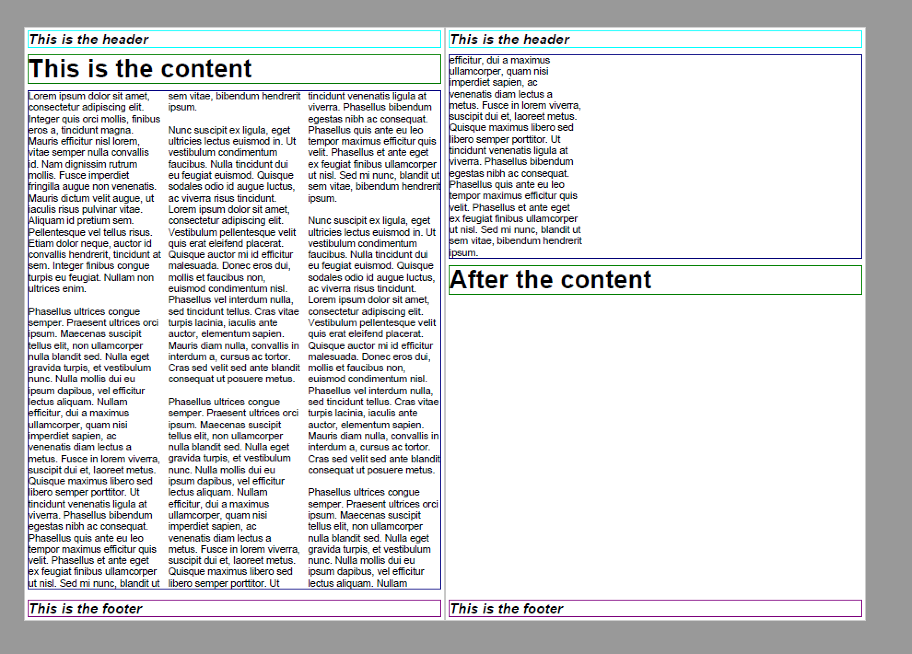
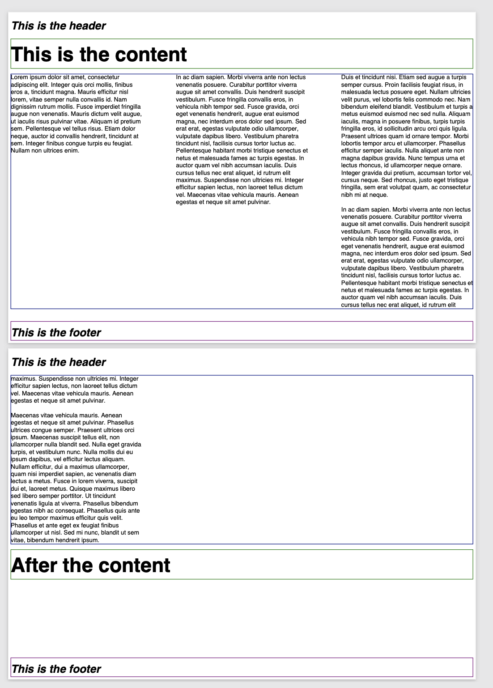
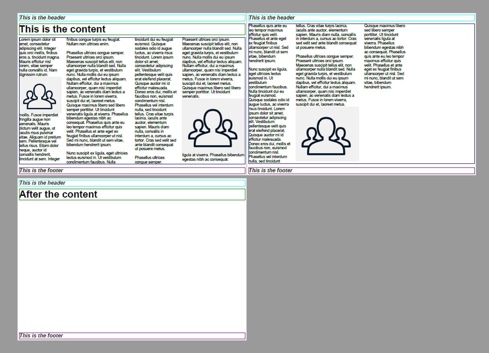
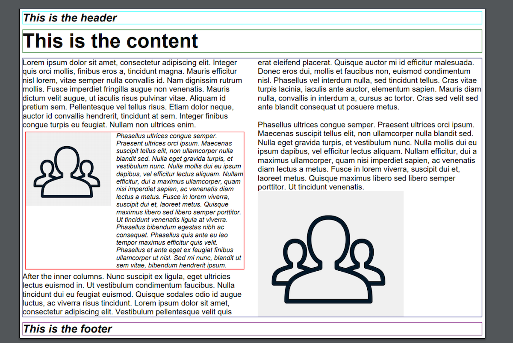

===================================
Column layout
===================================

Scryber supports flowing content layout. No matter the font, content type or structure. (see :doc:`document_pages`)
It also supports the same with columns, at the page and container level.

Specifying columns on Pages
===========================

All block level components (see :doc:`component_positioning`) support the use of columns.

There is by default on a block a single column, but by specifying a style:column-count (either on the block, or in the style definition) then 
the layout will split the block into that number of regions within it.

Content within the column will flow down as far as it is able (either the bottom or the page, or the maximum height of the container)
and then move to the top of the next column.

Below we specify the section to have 3 columns, they will be of equal size and the content within it will flow onto each
column and then ulimately the next page.

.. code-block:: xml

    <?xml version="1.0" encoding="utf-8" ?>

    <doc:Document xmlns:doc="http://www.scryber.co.uk/schemas/core/release/v1/Scryber.Components.xsd"
              xmlns:styles="http://www.scryber.co.uk/schemas/core/release/v1/Scryber.Styles.xsd"
              xmlns:data="http://www.scryber.co.uk/schemas/core/release/v1/Scryber.Data.xsd" >
    <Pages>
        <doc:Section styles:column-count="3" >
        <Header>
            <doc:H4 styles:margins="5pt" styles:border-width="1pt" styles:border-color="aqua" >This is the header</doc:H4>
        </Header>
        <Content>
            <doc:H1 styles:margins="5pt" styles:border-width="1pt" styles:border-color="green" >This is the content</doc:H1>
            <doc:Div styles:margins="5pt" styles:font-size="14pt" styles:border-width="1pt" styles:border-color="navy">
            Lorem ipsum dolor sit amet, consectetur adipiscing elit. Integer quis orci mollis, finibus eros a, 
            tincidunt magna. Mauris efficitur nisl lorem, vitae semper nulla convallis id. Nam dignissim rutrum 
            mollis. Fusce imperdiet fringilla augue non venenatis. Mauris dictum velit augue, ut iaculis risus 
            pulvinar vitae. Aliquam id pretium sem. Pellentesque vel tellus risus. Etiam dolor neque, auctor id 
            convallis hendrerit, tincidunt at sem. Integer finibus congue turpis eu feugiat. Nullam non ultrices enim.<doc:Br/>
            <doc:Br/>
            <!-- Truncated for brevity
            .
            . -->
            Phasellus ultrices congue semper. Praesent ultrices orci ipsum. Maecenas suscipit tellus elit,
            non ullamcorper nulla blandit sed. Nulla eget gravida turpis, et vestibulum nunc. Nulla mollis
            dui eu ipsum dapibus, vel efficitur lectus aliquam. Nullam efficitur, dui a maximus ullamcorper,
            quam nisi imperdiet sapien, ac venenatis diam lectus a metus. Fusce in lorem viverra, suscipit
            dui et, laoreet metus. Quisque maximus libero sed libero semper porttitor. Ut tincidunt venenatis
            ligula at viverra. Phasellus bibendum egestas nibh ac consequat. Phasellus quis ante eu leo tempor
            maximus efficitur quis velit. Phasellus et ante eget ex feugiat finibus ullamcorper ut nisl. Sed mi
            nunc, blandit ut sem vitae, bibendum hendrerit ipsum.<doc:Br/>
        </doc:Div>
        <doc:H1 styles:margins="5pt" styles:border-width="1pt" styles:border-color="green" >After the content</doc:H1>
        </Content>
        <Footer>
            <doc:H4 styles:margins="5pt" styles:border-width="1pt" styles:border-color="purple" >This is the footer</doc:H4>
        </Footer>
        </doc:Section>
    </Pages>
    
    </doc:Document>

Here the page is set to 3 columns across the layout page. The headers are independent of the column setting, but the inner content 
flows down the first column, and then moves to the next when no more can be fitted, and so on until it reaches the end of the layout page. 

As we can overflow, a new layout page is added, and the content latout continues until the end.

.. note:: The borders and any background will be based around the container and show on each column.

Columns on containers
=====================

As we can see above, the headings were also part of the column layout on the page. 

Scryber supports the use of columns on containers too. So our layout can be improved if we remove the columns from the page,
and set them on the `doc:Div` itself.

This will allow the headers to be full width, with the content flowing within the columns of the container.

.. code-block:: xml

    <doc:Section>
        <Header>
            <doc:H4 styles:margins="5pt" styles:border-width="1pt" styles:border-color="aqua" >This is the header</doc:H4>
        </Header>
        <Content>
            <doc:H1 styles:margins="5pt" styles:border-width="1pt" styles:border-color="green" >This is the content</doc:H1>
            <doc:Div styles:column-count="3" styles:margins="5pt" styles:font-size="14pt" styles:border-width="1pt" styles:border-color="navy">
            Lorem ipsum dolor sit amet, consectetur adipiscing elit. Integer quis orci mollis, finibus eros a, 
            tincidunt magna. Mauris efficitur nisl lorem, vitae semper nulla convallis id. Nam dignissim rutrum 
            mollis. Fusce imperdiet fringilla augue non venenatis. Mauris dictum velit augue, ut iaculis risus 
            pulvinar vitae. Aliquam id pretium sem. Pellentesque vel tellus risus. Etiam dolor neque, auctor id 
            convallis hendrerit, tincidunt at sem. Integer finibus congue turpis eu feugiat. Nullam non ultrices enim.<doc:Br/>
            <doc:Br/>
            <!-- Truncated for brevity
            .
            . -->
            Phasellus ultrices congue semper. Praesent ultrices orci ipsum. Maecenas suscipit tellus elit,
            non ullamcorper nulla blandit sed. Nulla eget gravida turpis, et vestibulum nunc. Nulla mollis
            dui eu ipsum dapibus, vel efficitur lectus aliquam. Nullam efficitur, dui a maximus ullamcorper,
            quam nisi imperdiet sapien, ac venenatis diam lectus a metus. Fusce in lorem viverra, suscipit
            dui et, laoreet metus. Quisque maximus libero sed libero semper porttitor. Ut tincidunt venenatis
            ligula at viverra. Phasellus bibendum egestas nibh ac consequat. Phasellus quis ante eu leo tempor
            maximus efficitur quis velit. Phasellus et ante eget ex feugiat finibus ullamcorper ut nisl. Sed mi
            nunc, blandit ut sem vitae, bibendum hendrerit ipsum.<doc:Br/>
        </doc:Div>
        <doc:H1 styles:margins="5pt" styles:border-width="1pt" styles:border-color="green" >After the content</doc:H1>
        </Content>
        <Footer>
            <doc:H4 styles:margins="5pt" styles:border-width="1pt" styles:border-color="purple" >This is the footer</doc:H4>
        </Footer>
    </doc:Section>

Column and Alley Widths
========================

Along with changing the number of columns, scryber also supports the use of column and alley widths that can either be set on the style or
component itself.

Alleys are the margins between each column that defaults to 10pt, but can be specified as a single unit value, e.g. 20pt or 5mm
(see :doc:`drawing_units` for more on scryber measurements).

The `column-widths` attribute (or `widths` on a style definition) takes multiple fraction values (0.0 to 1.0), for one or more columns.
It also supports the use of the `*` character for variable width.
If a column is not specified then it will use the remainder of the space.

If for example we have 4 columns on a container that is 430pt wide with a 10pt alley we could use any of the following for the column widths.

* `0.2 0.3 0.3 0.2`
    * The first and last column will be 1/5th of the available space (80pt)
    * The second and third columns will be 3/10ths of the available space (120pt)
* `0.2 0.2`
    * The first 2 columns would be 1/5th of the available space (80pt)
    * The last 2 colums would be calculated as the remainder divided equally (120pt)
* `0.2 * 0.2`
    * The first and the 3rd column would be 1/5th of the available space (80pt)
    * The second and last columns will be 3/10ths of the available space (120pt)
    * If the column count were to increase to 5, then the variable columns would accomodate and ultimately all be the same width

.. warning:: It is an error to specify column widths that add up to over 1.0 (100%). An exception will be thrown.

.. code-block:: xml

    <doc:Section styles:paper-orientation="Landscape" >
        <Header>
            <doc:H4 styles:margins="5pt" styles:border-width="1pt" styles:border-color="aqua" >This is the header</doc:H4>
        </Header>
        <Content>
            <doc:H1 styles:margins="5pt" styles:border-width="1pt" styles:border-color="green" >This is the content</doc:H1>
            <doc:Div styles:column-count="4" styles:column-widths="0.2 * 0.2" styles:alley-width="20pt" 
                     styles:margins="5pt" styles:font-size="14pt" styles:border-width="1pt" styles:border-color="navy">
            Lorem ipsum dolor sit amet, consectetur adipiscing elit. Integer quis orci mollis, finibus eros a, 
            tincidunt magna. Mauris efficitur nisl lorem, vitae semper nulla convallis id. Nam dignissim rutrum 
            mollis. Fusce imperdiet fringilla augue non venenatis. Mauris dictum velit augue, ut iaculis risus 
            pulvinar vitae. Aliquam id pretium sem. Pellentesque vel tellus risus. Etiam dolor neque, auctor id 
            convallis hendrerit, tincidunt at sem. Integer finibus congue turpis eu feugiat. Nullam non ultrices enim.<doc:Br/>
            <doc:Br/>
            <!-- Truncated for brevity
            .
            . -->
            Phasellus ultrices congue semper. Praesent ultrices orci ipsum. Maecenas suscipit tellus elit,
            non ullamcorper nulla blandit sed. Nulla eget gravida turpis, et vestibulum nunc. Nulla mollis
            dui eu ipsum dapibus, vel efficitur lectus aliquam. Nullam efficitur, dui a maximus ullamcorper,
            quam nisi imperdiet sapien, ac venenatis diam lectus a metus. Fusce in lorem viverra, suscipit
            dui et, laoreet metus. Quisque maximus libero sed libero semper porttitor. Ut tincidunt venenatis
            ligula at viverra. Phasellus bibendum egestas nibh ac consequat. Phasellus quis ante eu leo tempor
            maximus efficitur quis velit. Phasellus et ante eget ex feugiat finibus ullamcorper ut nisl. Sed mi
            nunc, blandit ut sem vitae, bibendum hendrerit ipsum.<doc:Br/>
        </doc:Div>
        <doc:H1 styles:margins="5pt" styles:border-width="1pt" styles:border-color="green" >After the content</doc:H1>
        </Content>
        <Footer>
            <doc:H4 styles:margins="5pt" styles:border-width="1pt" styles:border-color="purple" >This is the footer</doc:H4>
        </Footer>
    </doc:Section>

Here we can see that we have changed the paper orientation to landscape, set the column number to 4 with widths of 0.2 * 0.2,
and set the alley width to 20pt to give more spacing.

The layout engine adjusts all content automatically within the column widths.

Balanced Columns
=================

As can be seen in the above image, scryber does not balance columns across the page (matching height).
At the moment this is due to rendering speed, and the need to recaclulate all inner content again (and again),
in order to match the spacing etc.

.. note:: It's being looked into and may be supported in the future. Even if it's just for equally spaced columns.

Images and Shapes in columns
==============================

As with :doc:`component_sizing`, images and shapes that do not have an explicit size, take their natural width up to the size of the container.

This also applies to columns. If an image is too wide for the column it will be proportionally resized to fit within the column.

.. code-block:: xml

    <doc:Section styles:paper-orientation="Landscape" >
        <Header>
            <doc:H4 styles:margins="5pt" styles:border-width="1pt" styles:border-color="aqua" >This is the header</doc:H4>
        </Header>
        <Content>
            <doc:H1 styles:margins="5pt" styles:border-width="1pt" styles:border-color="green" >This is the content</doc:H1>
            <doc:Div styles:column-count="4" styles:column-widths="0.2 0.0 0.2" 
                 styles:alley-width="20pt" styles:margins="5pt" styles:font-size="14pt" styles:border-width="1pt" styles:border-color="navy">
          Lorem ipsum dolor sit amet, consectetur adipiscing elit. Integer quis orci mollis, finibus eros a, 
          tincidunt magna. Mauris efficitur nisl lorem, vitae semper nulla convallis id. Nam dignissim rutrum 
          <doc:Image src="../../content/images/group.png" />
          mollis. Fusce imperdiet fringilla augue non venenatis. Mauris dictum velit augue, ut iaculis risus 
          pulvinar vitae. Aliquam id pretium sem. Pellentesque vel tellus risus. Etiam dolor neque, auctor id 
          convallis hendrerit, tincidunt at sem. Integer finibus congue turpis eu feugiat. Nullam non ultrices enim.<doc:Br/>
          <doc:Br/>
          <!-- Truncated for brevity
            .
            . -->
         <doc:Image src="../../content/images/group.png" />
          Quisque maximus libero sed libero semper porttitor. Ut tincidunt venenatis
          ligula at viverra. Phasellus bibendum egestas nibh ac consequat. Phasellus quis ante eu leo tempor
          maximus efficitur quis velit. Phasellus et ante eget ex feugiat finibus ullamcorper ut nisl. Sed mi
          nunc, blandit ut sem vitae, bibendum hendrerit ipsum.<doc:Br/>
      </doc:Div>
        <doc:H1 styles:margins="5pt" styles:border-width="1pt" styles:border-color="green" >After the content</doc:H1>
        </Content>
        <Footer>
            <doc:H4 styles:margins="5pt" styles:border-width="1pt" styles:border-color="purple" >This is the footer</doc:H4>
        </Footer>
    </doc:Section>

With this layout the images are taking the full width available within the variable columns.

Breaking columns
=================

Withing the content flow of the document, it's possible just as with page breaks to stop any layout in the current column, and move to the next
using the `doc:ColumnBreak` ( :doc:`reference/pdf_ColumnBreak`). 

When a column break appears, the heirarchy will be traversed upwards to find

.. note:: When a column break appears, the heirarchy will be traversed upwards to find the next container with multiple columns. If it gets to the top, a new page will be created for the columns.

See the Nested containers and columns below for an example.

Nested containers and columns
==============================

Scryber fully supports nested columns whether that be at the page or multiple container level.
Again mixed content can be used within the columns, and the content will flow as normal.

.. code-block:: xml

    <doc:Section styles:paper-orientation="Landscape" >
        <Header>
            <doc:H4 styles:margins="5pt" styles:border-width="1pt" styles:border-color="aqua" >This is the header</doc:H4>
        </Header>
        <Content>
            <doc:H1 styles:margins="5pt" styles:border-width="1pt" styles:border-color="green" >This is the content</doc:H1>
            <!--
                2 columns on the outer div
             -->
            <doc:Div styles:column-count="2"
                    styles:alley-width="20pt" styles:margins="5pt" styles:font-size="14pt" styles:border-width="1pt" styles:border-color="navy">
            Lorem ipsum dolor sit amet, consectetur adipiscing elit. Integer quis orci mollis, finibus eros a, 
            tincidunt magna. Mauris efficitur nisl lorem, vitae semper nulla convallis id. Nam dignissim rutrum 
            
            mollis. Fusce imperdiet fringilla augue non venenatis. Mauris dictum velit augue, ut iaculis risus 
            pulvinar vitae. Aliquam id pretium sem. Pellentesque vel tellus risus. Etiam dolor neque, auctor id 
            convallis hendrerit, tincidunt at sem. Integer finibus congue turpis eu feugiat. Nullam non ultrices enim.<doc:Br/>
            <!-- 
                Inner div with 2 columns for an image and a bit of text 
            -->
            <doc:Div styles:column-count="2" styles:column-widths="0.4 0.6"
                    styles:margins="5pt" styles:font-size="12pt" styles:font-italic="true" 
                    styles:border-width="1pt" styles:border-color="red">
                <doc:Image src="../../content/images/group.png" />
                <!-- 
                    Explicit column break after 
                    the image to go on a new line
                -->
                <doc:ColumnBreak />
                Phasellus ultrices congue semper. Praesent ultrices orci ipsum. Maecenas suscipit tellus elit,
                non ullamcorper nulla blandit sed. Nulla eget gravida turpis, et vestibulum nunc. Nulla mollis
                dui eu ipsum dapibus, vel efficitur lectus aliquam. Nullam efficitur, dui a maximus ullamcorper,
                quam nisi imperdiet sapien, ac venenatis diam lectus a metus. Fusce in lorem viverra, suscipit
                dui et, laoreet metus. Quisque maximus libero sed libero semper porttitor. Ut tincidunt venenatis
                ligula at viverra. Phasellus bibendum egestas nibh ac consequat. Phasellus quis ante eu leo tempor
                maximus efficitur quis velit. Phasellus et ante eget ex feugiat finibus ullamcorper ut nisl. Sed mi
                nunc, blandit ut sem vitae, bibendum hendrerit ipsum.
            </doc:Div>
            After the inner columns. Nunc suscipit ex ligula, eget ultricies lectus euismod in. Ut vestibulum condimentum faucibus. Nulla
            tincidunt dui eu feugiat euismod. Quisque sodales odio id augue luctus, ac viverra risus tincidunt.
            Lorem ipsum dolor sit amet, consectetur adipiscing elit. Vestibulum pellentesque velit quis erat
            eleifend placerat. Quisque auctor mi id efficitur malesuada. Donec eros dui, mollis et faucibus non,

            <!-- Truncated for brevity
            .
            . -->

        </doc:Div>
            <doc:H1 styles:margins="5pt" styles:border-width="1pt" styles:border-color="green" >After the content</doc:H1>
        </Content>
        <Footer>
            <doc:H4 styles:margins="5pt" styles:border-width="1pt" styles:border-color="purple" >This is the footer</doc:H4>
        </Footer>
    </doc:Section>

