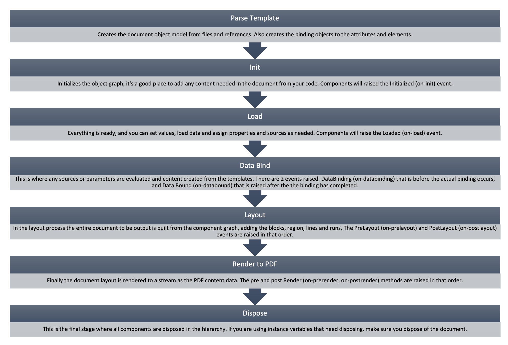

======================================
Lifecycle of a document creation
======================================

During the creation and output of a document, there are a number of stages that the processing goes through.

Wrapping it up
===============

Using the wrapper methods for `PDFDocument.ProcessDocument(output)` or the MVC `this.PDF(doc)` all
the stages will be automatically executed and the resulting content rendered to a stream.

It makes the output of a document simple and discreet.

.. code-block:: csharp

    using(var doc = PDFDocument.Parse(path))
    {
        doc.ProcessDocument(output);
    }

Initialize and Load
====================

The initialize and load method, `InitializeAndLoad()`, makes sure that the document components are ready.
It allows opportunity to set up the defaults, prepare for loading of resources, and perform any start up operation.

After initialization and loading external code should be able to interact and alter the propperties etc.

Data Binding
=============

The data binding stage is important for the creation of any content from a datasource. There is a flag on the 
document class (see :doc:`reference/pdf_document`) that defines whether databinding should automatically be done
during the lifecycle.

By default this is set to true, but if manual invocation of databinding is required, then it can be set to false
and databing can be invoked later.

Layout and Rendering
=====================

The output stage is rendering the content to a stream or file. This is where all the compoments are laid-out to 
their text runs, image binarty details, fonts and string measured etc.

And then finally they are written to the data stream (compressed and ordered).

Disposing
=========

It's a good idea to dispose of your document once created. Scryber itself does not use any unmanaged resources,
but other components or extensions build could allocate significant memory blocks, leading to a leak over time.

Manual Execution
================

.. code-block:: csharp

    using(var doc = PDFDocument.Parse(path))
    {
         //make any component changes needed

         doc.InitializeAndLoad();

         // between each of the stages

         doc.DataBind();

         // everything is all set to generate

         doc.RenderToPDF(output);
    }

Reuse of a document object
==========================

It is not recommended to load or create a documment and execute the rendering multiple times.
Because state and output information can be stored on the components themselves it may have
unpredictable output.

The parsing or creation of a document object is not usually the most exhaustive process.

