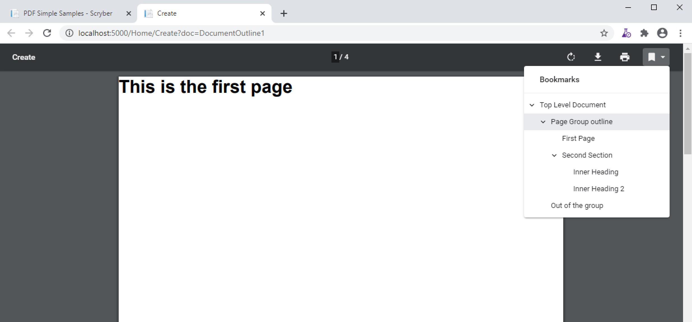
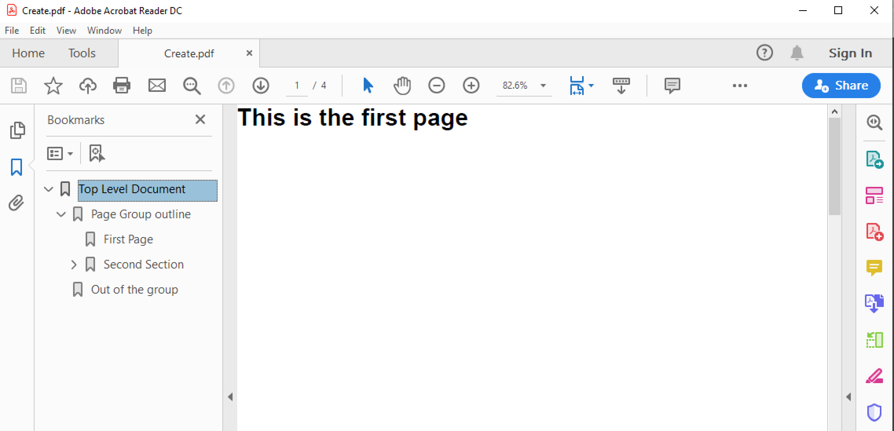

================================
Document outline (or bookmarks)
================================

Structing a document also allows for the outline. This is effectively a table of contents
available in PDF readers that support quick navigation of the whole document, to go to the 
section or content needed.

All container components have an Outline element, and a shorthand outline-title attribute, that will build into the hierarchy
of a document as it is output.

Simple Outline
===============

.. code-block:: xml

    <?xml version="1.0" encoding="utf-8" ?>
    <pdf:Document xmlns:pdf="http://www.scryber.co.uk/schemas/core/release/v1/Scryber.Components.xsd"
                xmlns:styles="http://www.scryber.co.uk/schemas/core/release/v1/Scryber.Styles.xsd"
                xmlns:data="http://www.scryber.co.uk/schemas/core/release/v1/Scryber.Data.xsd">
    <!-- Document outline -->
    <Outline title="Top Level Document" styles:open="true" />

    <Pages>

        <!-- inner outline item-->
        <pdf:PageGroup outline-title="Page Group outline" >
        <Pages>

            <pdf:Page outline-title="First Page">
            <Content>
                
                <pdf:H3 >This is the first page</pdf:H3>
            </Content>
            </pdf:Page>

            <pdf:Section outline-title="Second Section">
                <Content>
                    <pdf:H3>This is the second page</pdf:H3>
                    <pdf:PageBreak/>
                    <!-- outline title on a component -->
                    <pdf:H3 outline-title="Inner Heading">This is the third page</pdf:H3>
                    <pdf:Br/>
                    <pdf:Br/>
                    <pdf:Br/>
                    <pdf:Br/>
                    <pdf:H3 outline-title="Inner Heading 2">This is still the third page</pdf:H3>
                </Content>
            </pdf:Section>
            
        </Pages>
        
        </pdf:PageGroup>
        
        <pdf:Page outline-title="Out of the group">
            <Content>
                <pdf:H3 >This is after the group</pdf:H3>
            </Content>
        </pdf:Page>

    
    </Pages>
    
    </pdf:Document>

When output the viewer application or browser can show the content of the outline.
Selecting any of the bookmark items should navigate directly to the page the content is on.

Show or Hide the outline
========================

Styling the outline
===================

