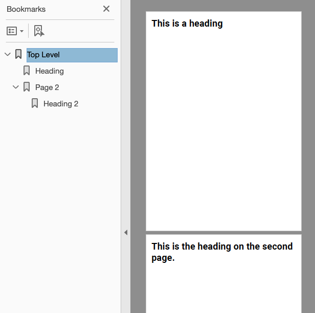

================================
Document outline (or bookmarks)
================================

Structing a document also allows for the outline. This is effectively a table of contents
available in PDF readers that support quick navigation of the whole document, to go to the 
section or content needed.

In Scryber the title attribute is converted to display as the outline of the document.
Nested content will be under any parent title.

Simple Outline
----------------

.. code-block:: xml

    <?xml version="1.0" encoding="utf-8" ?>
    <!DOCTYPE HTML>

    <html xmlns='http://www.w3.org/1999/xhtml' >
    <head>
        <link type="text/css" rel="stylesheet" href="https://fonts.googleapis.com/css2?family=Roboto:ital,wght@0,100;0,700;1,100&amp;display=swap" />
        
    </head>
    <body title="Top Level" style="padding:20pt;">
        

            <h1 title="Heading" >This is a heading</h1>
        

        <section title="Page 2" >
            <h1 title="Heading 2" >This is the heading on the second page.</h1>
        </section>
    </body>
    </html>

When output the reader application or browser can show the content of the outline.
Selecting any of the bookmark items should navigate directly to the page the content is on.

