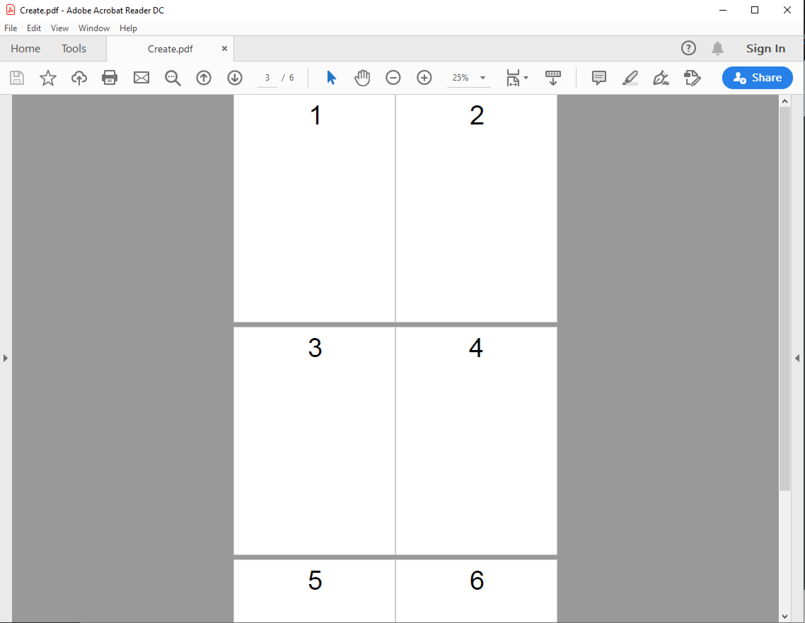
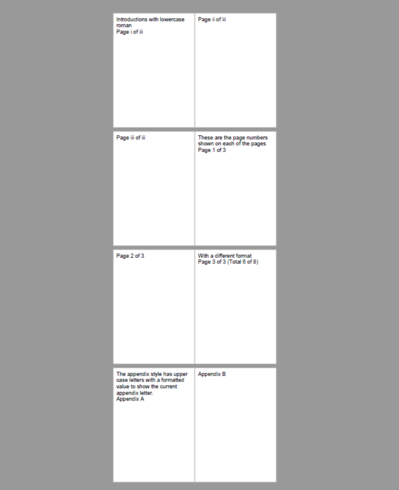
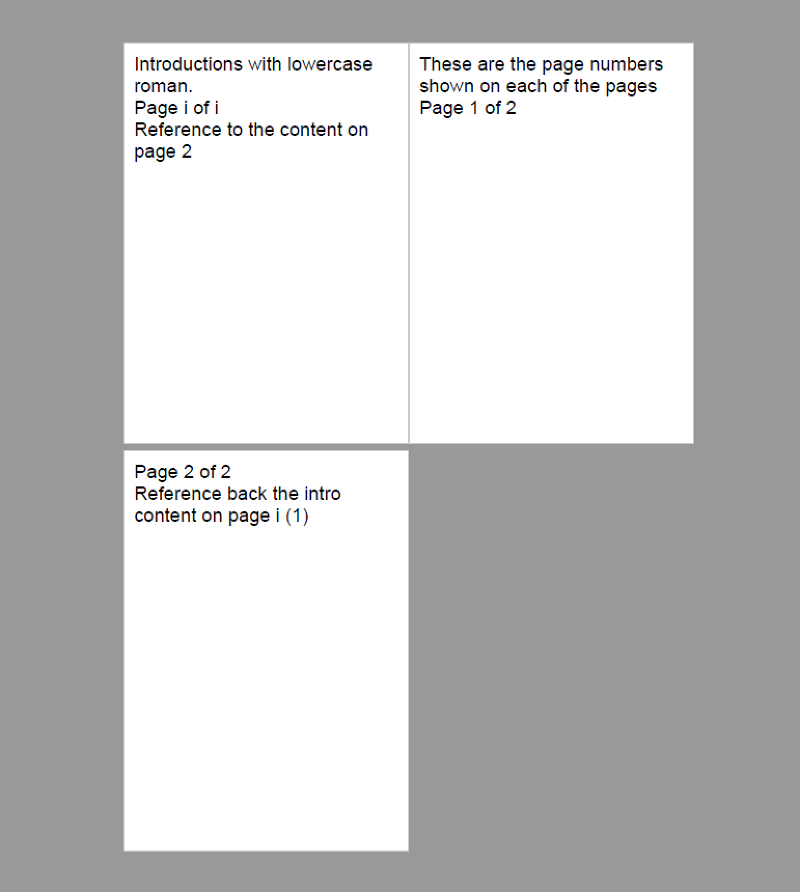

================================
Page numbering
================================

A documents pages starts by default at layout page 1 and increments by 1 for each subsequent layout page to the end of the document.
We can show the current page number by adding the :doc:`reference/pdf_pagenumber` on the page.

.. code-block:: xml

    <?xml version="1.0" encoding="utf-8" ?>

    <doc:Document xmlns:doc="http://www.scryber.co.uk/schemas/core/release/v1/Scryber.Components.xsd"
                xmlns:styles="http://www.scryber.co.uk/schemas/core/release/v1/Scryber.Styles.xsd"
                xmlns:data="http://www.scryber.co.uk/schemas/core/release/v1/Scryber.Data.xsd" >
    <Styles>
        <styles:Style applied-class="pg-num1" >
            <styles:Position h-align="Center"/>
            <styles:Padding all="20pt"/>
            <styles:Font size="100pt"/>
        </styles:Style>

    </Styles>
    
    <Pages>
        <doc:Page styles:class="pg-num1">
        <Content>
            <!-- Page 1 -->
            <doc:PageNumber />
        </Content>
        </doc:Page>

        <doc:Section styles:class="pg-num1">
        <Content>
            <!-- Page 2 -->
            <doc:PageNumber />
            <doc:PageBreak/>
            <!-- Page 3 -->
            <doc:PageNumber />
            <doc:PageBreak />
            <!-- Page 4 -->
            <doc:PageNumber />
        </Content>
        </doc:Section>

        <doc:Section styles:class="pg-num1">
        <Content>
            <!-- Page 5 -->
            <doc:PageNumber />
            <doc:PageBreak />
            <!-- Page 6 -->
            <doc:PageNumber />
        </Content>
        </doc:Section>
    </Pages>
    
    </doc:Document>

Page number style
=====================

There is always a global page numbering in all documents, and the default is decimal.

If we wanted our sections or pages to use a different numbering style, then we can specify it in the styles
or on the element itself.

Scryber supports the following numbering styles.

* Decimal - 1, 2, 3, 4, 5, etc.
* UppercaseRoman - I, II, III, IV, V, etc.
* LowercaseRoman - i, ii, iii, iv, v, etc.
* UppercaseLetters - A, B, C, D, E, etc.
* LowercaseLetters - a, b, c, d, e, etc.
* And None.

Page number index
==================

Along with the number styles, scryber also supports a start-index on a document or page.

Setting the start-index (page-number-start-index) will begin a new numbering group at that page, and increment from there within the group.
When the layout leaves the section or page group, the numbering will revert back to the previous values.

Page display format
====================

The display-format enables full control of the text of the page number output.

There are 4 values that can be set in a standard dotnet format string.

* {0} - The current page index within the group
* {1} - The total page count within the group
* {2} - The current global page index within the document.
* {3} - The global page count within the document.

The number styles will be automatically used with any format string.

.. code-block:: xml

    <?xml version='1.0' encoding='utf-8' ?>

    <doc:Document xmlns:doc='http://www.scryber.co.uk/schemas/core/release/v1/Scryber.Components.xsd'
                xmlns:styles='http://www.scryber.co.uk/schemas/core/release/v1/Scryber.Styles.xsd'
                xmlns:data='http://www.scryber.co.uk/schemas/core/release/v1/Scryber.Data.xsd' >
    <Styles>
        <styles:Style applied-class='pg-num' >
        <styles:Padding all='20pt'/>
        <styles:Font size='60pt' family='Helvetica'/>
        <styles:Page display-format='Page {0} of {1}'/>
        </styles:Style>

        <styles:Style applied-class='intro' >
        <styles:Page number-style='LowercaseRoman'/>
        </styles:Style>

        <styles:Style applied-class='appendix' >
        <styles:Page display-format='Appendix {0}'  number-style='UppercaseLetters' number-start-index='1' />
        </styles:Style>
    </Styles>
    
    <Pages>

        <doc:Section styles:class='pg-num intro'>
        <Content>
            <doc:Div>Introductions with lowercase roman</doc:Div>
            <!-- Page 1 -->
            <doc:PageNumber />
            <doc:PageBreak/>
            <!-- Page 2 -->
            <doc:PageNumber />
            <doc:PageBreak />
            <!-- Page 3 -->
            <doc:PageNumber />
        </Content>
        </doc:Section>

        <doc:Section styles:class='pg-num' styles:page-number-start-index='1' >
        <Content>
            <doc:Div>These are the page numbers shown on each of the pages</doc:Div>
            <!-- Page 1 -->
            <doc:PageNumber />
            <doc:PageBreak/>
            <!-- Page 2 -->
            <doc:PageNumber />
            <doc:PageBreak />
            <!-- Page 3 -->
            <doc:Div>With a different format</doc:Div>
            <doc:PageNumber id='ExplicitPageNum' styles:display-format='Page {0} of {1} (Total {2} of {3})' />
        </Content>
        </doc:Section>

        <doc:Section styles:class='pg-num appendix'>
        <Content>
            <doc:Div>The appendix style has upper case letters with a formatted value to show the current appendix letter.</doc:Div>
            <!-- Page 4 -->
            <doc:PageNumber />
            <doc:PageBreak />
            <!-- Page 5 -->
            <doc:PageNumber />
        </Content>
        </doc:Section>

    </Pages>
    
    </doc:Document>

Page count hints
================

During layout scryber has no ability to know the group or total page counts. However, it needs to layout the content 
in order to put everything on the page.

Often this is not an issue as page numbers tend to be isolated. However when mixed inline with other text it can cause a flow inconsistency.

As such scryber uses standard hint values for the total number of pages, and the number of pages in a group. During the 
layout phase (see: :doc:`document_lifecycle`) scryber will use 10 and 100 for the group and total page counts. as hints for layout.
These will be replaced at the end of layout, with the actual grouop and total values, for rendering.

To improve layout, it's possible to set the group-count-hint and total-count-hint in the Page styles so they will be used to improve the text flow.

Page of a different component
==============================

Providing the current page number using the `PageNumber` component is based around the current page. But it's also good to know the layout page a different 
component was placed on.

This is achieved by the `PageOf` component. You can identify the component to be referenced either by name or id.
Use the `#` prefix to reference via id.

The number style of the page being referenced will be used, and the display format can also be used. 
But formats set for the page will not be used.

.. code-block:: xml

    <?xml version='1.0' encoding='utf-8' ?>
    <doc:Document xmlns:doc='http://www.scryber.co.uk/schemas/core/release/v1/Scryber.Components.xsd'
                xmlns:styles='http://www.scryber.co.uk/schemas/core/release/v1/Scryber.Styles.xsd'
                xmlns:data='http://www.scryber.co.uk/schemas/core/release/v1/Scryber.Data.xsd' >
    <Styles>
        <styles:Style applied-class='pg-num' >
        <styles:Padding all='20pt'/>
        <styles:Font size='40pt' family='Helvetica'/>
        <styles:Page display-format='Page {0} of {1}' />
        </styles:Style>

        <styles:Style applied-class='intro' >
        <styles:Page number-style='LowercaseRoman'/>
        </styles:Style>

        <styles:Style applied-class='appendix' >
        <styles:Page display-format='Appendix {0}'  number-style='UppercaseLetters' number-start-index='1' />
        </styles:Style>
    </Styles>
    
    <Pages>

        <doc:Section name='IntroSection' styles:class='pg-num intro'>
            <Content>
                <doc:Div>Introductions with lowercase roman.</doc:Div>
                <!-- Page 1 -->
                <doc:PageNumber />
                <doc:Div >Reference to the content on page <doc:PageOf component='#Page2' /></doc:Div>
            </Content>
        </doc:Section>

        <doc:Section styles:class='pg-num' styles:page-number-start-index='1' >
            <Content>
                <doc:Div>These are the page numbers shown on each of the pages</doc:Div>
                <!-- Page 1 -->
                <doc:PageNumber id='Page1' />
                <doc:PageBreak/>
                <!-- Page 2 -->
                <doc:PageNumber id='Page2' />
                <doc:Div >
                    Reference back the intro content 
                    <doc:PageOf component='IntroSection' styles:display-format='on page {0} ({2})' ></doc:PageOf>
                </doc:Div>
            </Content>
        </doc:Section>

    </Pages>
    
    </doc:Document>

The page numbers can also be used nicely within :doc:`document_linking`

