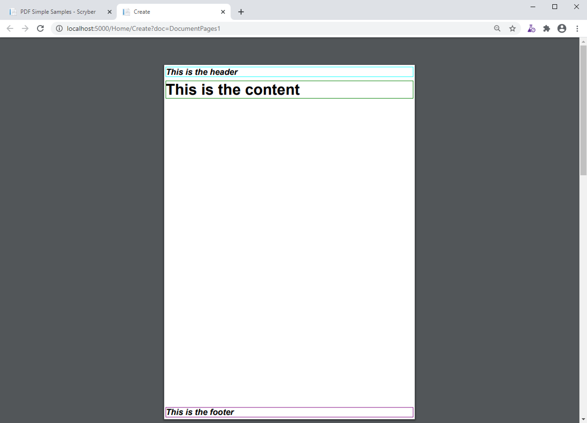
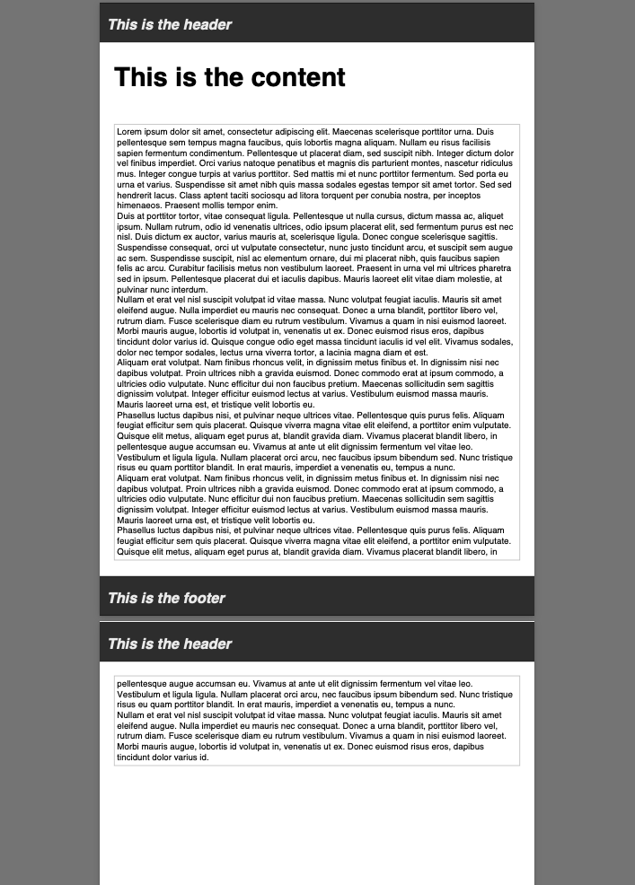
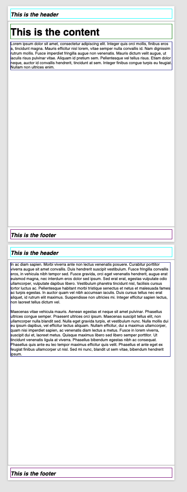
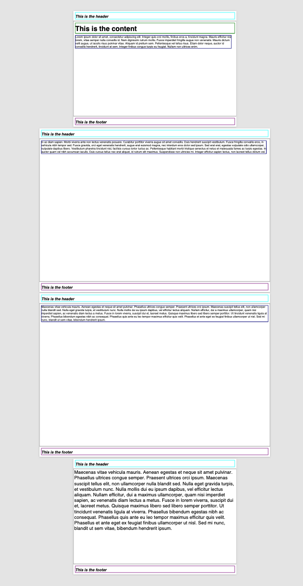
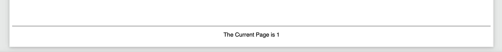
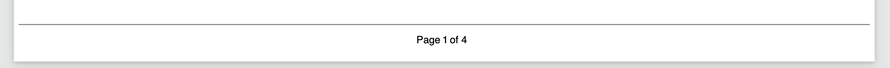
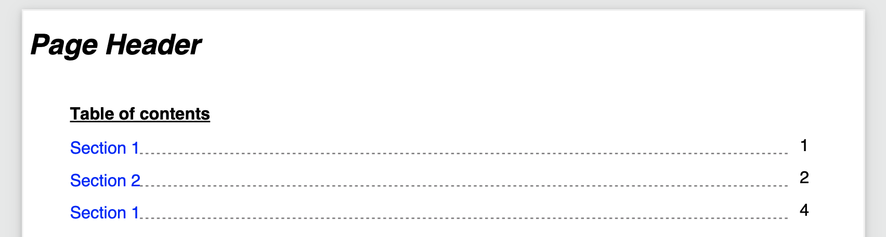

================================
Pages and Sections
================================

All the visual content in a document sits in pages. Scryber supports the use of both a single body with content within it, 
and also explicit flowing pages in a section.

The use of the page-break-before is set to 'always' on a section, but can, along with page-break-after, be set and supported on any component tag

The body has an optional header and footer that will be used on every page if set.

Scryber also supports the use of the @page rule to be able to change the size and orientation of each of the pages either as a whole, or within a section or tag.

The body and its content
--------------------------

A single page has a structure of optional elements

* header - Optional, but always sited at the top of a page
* Sited between the Header and Footer is any content to be included within the page.
* footer - Optional, but always sited at the bottom of a page

If a page has a header or footer the available space for the content will be reduced.

.. code-block:: html

    <?xml version="1.0" encoding="utf-8" ?>
    <html xmlns='http://www.w3.org/1999/xhtml' >
    <body>
        <header>
            <h4 style="margins:5pt; border-width:1pt; border-color:aqua" >This is the header</h4>
        </header>
        <h1 style='margins:5pt; border-width=1pt; border-color:green;" >This is the content</h1>
        <footer>
            <h4 styles="margins:5pt; border-width:1pt; border-color:purple" >This is the footer</h4>
        </footer>

    </body>
    
    </html>

Flowing Pages
---------------
If the size of the content is more than can fit on a page it will overflow onto another page. Repeating any header or footer.

.. code-block:: html

    <?xml version="1.0" encoding="utf-8" ?>
    <html xmlns='http://www.w3.org/1999/xhtml' >
        <body>
            <header>
                <h4 style='margin: 5pt; border-width: 1pt; border-color:aqua' >This is the header</h4>
            </header>
            <h1 style='margins: 5pt; border-width: 1pt; border-color: green;' >This is the content</h1>
            

                Lorem ipsum dolor sit amet, consectetur adipiscing elit. Integer quis orci mollis, finibus eros a, 
                tincidunt magna. Mauris efficitur nisl lorem, vitae semper nulla convallis id. Nam dignissim rutrum 
                mollis. Fusce imperdiet fringilla augue non venenatis. Mauris dictum velit augue, ut iaculis risus 
                pulvinar vitae. Aliquam id pretium sem. Pellentesque vel tellus risus. Etiam dolor neque, auctor id 
                convallis hendrerit, tincidunt at sem. Integer finibus congue turpis eu feugiat. Nullam non ultrices enim.<doc:Br/>
                <doc:Br/>
                <!-- Truncated for brevity 
                .
                . -->
                Phasellus ultrices congue semper. Praesent ultrices orci ipsum. Maecenas suscipit tellus elit,
                non ullamcorper nulla blandit sed. Nulla eget gravida turpis, et vestibulum nunc. Nulla mollis
                dui eu ipsum dapibus, vel efficitur lectus aliquam. Nullam efficitur, dui a maximus ullamcorper,
                quam nisi imperdiet sapien, ac venenatis diam lectus a metus. Fusce in lorem viverra, suscipit
                dui et, laoreet metus. Quisque maximus libero sed libero semper porttitor. Ut tincidunt venenatis
                ligula at viverra. Phasellus bibendum egestas nibh ac consequat. Phasellus quis ante eu leo tempor
                maximus efficitur quis velit. Phasellus et ante eget ex feugiat finibus ullamcorper ut nisl. Sed mi
                nunc, blandit ut sem vitae, bibendum hendrerit ipsum.<doc:Br/>
            

            <footer>
                <h4 styles="margin:5pt; border-width: 1pt; border-color: purple;" >This is the footer</h4>
            </footer>
        </body>
    
    </html>

Here we can see that the content flows naturally onto the next page, including the padding and borders.
And the header and footer are shown on the second page.

Page breaks
-------------

When using a section it will by default force a break in the pages using the before the component. 

This can can be stopped by applying the css attribute for page-break-before='avoid' value,
and a page break can be applied to any element using the page-break-before (or page-break-after) attribute set to 'always'.

Margins, padding and depth should be preserved during the page break.

.. code-block:: html

    <?xml version="1.0" encoding="utf-8" ?>
    <html xmlns='http://www.w3.org/1999/xhtml' >
        <body style='border:solid 1px gray;padding:5pt;'>
            <header>
                <h4 style='margin: 5pt; border-width: 1pt; border-color:aqua' >This is the header</h4>
            </header>
            <h1 style='margin: 5pt; border-width: 1pt; border-color: green;' >This is the content</h1>
            <!-- Set a section to not break on the first page -->
            <section style="page-break-before: avoid; margin:5pt; font-size: 14pt; border-width: 1pt; border-color: navy;">
                Lorem ipsum dolor sit amet, consectetur adipiscing elit. Integer quis orci mollis, finibus eros a, 
                tincidunt magna. Mauris efficitur nisl lorem, vitae semper nulla convallis id. Nam dignissim rutrum 
                mollis. Fusce imperdiet fringilla augue non venenatis. Mauris dictum velit augue, ut iaculis risus 
                pulvinar vitae. Aliquam id pretium sem. Pellentesque vel tellus risus. Etiam dolor neque, auctor id 
                convallis hendrerit, tincidunt at sem. Integer finibus congue turpis eu feugiat. Nullam non ultrices enim.
            </section>
            <!-- By default this will start on a new page -->
            <section style="margin:5pt; font-size: 14pt; border-width: 1pt; border-color: navy;">
                <!-- Truncated for brevity 
                .
                . -->
                Phasellus ultrices congue semper. Praesent ultrices orci ipsum. Maecenas suscipit tellus elit,
                non ullamcorper nulla blandit sed. Nulla eget gravida turpis, et vestibulum nunc. Nulla mollis
                dui eu ipsum dapibus, vel efficitur lectus aliquam. Nullam efficitur, dui a maximus ullamcorper,
                quam nisi imperdiet sapien, ac venenatis diam lectus a metus. Fusce in lorem viverra, suscipit
                dui et, laoreet metus. Quisque maximus libero sed libero semper porttitor. Ut tincidunt venenatis
                ligula at viverra. Phasellus bibendum egestas nibh ac consequat. Phasellus quis ante eu leo tempor
                maximus efficitur quis velit. Phasellus et ante eget ex feugiat finibus ullamcorper ut nisl. Sed mi
                nunc, blandit ut sem vitae, bibendum hendrerit ipsum.<doc:Br/>
            

            <footer>
                <h4 styles="margin:5pt; border-width: 1pt; border-color: purple;" >This is the footer</h4>
            </footer>
        </body>
    
    </html>

Page size and orientation
-------------------------

When outputting a page the default paper size is ISO A4 Portrait (210mm x 29.7mm), however Scryber supports setting the paper size 
either on the section or via styles to the standard ISO or Imperial page sizes, in landscape or portrait.

* ISO 216 Standard Paper sizes
    * `A0 to A9 <https://papersizes.io/a/>`_
    * `B0 to B9 <https://papersizes.io/b/>`_
    * `C0 to C9 <https://papersizes.io/c/>`_
* Imperial Paper Sizes
    * Quarto, Foolscap, Executive, GovermentLetter, Letter, Legal, Tabloid, Post, Crown, LargePost, Demy, Medium, Royal, Elephant, DoubleDemy, QuadDemy, Statement,

The body or a section can only be 1 size of paper, but different sections (or page breaks) can be different pages and can have different sizes.

.. code-block:: html

    <?xml version="1.0" encoding="utf-8" ?>
    <html xmlns='http://www.w3.org/1999/xhtml'>
    <head>
        
    </head>
    <body style='border:solid 1px gray;padding:5pt;'>
        <header>
            <h4 style='margin: 5pt; border-width: 1pt; border-color:aqua'>This is the header</h4>
        </header>
        <h1 style='margin:5pt; border-width: 1pt; border-color: green;'>This is the content</h1>
        <!-- Set a section to not break on the first page -->
        <section style="page-break-before: avoid; margin:5pt; font-size: 14pt; border-width: 1pt; border-color: navy;">
            Lorem ipsum dolor sit amet, consectetur adipiscing elit. Integer quis orci mollis, finibus eros a,
            .....
        </section>
        <!-- By default this will start on a new page with A3 size -->
        <section style="page:large; margin:5pt; font-size: 14pt; border-width: 1pt; border-color: navy;">
            In ac diam sapien. Morbi viverra ante non lectus venenatis posuere. Curabitur porttitor viverra augue
            sit amet convallis. Duis hendrerit suscipit vestibulum. Fusce fringilla convallis eros, in vehicula
            .....
            Integer efficitur sapien lectus, non laoreet tellus dictum vel. 
            <!-- Introducing an inner page break that follow the same A3 size -->
            

                Maecenas vitae vehicula mauris. Aenean egestas et neque sit amet pulvinar.
                Phasellus ultrices congue semper. Praesent ultrices orci ipsum. Maecenas suscipit tellus elit,
                .....
            

        </section>
        <!-- Outside of the large page section use page: auto to revert to the default size -->
        

            Maecenas vitae vehicula mauris. Aenean egestas et neque sit amet pulvinar.
            Phasellus ultrices congue semper. Praesent ultrices orci ipsum. Maecenas suscipit tellus elit,
            .....
        

        <footer>
            <h4 style="margin:5pt; border-width: 1pt; border-color: purple;">This is the footer</h4>
        </footer>
    </body>

    </html>

Page numbering
---------------

Putting numbers in pages is often a requirement, but honestly we have never liked the CSS approach.

At scryber we have taken a slightly more declarative approach with the 'page' tag. Browsers do not understand this tag, and will ignore it.
The scryber engine will understand and output the current page number

.. code-block:: html

    <footer>
        
 The Current Page is <page />

    </footer>

We can add our explicit styles to this, so the content of the footer will not be shown by browsers
But will display nicely on the document.

.. code-block:: css

    .print-only{ display:none;}

    @media print{

        .print-only{ display: block; }

        .foot{
            border-top: solid 1pt gray;
            padding: 10pt;
            text-align:center;
            font: 10pt sans-serif;
            margin: 5pt;
        }
    }

And our page footer will display as expected.

The page tag also supports the property attribute for displying the 'total' number of pages, and also the current 'section' or 'sectiontotal' page count.

.. code-block:: html

    <footer>
        
 Page <page /> of <page propery='total' />

    </footer>

The page for
-------------

Conversly to the current page number, it is also possible to get the page number of another element.
By using the 'for' attribute.

The example below is a table of contents with links to sections based on their 
ID and a line leading to the page numbers on the right cell.

.. code-block:: html

    <table class="toc" style="margin:20pt; width:100%;">
        <thead>
            <tr>
                <td colspan="2">Table of contents</td>
            </tr>
        </thead>
        <tbody>
            <tr>
                <td><a href="#section1">Section 1</a>
</td>
                <td class="pg-num"><page for="#section1" /></td>
            </tr>
            <tr>
                <td><a href="#section2">Section 2</a>
</td>
                <td class="pg-num"><page for="#section2" /></td>
            </tr>
            <tr>
                <td><a href="#section3">Section 1</a>
</td>
                <td class="pg-num"><page for="#section3" /></td>
            </tr>
        </tbody>
    </table>

The is a bit of css fun going on to achieve this..

.. code-block:: css

        table.toc{
            font-size:12pt;
            margin-left:30pt;
        }

        table.toc thead{
            font-weight:bold;
            text-decoration:underline;
        }

        table.toc a{
            text-decoration:none;
        }

        table.toc hr{
            display:inline;
            margin-top:12pt;
            stroke: gray;
            stroke-dasharray: 2;
        }

        table.toc td{
            border:none;
        }

        table.toc td.pg-num {
            width:30pt;
        }

But the output is quite pleasing. And you could use databinding to achieve this.

