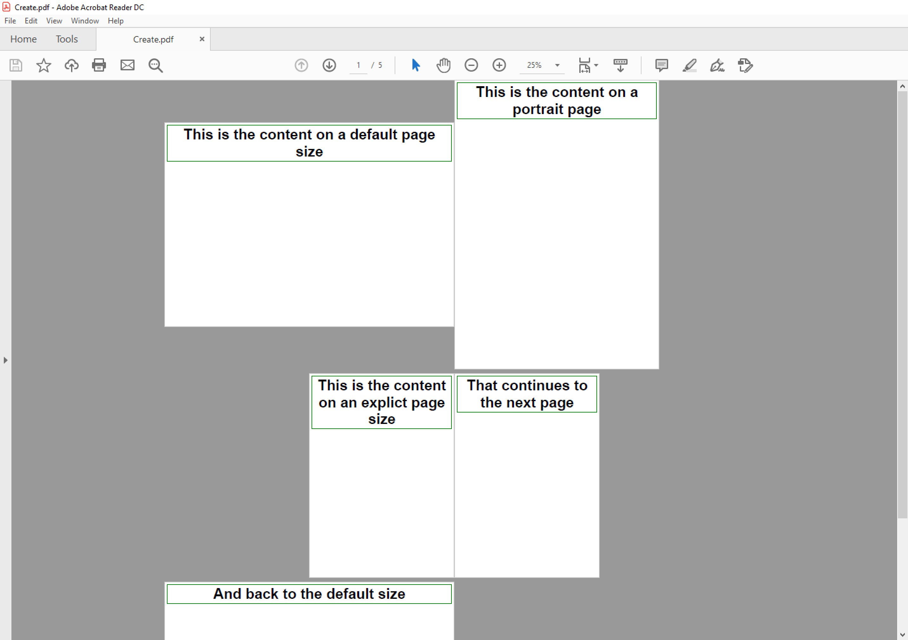

================================
Pages and Sections
================================

All the visual content in a document sit's in pages. Scryber supports the use of both a single :doc:`reference/pdf_page` with content within it.
And mutliple flowing pages in a :doc:`reference/pdf_section`.

A Page and its content
======================

A single page has a structure of optional elements

* Header - Optional, but always sited at the top of a page
* Content - Sited between the Header and Footer.
* Footer - Optional, but always sited at the bottom of a page

If a page has a header or footer the available space for the content will be reduced.

.. code-block:: xml

    <?xml version="1.0" encoding="utf-8" ?>
    <doc:Document xmlns:doc="http://www.scryber.co.uk/schemas/core/release/v1/Scryber.Components.xsd"
                xmlns:styles="http://www.scryber.co.uk/schemas/core/release/v1/Scryber.Styles.xsd"
                xmlns:data="http://www.scryber.co.uk/schemas/core/release/v1/Scryber.Data.xsd" >
    <Pages>
        <doc:Page >
            <Header>
                <doc:H4 styles:margins="5pt" styles:border-width="1pt" styles:border-color="aqua" >This is the header</doc:H4>
            </Header>
            <Content>
                <doc:H1 styles:margins="5pt" styles:border-width="1pt" styles:border-color="green" >This is the content</doc:H1>
            </Content>
            <Footer>
                <doc:H4 styles:margins="5pt" styles:border-width="1pt" styles:border-color="purple" >This is the footer</doc:H4>
            </Footer>
        </doc:Page>
    </Pages>
    
    </doc:Document>

.. image:: images/documentpages1.png

If the size of the content is more than can fit on a page it will be truncated.

.. code-block:: xml

    <?xml version="1.0" encoding="utf-8" ?>
    <doc:Document xmlns:doc="http://www.scryber.co.uk/schemas/core/release/v1/Scryber.Components.xsd"
                xmlns:styles="http://www.scryber.co.uk/schemas/core/release/v1/Scryber.Styles.xsd"
                xmlns:data="http://www.scryber.co.uk/schemas/core/release/v1/Scryber.Data.xsd" >
    <Pages>
        <doc:Page>
            <Header>
                <doc:H4 styles:margins="5pt" styles:border-width="1pt" styles:border-color="aqua" >This is the header</doc:H4>
            </Header>
            <Content>
                <doc:H1 styles:margins="5pt" styles:border-width="1pt" styles:border-color="green" >This is the content</doc:H1>
                <doc:Div styles:margins="5pt" styles:font-size="14pt" styles:border-width="1pt" styles:border-color="navy">
                Lorem ipsum dolor sit amet, consectetur adipiscing elit. Integer quis orci mollis, finibus eros a, 
                tincidunt magna. Mauris efficitur nisl lorem, vitae semper nulla convallis id. Nam dignissim rutrum 
                mollis. Fusce imperdiet fringilla augue non venenatis. Mauris dictum velit augue, ut iaculis risus 
                pulvinar vitae. Aliquam id pretium sem. Pellentesque vel tellus risus. Etiam dolor neque, auctor id 
                convallis hendrerit, tincidunt at sem. Integer finibus congue turpis eu feugiat. Nullam non ultrices enim.<doc:Br/>
                <doc:Br/>
                <!-- Truncated for brevity 
                .
                . -->
                Phasellus ultrices congue semper. Praesent ultrices orci ipsum. Maecenas suscipit tellus elit,
                non ullamcorper nulla blandit sed. Nulla eget gravida turpis, et vestibulum nunc. Nulla mollis
                dui eu ipsum dapibus, vel efficitur lectus aliquam. Nullam efficitur, dui a maximus ullamcorper,
                quam nisi imperdiet sapien, ac venenatis diam lectus a metus. Fusce in lorem viverra, suscipit
                dui et, laoreet metus. Quisque maximus libero sed libero semper porttitor. Ut tincidunt venenatis
                ligula at viverra. Phasellus bibendum egestas nibh ac consequat. Phasellus quis ante eu leo tempor
                maximus efficitur quis velit. Phasellus et ante eget ex feugiat finibus ullamcorper ut nisl. Sed mi
                nunc, blandit ut sem vitae, bibendum hendrerit ipsum.<doc:Br/>
            </doc:Div>
            </Content>
            <Footer>
                <doc:H4 styles:margins="5pt" styles:border-width="1pt" styles:border-color="purple" >This is the footer</doc:H4>
            </Footer>
        </doc:Page>
    </Pages>
    
    </doc:Document>

.. image:: images/documentpages2.png

Sections and continuation
=========================

A section differs from a page in 2 ways. Firstly the default style has an overflow action of NewPage (rather than Truncate), 
and it also has allows for a definition of a continuation header and footer.

If defined, then the continuation headers and footers will be shown on the following pages, after the first.
If not defined, then the main page headers and footers will be shown.

So if we change our `doc:Page` element to a `doc:Section` we can add a continuation header and flow onto multiple pages.

.. code-block:: xml

    <?xml version="1.0" encoding="utf-8" ?>
    <doc:Document xmlns:doc="http://www.scryber.co.uk/schemas/core/release/v1/Scryber.Components.xsd"
                xmlns:styles="http://www.scryber.co.uk/schemas/core/release/v1/Scryber.Styles.xsd"
                xmlns:data="http://www.scryber.co.uk/schemas/core/release/v1/Scryber.Data.xsd" >
    <Pages>
        <doc:Section>
            <Header>
                <doc:H4 styles:margins="5pt" styles:border-width="1pt" styles:border-color="aqua" >This is the header</doc:H4>
            </Header>
            <Continuation-Header>
                <doc:H4 styles:margins="5pt" styles:border-width="1pt" styles:border-color="fuschia" >This is the continuation header</doc:H4>
            </Continuation-Header>
            <Content>
                <doc:H1 styles:margins="5pt" styles:border-width="1pt" styles:border-color="green" >This is the content</doc:H1>
                <doc:Div styles:margins="5pt" styles:font-size="14pt" styles:border-width="1pt" styles:border-color="navy">
                Lorem ipsum dolor sit amet, consectetur adipiscing elit. Integer quis orci mollis, finibus eros a, 
                tincidunt magna. Mauris efficitur nisl lorem, vitae semper nulla convallis id. Nam dignissim rutrum 
                mollis. Fusce imperdiet fringilla augue non venenatis. Mauris dictum velit augue, ut iaculis risus 
                pulvinar vitae. Aliquam id pretium sem. Pellentesque vel tellus risus. Etiam dolor neque, auctor id 
                convallis hendrerit, tincidunt at sem. Integer finibus congue turpis eu feugiat. Nullam non ultrices enim.<doc:Br/>
                <doc:Br/>
                <!-- Truncated for brevity 
                .
                . -->
                Phasellus ultrices congue semper. Praesent ultrices orci ipsum. Maecenas suscipit tellus elit,
                non ullamcorper nulla blandit sed. Nulla eget gravida turpis, et vestibulum nunc. Nulla mollis
                dui eu ipsum dapibus, vel efficitur lectus aliquam. Nullam efficitur, dui a maximus ullamcorper,
                quam nisi imperdiet sapien, ac venenatis diam lectus a metus. Fusce in lorem viverra, suscipit
                dui et, laoreet metus. Quisque maximus libero sed libero semper porttitor. Ut tincidunt venenatis
                ligula at viverra. Phasellus bibendum egestas nibh ac consequat. Phasellus quis ante eu leo tempor
                maximus efficitur quis velit. Phasellus et ante eget ex feugiat finibus ullamcorper ut nisl. Sed mi
                nunc, blandit ut sem vitae, bibendum hendrerit ipsum.<doc:Br/>
            </doc:Div>
            </Content>
            <Footer>
                <doc:H4 styles:margins="5pt" styles:border-width="1pt" styles:border-color="purple" >This is the footer</doc:H4>
            </Footer>
        </doc:Section>
    </Pages>
    
    </doc:Document>

Here we can see that the content flows naturally onto the next page, including the padding and borders.
And the continuation header is shown on the second page.

The footer is consistent throughout, so shows on both output pages.

.. image:: images/documentpages3.png

Page breaks
============

When using an overflowing section it's possible to explicitly force a break in the pages using the
`doc:PageBreak` component. This can appear within any block, and will force all the other parent components to stop
their layout on the current layout page, and move to the next layout page. Borders, margins and padding will (should) be preserved.

As with other components, it is also possible to bind the visibility of a page break too. If it's visible then the break will occur if not then the\
content will flow as normal.

see `Page size and orientation`_ below for an example of using a page break.

Page size and orientation
==========================

When outputting a page the default paper size is ISO A4 Portrait (210mm x 29.7mm), however Scryber supports setting the paper size 
either on the page or via styles to the standard ISO or Imperial page sizes, in landscape or portrait, or even a custom size.

* ISO 216 Standard Paper sizes
    * `A0 to A9 <https://papersizes.io/a/>`_
    * `B0 to B9 <https://papersizes.io/b/>`_
    * `C0 to C9 <https://papersizes.io/c/>`_
* Imperial Paper Sizes
    * Quarto, Foolscap, Executive, GovermentLetter, Letter, Legal, Tabloid, Post, Crown, LargePost, Demy, Medium, Royal, Elephant, DoubleDemy, QuadDemy, Statement,

A section can only be 1 size of paper, but different sections and different pages can have different sizes.

.. code-block:: xml

    <?xml version="1.0" encoding="utf-8" ?>
    <doc:Document xmlns:doc="http://www.scryber.co.uk/schemas/core/release/v1/Scryber.Components.xsd"
                xmlns:styles="http://www.scryber.co.uk/schemas/core/release/v1/Scryber.Styles.xsd"
                xmlns:data="http://www.scryber.co.uk/schemas/core/release/v1/Scryber.Data.xsd" >
    <Styles>
        
        <!-- changing the default page size to A3 Landscape -->
        <styles:Style applied-type="doc:Page" >
        <styles:Page size="A3" orientation="Landscape"/>
        </styles:Style>

        <!-- a style for portrait pages-->
        <styles:Style applied-class="long" >
        <styles:Page orientation="Portrait"/>
        </styles:Style>

        <!-- set up the default style for a heading 1-->
        <styles:Style applied-type="doc:H1" >
        <styles:Border color="green" width="2"/>
        <styles:Padding all="5pt"/>
        <styles:Margins all="10pt"/>
        <styles:Font size="60pt"/>
        <styles:Position h-align="Center"/>
        </styles:Style>
    </Styles>
    
    <Pages>
        <doc:Page>
        <Content>
            <doc:H1>This is the content on a default page size</doc:H1>
        </Content>
        </doc:Page>

        <doc:Page styles:class="long">
        <Content>
            <doc:H1>This is the content on a portrait page</doc:H1>
        </Content>
        </doc:Page>

        <doc:Section styles:class="long" styles:paper-size="A4">
        <Content>
            <doc:H1>This is the content on an explict page size</doc:H1>
            <!-- Force a break in the page -->
            <doc:PageBreak/>
            <doc:H1 >That continues to the next page</doc:H1>
        </Content>
        </doc:Section>

        <doc:Section>
        <Content>
            <doc:H1>And back to the default size</doc:H1>
        </Content>
        </doc:Section>
    </Pages>
    
    </doc:Document>

Page Groups
============

The `doc:PageGroup` allows for consistency across a set of pages. They will pass styles, page numbers, parameters, headers etc. 
down to any pages within the group.

.. code-block:: xml

    <?xml version="1.0" encoding="utf-8" ?>

    <doc:Document xmlns:doc="http://www.scryber.co.uk/schemas/core/release/v1/Scryber.Components.xsd"
                xmlns:styles="http://www.scryber.co.uk/schemas/core/release/v1/Scryber.Styles.xsd"
                xmlns:data="http://www.scryber.co.uk/schemas/core/release/v1/Scryber.Data.xsd" >
    <Styles>

        <!-- set up the default style for the header -->
        <styles:Style applied-type="doc:Div" applied-class="header" >
            <styles:Border color="aqua" width="2" sides="Bottom"/>
            <styles:Padding all="5pt"/>
            <styles:Margins all="10pt"/>
            <styles:Font size="12pt"/>
            <styles:Position h-align="Center"/>
        </styles:Style>

        <!-- a page numbering style for the page groups -->
        <styles:Style applied-type="doc:PageGroup" >
            <styles:Page number-prefix="Page #" number-style="Decimals"/>
        </styles:Style>
    </Styles>
    
    <Pages>

        <doc:PageGroup>
            <Params>
                <!-- Set parameters, just for this group -->
                <doc:String-Param id="sectTitle" value="Page Group Definitions" ></doc:String-Param>
            </Params>
            <!-- consistent header across the pages in this group (split into 3 columns -->
            <Header>
                <doc:Div styles:class="header" styles:column-count="3" >
                    <doc:Label text="{@:sectTitle}" />
                    <doc:ColumnBreak/>
                    <doc:PageNumber />
                    <doc:ColumnBreak/>
                    <doc:Date styles:date-format="dd MMMM yyyy" />
                </doc:Div>
            </Header>

            <Pages>

                <doc:Page>
                <Content>
                    <doc:H3 >This is the first page</doc:H3>
                </Content>
                </doc:Page>

                <doc:Section>
                <Content>
                    <doc:H3>This is the second page</doc:H3>
                    <doc:PageBreak/>
                    <doc:H3>This is the third page</doc:H3>
                </Content>
                </doc:Section>
                
            </Pages>
        </doc:PageGroup>
        
        <doc:Page>
            <Content>
                <doc:H3 >This is after the group</doc:H3>
            </Content>
        </doc:Page>
    
    </Pages>
    
    </doc:Document>

By applying a header at the group level, we can be sure that it is repeated across all pages.

.. image:: images/documentpagegroups.png

Page numbering
==============

In the previous example we saw use of the :doc:`reference/pdf_pagenumber` component to display the current page number on a page.
The actual numbering is held at a document level, but can be altered for each group, section or individual page.

See :doc:`document_pagenumbers` for a complete example.

