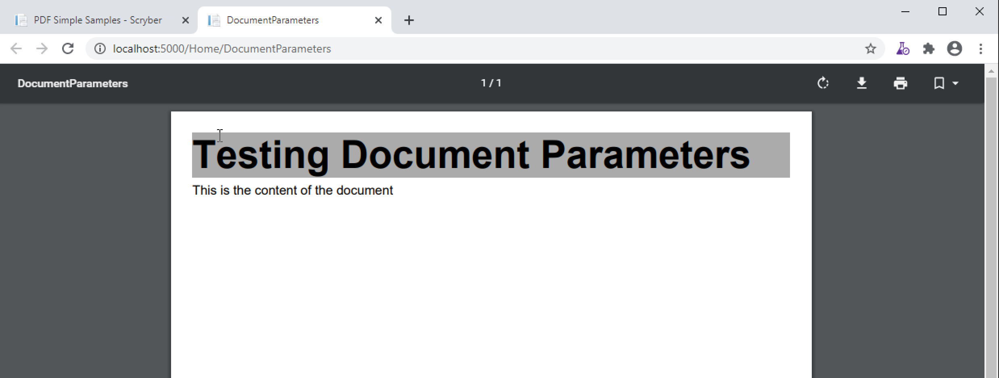
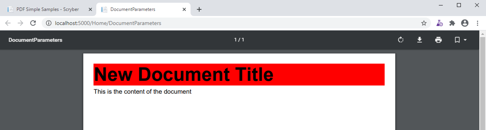

================================
A Scryber Document parameters
================================

The document parameters are values that can be set within the template or in code.
They are able to hold values used through out the generation process (see :doc:`document_lifecycle`) and are passed via the Context to any event handlers.

Declaring and Using in Documents
================================

Document parameters are declared within the `<Params>` element of 
Declaring a parameter in a document is not required for it to be used later on, but is best practice.
It is more readable and supports default values if they do not change.

When referring to a parameter within your document template use the @: binding syntax (or item: syntax) e.g. `{@:MyParamName}`
Then the parser finds a binding reference with this syntax it will create a binding expression that will be evaulated in the :doc:`document_lifecycle` Databinding phase 
and the value applied to the property it was set on.

.. code-block:: xml

    <?xml version="1.0" encoding="utf-8" ?>
    <pdf:Document xmlns:pdf="http://www.scryber.co.uk/schemas/core/release/v1/Scryber.Components.xsd"
                xmlns:styles="http://www.scryber.co.uk/schemas/core/release/v1/Scryber.Styles.xsd" >
        <Params>
            <!-- Declare the parameters -->
            <pdf:Bool-Param id="ShowTitle" value="true" />
            <pdf:String-Param id="MyTitle" value="Document Title" />
            <pdf:Color-Param id="TitleBg" value="#AAAAAA" />
        </Params>
        
        <Pages>
            <!-- Use the 'MyTitle' parameter for the outline. -->
            <pdf:Page outline-title="{@:MyTitle}" styles:margins="20pt" styles:font-size="12pt">
            <Content>
                <!-- And use it as the text on the heading -->
                <pdf:H1 visible="{@:ShowTitle}" styles:bg-color="{@:TitleBg}"  text="{@:MyTitle}" > </pdf:H1>
                <pdf:Para >This is the content of the document</pdf:Para>
            </Content>
            </pdf:Page>
        </Pages>
    
    </pdf:Document>

Generating this document the parameter values are applied to the final output and rendered.

.. code-block:: csharp

    [HttpGet]
    public IActionResult DocumentParameters()
    {
        var path = _rootPath;
        path = System.IO.Path.Combine(path,"Views", "PDF", "DocumentParameters.pdfx");
        var doc = PDFDocument.ParseDocument(path);

        return this.PDF(doc);
    }

And this then output as follows

Changing the values
===================

Parameters are evaluated during the data binding stage of a document creation, so once bound, any changes to the parameters will not be evaluated.
The best time to change the values of a parameters are once it has been parsed, or on the loaded event.

.. code-block:: csharp

    [HttpGet]
    public IActionResult DocumentParameters()
    {
        var path = _rootPath;
        path = System.IO.Path.Combine(path,"Views", "PDF", "DocumentParameters.pdfx");
        var doc = PDFDocument.ParseDocument(path);

        doc.Params["MyTitle"] = "New Document Title";
        doc.Params["TitleBg"] = new PDFColor(255,0,0);

        return this.PDF(doc);
    }

Generating the file will then apply the vaules at binding time to the content and rendering will produce the following output.

It is perfectly acceptable to assign a parameter in the document that is not declared, nor does it have to be typed.

e.g.

.. code-block:: csharp

    [HttpGet]
    public IActionResult DocumentParameters()
    {
        var path = _rootPath;
        path = System.IO.Path.Combine(path,"Views", "PDF", "DocumentParameters.pdfx");
        var doc = PDFDocument.ParseDocument(path);

        doc.Params["MyTitle"] = "New Document Title";
        doc.Params["TitleBg"] = new PDFColor(255,0,0);
        //Undeclared parameter
        doc.Params["Size"] = (PDFUnit)30;
        return this.PDF(doc);
    }

And the used in your template

.. code-block:: xml

    <pdf:H1 visible="{@:ShowTitle}" styles:font-size="{@:Size}" styles:bg-color="{@:TitleBg}"  text="{@:MyTitle}" > </pdf:H1>

But it will not be co-erced into the correct type, nor will it have a clear initial value.

Simple Parameter Types
======================

Scryber is strongly typed. The xml templates are defined as classes in namespaces and assemblies, and so are the **parameter** declarations.

There are a range of types available, and options for using complex types (see below).

* String-Param: Any string value, the default if not set is null.
* Int-Param: Single integer value, the defult if not set is 0.
* Guid-Param: A GUID value, the default is an empty guid.
* Double-Param: Holds double values, the default is 0.0
* Bool-Param: Boolean (True, False) values, the default is false.
* Date-Param: Date and time values, the default is minimum date time and values are culture sensitive.
* Unit-Param: Holds a :doc:`reference/pdf_unit` value, see :doc:`component_positioning` for more info. The default is empty (zero) unit.
* Color-Param: Holds a :doc:`reference/pdf_color` value, the default is transparent.
* Thickness-Param: Holds a :doc:`reference/pdf_thickness` value (used in padding, margins, clipping etc.). The default is empty (zero) thickness.
* Enum-Param: Has a specific `type` attribute that specifies the type of enum that should be stored. The default is null.

There are 3 other parameter types available XML, Template and Object which are discussed later on in this document.

Complex Object Parameters
=========================

Where can parameters be referenced?
===================================

The MVC model
=============

Binding Styles to Parameters
============================

Passing to References
=====================

XML and Template parameters
===========================

Combining selector paths
========================

Both the object and xpath selectors support complex notation for retrieving values.

* {@:*dotnotation*} for binding to a paramter passed to the document. This supports complex paths
    * {@:ParamName} for the direct value.
    * {@:ParamName.Property} for getting a property value.
    * {@:ParamName[n]} for getting the n'th value from an array
    * {@:ParamName['key']} for geting a dictionary value based on key.
    * The statements can be chained together as long as needed.
* {xpath:*selector*} for binding to xml content.
    * {xpath://root} for the root element
    * {xpath:element/@attribute} for inner selection
    * {xpath:../parentsibling} for traversing back up the tree
    * {xpath:concat('prefix ',selector)} for using the xpath functions.

Object Types
============

Scryber is strongly typed. And the object notation enforces this too. There are various types of parameter, and the object selectors 
also rely on the type being set, to be the same as the value assigned.

