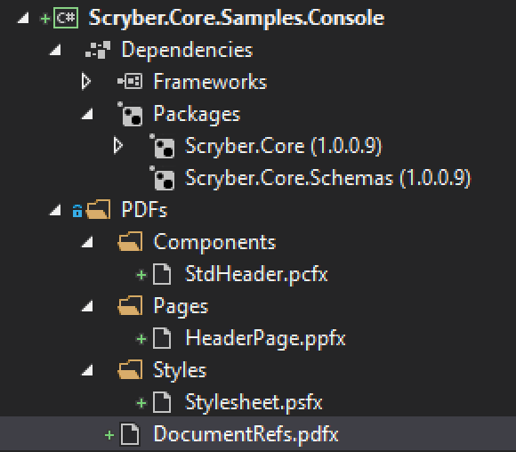

==============================================
Splitting into multiple files
==============================================

For large documents or projects, it's often easier to split your templates into multiple files.
These can be separate stylesheets, pages, components and the top level document.

As a converions the files should have the following extensions.

* Documents - [MyDocument].pdfx
* Stylesheets - [MyStyles].psfx
* Pages - [MyPage].ppfx
* Components - [MyComponent].pcfx

It just makes life easier.

4 file example
==============

As an example we can split a single document into 4 files.
Here we will take the top level document and reference a stylesheet, a page header component and a cover page.

DocumentRefs.pdfx
=================

At the top level is the Document - `DocumentRefs.pdfx`

.. code-block:: xml

    <?xml version="1.0" encoding="utf-8" ?>
    <pdf:Document xmlns:pdf="http://www.scryber.co.uk/schemas/core/release/v1/Scryber.Components.xsd"
                xmlns:styles="http://www.scryber.co.uk/schemas/core/release/v1/Scryber.Styles.xsd"
                xmlns:data="http://www.scryber.co.uk/schemas/core/release/v1/Scryber.Data.xsd"
                auto-bind="true" >
        <Styles>
            <styles:Styles-Ref source="./Styles/Stylesheet.psfx"/>
        
        </Styles>
        
        <Pages>
            <pdf:Page-Ref source="Pages/HeaderPage.ppfx"></pdf:Page-Ref>

            <pdf:Page>
                <Header>
                    <pdf:Component-Ref source="Components/StdHeader.pcfx"></pdf:Component-Ref>
                </Header>
                <Content>
                    <pdf:H1 styles:class="title" >This is the second Page </pdf:H1>
                </Content>
            </pdf:Page>
        </Pages>
    </pdf:Document>

This contains a reference to `StyleSheet.psfx` in the `Styles` folder.
A reference to a `HeaderPage.ppfx` in the `Pages` folder, and a reference to a `StdHeader.pcfx` in the `Components` folder.

The path references are relative to the current document.

StyleSheet.psfx
=================

This is the content of the `stylesheet.psfx`

.. code-block:: xml

    <?xml version="1.0" encoding="utf-8" ?>
    <styles:Styles xmlns:pdf="http://www.scryber.co.uk/schemas/core/release/v1/Scryber.Components.xsd"
            xmlns:styles="http://www.scryber.co.uk/schemas/core/release/v1/Scryber.Styles.xsd">
    
        <styles:Style applied-class="title" >
            <styles:Font family="Segoe UI" bold="false" size="60pt"/>
            <styles:Margins all="20pt"/>
            <styles:Padding all="10pt"/>
            <styles:Position h-align="Center" />
        </styles:Style>

        <styles:Style applied-class="page-head" >
            <styles:Font family="Segoe UI" bold="false" size="14pt"/>
            <styles:Margins top="20pt" left="10pt" right="10pt" bottom="10pt" />
            <styles:Border sides="Bottom" style="Solid" width="1pt"/>
            <styles:Padding all="10pt"/>
        </styles:Style>
    
    </styles:Styles>

This file declares 2 style classes that can be applied to any element with class names `title` and `page-head`
For more info about styles see `Styles in your template <document_styles>`_

HeaderPage.ppfx
===============

This is the content of the `HeaderPage.psfx`, which has a reference 
to the `StdHeader.pcfx` file **relative** to the page, along with a heading.

.. code-block:: xml

    <?xml version="1.0" encoding="utf-8" ?>
    <pdf:Page xmlns:pdf="http://www.scryber.co.uk/schemas/core/release/v1/Scryber.Components.xsd"
            xmlns:styles="http://www.scryber.co.uk/schemas/core/release/v1/Scryber.Styles.xsd">
        <Header>
            <pdf:Component-Ref source="../Components/StdHeader.pcfx"/>
        </Header>
        <Content>
            <pdf:H1 styles:class="title" text="Heading Page" ></pdf:H1>
        </Content>
    </pdf:Page>

StdHeader.pcfx
==============

The component is referenced from the `HeaderPage.ppfx` and also the `DocumentRefs.pdfx`.
This file is just used as the content for the header of the pages.

.. code-block:: xml

    <?xml version="1.0" encoding="utf-8" ?>
    <pdf:Div xmlns:pdf="http://www.scryber.co.uk/schemas/core/release/v1/Scryber.Components.xsd"
            xmlns:styles="http://www.scryber.co.uk/schemas/core/release/v1/Scryber.Styles.xsd"
            styles:class="page-head" styles:column-count="2" >
    
        <pdf:Label styles:class="head-text" text="Referenced Files Example" />
        <pdf:ColumnBreak/>
        <pdf:Date styles:class="head-text" styles:date-format="dd MMM yyyy" />
    </pdf:Div>

The content could be anything, but for this time we are using it as a standard header.
It has 2 columns with a title on one side and then a date label on the other.

Bringing it all together
========================

These are all the files, and we just need to generate them.

.. code-block:: csharp

    var path = System.IO.Path.Combine(workingDirectory, "PDFs", "DocumentRefs.pdfx");
    using (var doc = PDFDocument.ParseDocument(path)){
        doc.ProcessDocument(outputPath, System.IO.FileMode.OpenOrCreate);
    }

All being well, then when we bring it together we will get a 2 page document with consistent headers and content.

.. image:: images/referencefilesoutput.png

Circular references
===================

Scryber will not allow circular references. i.e. files that reference either themselves, or other files that reference back to the original.
This would create an infinie parsing loop. 

Whilst a file can be referenced from multiple places in multiple documents, each time it will be loaded as a new object graph.
Once loaded changes to one instance will not affect any other instances loaded from that file.

Selecting within a file
=======================

Because we use XML as the native store for the files we can also use XPath to select specific components within a file.
If you wanted to pull out just a heading from a file with id `title` you could use:

.. code-block:: xml

    <pdf:Component-Ref source='Components/StdHeader.pcfx' select='//pdf:Div/pdf:H1[@id="title"]' />

This would then only load that component, and not any other components in that file.
It's quite useful to build a library of standard components all together without creating a plethora of files.

