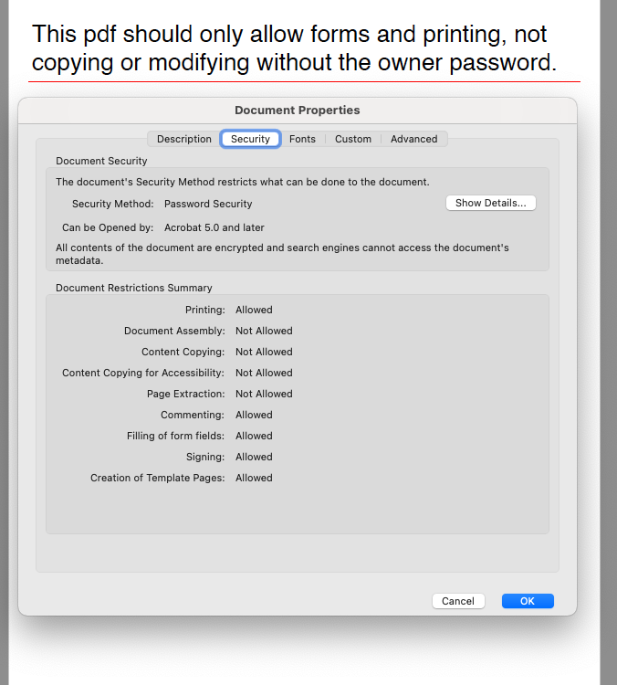

================================
Securing Documents
================================

Scryber supports securing documents with restrictions (printing, copying and modifying) along with password protection.

Restrictions
--------------

The document restrictions are managed through the header meta tag with the name print-restrictions or print-encryption.

.. code-block:: html

    <meta name="print-restrictions" content="allow-forms allow-printing"  />
    <!-- optional print encryption settings -->
    <meta name="print-encryption" content="128bit" />

These restrictions can be applied directly to a document without an owner password if the parser-mode is Lax (default).
However this will be a randomly generated password, and unretrieveable. (Although the document will still open and be secured).

If the parser-mode is strict then an error will be thrown.
See (:doc:`extending_logging`)

.. code-block:: html

    <!DOCTYPE HTML PUBLIC "-//W3C//DTD HTML 4.01//EN"
          "http://www.w3.org/TR/html4/strict.dtd">

    <html lang='en' xmlns='http://www.w3.org/1999/xhtml'
        title="Root">
    <head>
        <meta charset='utf-8' name='author' content='Richard Hewitson' />
        <title>{@:title}</title>
        <meta name="print-restrictions" content="allow-forms allow-printing" />
        <meta name="print-encryption" content="128bit" />
    </head>
    <body class="grey" title="Outer">
        

        This pdf should only allow forms and printing, not copying or modifying without the owner password.

        
{@:title}

    </body>
    </html>

Restriction values
-------------------

The following values are supported on the print-restrictions meta tag.

* allow-printing - The end user will be able to print the document.
* allow-accessibility - The end user can use accessibility tools to read the document.
* allow-annotations - The end user can add annotations and comments.
* allow-copying - The end user can copy content from the document
* allow-modifications - The end user can modify the document and add remove pages etc.
* allow-forms - The end user can complete forms, and sign content.

* all - All restrictions are applied.
  
The print-encryption values supported are

* 40bit - lowest level, and most basic restrictions.
* 128bit - more secure and supports enhanced restrictions (default if no print-encryption is set).

Adding Passwords
------------------

The best use of the document restrictions is when providing password(s) at generation time.

There are 2 passwords used

* owner - to unlock the restrictions and allow all actions.
* user - to allow opening of the document.

They can both be the same, if wanted, and are set on the Document.PasswordProvider property, through the
implementation of an IPDFSecurePasswordProvider

The quickest set up is to use the DocumentPasswordProvider in Scryber.Secure.
This can be initialized with one or two strings, or secure strings.

.. code-block:: csharp

    using (var doc = Document.ParseDocument(path))
    {
        doc.PasswordProvider = new Scryber.Secure.DocumentPasswordProvider("Password", "Password");
        doc.Params["title"] = "Hello World";

        using (var stream = DocStreams.GetOutputStream("ProtectedHtml.pdf"))
        {
            doc.SaveAsPDF(stream);
        }

    }

.. warning:: The use of simple strings as in memory passwords onto documents could be a security risk, 
             and the IDisposable System.Secure.SecureString is more appropriate.

Implementing the IPDFSecurePasswordProvider
--------------------------------------------

The secure password provider interface is a trivial matter of implementing a class that can set some document password settings, based on the document path.
The way they are loaded and how they are retuned is up to the implementor.

If the provider returns false then the document will not be secured, otherwise it will use the IDocumentPasswordSettings as needed.

.. code-block:: csharp

    //using System.Security

    public interface IPDFSecurePasswordProvider : IDisposable
    {
        /// 

        /// Implementers should use this method to load specific security settings pased on a specific path and return required values 
        /// 

        /// <param name="documentpath">The source path the document was loaded from</param>
        /// <param name="settings">Set to the security settings to be associated with this document if IsSecure returns true.</param>
        /// <returns>Return true to assign security settings, or false to not.</returns>
        bool IsSecure(string documentpath, out IDocumentPasswordSettings settings);

    }

    public interface IDocumentPasswordSettings : IDisposable
    {
        /// 

        /// Gets the Owner Password for the document. 
        /// If not set, then it must be set in code before a secure document is output
        /// 

        public SecureString OwnerPassword { get; }

        /// 

        /// Gets the User Password for the document. If null then NO password is required to open and view the document
        /// 

        public SecureString UserPassword { get; }

    }

