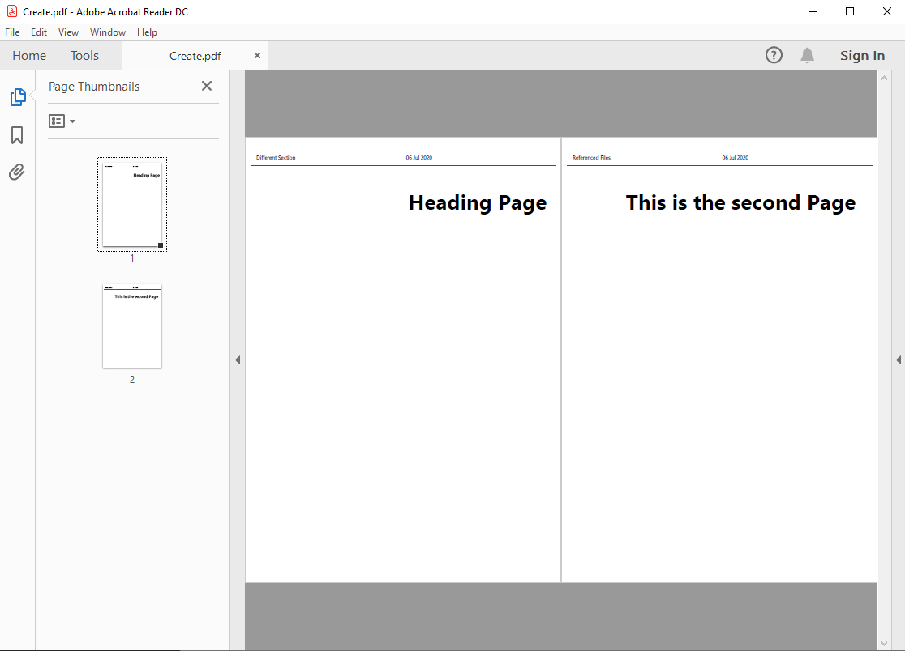
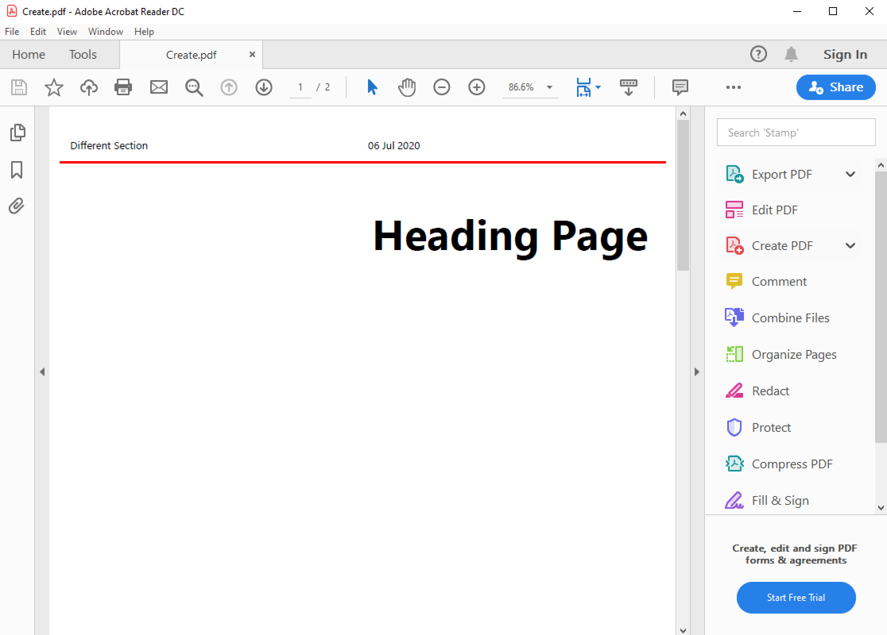
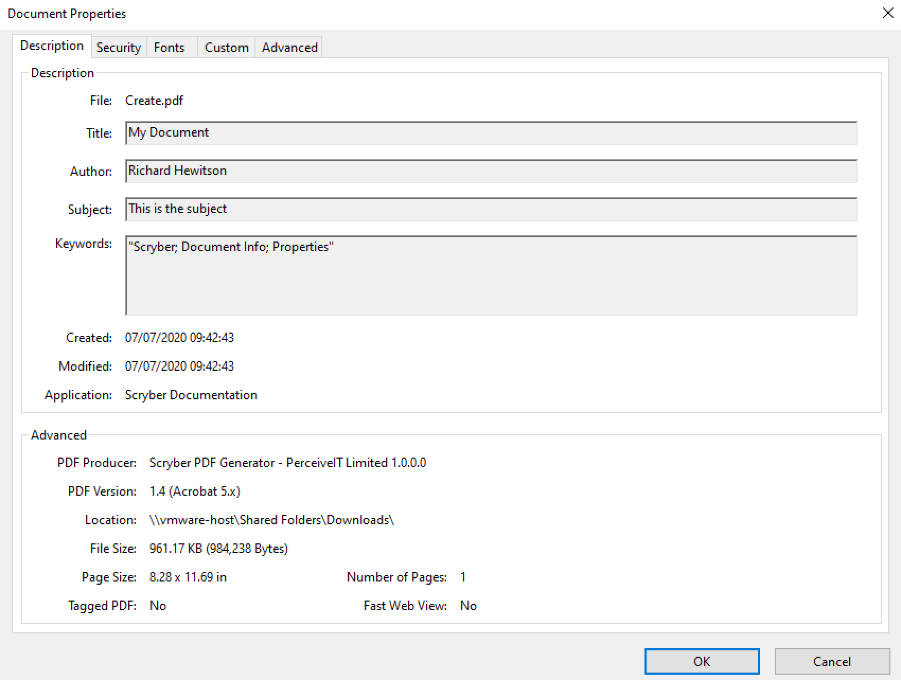
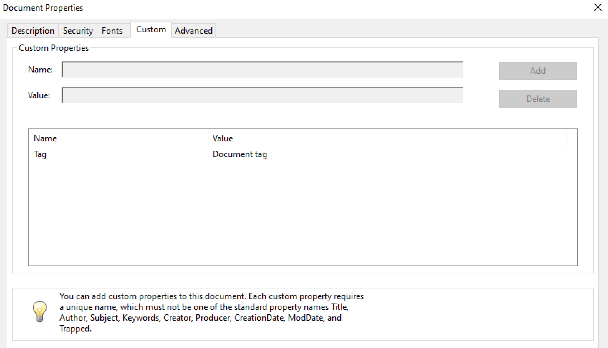

================================
A Scryber XML Document structure
================================

At the root, the document has a number of capabilities that change the output content.

* Scryber Processing Instruction
* Params - The parameters or variables in a document
* Data - Contains any referenced data sources in a document
* Styles - Contains and styles (in document or referenced)
* Pages - The visual page content in the document or referenced
* Viewer Options - Options for how the document opens in the reader.
* Render Options - Options for altering how the pdf is output
* Info - Metadata options about the document itself.

Example
=======

.. code-block:: xml

    <?xml version="1.0" encoding="utf-8" ?>
    <?scryber append-log='true' log-level='Messages' parser-log='true' ?>

    <pdf:Document xmlns:pdf="http://www.scryber.co.uk/schemas/core/release/v1/Scryber.Components.xsd"
                xmlns:styles="http://www.scryber.co.uk/schemas/core/release/v1/Scryber.Styles.xsd"
                xmlns:data="http://www.scryber.co.uk/schemas/core/release/v1/Scryber.Data.xsd" >
    
        <Viewer hide-toolbar="true" page-layout="TwoColumnRight" center-window="true" />
        <Render-Options ></Render-Options>
        <Info></Info>
        
        <Styles>
        </Styles>

        <Params>
            <pdf:String-Param id="MyTitle" value="Document Title" />
        </Params>
        
        <Pages>
            <pdf:Page outline-title="Third Page">
            <Content>
                <pdf:H1 styles:class="title" text="{@:MyTitle}" > </pdf:H1>
            </Content>
            </pdf:Page>
        </Pages>
    
    </pdf:Document>

.. note:: The order of the elements is not important, but it's a maximum of one each. It is not an error for a Document element to be completely empty, but it will be just that.

Processing Instructions
=======================

The scryber processing instruction is an optional entry at the very top of the xml file 
or content stream to define explicit options for the way the file is handled.

.. code-block:: XML

    <?xml version="1.0" encoding="utf-8" ?>
    <?scryber append-log='true' log-level='Messages' parser-log='true' ?>
    <pdf:Document ....

As a processing instruction, the schema xsds do not support validation of the content, but the following are the supported options.

* 'log-level' - This is an enumeration of the granularity of the logging performed on the pdf file. Values supported (from least to most) are
    * Off - no entries be recorded.
    * Errors - only errors will be recorded (depending on the parser mode switch)
    * Warnings - warnings will occur if some of the contents cannot be loaded, or the parsing fails for a non-error condition.
    * Messages - This will output key stage messages for the generation of the file.
    * Verbose - A quantity of messages will be output for each of the compoents, and is a useful level to understand what is going wrong (if anything) with your document.
    * Diagnostic - Be carefull, this will generate a large log file and can slow the creation of a PDF file significnatly. But it's very informative.
* 'parser-log' - Controls the logging from the xml parser.
    * true - then both the reading of the content, to create the document, as well as the output of the content to PDF will be recorded.
    * false - then only messages from the content creation and output will be recorded.
* 'append-log' - Controls the tracing log output for a single document (see :doc:`document_logging`)
    * false - This is the default and the document will be rendered and output as normal.
    * true - If set to true, then once the document has been generated, a trace log of output will be appended to the resultant file, containing all the recorded entries.
* 'parser-culture' - specifies the culture settings when parsing a file for interpreting dates and number formats in the xml. e.g.
    * en-gb - This specifies the english, britsh culture. It can be useful for reading number formats or dates from files e.g. 
    * es-es - This will read spanish nuber formats where . 'dot' is a thousand separator and , 'comma' is the decimal separator.
* 'parser-mode' - Defines how errors will be recorded if unknown or invalid attributes values are encountered. 
    * Strict - Will raise exceptions to the top of the stack and must be handled in your code. (Good for dev)
    * Lax - If this is set  then the parser is more complianant, where errors will be logged, but not cause the output to fail. (Good for Prod).
* 'controller' - This is the full type name of a controller for the docucment, that can interact with and handle events on the document. e.g.
    * 'Namespace.TypeName, AssemblyName' - The class should have a parameterless constructor (see: :doc:`document_controllers`)

Params
======

The 'Params' element (short for parameters) contains the strongly typed values for parameters (aka variables) that can be used in the document, to alter the final content output.
They form a key part of the document creation process, and allow creators to pass information from their code into the template(s).

In fact they are so key to PDF generation, they have their own section, terminology, and functions (see: :doc:`document_parameters`).

Data
====

The `Data` element is a new element for version 1.0. Previously all sources of data would be mixed into the content of the document.
With the separation and full support for data binding (see: :doc:`document_databinding`), with a top level element it's easier to structure and separate and keep the visual content in Pages.

.. note:: It's not an error to put your data components in the Pages section, as there can be times when it's really useful.

Styles
======

The `Styles` element contains all the document style class information that is not inline of the components themselves, along with any references to stylesheets.
Document styles (:doc:`document_styles`) are fully bindable to any data components or prameters.

Pages
=====

The `Pages` element contains the visual content of the document. Whether that is single pages, sections of multiple pages, or references to external pages.
See :doc:`page_content` for more information on the visual content.

Viewer Options
==============

The viewer options within the Document level element alter how readers (should) show the document and it's contents.
Not all readers support these (especially browsers), but it can help.

For example the following viewer options:

.. code-block:: XML

    <pdf:Document xmlns:pdf="http://www.scryber.co.uk/schemas/core/release/v1/Scryber.Components.xsd"
              xmlns:styles="http://www.scryber.co.uk/schemas/core/release/v1/Scryber.Styles.xsd"
              xmlns:data="http://www.scryber.co.uk/schemas/core/release/v1/Scryber.Data.xsd"
              auto-bind="true" >
    <Viewer hide-toolbar="true" page-display="Thumbnails" page-layout="TwoPageLeft" fit-window="false" />

Will open in Acrobat Reader as:

Whereas without the View options the default is:

The following options are declared and supported in the Viewer element

* `hide-toolbar` - will show or hide the toolbar (currently a side bar) in reader.
* `page-display` - Indicates the type of side navigation shown for the document. Supported values are:
    * `None` - Side display is hidden (contracted).
    * `Thumbnails` - The page thumbnails are shown.
    * `Outlines` - The document outline, a hierarcial structure of the content, is shown. (see :doc:`document_outline`)
    * `Attachments` - The document attachments panel is shown.
    * `FullScreen` - This attempts to open the document in full screen presentation mode. A warning to the end user is often shown beforehand.
* `page-layout` - Indicates how pages will be displayed in the view. Supported values are:
    * `SinglePage` - It will open with a page per view sizing in the reader window.
    * `TwoPageLeft` - The document will open with a side by side view of 2 pages, where the first page is on the left.
    * `TwoPageRight` - The document will open with a single first page (the right page) and then 2 page per view following that. Very similar to reading a book.
    * `OneColumn` - The document will open with a full width continuous display, to support scrolling through the complete document.
    * `TwoColumnLeft` - 2 pages, side by side with a full width continuous display.
    * `TwoColumnRight` - 2 pages, side by side, continuous scrolling, with the first page on it's own as per a book.
* `fit-window` - If true the window will resize to fit the width of the first page.
* `center-window` - If true, the UI reader window will center in the main screen.
* `hide-menubar` - If true, then the window menu bar should be hidden.

Render Options
==============

This element controls the output of the PDF content itself. 
Most of the default values are correct for the best output, but can be altered if needed.

.. note:: This section is primarily so the contents of the output PDF can be inspected and read, looking at PDF contents is not recommended for anyone with a sensitive bladder or prone to feinting.

.. code-block:: xml

    <Render-Options component-names="ExplicitOnly" compression-type="None" output-compliance="None" 
    img-cache-mins="10" string-output="Hex" ></Render-Options>

The following options are supported on the render options element.

* `component-names` - Defines how the output of names will be used. This is important for linking to sections from within the document and other documents.
    * `ExplicitOnly` - (default) Only the components that have an actual name value will be listed.
    * `All` - Any component with an ID will be included in the name dictionary, and can be linked to with the UniqueID (full path with underscores).
* `compression-type` - Defines whether the indirect streams within a pdf are compressed or as plain text.
    * `FlateDecode` - (default) The stream content will be zip compressed to reduce the file size.
    * `None` - The streams will be put in the file in their raw format. File size will increase, but the streams can be 'read'
* `string-output` - Defines how strings of text within the document and object streams are written to the file.
    * `Hex` - (default) The textual values will be written as Hex encoded values. This is better for unicode characters.
    * `Text` - The string characters will be output with the ACSII format encoding of PDF files, and unicode will be escaped but render badly.
* `img-cache-mins` - Defines within the document any images that are used will be cached for re-use, and not loaded from a file each time.
    * `0` - (default) The images will be loaded each time for a document creation
    * `60` - Specify any number of minutes to hold the images in the cache. Changes to the images will not be updated in the documents for that time either.

The Render element also allows an inner `<Writer>` element.
This can support other writers including the secure writer and the protected writer. (coming soon)

Document Info
==============

This controlls the output document information, that can be seen in the document properties of acrobat reader.
This information is also, open and indexed by many search engines and forms the key metadata about the document.

It is also fully bindable so can be recorded at runtime.

.. code-block:: xml

    <Info creator="Scryber Documentation Tooling"  >
        <Title>{@:Title}</Title>
        <Subject>{@:Subject}</Subject>
        <Keywords>{@:Keywords}</Keywords>
        <Author>{@:Author}</Author>
        <pdf:Extra name="Tag" >Document tag</pdf:Extra>
    </Info>

    <Params>
        <pdf:String-Param id="Title" value="Document Title" />
        <pdf:String-Param id="Author" value="My Name" />
        <pdf:String-Param id="Subject" value="This is the subject" />
        <pdf:String-Param id="Keywords" value="Scryber; Document Info; Properties" />
    </Params>

The attributes on the document `Info` for creator, created-date, producer, modified-date are automatically completed by the scryber library
but can be overriden.

The pdf:Extra entries within the info, allow producers to add their own keywords and content.
This will appear in the custom tag of the document properties, but can also be processed by search engines and other tools quickly and easily.

