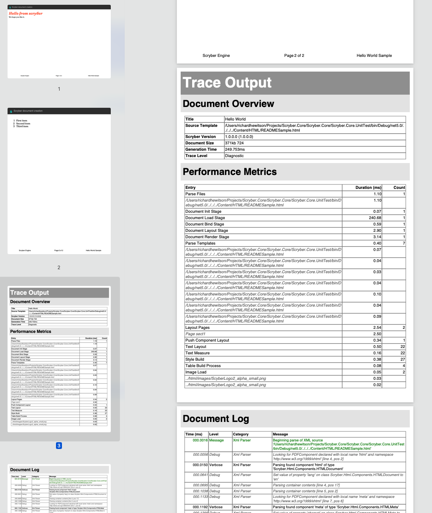

-----------------
File structure
----------------

Scryber expects all content to be in valid XHTML structrure.
Tags must be properly closed, and ampersands (&) must either be escaped or valid html character notations (&amp; &quot; etc.)

Example
--------

.. code-block:: html

    <?scryber append-log='true' log-level='Messages' parser-log='true' ?>
    <!DOCTYPE HTML >
    <html xmlns='http://www.w3.org/1999/xhtml' >
        <head>
            <title>Hello World</title>
        </head>
        <body>
            
Hello World from scryber.

        </body>
    </html>

At the top of the file scryber has it's own **optional** processing instuctions to specify log levels and output.
This is so you can quickly and easily check what is actually going on under the hood.

The DOCTYPE is not required, and if present will be ignored in preference to the xmlns (next).

The html tag has the xmlns attribute - this tells scryber to expect an XHTML formatted document,
rather than any other document description. It is required, although you can use prefixes and any other supported namespaces (see :doc:`drawing_paths`)

The rest of the document follows the standard html structure, which is discussed in detail below.

Scryber processing instruction
-----------------------------------

The following are the supported options on the processing instruction.

* 'append-log' - Controls the tracing log output for a single document
    * false - This is the default and the document will be rendered as normal.
    * true - If set to true, then once the document has been generated, a trace log of output will be appended to the resultant file, containing all the recorded entries.
* 'log-level' - This is an enumeration of the granularity of the logging performed on the pdf file. Values supported (from least to most) are
    * Off - no entries be recorded.
    * Errors - only errors will be recorded (depending on the parser mode switch)
    * Warnings - warnings will occur if some of the contents cannot be loaded, or the parsing fails for a non-error condition.
    * Messages - This will output key stage messages for the generation of the file.
    * Verbose - A quantity of messages will be output for each of the compoents, and is a useful level to understand what is going wrong (if anything) with your document.
    * Diagnostic - **Be carefull**, this will generate a large log file and can slow the creation of a PDF file significnatly. But it's very informative.
* 'parser-log' - Controls the logging from the xml parser.
    * true - then both the reading of the content, to create the document, as well as the output of the content to PDF will be recorded.
    * false - then only messages from the content creation and output will be recorded.
* 'parser-culture' - specifies the global culture settings when parsing a file for interpreting dates and number formats in the content. e.g.
    * en-gb - This specifies the english, britsh culture. It can be useful for reading number formats or dates from files e.g. 
    * es-es - This will read spanish nuber formats where . 'dot' is a thousand separator and , 'comma' is the decimal separator.
* 'parser-mode' - Defines how errors will be recorded if unknown or invalid attributes values are encountered. 
    * Strict - Will raise exceptions to the top of the stack and must be handled in your code. (Good for dev)
    * Lax - Default. If this is set  then the parser is more complianant, where errors will be logged, but not cause the output to fail. (Good for Prod).

.. note:: If you set the log level to Diagnostic for the Hello World example in our Getting started examples, the appended log file is around 30 pages in length. If it's a long template - diagnostic is going to hurt, but for a quick check or a feature - it is awesome without needing debugging.

Namespaces
----------

Scryber is dynamic and extensible. The xml namespaces refer directly to namespaces (and assemblies) in the library.
There are 3 primary namespaces, and a convention for the prefixes for those namespaces.

By using explicit namespaces the xml can be read and which class an element rerers to determined.
Scryber requires the use of a prefix for all of the namespaces (as there are content elements defined without a prefix).

* `doc` - http://www.scryber.co.uk/schemas/core/release/v1/Scryber.Components.xsd
    * These are the main visual and structural components in a file or document.
    * e.g. doc:Document; doc:Page; doc:Label.
    * It refers to the assembly namespace `Scryber.Components, Scryber.Components, Version=1.0.0.0, Culture=neutral, PublicKeyToken=872cbeb81db952fe`
    * see :doc:`document_components` for more on the content elements of a document.
* `data` - http://www.scryber.co.uk/schemas/core/release/v1/Scryber.Styles.xsd
    * These are either non visual components that load data from other sources, change content based on rules in data sources, or create inner content based on available data.
    * e.g. data:DataGrid; data:XmlDataSource; data:If.
    * It refers to the assembly namespace `Scryber.Data, Scryber.Components, Version=1.0.0.0, Culture=neutral, PublicKeyToken=872cbeb81db952fe`
    * see :doc:`document_databinding` for more on working with data.
* `styles` - http://www.scryber.co.uk/schemas/core/release/v1/Scryber.Data.xsd
    * These apply colour, size and other visual style to the components, both as Style elements and as attributes on doc:Compontents
    * e.g. styles:Style; styles:bg-color; styles:width.
    * It refers to the assembly namespace `Scryber.Styles, Scryber.Styles, Version=1.0.0.0, Culture=neutral, PublicKeyToken=872cbeb81db952fe`
    * see :doc:`document_styles` for more on working with styles.

For more information on how these are mapped, and also adding your own namespaces see :doc:`namespaces_and_assemblies` along with :doc:`scryber_configuration`

The `Pages` element contains the visual content of the document. Whether that is single pages, sections of multiple pages, or references to external pages.
See :doc:`document_pages` for more information on the visual content.

Viewer Options
---------------

The viewer options within the Document level element alter how readers (should) show the document and it's contents.
Not all readers support these (especially browsers), but it can help.

For example the following viewer options:

.. code-block:: XML

    <doc:Document xmlns:doc="http://www.scryber.co.uk/schemas/core/release/v1/Scryber.Components.xsd"
              xmlns:styles="http://www.scryber.co.uk/schemas/core/release/v1/Scryber.Styles.xsd"
              xmlns:data="http://www.scryber.co.uk/schemas/core/release/v1/Scryber.Data.xsd"
              auto-bind="true" >
    <Viewer hide-toolbar="true" page-display="Thumbnails" page-layout="TwoPageLeft" fit-window="false" />

Will open in Acrobat Reader as:

.. image:: images/viewOptions.png

Whereas without the View options the default is:

.. image:: images/viewOptionsNone.png

The following options are declared and supported in the Viewer element

* `hide-toolbar` - will show or hide the toolbar (currently a side bar) in reader.
* `page-display` - Indicates the type of side navigation shown for the document. Supported values are:
    * `None` - Side display is hidden (contracted).
    * `Thumbnails` - The page thumbnails are shown.
    * `Outlines` - The document outline, a hierarcial structure of the content, is shown. (see :doc:`document_outline`)
    * `Attachments` - The document attachments panel is shown.
    * `FullScreen` - This attempts to open the document in full screen presentation mode. A warning to the end user is often shown beforehand.
* `page-layout` - Indicates how pages will be displayed in the view. Supported values are:
    * `SinglePage` - It will open with a page per view sizing in the reader window.
    * `TwoPageLeft` - The document will open with a side by side view of 2 pages, where the first page is on the left.
    * `TwoPageRight` - The document will open with a single first page (the right page) and then 2 page per view following that. Very similar to reading a book.
    * `OneColumn` - The document will open with a full width continuous display, to support scrolling through the complete document.
    * `TwoColumnLeft` - 2 pages, side by side with a full width continuous display.
    * `TwoColumnRight` - 2 pages, side by side, continuous scrolling, with the first page on it's own as per a book.
* `fit-window` - If true the window will resize to fit the width of the first page.
* `center-window` - If true, the UI reader window will center in the main screen.
* `hide-menubar` - If true, then the window menu bar should be hidden.

Render Options
---------------

This element controls the output of the PDF content itself. 
Most of the default values are correct for the best output, but can be altered if needed.

.. note:: This section is primarily so the contents of the output PDF can be inspected and read, looking at PDF contents is not recommended for anyone with a sensitive bladder or prone to feinting.

.. code-block:: xml

    <Render-Options component-names="ExplicitOnly" compression-type="None" output-compliance="None" 
    img-cache-mins="10" string-output="Hex" ></Render-Options>

The following options are supported on the render options element.

* `component-names` - Defines how the output of names will be used. This is important for linking to sections from within the document and other documents.
    * `ExplicitOnly` - (default) Only the components that have an actual name value will be listed.
    * `All` - Any component with an ID will be included in the name dictionary, and can be linked to with the UniqueID (full path with underscores).
* `compression-type` - Defines whether the indirect streams within a pdf are compressed or as plain text.
    * `FlateDecode` - (default) The stream content will be zip compressed to reduce the file size.
    * `None` - The streams will be put in the file in their raw format. File size will increase, but the streams can be 'read'
* `string-output` - Defines how strings of text within the document and object streams are written to the file.
    * `Hex` - (default) The textual values will be written as Hex encoded values. This is better for unicode characters.
    * `Text` - The string characters will be output with the ACSII format encoding of PDF files, and unicode will be escaped but render badly.
* `img-cache-mins` - Defines within the document any images that are used will be cached for re-use, and not loaded from a file each time.
    * `0` - (default) The images will be loaded each time for a document creation
    * `60` - Specify any number of minutes to hold the images in the cache. Changes to the images will not be updated in the documents for that time either.

The Render element also allows an inner `<Writer>` element.
This can support other writers including the secure writer and the protected writer. (coming soon)

Document Info
--------------

This controlls the output document information, that can be seen in the document properties of acrobat reader.
This information is also, open and indexed by many search engines and forms the key metadata about the document.

.. image:: images/documentproperties.png

It is also bindable on the main attributes 
and named elements so can be changed at runtime. 
(see ':doc:`document_parameters`' for more on the parameters and binding).

.. code-block:: xml

    <Info creator="Scryber Documentation"  >
        <Title>{@:Title}</Title>
        <Subject>{@:Subject}</Subject>
        <Keywords>{@:Keywords}</Keywords>
        <Author>{@:Author}</Author>
        <doc:Extra name="Tag" >Document tag</doc:Extra>
    </Info>

    <Params>
        <doc:String-Param id="Title" value="Document Title" />
        <doc:String-Param id="Author" value="My Name" />
        <doc:String-Param id="Subject" value="This is the subject" />
        <doc:String-Param id="Keywords" value="Scryber; Document Info; Properties" />
    </Params>

The attributes on the document `Info` for creator, created-date, producer, modified-date are automatically completed by the scryber library
but can be overriden.

The doc:Extra entries within the info, allow producers to add their own keywords and content.
This will appear in the custom tag of the document properties, but can also be processed by search engines and other tools quickly and easily.

.. image:: images/documentproperties_extra.png

