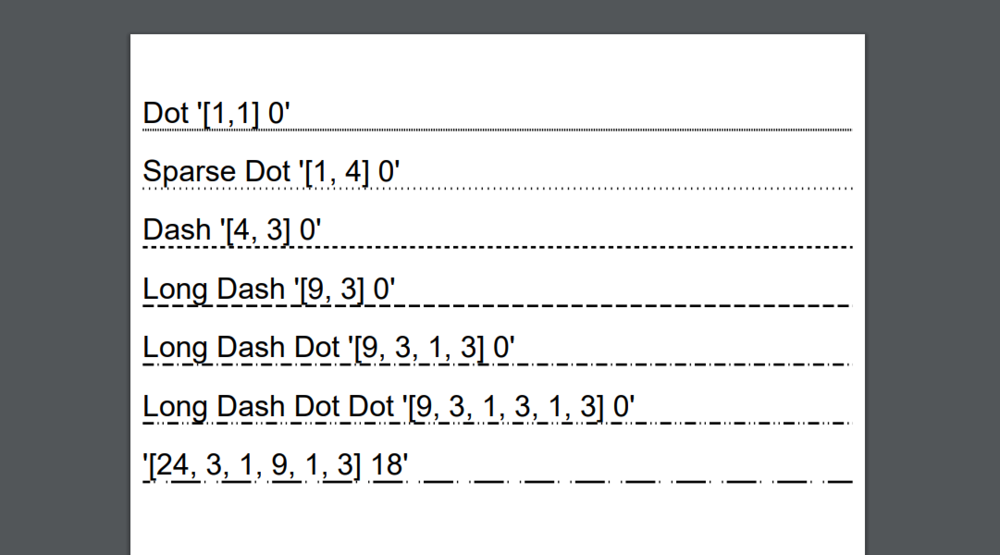

============================================
Colours, fills, borders and backgrounds
============================================

Colours are standard drawing structure. They can be defined in the template in multiple ways.

Standard Colours
=================

There is a standard enumeration of the 16 named colours.

* Aqua
* Black
* Blue
* Fuschia
* Gray
* Green
* Lime
* Maroon
* Navy
* Olive
* Purple
* Red
* Silver
* Teal
* White
* Yellow
* Transparent

These can be defined on any attribute, 

e.g `pdf:Div styles:bg-color='red'></pdf:Div>`

or in code via the `Scryber.Drawing.PDFColors` static class.

e.g. `mydiv.BackgroundColour = System.Drawing.PDFColours.Red;`

Colour Explicit Values
=======================

The colour also supports definition with explicit Hex, RGB or Grayscale values.

* Grayscale
    * Can be applied to an attribute with the format `G(255)`.
    * Can be applied to an attribute with the 2 character hex format `#FF`.
    * Can be assigned in code via the constructor `new PDFColor(1)`.
* RGB color
    * Can be applied to an attribute with the format `RGB(255,0,0)`.
    * Can be applied to an attribute with the 3 character format `#F00`
    * Can be applied to an attribute with the 6 character format `#FF0000`
    * Can be assigned in code via the constructor `new PDFColor(1,0,0)`

The use of transparency (opacity) is not part of the colour structure, but most drawing operations
also allow a separate opacity value to be set.

Using background colors
==========================

All pages and block components (see :doc:`component_positioning`) support background colors and opacity.
This can either be set via styles or explicitly on the component.

Inline components do not (currently) support rendering of a background colour.

The background is simply a solid colour from the Grayscale or RGB ranges. The background can also be specified with a fraction value from 0.0 to 1.0.

.. code-block:: xml

    <?xml version="1.0" encoding="utf-8" ?>

    <pdf:Document xmlns:pdf="http://www.scryber.co.uk/schemas/core/release/v1/Scryber.Components.xsd"
                xmlns:styles="http://www.scryber.co.uk/schemas/core/release/v1/Scryber.Styles.xsd"
                xmlns:data="http://www.scryber.co.uk/schemas/core/release/v1/Scryber.Data.xsd" >
    <Styles>
        
        <!-- catch all style-->
        <styles:Style >
            <styles:Font family="Arial" size="20pt"/>
        </styles:Style>

        <styles:Style applied-class="floating" >
            <styles:Position mode="Absolute" x="230" y="70"/>
            <styles:Size width="300pt"/>
            <styles:Background color="fuchsia" opacity="0.5"/>
        </styles:Style>
        
    </Styles>
    <Pages>
        
        <!-- Page background with 40pt top padding -->
        <pdf:Page styles:bg-color="aqua" styles:padding="40 0 0 0" >
            <Content>
                <!--  values from the hex values. -->
                <pdf:Div styles:bg-color="#FAA" styles:padding="20pt" >
                    Light pink full opacity background.
                </pdf:Div>

                <!-- values from the enumeration with transparency -->
                <pdf:Div styles:class="floating" >
                    This is the content in a semi-opaque fuschia background ontop of the page.
                </pdf:Div>
            </Content>
        </pdf:Page>

    </Pages>
    
    </pdf:Document>

.. image:: images/documentbgcolor.png

.. note:: Backgrounds also support the use of single or repeating images. See :doc:`drawing_images` for details on using images backgrounds.

Using border colors
====================

Borders apply around the edges of block components. They can be solid or dashed (see below), and have color, opaciy and width values.

Margins are outside of the border, and padding is inside. But borders do not affect either, by design.

.. code-block:: xml

    <?xml version="1.0" encoding="utf-8" ?>

    <pdf:Document xmlns:pdf="http://www.scryber.co.uk/schemas/core/release/v1/Scryber.Components.xsd"
                xmlns:styles="http://www.scryber.co.uk/schemas/core/release/v1/Scryber.Styles.xsd"
                xmlns:data="http://www.scryber.co.uk/schemas/core/release/v1/Scryber.Data.xsd" >
    <Styles>
        
        <!-- catch all style-->
        <styles:Style >
            <styles:Font family="Arial" size="20pt"/>
        </styles:Style>

        <styles:Style applied-class="floating" >
            <styles:Position mode="Absolute" x="230" y="90"/>
            <styles:Size width="300pt"/>
            <styles:Background color="fuchsia" opacity="0.5"/>
            <styles:Border color="maroon" width="15pt" opacity="0.5" />
        </styles:Style>
        
    </Styles>
    <Pages>
        
        <!-- Page background with 40pt top padding -->
        <pdf:Page styles:bg-color="aqua" styles:padding="40 0 0 0" >
        <Content>
        
        
            <!--  Borders set on a full width div. -->
            <pdf:Div styles:bg-color="#FAA" styles:padding="20pt" 
                        styles:border-color="#C77" styles:border-width="3pt" >
                Light pink with a border.
            </pdf:Div>

            <!-- Thick border will overlay the inner content -->
            <pdf:Div styles:class="floating" >
                Semi-opaque fuschia background with a thick border.
            </pdf:Div>
        </Content>
        </pdf:Page>
    </Pages>
    
    </pdf:Document>

.. image:: images/documentbordercolor.png

Border sides and radii
======================

Borders can also have sides and corner radii. The sides enumeration can be one or more of the following

* Top
* Left
* Bottom
* Right

And they can be combined in any order. e.g. `Top Left Bottom`

The corner radius can be any unit value (see: :doc:`drawing_units`).

If the sides and corner radii are combined, only the sides that create a corner will have the radius applied.

.. code-block:: xml

    <?xml version="1.0" encoding="utf-8" ?>

    <pdf:Document xmlns:pdf="http://www.scryber.co.uk/schemas/core/release/v1/Scryber.Components.xsd"
                xmlns:styles="http://www.scryber.co.uk/schemas/core/release/v1/Scryber.Styles.xsd"
                xmlns:data="http://www.scryber.co.uk/schemas/core/release/v1/Scryber.Data.xsd" >
    <Styles>
        
        <!-- catch all style-->
        <styles:Style >
            <styles:Font family="Arial" size="20pt"/>
        </styles:Style>

        <styles:Style applied-class="floating" >
            <styles:Position mode="Absolute" x="230" y="90"/>
            <styles:Size width="300pt"/>
            <styles:Background color="fuchsia" opacity="0.5"/>
            <styles:Border color="maroon" width="15pt" opacity="0.5"
                           corner-radius="15pt" sides="Bottom Left Right"/>
        </styles:Style>
        
    </Styles>
    <Pages>
        
        <!-- Page background with 40pt top padding -->
        <pdf:Page styles:bg-color="aqua" styles:padding="40 0 0 0" >
        <Content>
        
        
        <!--  Borders set on a full width div. -->
            <pdf:Div styles:bg-color="#FAA" styles:padding="20pt" 
                        styles:border-color="#C77" styles:border-width="3pt" styles:border-corner-radius="10pt">
                Light pink with a border around.
            </pdf:Div>

            <!-- Thick border will overlay the inner content -->
            <pdf:Div styles:class="floating" >
                Semi-opaque fuschia background with a thick sided border.
            </pdf:Div>
        </Content>
        </pdf:Page>
    </Pages>
    
    </pdf:Document>

.. image:: images/documentbordersides.png

Using fill colors
===================

The fill color applies to shapes and text. 
It is independent of background, however the same attributes apply to fills as to backgrounds.

.. code-block:: xml

    <?xml version="1.0" encoding="utf-8" ?>

    <pdf:Document xmlns:pdf="http://www.scryber.co.uk/schemas/core/release/v1/Scryber.Components.xsd"
                xmlns:styles="http://www.scryber.co.uk/schemas/core/release/v1/Scryber.Styles.xsd"
                xmlns:data="http://www.scryber.co.uk/schemas/core/release/v1/Scryber.Data.xsd" >
    <Styles>
        
        <!-- catch all style-->
        <styles:Style >
            <styles:Font family="Arial" size="20pt"/>
        </styles:Style>

        <styles:Style applied-class="floating" >
            <styles:Position mode="Absolute" x="230" y="90"/>
            <styles:Size width="300pt"/>
            <styles:Background color="fuchsia" opacity="0.5"/>
            <styles:Border color="maroon" width="15pt" opacity="0.5"
                            corner-radius="15pt" sides="Bottom Left Right"/>
        </styles:Style>
        
    </Styles>
    <Pages>
        
        <!-- Page background with 40pt top padding -->
        <pdf:Page styles:bg-color="aqua" styles:padding="40 0 0 0" >
        <Content>
        
        
            <!--  Borders set on a full width div. -->
            <pdf:Div styles:bg-color="#FAA" styles:padding="20pt" 
                        styles:border-color="#C77" styles:border-width="3pt" styles:border-corner-radius="10pt"
                        styles:fill-color="aqua" styles:font-bold="true" styles:font-size="40pt">
                Light pink bg with aqua Text.
            </pdf:Div>

            <!-- Thick border will overlay the inner content -->
            <pdf:Div styles:class="floating" >
                <pdf:Span styles:fill-color="white" styles:fill-opacity="0.7">
                Semi-opaque fuschia with white semi-transparent text.
                </pdf:Span>
            </pdf:Div>

            <!-- Rectangle with a fill colour, no background or border -->
            <pdf:Rect styles:fill-color="lime" styles:fill-opacity="0.9"
                        styles:position-mode="Absolute" 
                        styles:x="120" styles:y="120" styles:width="120" styles:height="120" ></pdf:Rect>
        
        </Content>
        </pdf:Page>
    </Pages>
    
    </pdf:Document>

.. image:: images/documentbordertextfillrect.png

.. note:: Fills also support the use of single or repeating images. See :doc:`drawing_images` for details on using images for fills.

Using stroke colors
====================

The stroke is around the shape or text. It supports the same properties as the border.

.. code-block:: xml

    <?xml version="1.0" encoding="utf-8" ?>

    <pdf:Document xmlns:pdf="http://www.scryber.co.uk/schemas/core/release/v1/Scryber.Components.xsd"
                xmlns:styles="http://www.scryber.co.uk/schemas/core/release/v1/Scryber.Styles.xsd"
                xmlns:data="http://www.scryber.co.uk/schemas/core/release/v1/Scryber.Data.xsd" >
    <Styles>
        
        <!-- catch all style-->
        <styles:Style >
            <styles:Font family="Arial" size="20pt"/>
        </styles:Style>

        <styles:Style applied-class="floating" >
            <styles:Position mode="Absolute" x="230" y="90"/>
            <styles:Size width="300pt"/>
            <styles:Background color="fuchsia" opacity="0.5"/>
            <styles:Border color="maroon" width="15pt" opacity="0.5"
                            corner-radius="15pt" sides="Bottom Left Right"/>
        </styles:Style>

        <!-- Added the stroked class -->
        <styles:Style applied-class="stroked" >
            <styles:Stroke color="#C77" style="Solid" width="2pt" />
        </styles:Style>
    </Styles>
    <Pages>
        
        <pdf:Page styles:bg-color="aqua" styles:padding="40 0 0 0" >
        <Content>
        
            <!--  Set the ctroked class for the text -->
            <pdf:Div styles:class="stroked" styles:bg-color="#FAA" styles:padding="20pt" 
                        styles:border-color="#C77" styles:border-width="3pt" styles:border-corner-radius="10pt"
                        styles:fill-color="aqua" styles:font-bold="true" styles:font-size="40pt">
                Light pink bg with aqua Text.
            </pdf:Div>

            <pdf:Div styles:class="floating" >
                <pdf:Span styles:fill-color="white" styles:fill-opacity="0.7">
                Semi-opaque fuschia with white semi-transparent text.
                </pdf:Span>
            </pdf:Div>

            <!-- Added the stroke to the rectangle shape too -->
            <pdf:Rect styles:class="stroked" styles:fill-color="lime" styles:fill-opacity="0.9"
                        styles:position-mode="Absolute" 
                        styles:x="120" styles:y="120" styles:width="120" styles:height="120" ></pdf:Rect>
        </Content>
        </pdf:Page>
    </Pages>
    
    </pdf:Document>

.. image:: images/documentbordertextstroke.png

Border and stroke dashes
========================

Both the border and stroke styles support the use of dashes.
Simply changing the stroke or border style to Dashed will apply s simple dash style.

.. code-block:: xml

    <styles:Style applied-class="stroked" >
      <styles:Stroke color="#C77" style="Dash" width="2pt" />
    </styles:Style>

.. image:: images/documentborderdash.png

Dash Styles
============

The type of dash can also be modified either with the enumeration values:

* Dot
* Sparse-Dot
* Dash
* Long-Dash
* Long-Dash-Dot
* Long-Dash-Dot-Dot

Or an explicit pattern array and phase offset. e.g. `[10, 3, 1, 3], 0`

.. code-block:: xml

    <?xml version="1.0" encoding="utf-8" ?>

    <pdf:Document xmlns:pdf="http://www.scryber.co.uk/schemas/core/release/v1/Scryber.Components.xsd"
                xmlns:styles="http://www.scryber.co.uk/schemas/core/release/v1/Scryber.Styles.xsd"
                xmlns:data="http://www.scryber.co.uk/schemas/core/release/v1/Scryber.Data.xsd" >

    <Pages>
        
        <!-- Page background with 40pt top padding -->
        <pdf:Page styles:padding="40 0 0 0" >
        <Content>
        
        
            <!--  Dash styles. -->
            <pdf:Div styles:padding="10pt">
                Dot '[1,1] 0' <pdf:Line styles:stroke-dash="Dot" styles:stroke-width="2pt"  />
            </pdf:Div>
            
            <pdf:Div styles:padding="10pt">
                Sparse Dot '[1, 4] 0' <pdf:Line styles:stroke-dash="Sparse-Dot" styles:stroke-width="2pt"  />
            </pdf:Div>
            
            <pdf:Div styles:padding="10pt">
                Dash '[4, 3] 0' <pdf:Line styles:stroke-dash="Dash" styles:stroke-width="2pt"  />
            </pdf:Div>
            
            <pdf:Div styles:padding="10pt">
                Long Dash '[9, 3] 0' <pdf:Line styles:stroke-dash="Long-Dash" styles:stroke-width="2pt"  />
            </pdf:Div>

            <pdf:Div styles:padding="10pt">
                Long Dash Dot '[9, 3, 1, 3] 0' <pdf:Line styles:stroke-dash="Long-Dash-Dot" styles:stroke-width="2pt"  />
            </pdf:Div>

            <pdf:Div styles:padding="10pt">
                Long Dash Dot Dot '[9, 3, 1, 3, 1, 3] 0' <pdf:Line styles:stroke-dash="Long-Dash-Dot-Dot" styles:stroke-width="2pt"  />
            </pdf:Div>
            
            <pdf:Div styles:padding="10pt">
                '[24, 3, 1, 9, 1, 3] 18' <pdf:Line styles:stroke-dash="[24, 3, 1, 9, 1, 3] 18" styles:stroke-width="2pt"  />
            </pdf:Div>

        
        </Content>
        </pdf:Page>
    </Pages>
    
    </pdf:Document>

The custom style defines an initial integer array or on, off, on etc. And the trainling phase defines how far along
the pattern the line drawing will start at.

e.g. [24, 3, 1, 9, 1, 3] 18 has a 24pt on, a 3pt off, 1pt on, 9pt off, 1pt on, 3pt off, and then repeat. 
But the line drawing starts 18pts into the first long 24pt dash.

Binding Colors and fills
=========================

As with all things scryber. The colors fills etc. are all bindable to parameters and data, so regular colours could be defined
and then used in places throughout the styles and components.

.. note:: Scryber is strongly typed. If it's a color use a Color param, or a string (that can be converted).

.. code-block:: xml

    <?xml version="1.0" encoding="utf-8" ?>

    <pdf:Document xmlns:pdf="http://www.scryber.co.uk/schemas/core/release/v1/Scryber.Components.xsd"
                xmlns:styles="http://www.scryber.co.uk/schemas/core/release/v1/Scryber.Styles.xsd"
                xmlns:data="http://www.scryber.co.uk/schemas/core/release/v1/Scryber.Data.xsd" >
    <Params>
        <!-- Declare the parameters for the colours and units -->
        <pdf:Color-Param value="#FAA" id="bg-color" />
        <pdf:Color-Param value="#C77" id="border-color" />
        <pdf:Unit-Param value="2pt" id="border-width" />
    </Params>
    <Styles>
        
        <styles:Style >
        <styles:Font family="Arial" size="20pt"/>
        </styles:Style>

        <!-- Reference the parameters with the bindings -->

        <styles:Style applied-class="floating" >
            <styles:Position mode="Absolute" x="230" y="90"/>
            <styles:Size width="300pt"/>
            <styles:Background color="{@:bg-color}" />
            <styles:Border color="{@:border-color}" width="{@:border-width}" />
        </styles:Style>

    </Styles>
    <Pages>
        
        <!-- Page background with 40pt top padding -->
        <pdf:Page styles:bg-color="aqua" styles:padding="40 0 0 0" >
        <Content>
        
        
            <!--  Bind explicitly to the parameters. -->
            <pdf:Div styles:bg-color="{@:bg-color}" styles:padding="20pt" 
                        styles:border-color="{@:border-color}" styles:border-width="{@:border-width}">
                Bound background and border
            </pdf:Div>

            <!-- Or use the style that has been bound -->
            <pdf:Div styles:class="floating" >
                Bound background and border on a style.
            </pdf:Div>

        
        </Content>
        </pdf:Page>
    </Pages>
    
    </pdf:Document>

.. image:: images/documentbroderbound.png