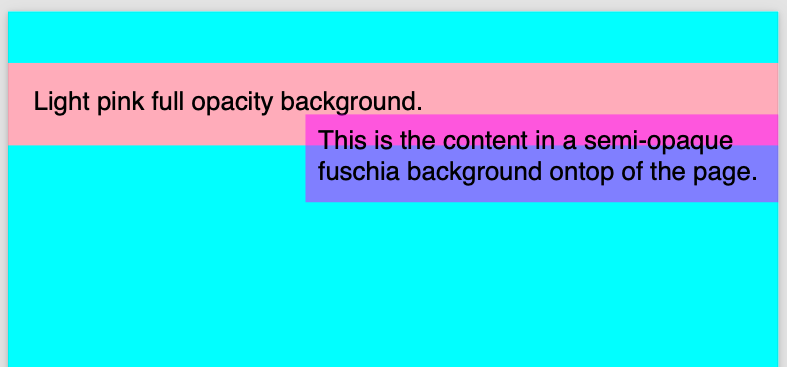
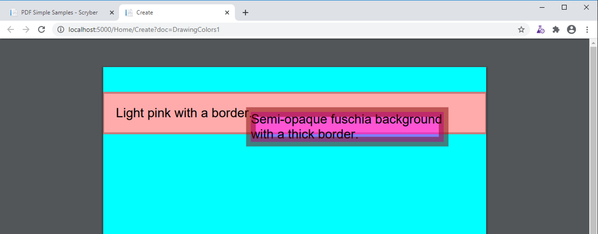
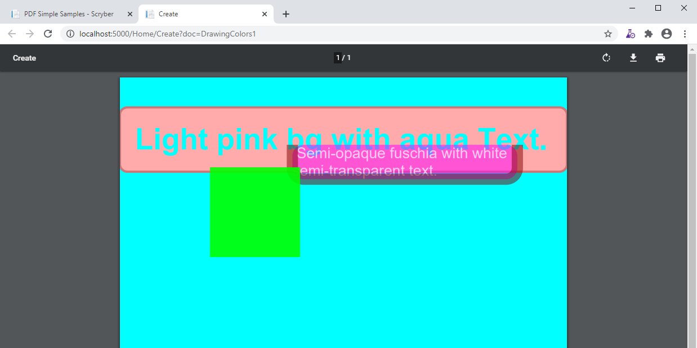
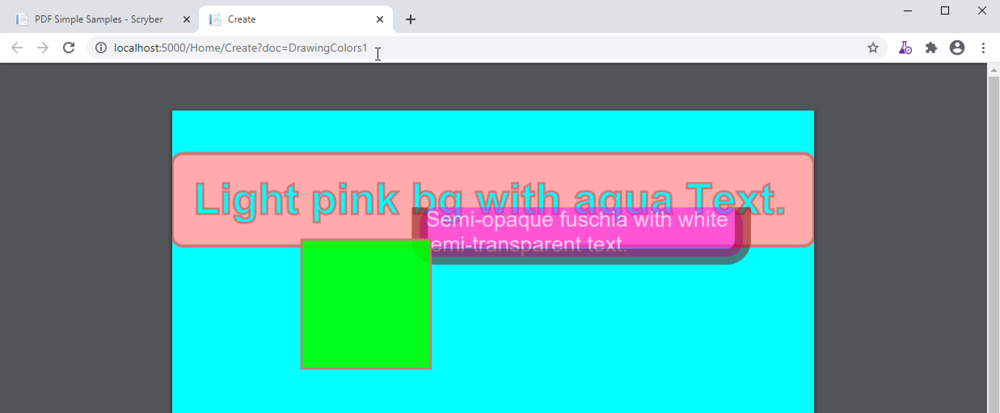
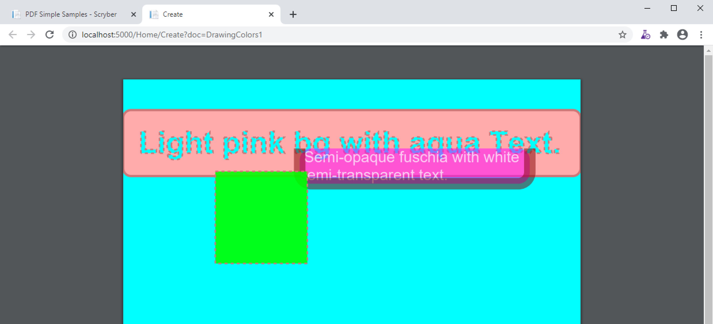

============================================
Colours, fills, borders and backgrounds
============================================

Colours are a standard drawing structure. They can be defined in the template and code in multiple ways.

Named Colours
-----------------

Within a template the 140 standard HTML colours can be used
These can be defined on any color style or css class, 

.. code-block:: csharp

    
Red Content

In the core library 16 pre-defined colors have been defined, and are available in the Scryber.Drawing.PDFColors class.

.. code-block:: csharp

    var div = new Scryber.Components.Div(){ BackgroundColor = Scryber.Drawing.PDFColors.Red };

Colour Explicit Values
-----------------------

The colour also supports definition with explicit Hex, RGB or Grayscale values.

* Grayscale
    * Can be applied to an attribute with the format `G(255)`.
    * Can be applied to an attribute with the 2 character hex format `#FF`.
    * Can be assigned in code via the constructor `new PDFColor(1)`.
* RGB color
    * Can be applied to an attribute with the format `RGB(255,0,0)`.
    * Can be applied to an attribute with the 3 character format `#F00`
    * Can be applied to an attribute with the 6 character format `#FF0000`
    * Can be assigned in code via the constructor `new PDFColor(1,0,0)`
* RGBA color
    * Can only be applied to the css colors in the standard rgba(255,0,0,0.5)

.. code-block:: csharp

    
Red Content

.. code-block:: csharp

    var div = new Scryber.Components.Div(){ BackgroundColor = new Scryber.Drawing.PDFColor(1,0,0) };

The use of transparency (opacity) is not part of the colour structure, but most drawing operations
also allow a separate opacity value to be set.

.. note:: The internal styles have a color property and an opacity property (Background.Color, Background.Opacity) to allow image backgrounds and fills to obey this opacity.

Using background colors
------------------------

All pages and block components (see :doc:`component_positioning`) support background colors and opacity.
This can either be set via classes or explicitly on the style.

Inline components do not (currently) support rendering of a background colour.

The background is simply a solid colour from the Grayscale or RGB ranges. 
The background can also be specified with a fraction value from 0.0 to 1.0.

.. code-block:: html

    <?xml version="1.0" encoding="utf-8" ?>
    <!DOCTYPE HTML PUBLIC "-//W3C//DTD HTML 4.01//EN"
            "http://www.w3.org/TR/html4/strict.dtd">

    <html xmlns='http://www.w3.org/1999/xhtml'>
    <head>
        
    </head>
    <body>
        

            Light pink full opacity background.
        

        

            This is the content in a semi-opaque fuschia background ontop of the page.
        

    </body>
    </html>

.. note:: Backgrounds also support the use of single or repeating images. See :doc:`drawing_images` for details on using images backgrounds.

Using border colors
--------------------

Borders apply around the edges of block components. They can be solid or dashed (see below), and have color, opaciy and width values.

Margins are outside of the border, and padding is inside. But borders do not affect either, by design.

Scryber (v5.0.5) also supports the use of border sides (border-left etc.) and corner radius.

.. code-block:: html

    <?xml version="1.0" encoding="utf-8" ?>
    <!DOCTYPE HTML PUBLIC "-//W3C//DTD HTML 4.01//EN"
            "http://www.w3.org/TR/html4/strict.dtd">

    <html xmlns='http://www.w3.org/1999/xhtml'>
    <head>
        
    </head>
    <body>
        

            Light pink full opacity background.
        

        

            This is the content in a semi-opaque fuschia background ontop of the page.
        

    </body>
    </html>

Using fill colors
-------------------

The fill color applies to shapes and text. 
It is independent of background, however the same attributes apply to fills as to backgrounds.

See :doc:`drawing_paths` for more on using fills with shapes.

.. code-block:: html

    <?xml version="1.0" encoding="utf-8" ?>
    <!DOCTYPE HTML PUBLIC "-//W3C//DTD HTML 4.01//EN"
            "http://www.w3.org/TR/html4/strict.dtd">

    <html xmlns='http://www.w3.org/1999/xhtml'>
    <head>
        
    </head>
    <body>
        

            Light pink full opacity background.
        

        

            This is the content in a semi-opaque fuschia background ontop of the page.
        

    </body>
    </html>

.. note:: Fills also support the use of single or repeating images. See :doc:`drawing_images` for details on using images for fills.

Using stroke colors
--------------------

Finally stroke is around the shape or text. It supports the same properties as the border.

.. code-block:: html

    <?xml version="1.0" encoding="utf-8" ?>
    <!DOCTYPE HTML PUBLIC "-//W3C//DTD HTML 4.01//EN"
            "http://www.w3.org/TR/html4/strict.dtd">

    <html xmlns='http://www.w3.org/1999/xhtml'>
    <head>
        
    </head>
    <body>
        

            Light pink full opacity background.
        

        

            This is the content in a semi-opaque fuschia background ontop of the page.
        

    </body>
    </html>

Border and stroke styles
-------------------------

Both the border and stroke styles support the use of dashes.
Simply changing the stroke or border style to Dashed will apply a simple dash style.

.. code-block:: css

    border: dashed 3pt rgba(127,0, 0, 0.7);

.. note:: scryber supports the solid, dashed, and dotted line styles only.

Binding Colors and fills
-------------------------

As with all things scryber. The styles are all bindable to parameters and data, so regular colours could be defined
and then used in places throughout the styles and components.

See :doc:`binding_model` for an example.
