======================================
Document fonts and text styles
======================================

Fonts are by detault automatically loaded at startup, and can be referenced by name.

Built in fonts
==============

There are a number (14 to be precise) of built in fonts with PDF readers that can be used in documents. These are as follows

* Helvetica - Regular, Bold, Italic and Bold Italic.
* Times - Regular, Bold, Italic and Bold Italic.
* Courier - Regular, Bold, Italic and Bold Italic.
* Zapf Dingbats - Regular
* Symbol - Regular

It is safe to assume that these fonts exist and can be used.

.. code-block:: xml

    <?xml version="1.0" encoding="utf-8" ?>
    <pdf:Document xmlns:pdf="http://www.scryber.co.uk/schemas/core/release/v1/Scryber.Components.xsd"
                xmlns:styles="http://www.scryber.co.uk/schemas/core/release/v1/Scryber.Styles.xsd"
                xmlns:data="http://www.scryber.co.uk/schemas/core/release/v1/Scryber.Data.xsd" >

    <Styles>
        
        <!-- Add a style to font divs -->
        <styles:Style applied-type="pdf:Div" applied-class="std-font" >
            <styles:Font size="20pt" />
            <styles:Background color="#AAA"/>
            <styles:Padding all="4pt"/>
            <styles:Margins bottom="10pt" />
        </styles:Style>

    </Styles>
    <Pages>
        
        <pdf:Page styles:padding="10" >
        <Content>
            <pdf:Div styles:class="std-font" styles:font-family="Helvetica" >
                <pdf:Span>Helvetica is the default font.</pdf:Span>
            </pdf:Div>
            <pdf:Div styles:class="std-font" styles:font-family="Times" >
                <pdf:Span>Times is a standard font.</pdf:Span>
            </pdf:Div>
            <pdf:Div styles:class="std-font" styles:font-family="Courier" >
                <pdf:Span>Courier is a standard font.</pdf:Span>
            </pdf:Div>
            <pdf:Div styles:class="std-font" styles:font-family="Zapf Dingbats" >
                <pdf:Span>Dingbats is a standard font.</pdf:Span>
            </pdf:Div>
            <pdf:Div styles:class="std-font" styles:font-family="Symbol" >
                <pdf:Span>Symbol is a standard font.</pdf:Span>
            </pdf:Div>
        </Content>
        </pdf:Page>
    </Pages>
    
    </pdf:Document>

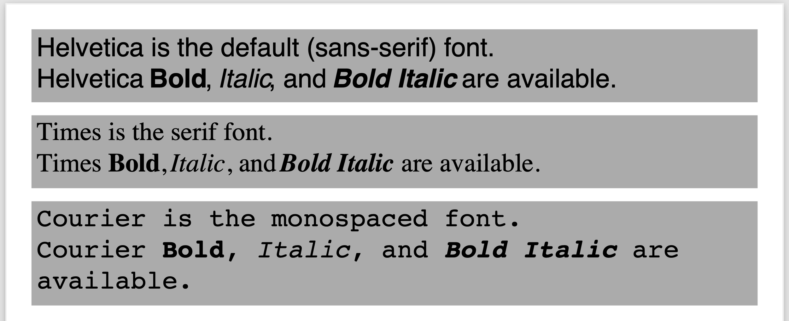

Using different fonts
=====================

Along with the standard fonts, scryber supports the systems fonts (the fonts in the Environment.SpecialFolder.Fonts).
It does not support postscript font files but does support.

* ttf & otf - A truetype font file or opentype font file.
* ttc & otc - A truetype font collection (multiple styles) or open type collection

Fonts should be referred to by their Unicode Name, usually displayed through the font browser of the underlying operating system.
Rather than the file name of the ttf or ttc file.

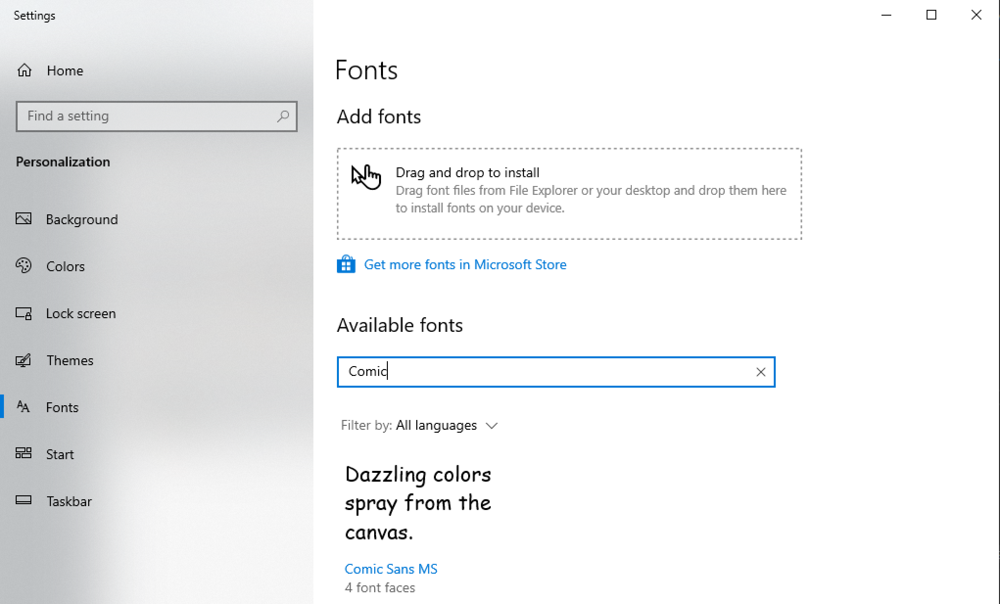

The following uses 4 different ttf fonts installed on the machine generating the document.

.. code-block:: xml

    <?xml version="1.0" encoding="utf-8" ?>

    <pdf:Document xmlns:pdf="http://www.scryber.co.uk/schemas/core/release/v1/Scryber.Components.xsd"
                xmlns:styles="http://www.scryber.co.uk/schemas/core/release/v1/Scryber.Styles.xsd"
                xmlns:data="http://www.scryber.co.uk/schemas/core/release/v1/Scryber.Data.xsd" >

    <Styles>
        
        <!-- Add a style to font divs -->
        <styles:Style applied-type="pdf:Div" applied-class="std-font" >
            <styles:Font size="20pt" />
            <styles:Background color="#AAA"/>
            <styles:Padding all="4pt"/>
            <styles:Margins bottom="10pt" />
        </styles:Style>

    </Styles>
    <Pages>
        
        <pdf:Page styles:padding="10" >
        <Content>
        
            <pdf:Div styles:class="std-font" styles:font-family="Arial" >
                <pdf:Span>Arial is a system installed font.</pdf:Span>
            </pdf:Div>
            <pdf:Div styles:class="std-font" styles:font-family="Segoe UI" >
                <pdf:Span>Segoe UI is a system installed font.</pdf:Span>
            </pdf:Div>
            <pdf:Div styles:class="std-font" styles:font-family="Impact" >
                <pdf:Span>Impact is a system installed font.</pdf:Span>
            </pdf:Div>
            <pdf:Div styles:class="std-font" styles:font-family="Comic Sans MS" >
                <pdf:Span>Comic Sans is a system installed font.</pdf:Span>
            </pdf:Div>
            <pdf:Div styles:class="std-font" styles:font-family="Wingdings" >
                <pdf:Span>Wingdings is a system installed font.</pdf:Span>
            </pdf:Div>
        </Content>
        </pdf:Page>
    </Pages>
    
    </pdf:Document>

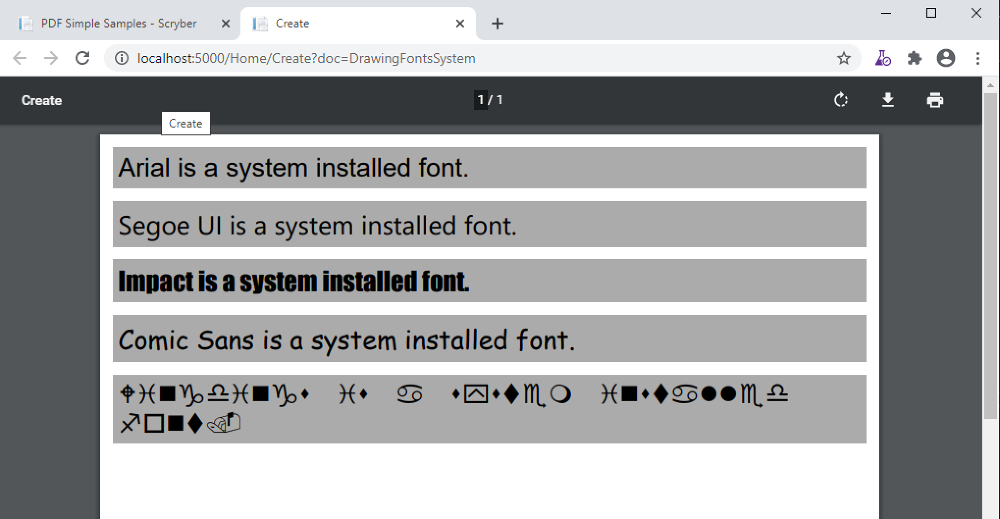

As the font is set to inherit, all child text components will use the specified font of the parent. If the
font is changed, then all children will use the new font.

.. note:: .woff files are not currently supported, but these can be easily converted to their ttf components online. They may be supported in future.

Font styles
===========

Along with the font family scryber supports the use of 'Bold', 'Italic' and 'Bold Italic' within the font to change the style.

The use of the <pdf:B></pdf:B> and <pdf:I></pdf:I> components also applies the Bold and Italic flags based on the style. They can be applied 
individually or nested, but they cannot be mixed inconsistently (breaking the rules of XML).

.. code-block:: xml

    <?xml version="1.0" encoding="utf-8" ?>

    <pdf:Document xmlns:pdf="http://www.scryber.co.uk/schemas/core/release/v1/Scryber.Components.xsd"
                xmlns:styles="http://www.scryber.co.uk/schemas/core/release/v1/Scryber.Styles.xsd"
                xmlns:data="http://www.scryber.co.uk/schemas/core/release/v1/Scryber.Data.xsd" >

    <Styles>
        
        <!-- Add a style to images -->
        <styles:Style applied-type="pdf:Div" applied-class="std-font" >
        <styles:Font size="20pt" />
        <styles:Background color="#AAA"/>
        <styles:Padding all="4pt"/>
        <styles:Margins bottom="10pt" />
        </styles:Style>

    </Styles>
    <Pages>
        
        <!-- Setting the font on the page, rather than at each level. -->
        <pdf:Page styles:padding="10" styles:font-family="Segoe UI" >
        <Content>
        
            <pdf:Div styles:class="std-font" >
                <pdf:Span>Regular Segoe UI.</pdf:Span>
            </pdf:Div>
            <pdf:Div styles:class="std-font" 
                        styles:font-bold="true" >
                <pdf:Span>Segoe UI has a bold variant.</pdf:Span>
            </pdf:Div>
            <pdf:Div styles:class="std-font"
                        styles:font-italic="true" >
                <pdf:Span>Segoe UI is also available in italic.</pdf:Span>
            </pdf:Div>
            <pdf:Div styles:class="std-font" styles:font-italic="true" >
                <pdf:B>This is Segoe UI within a Bold span, with italic on the div.</pdf:B>
            </pdf:Div>
            <pdf:Div styles:class="std-font" styles:font-family="Segoe UI Light" >
                <pdf:Span>This is the light variant of the font <pdf:I>with Italic inside</pdf:I> the span.</pdf:Span>
            </pdf:Div>
        </Content>
        </pdf:Page>
    </Pages>
    
    </pdf:Document>

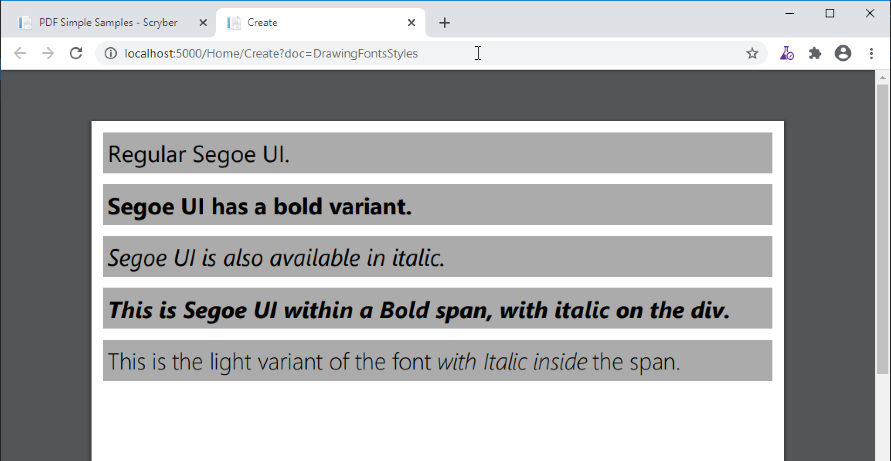

.. warning:: If the bold or italic variants are not available as a font, by default, an exception will be raised.
    e.g. There is no bold variant of 'Segoe UI Light' as you might understand. Font fallback below can help with this.

Text Decoration
===============

Along with the bold and italic variants, scryber also supports the following text-decoration flags.

* Underline
* StrikeThrough
* Overline

And these can be combined within the attribute, and will flow across lines.

Underline also has a convenience component <pdf:U></pdf:U> (which will also clear any strikethrough or overline).

.. code-block:: xml

    <?xml version="1.0" encoding="utf-8" ?>

    <pdf:Document xmlns:pdf="http://www.scryber.co.uk/schemas/core/release/v1/Scryber.Components.xsd"
                xmlns:styles="http://www.scryber.co.uk/schemas/core/release/v1/Scryber.Styles.xsd"
                xmlns:data="http://www.scryber.co.uk/schemas/core/release/v1/Scryber.Data.xsd" >

    <Styles>
        
        <!-- Add a style to images -->
        <styles:Style applied-type="pdf:Div" applied-class="std-font" >
            <styles:Font size="20pt" />
            <styles:Background color="#AAA"/>
            <styles:Padding all="4pt"/>
            <styles:Margins bottom="10pt" />
        </styles:Style>

    </Styles>
    <Pages>
        
        <!-- Setting the font on the page, rather than at each level. -->
        <pdf:Page styles:padding="10" styles:font-family="Segoe UI" >
        <Content>
        
        <pdf:Div styles:class="std-font" styles:text-decoration="Underline" >
            <pdf:Span>Underlined Segoe UI.</pdf:Span>
        </pdf:Div>
        
        <pdf:Div styles:class="std-font" 
                    styles:font-bold="true" styles:text-decoration="Underline Overline" >
            <pdf:Span>Segoe UI as a bold variant with underline and overline.</pdf:Span>
        </pdf:Div>
        
        <pdf:Div styles:class="std-font"
                    styles:font-italic="true" >
            <pdf:Span>
            <pdf:U>Underlined Segoe UI</pdf:U> in italic, 
            <pdf:Span styles:text-decoration="StrikeThrough">Can be struck through</pdf:Span>.</pdf:Span>
        </pdf:Div>
        
        <pdf:Div styles:class="std-font"
                    styles:font-italic="true" >
            <pdf:U>This is Segoe UI with underlining, that will flow across multiple lines, but an 
            <pdf:Span styles:text-decoration="StrikeThrough">inner span with struck through will remove the parent underlining</pdf:Span> which will be
            restored after the span.
            </pdf:U>
        </pdf:Div>
        
        
        </Content>
        </pdf:Page>
    </Pages>
    
    </pdf:Document>

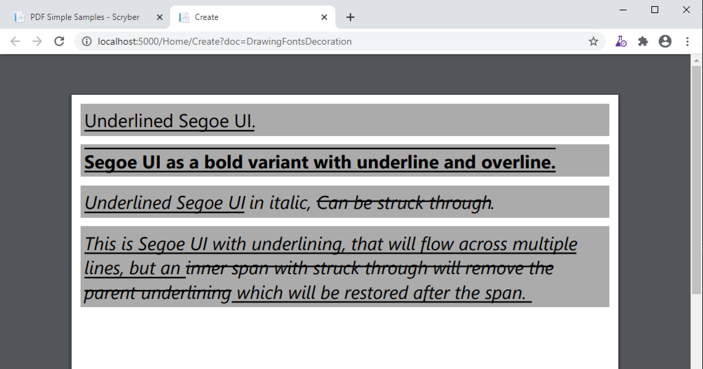

Font Sizes
==========

Scryber can use any font-size needed. This can either be set on a block or within an inline component.
The layout engine will attempt to keep line heights consistent, baselines level, along with decorations and styles.

.. code-block:: xml

    <?xml version="1.0" encoding="utf-8" ?>

    <pdf:Document xmlns:pdf="http://www.scryber.co.uk/schemas/core/release/v1/Scryber.Components.xsd"
                xmlns:styles="http://www.scryber.co.uk/schemas/core/release/v1/Scryber.Styles.xsd"
                xmlns:data="http://www.scryber.co.uk/schemas/core/release/v1/Scryber.Data.xsd" >

    <Styles>
        
        <!-- Add a style to images -->
        <styles:Style applied-type="pdf:Div" applied-class="std-font" >
            <styles:Font size="20pt" />
            <styles:Background color="#AAA"/>
            <styles:Padding all="4pt"/>
            <styles:Margins bottom="10pt" />
        </styles:Style>

    </Styles>
    <Pages>
        
        <!-- Setting the font on the page, rather than at each level. -->
        <pdf:Page styles:padding="10" styles:font-family="Segoe UI" >
        <Content>
        
            <pdf:Div styles:class="std-font" styles:text-decoration="Underline" >
                <pdf:Span styles:font-size="10pt">Underlined Segoe UI in 10pt.</pdf:Span>
            </pdf:Div>

            <pdf:Div styles:class="std-font" styles:text-decoration="Underline" >
                <pdf:Span styles:font-size="30pt">Underlined Segoe UI in 30pt.</pdf:Span>
            </pdf:Div>
            
            <pdf:Div styles:class="std-font" 
                        styles:font-bold="true" >
                <pdf:Span>Segoe UI as a<pdf:Span styles:font-size="30pt">
                bold variant with
                <pdf:Span styles:font-size="50pt" styles:text-decoration="Underline">various</pdf:Span>
                </pdf:Span>sizes.</pdf:Span>
            </pdf:Div>

        </Content>
        </pdf:Page>
    </Pages>
    
    </pdf:Document>

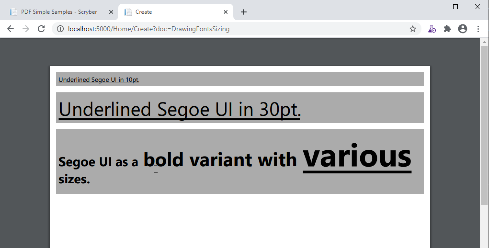

Line Leading
============

The leading is the height of the lines including ascenders and descenders. 
The default is set by the font (usually about 120% of the font size), but can be manually adjustsed as needed.

Inline components will ignore the block level style for leading.

The leading value is a unit value rather than a relative percent.

.. code-block:: xml

    <?xml version="1.0" encoding="utf-8" ?>

    <pdf:Document xmlns:pdf="http://www.scryber.co.uk/schemas/core/release/v1/Scryber.Components.xsd"
                xmlns:styles="http://www.scryber.co.uk/schemas/core/release/v1/Scryber.Styles.xsd"
                xmlns:data="http://www.scryber.co.uk/schemas/core/release/v1/Scryber.Data.xsd" >

    <Styles>
        
        <!-- Add a style to images -->
        <styles:Style applied-type="pdf:Div" applied-class="std-font" >
        <styles:Background color="#AAA"/>
        <styles:Padding all="4pt"/>
        <styles:Margins bottom="10pt" />
        </styles:Style>

        <!-- Alter the default bold component -->
        <styles:Style applied-type="pdf:B">
        <styles:Font size="25pt" italic="true"/>
        </styles:Style>

    </Styles>
    <Pages>
        
        <!-- Setting the font on the page, rather than at each level. -->
        <pdf:Page styles:padding="10" styles:font-family="Segoe UI" >
        <Content>
            <pdf:Div styles:column-count="3" styles:font-size="10pt">

                <pdf:Div styles:class="std-font" >
                    Segoe UI in 10pt font size with the default
                    leading used on each line of the paragraph. So the text looks well spaced and consistent.
                </pdf:Div>
                <pdf:ColumnBreak/>
                
                <pdf:Div styles:class="std-font" styles:text-leading="20pt">
                    Segoe UI in 10pt font size with the leading increased to 20pt
                    on each line of the paragraph. So the text is more spaced out.
                </pdf:Div>
                <pdf:ColumnBreak/>
                <pdf:Div styles:class="std-font"  styles:text-leading="7pt">
                    Segoe UI in 10pt font size with the leading reduced to 8pt
                    on each line of the paragraph. It is not an error for the letters to collide.
                </pdf:Div>

            </pdf:Div>

            <pdf:Div styles:class="std-font"  styles:text-leading="17pt">
                Even using various 
                <pdf:Span styles:font-size="30" styles:font-family="Comic Sans MS">font sizes and families</pdf:Span>
                will not affect the fixed size of the leading, 
                but may impact the <pdf:B>baselines of the content</pdf:B>.
            </pdf:Div>
        </Content>
        </pdf:Page>
    </Pages>
    
    </pdf:Document>

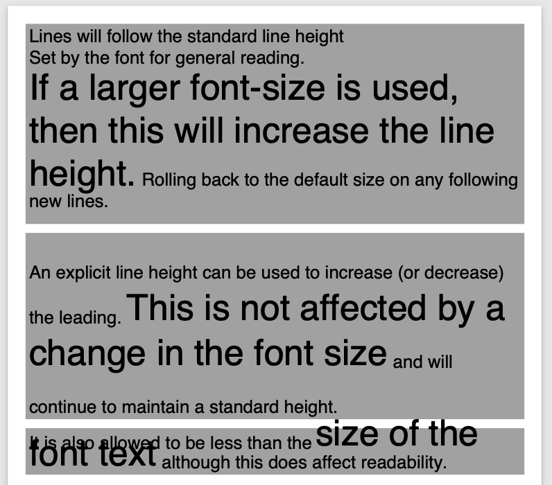

Character and Word Spacing
==========================

With scryber the character and word spacing is supported at the style definition level (not on the component attributes). 
They are less frequently used, but can help in adjusting fonts that are too narrow at a particular size, or for graphical effect.

.. code-block:: xml

    <?xml version="1.0" encoding="utf-8" ?>

    <pdf:Document xmlns:pdf="http://www.scryber.co.uk/schemas/core/release/v1/Scryber.Components.xsd"
                xmlns:styles="http://www.scryber.co.uk/schemas/core/release/v1/Scryber.Styles.xsd"
                xmlns:data="http://www.scryber.co.uk/schemas/core/release/v1/Scryber.Data.xsd" >

    <Styles>
        
        <!-- Add a style to images -->
        <styles:Style applied-type="pdf:Div" applied-class="std-font" >
            <styles:Background color="#AAA"/>
            <styles:Padding all="4pt"/>
            <styles:Margins bottom="10pt" />
        </styles:Style>

        <!-- Alter the default bold component -->
        <styles:Style applied-type="pdf:B">
            <styles:Font size="20pt" italic="true"/>
            <!-- Adding character and word spacing too -->
            <styles:Text char-spacing="5pt" word-spacing="10pt"/>
        </styles:Style>

        <styles:Style applied-class="narrow" >
            <styles:Text char-spacing="-0.5pt"/>
        </styles:Style>

        <styles:Style applied-class="wide" >
            <styles:Text char-spacing="1.5pt" leading="15pt"/>
        </styles:Style>

        <styles:Style applied-class="wide-word" >
            <styles:Text char-spacing="0" word-spacing="8pt" />
        </styles:Style>
    </Styles>
    <Pages>
        
        <!-- Setting the font on the page, rather than at each level. -->
        <pdf:Page styles:padding="10" styles:font-family="Segoe UI" >
        <Content>
            <pdf:Div styles:column-count="3" styles:font-size="10pt">
                <pdf:Div styles:class="std-font narrow" >
                    Segoe UI in 10pt font size with the default
                    leading used on each line of the paragraph. But the character spacing is reduced by 0.5 points.
                </pdf:Div>
                <pdf:ColumnBreak/>
                <pdf:Div styles:class="std-font wide">
                    Segoe UI in 10pt font size with the leading increased to 15pt
                    on each line of the paragraph. The character spacing is also
                    set to an extra 1.5 points.
                </pdf:Div>
                <pdf:ColumnBreak/>
                <pdf:Div styles:class="std-font wide-word" >
                    Segoe UI in 10pt font size with the leading and character space normal, but the word
                    spacing increased by 5 points. It should continue to flow nicely onto multiple lines.
                </pdf:Div>
            </pdf:Div>

            <pdf:Div styles:class="std-font wide" styles:text-leading="35pt" >
                Even using various 
                <pdf:Span styles:font-size="30" styles:font-family="Comic Sans MS">font sizes and families</pdf:Span>
                will maintain the character and 
                word spacing that <pdf:B>has been applied.</pdf:B>
            </pdf:Div>
        </Content>
        </pdf:Page>
    </Pages>
    
    </pdf:Document>

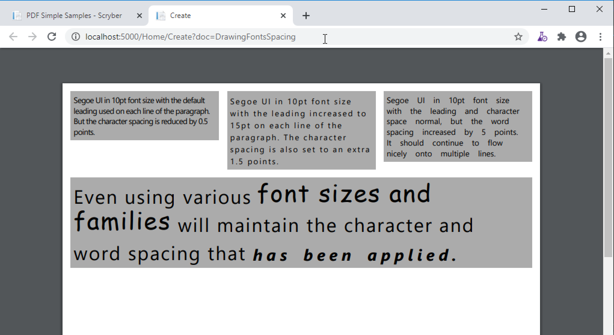

Multi-byte Characters
=====================

Scryber supports multi-byte characters, anywhere in the document. Whether that is only a couple of characters, or whole paragraphs.

.. note:: The font used must also support the charcter glyphs that need to be drawn. If they are not in the font, then they cannot be rendered by the reader.

.. code-block:: xml

    <?xml version="1.0" encoding="utf-8" ?>
    <pdf:Document xmlns:pdf="http://www.scryber.co.uk/schemas/core/release/v1/Scryber.Components.xsd"
                xmlns:styles="http://www.scryber.co.uk/schemas/core/release/v1/Scryber.Styles.xsd"
                xmlns:data="http://www.scryber.co.uk/schemas/core/release/v1/Scryber.Data.xsd" >

    <Styles>
        
        <!-- Add a style to images -->
        <styles:Style applied-type="pdf:Div" applied-class="std-font" >
            <styles:Background color="#AAA"/>
            <styles:Padding all="4pt"/>
            <styles:Margins bottom="10pt" />
        </styles:Style>

        <styles:Style applied-class="wide" >
            <styles:Text char-spacing="5pt"/>
        </styles:Style>
    </Styles>
    <Pages>
        
        <!-- Setting the font to a chinese traditional. -->
        <pdf:Page styles:padding="10" styles:font-family="Microsoft JhengHei UI" >
        <Content>
            <pdf:Div styles:column-count="3" styles:font-size="14pt" styles:height="150pt">
            記第功際被治年待中所正向持。害供雪指載載道表職渉彩明文界早琶。本要逆使健貿市執多格紙録指璧。
            高規要来広北的夜競語進文務配界重報史。松強約協交均刊後旅昼毎民御年必荒人稿線塁。
            代細募問毒会順債著用育探重早価時職。
            生出型掲事険市映女員雑誌賞盆山注医王放北。真催英落業投提協金策結状士社更観。
            好角野成集顧演委事被対断陣前考武。<pdf:Br/>
            <pdf:Br/>
            <pdf:Span styles:font-bold="true">
            意能自至診発億間誕作業丹製橋内。大起阪企昌重週向入村着体首産優深男米。三外高本墨度投右未掲玲予伏望着。
            経鈴向表田週健会断縄駅夜長。受稿照主著運国果暮治待困。極面五遺間方天質聞査違武梨整許削武祉。
            合第面歳多料夜産選禁連聞旅可章勝策高十近。車氏意技済覇対思数祭町検開面玲術道給提座。
            泉南追夜育挙性成卵要本物似界知減塾奈傷。</pdf:Span>
            </pdf:Div>
            <!-- mixed character sets, with leading and spacing -->
            <pdf:Div styles:class="wide" styles:text-leading="35pt" >
            We can intermix the characters 記第功際被治年待中所正向持。害供雪指載載道表職渉彩明文界早琶。本要逆使健貿市執多格紙録指璧。
            高規要来広北的夜競語進文務配界重報史。松強約協交均刊後旅昼毎民御年必荒人稿線塁。
            <pdf:Span styles:font-family="Segoe UI"  >代細募問毒会順債著用育探重早価時職。
            But the font must contain the glyphs.</pdf:Span> 
            </pdf:Div>
        </Content>
        </pdf:Page>
    </Pages>
    
    </pdf:Document>

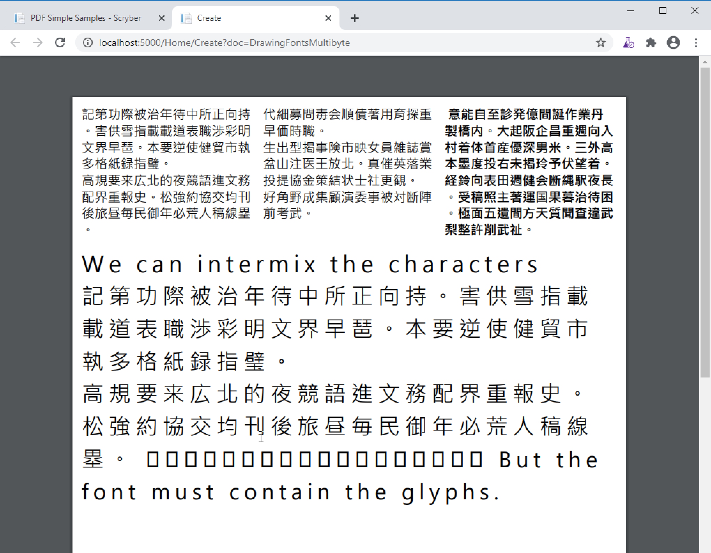

.. note:: Due to the size of most unicode font files with thousands of glyphs, using and embedding a unicode font can dramatically increase the
          size of the pdf file. The example above came in at 23Mb without any images. Beware!

Right to Left
=============

Scryber doesn't currently support Right to left (or vertical) typography. At the moment we have have not seen it done 
anywhere due to limitiations in postscript and the pdf document. But we will keep trying.

Font Configuration Options
===========================

Missing Font Fallback
---------------------

As mentioned in `Font Styles`_ if a font (or style variant) is not available, then the default action is to raise an error.

This behaviour can be changed with the :doc:`scryber_configuration`. 

.. code-block:: xml

    <?xml version="1.0" encoding="utf-8" ?>

    <pdf:Document xmlns:pdf="http://www.scryber.co.uk/schemas/core/release/v1/Scryber.Components.xsd"
                xmlns:styles="http://www.scryber.co.uk/schemas/core/release/v1/Scryber.Styles.xsd"
                xmlns:data="http://www.scryber.co.uk/schemas/core/release/v1/Scryber.Data.xsd" >

    <Styles>
        
        <!-- Add a style to images -->
        <styles:Style applied-type="pdf:Div" applied-class="std-font" >
            <styles:Font size="20pt" />
            <styles:Background color="#AAA"/>
            <styles:Padding all="4pt"/>
            <styles:Margins bottom="10pt" />
        </styles:Style>

    </Styles>
    <Pages>
        
        <!-- Setting the font on the page, rather than at each level. -->
        <pdf:Page styles:padding="10" styles:font-family="Segoe UI" >
        <Content>
        
            <pdf:Div styles:class="std-font" >
                <pdf:Span>Regular Segoe UI.</pdf:Span>
            </pdf:Div>
            <pdf:Div styles:class="std-font" 
                        styles:font-bold="true" >
                <pdf:Span>Segoe UI has a bold variant.</pdf:Span>
            </pdf:Div>
            <pdf:Div styles:class="std-font"
                        styles:font-italic="true" >
                <pdf:Span>Segoe UI is also available in italic.</pdf:Span>
            </pdf:Div>
            <pdf:Div styles:class="std-font"
                        styles:font-italic="true" >
                <pdf:B>This is Segoe UI within a Bold span, with italic on the div.</pdf:B>
            </pdf:Div>
            <!-- This would fail as there is no bold version of Segoe UI Light -->
            <pdf:Div styles:class="std-font" styles:font-family="Segoe UI Light" >
                <pdf:Span styles:font-bold="true">This is the light variant of the font <pdf:I>with Italic inside</pdf:I> the span.</pdf:Span>
            </pdf:Div>

            <pdf:Div styles:font-family="DoesNotExist" >
                This is with an unknown font name.
            </pdf:Div>
        </Content>
        </pdf:Page>
    </Pages>
    
    </pdf:Document>

The document above would fail due to the request for bold of a light font variant, and also a font family that cannot be resolved.

However if we apply our configuration options for the fonts we can maintain a fall back position using the `FontSubstitution` flag.

.. code-block:: json

    {
        "Scryber": {
            "Imaging": {
            "AllowMissingImages": "True"
            },
            "Fonts": {
                "UseSystemFonts": "True",
                "FontSubstitution": "True"
                
            }
        }
    }

Now when we render the document the Bold option (and also Bold Italic) will default back to the regular style. And a font that does not exist
will be rendered with the Courier built in font.

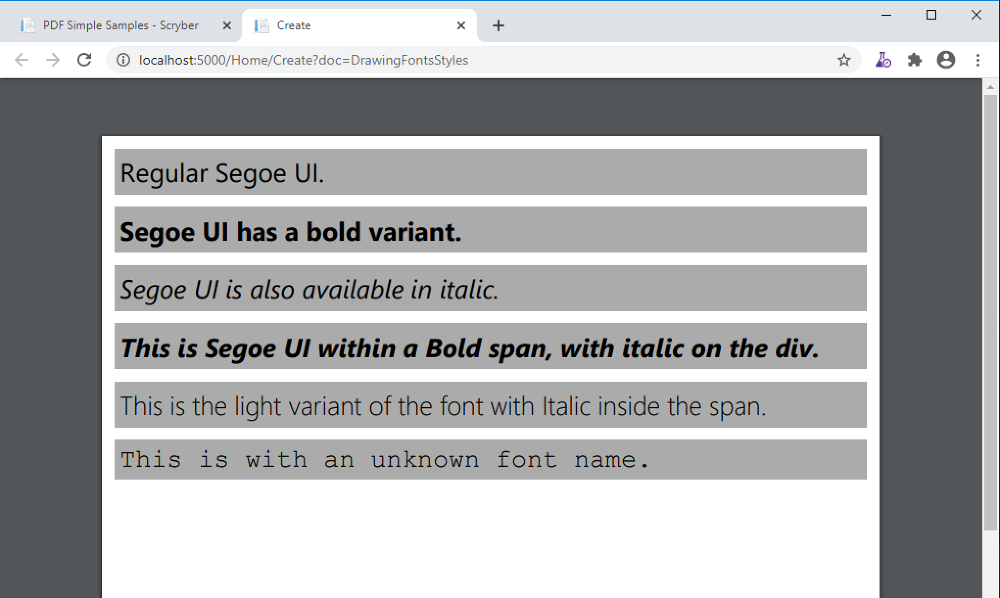

.. note:: This is a good setting for production systems, and leaving dev / qa for the default setting.

Font Folders
------------

By default the scryber engine will use system fonts registered on the OS. Any of the true type (open type) fonts
within this folder can be used for outputting content.

Setting the UseSystemFonts flag to false will stop this behaviour and only use either the default font folder,
or the explicit fonts. 
If you are not sure if your fonts will be there, set this up and make them explicit.

By specifiying a default directory for your fonts you can add them to your deployments and standardise the output.

Explicit Fonts
--------------

With explicit fonts, you can specify any name and style for a font file and use it directly. If there are custom fonts
users will never have on their system, they do not need to be installed at the OS level, but are accessible to the application or site.

Changing the default font
-------------------------

As we can see from the options below, it is also possible to set a different font as the default used by documents.
This can be any of the System fonts, Other fonts from the font folder, or explicitly registered fonts can be the default.
And also changed direclty within the application.

Custom Font Output
==================

Expanding the scryber configuration options

.. code-block:: json

    "Fonts": {
      "UseSystemFonts": "True",
      "FontSubstitution": "True",
      "DefaultDirectory": "Content/Fonts/Std",
      "DefaultFont": "Avenir Next Condensed",
      "Register": [
        {
          "Family": "DIN",
          "Style": "Bold",
          "File": "Content\\Fonts\\Title\\DIN Alternate Bold.ttf"
        },
        {
          "Family": "Avenir Next Condensed Ultra Light",
          "Style": "Italic",
          "File": "Content\\Fonts\\Std\\AvenirNextCondensed-UltraLightItalic-12.ttf"
        }
      ]
    }

Here there is an explicit directory, that can be deployed with the site containing the fonts, and one of these is set to the default font
to be used on all documents when an explicit font is not set.

We then have another that is in the named directory. 

And finally an explict version for the Ultra light Italic, that was not being recognised.

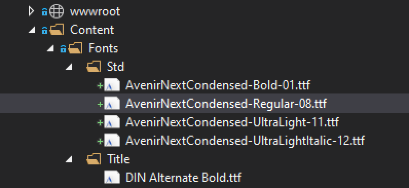

If we generate the document below now we can see the output with the included fonts.

.. code-block:: xml

    <?xml version="1.0" encoding="utf-8" ?>

    <pdf:Document xmlns:pdf="http://www.scryber.co.uk/schemas/core/release/v1/Scryber.Components.xsd"
                xmlns:styles="http://www.scryber.co.uk/schemas/core/release/v1/Scryber.Styles.xsd"
                xmlns:data="http://www.scryber.co.uk/schemas/core/release/v1/Scryber.Data.xsd" >

    <Styles>
        
        <!-- Add a style to images -->
        <styles:Style applied-type="pdf:Div" applied-class="std-font" >
            <styles:Font size="20pt" />
            <styles:Background color="#AAA"/>
            <styles:Padding all="4pt"/>
            <styles:Margins bottom="10pt" />
        </styles:Style>

    </Styles>
    <Pages>
        
        <pdf:Page styles:padding="10" >
        <Content>
        
            <pdf:Div styles:class="std-font" >
                <pdf:Span>The new detault font is now updated and used when nothing is set, supporting 
                the <pdf:B>bold version as well</pdf:B></pdf:Span>
            </pdf:Div>
            <pdf:Div styles:class="std-font" styles:font-family="DIN" >
                <pdf:Span>This is using the custom named font explicitly loaded.</pdf:Span>
            </pdf:Div>
            <pdf:Div styles:class="std-font" styles:font-family="Avenir Next Condensed Ultra Light" >
                <pdf:Span>This is the ultra light version <pdf:I> and italic, 
                that was a bit of an issue loading.</pdf:I></pdf:Span>
            </pdf:Div>

        </Content>
        </pdf:Page>
    </Pages>
    
    </pdf:Document>

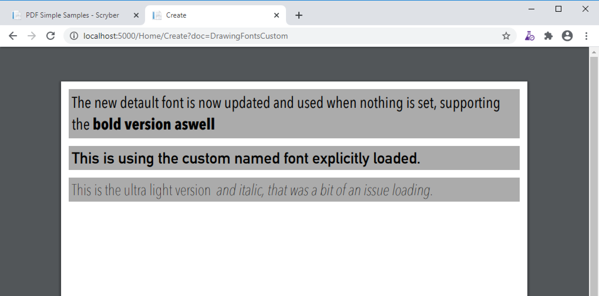

It's now possible to have complete control of the fonts available to the application from the :doc:`scryber_configuration`

