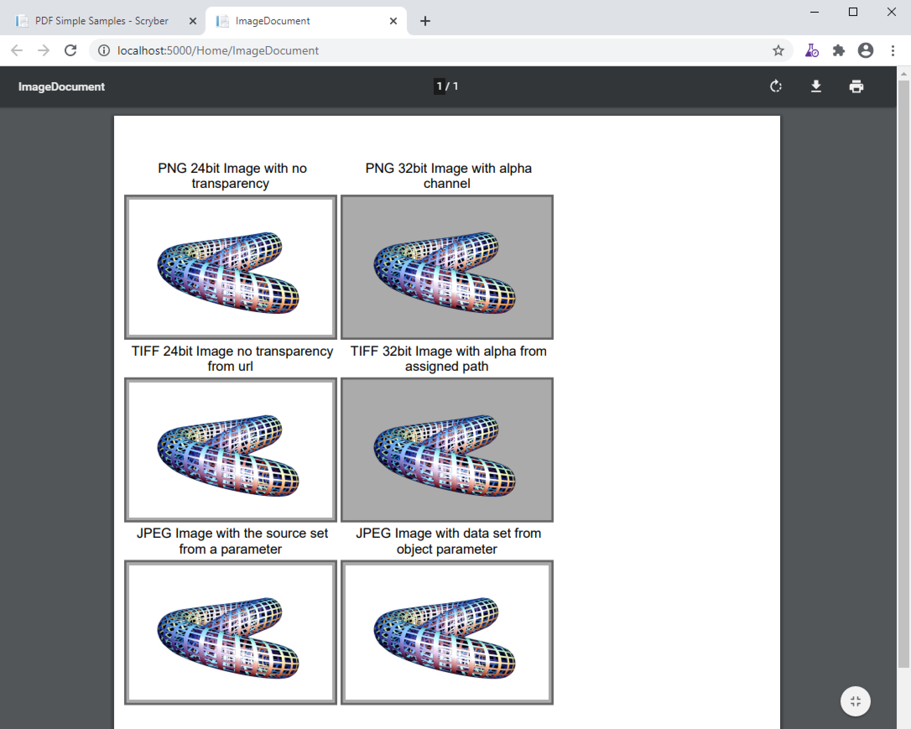

======================================
Images in documents
======================================

Scryber supports most standard image types, including the following.

* GIF - 1 & 8 bit, 
* TIFF - 1, 8, 24 and 32 bit alpha, Indexed, RGB and CMYK.
* PNG  - 8, 24 and 32 bit alpha, RGB.
* JPEG - 24 bit RGB.

Adding an image to the output is as simple as putting an `<pdf:Image src='[path]' />` in the template.
If the image has an alpha channel this will automatically be applied to the image.

Rendering an image.
=============================

Images paths can be referenced relative to the file path of the parsed document.

e.g. ../../Content/images/filename.ext

Or it can be the full url or full file path to the image.

e.g. http://localhost:5000/images/Toroid32.tiff

The path can even be specified in a parameter.

.. note:: If the image component is declared on a file referenced from the document, then the image path should still be relative to the file where the image component is declared. Not the top level document. 

.. code-block:: xml

    <?xml version="1.0" encoding="utf-8" ?>
    <pdf:Document xmlns:pdf="http://www.scryber.co.uk/schemas/core/release/v1/Scryber.Components.xsd"
                xmlns:styles="http://www.scryber.co.uk/schemas/core/release/v1/Scryber.Styles.xsd"
                xmlns:data="http://www.scryber.co.uk/schemas/core/release/v1/Scryber.Data.xsd" >
    <Params>
        <pdf:String-Param value="../../Content/Images/Toroid24.jpg" id="toroidPath" />
    </Params>
    <Styles>
        
        <!-- Add a style to images -->
        <styles:Style applied-type="pdf:Image" >
            <styles:Border color="#666" style="Solid" width="2pt" />
            <styles:Background color="#AAA"/>
            <styles:Padding all="4pt"/>
            <styles:Margins bottom="4pt" top="4pt"/>
        </styles:Style>

        <!-- Div wrapper style -->
        <styles:Style applied-class="img-wrap">
            <styles:Columns count="3" alley-width="5pt"/>
            <styles:Font size="12pt"/>
            <styles:Position h-align="Center"/>
        </styles:Style>
    </Styles>
    <Pages>
        
        <pdf:Page styles:padding="40 10 20 10" >
        <Content>
        
            <pdf:Div styles:class="img-wrap" >
                
                <pdf:Span> PNG 24bit Image with no transparency</pdf:Span>
                <pdf:Image src="../../Content/Images/Toroid24.png" />
                <pdf:ColumnBreak/>

                <pdf:Span> PNG 32bit Image with alpha channel</pdf:Span>
                <pdf:Image src="../../Content/Images/Toroid32.png" />
                <pdf:ColumnBreak/>

            </pdf:Div>

            <pdf:Div styles:class="img-wrap" >

                <pdf:Span> JPEG Image with the source set from a parameter</pdf:Span>
                <pdf:Image src="{@:toroidPath}" />
                <pdf:ColumnBreak/>

            </pdf:Div>

            <pdf:Div styles:class="img-wrap">

                <pdf:Span> TIFF 24bit Image</pdf:Span>
                <pdf:Image src="http://localhost:5000/images/Toroid24.tiff" />
                <pdf:ColumnBreak/>
                
                <pdf:Span> TIFF 32bit Image with alpha</pdf:Span>
                <pdf:Image src="http://localhost:5000/images/Toroid32.tiff" />

            </pdf:Div>
        
        </Content>
        </pdf:Page>
    </Pages>
    
    </pdf:Document>

Explicit image data
===================

Images as backgrounds
=====================

Images as fills
================

Dynamic Images
==============