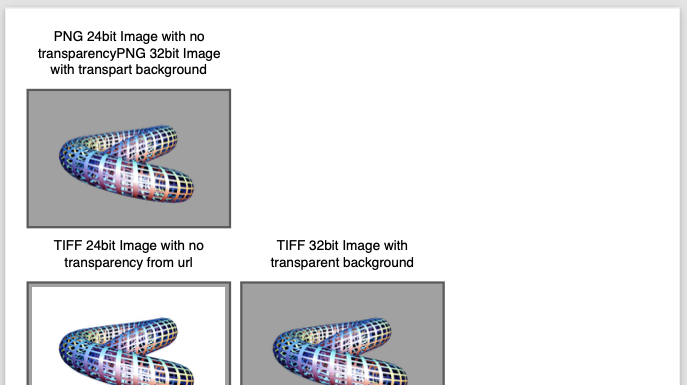
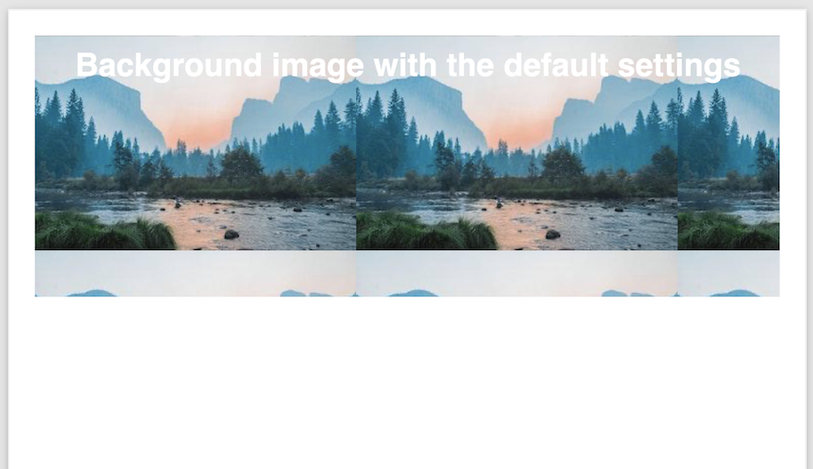
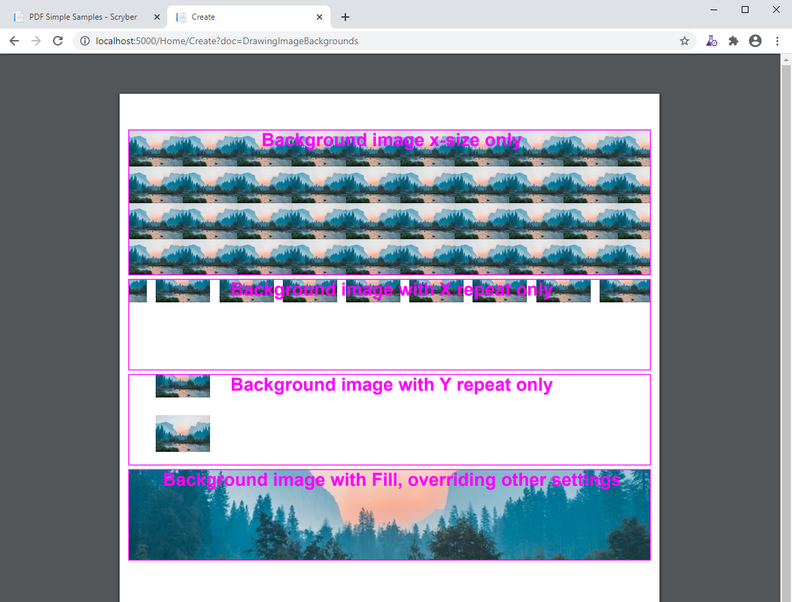
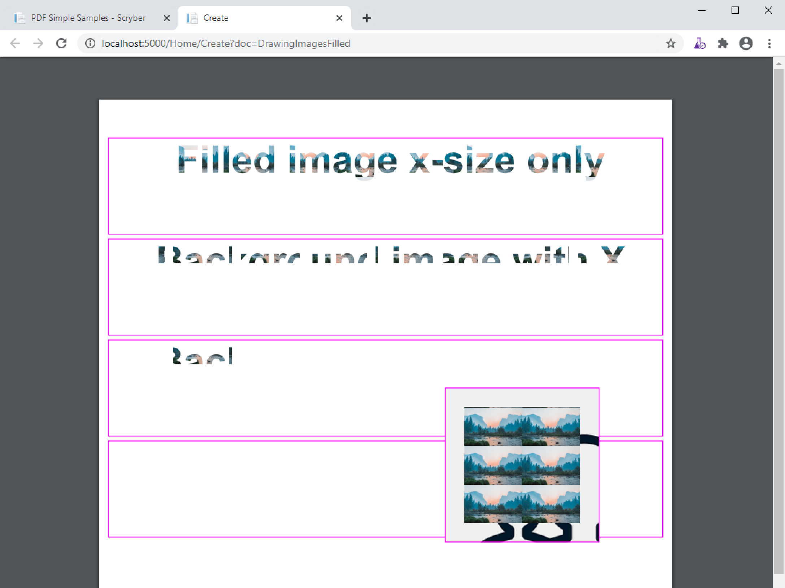

======================================
Images in documents
======================================

Scryber supports most standard image types, including the following.

* GIF - 1 & 8 bit, 
* TIFF - 1, 8, 24 and 32 bit alpha, Indexed, RGB and CMYK.
* PNG  - 8, 24 and 32 bit alpha, RGB.
* JPEG - 24 bit RGB.

Adding an image to the output is as simple as putting an `<pdf:Image src='[path]' />` in the template.
If the image has an alpha channel this will automatically be applied to the image.

Image Source Paths.
=============================

The source for an image path can be referenced relative to the current file being parsed.

e.g. ../../Content/images/filename.ext

Or it can be the full url or full file path to the image.

e.g. http://localhost:5000/images/Toroid32.tiff

.. note:: If the image component is declared on a file referenced from the document, then the image path should still be relative to the file where the image component is declared. Not the top level document. 

Explicit image data
===================

Data can be set on the image explicitly when loaded, using the Scryber.Drawing.PDFImageData class.
This class has a range of static methods to load the images from existing bitmaps, local files or streams.

And the image data can then be assigned to an image component directly, or via an object parameter

Image Sizing
============

Without an explicit size the images will be rendered at the natural size, if it fits in the container. 

If it does not fit in the container it will be reduced in size to fit. 
See :doc:`component_sizing` for more about sizing images with widths and heights.

Rendering Images
=================

Once the path or data are set, it's just a case of rendering the document in the normal way.

.. code-block:: xml

    <?xml version="1.0" encoding="utf-8" ?>
    <pdf:Document xmlns:pdf="http://www.scryber.co.uk/schemas/core/release/v1/Scryber.Components.xsd"
                xmlns:styles="http://www.scryber.co.uk/schemas/core/release/v1/Scryber.Styles.xsd"
                xmlns:data="http://www.scryber.co.uk/schemas/core/release/v1/Scryber.Data.xsd" >
    <Params>
        <!-- Parameters for the path and binary data -->
        <pdf:String-Param value="../../Content/Images/Toroid24.jpg" id="toroidPath" />
        <pdf:Object-Param id="toroidBin"/>
    </Params>
    <Styles>
        
        <!-- Add a style to images
             with a background and border -->
        <styles:Style applied-type="pdf:Image" >
        <styles:Border color="#666" style="Solid" width="2pt" />
        <styles:Background color="#AAA"/>
        <styles:Padding all="4pt"/>
        <styles:Margins bottom="4pt" top="4pt"/>
        </styles:Style>

        <!-- Div wrapper style -->
        <styles:Style applied-class="img-wrap">
        <styles:Columns count="3" alley-width="5pt"/>
        <styles:Font size="12pt"/>
        <styles:Position h-align="Center"/>
        </styles:Style>
    </Styles>
    <Pages>
        
        <pdf:Page styles:padding="40 10 20 10" >
        <Content>
        
        <pdf:Div styles:class="img-wrap" >
            
            <pdf:Span> PNG 24bit Image with no transparency</pdf:Span>
            <pdf:Image src="../../Content/Images/Toroid24.png" />
            <pdf:ColumnBreak/>

            <pdf:Span> PNG 32bit Image with alpha channel</pdf:Span>
            <pdf:Image src="../../Content/Images/Toroid32.png" />

        </pdf:Div>

        <pdf:Div styles:class="img-wrap">

            <pdf:Span> TIFF 24bit Image no transparency from url</pdf:Span>
            <pdf:Image src="http://localhost:5000/images/Toroid24.tiff" />
            <pdf:ColumnBreak/>
            
            <pdf:Span> TIFF 32bit Image with alpha from assigned path</pdf:Span>
            <pdf:Image id="tiff32" />

        </pdf:Div>

        <pdf:Div styles:class="img-wrap" >

            <pdf:Span> JPEG Image with the source set from a parameter</pdf:Span>
            <pdf:Image src="{@:toroidPath}" />
            <pdf:ColumnBreak/>

            <pdf:Span> JPEG Image with data set from object parameter</pdf:Span>
            <pdf:Image img-data="{@:toroidBin}" />
            
        </pdf:Div>
        
        </Content>
        </pdf:Page>
    </Pages>
    
    </pdf:Document>

.. code-block:: csharp

        public IActionResult ImageDocument()
        {
            // get the execution root, and path to the document.
            var root = _env.ContentRootPath;
            var path = System.IO.Path.Combine(root, "Views", "PDF", "DrawingImages.pdfx");
            path = System.IO.Path.GetFullPath(path);

            using(var doc = PDFDocument.ParseDocument(path))
            {
                var images = System.IO.Path.Combine(root, "Content", "Images");
                
                //Set the source path directly on the image
                (doc.FindAComponentById("tiff32") as PDFImage).Source = System.IO.Path.Combine(images, "Toroid32.tiff");

                //Set the source parameter to be used by an image
                doc.Params["toroidPath"] = System.IO.Path.Combine(images, "Toroid24.jpg");

                //Set the Image Data on a parameter from another bitmap or file
                var bmp = LoadImageBitmap();
                var data = PDFImageData.LoadImageFromBitmap("DynamicJpeg", bmp, false);
                
                doc.Params["toroidBin"] = data;

                return this.PDF(doc);
            }
        }

        private System.Drawing.Bitmap LoadImageBitmap()
        {
            //Example method that just returns an image from a file

            var path = _env.ContentRootPath;
            path = System.IO.Path.Combine(path, "Content", "Images", "Toroid24.jpg");

            return System.Drawing.Bitmap.FromFile(path) as System.Drawing.Bitmap;
        }

.. image:: images/documentimagesformat.png

Not found Images
================

If a path is set on an image but not resolved then by default scryber will raise an exception.

.. code-block:: xml

    <?xml version="1.0" encoding="utf-8" ?>
    <pdf:Document xmlns:pdf="http://www.scryber.co.uk/schemas/core/release/v1/Scryber.Components.xsd"
                xmlns:styles="http://www.scryber.co.uk/schemas/core/release/v1/Scryber.Styles.xsd"
                xmlns:data="http://www.scryber.co.uk/schemas/core/release/v1/Scryber.Data.xsd" >
    <Styles>
        
        <!-- Add a style to images -->
        <styles:Style applied-type="pdf:Image" >
            <styles:Border color="#666" style="Solid" width="2pt" />
            <styles:Background color="#AAA"/>
            <styles:Padding all="4pt"/>
            <styles:Margins bottom="4pt" top="4pt"/>
        </styles:Style>

        <!-- Div wrapper style -->
        <styles:Style applied-class="img-wrap">
            <styles:Columns count="3" alley-width="5pt"/>
            <styles:Font size="12pt"/>
            <styles:Position h-align="Center"/>
        </styles:Style>
    </Styles>
    <Pages>
        
        <pdf:Page styles:padding="40 10 20 10" >
        <Content>
        
        <pdf:Div styles:class="img-wrap" >
            <!-- This will raise an exception -->
            <pdf:Span> Image that does not exist</pdf:Span>
            <pdf:Image src="../../Content/Images/NotFound.png" />
            

            <pdf:Span> PNG 32bit Image with alpha channel</pdf:Span>
            <pdf:Image src="../../Content/Images/Toroid32.png" />

        </pdf:Div>

        </Content>
        </pdf:Page>
    </Pages>
    
    </pdf:Document>

This is the safest behaviour, but if this is not the desired behaviour, then there are a couople of options that
change the behaviour to allow missing images.

* On the image itself, if you know it may not be found, simply set the attribute allow-missing-images to true.
* Change the behaviour of scryber as a whole to allow missing images using the configuration options. See :doc:`scryber_configuration`

If the configuration is set to allow missing images, the attribute will override and cause an exception if set to false.
The attribute also supports binding, but is not styles based.

Images as backgrounds
=====================

Images are also supported on the backgrounds of block level components (see :doc:`component_positioning`),
and of fills for shapes, text, etc.

.. code-block:: xml

    <?xml version="1.0" encoding="utf-8" ?>
    <pdf:Document xmlns:pdf="http://www.scryber.co.uk/schemas/core/release/v1/Scryber.Components.xsd"
                xmlns:styles="http://www.scryber.co.uk/schemas/core/release/v1/Scryber.Styles.xsd"
                xmlns:data="http://www.scryber.co.uk/schemas/core/release/v1/Scryber.Data.xsd" >
    <Styles>
        <!-- Div style -->
        <styles:Style applied-class="img-wrap">
            <styles:Columns count="3" alley-width="5pt"/>
            <styles:Font size="12pt"/>
            <styles:Position h-align="Center"/>
            <!-- Set a backgrouns image for the div relative to the document -->
            <styles:Background img-src="../../Content/Images/Landscape.jpg"/>
        </styles:Style>
    </Styles>
    <Pages>
        
        <pdf:Page styles:padding="40 10 20 10" >
        <Content>
            <!-- Minimum height, so we can see the pattern -->
            <pdf:Div styles:class="img-wrap" styles:min-height="260pt" >
                <pdf:Span> Background image with default settings on the div</pdf:Span>
            </pdf:Div>
        
        </Content>
        </pdf:Page>
    </Pages>
    
    </pdf:Document>

The background has been drawn with the image repeating from the top left corner at its natural size, 
clipped to the boundary of the container.

Along with specifying the image background, there are various other options for how the pattern is laid out
that will change the defaults of how the image repeats. Only the background repeat is available on the
component itself, the other 

* The Repeat - 'repeat' or 'styles:bg-repeat' on the component.
    * None - The background will only be shown once.
    * RepeatX - The background will only repeat in the X (horizontal) direction.
    * RepeatY - The background will only repeat in the Y (vertical) direction.
    * Both - The default value, where the image repeats both X and Y directions.
    * Fill - The image will only be shown once, but fill the available container size **(also overrides any of the following size options)**.
* The size of the image of the rendered image.
    * x-size - Determines the vertical height of the rendered background image in units.
    * y-size - Determines the vertical height of the rendered background image in units.
* The starting position of the pattern.
    * x-pos - Determines the horizontal offset of the rendered background image in units.
    * y-pos - Determines the vertical  offset of the rendered background image in units.
* The pattern repeat step.
    * x-step - Sets the horizontal offset between repeating patterns, which can be more or less than the size of the rendered image.
    * y-step - Sets the vertical offset between repeating patterns, which can be more or less than the size of the rendered image.

.. code-block:: xml

    <?xml version="1.0" encoding="utf-8" ?>
    <pdf:Document xmlns:pdf="http://www.scryber.co.uk/schemas/core/release/v1/Scryber.Components.xsd"
                xmlns:styles="http://www.scryber.co.uk/schemas/core/release/v1/Scryber.Styles.xsd"
                xmlns:data="http://www.scryber.co.uk/schemas/core/release/v1/Scryber.Data.xsd" >
    <Styles>
        <!-- Div style -->
        <styles:Style applied-class="img-wrap">
        <styles:Font size="20pt" bold="true"/>
        <styles:Position h-align="Center"/>
        <styles:Border color="fuchsia"/>
        <!-- x-size (or y-size) alone will keep the natural proportions of the image -->
        <styles:Background img-src="../../Content/Images/Landscape.jpg" x-size="60pt" />
        </styles:Style>

        <styles:Style applied-class="bg-pos">
        <styles:Margins top="5pt"/>
        <!-- aplying a specific stating position and step -->
        <styles:Background x-pos="30pt" y-pos="-15pt" x-step="70pt" y-step="60pt" />
        <styles:Size min-height="100pt"/>
        </styles:Style>

        <styles:Style applied-type="pdf:Span">
        <styles:Fill color="fuchsia"/>
        </styles:Style>
    </Styles>
    <Pages> 
        
        <pdf:Page styles:padding="40 10 20 10" >
        <Content>

        <pdf:Div styles:class="img-wrap" styles:min-height="160pt" >
            <pdf:Span> Background image x-size only</pdf:Span>
        </pdf:Div>
        
        <pdf:Div styles:class="img-wrap bg-pos" styles:bg-repeat="RepeatX" >
            <pdf:Span> Background image with X repeat only</pdf:Span>
        </pdf:Div>

        <pdf:Div styles:class="img-wrap bg-pos" styles:bg-repeat="RepeatY" >
            <pdf:Span> Background image with Y repeat only</pdf:Span>
        </pdf:Div>

        <pdf:Div styles:class="img-wrap bg-pos" styles:bg-repeat="Fill" >
            <pdf:Span> Background image with Fill, overriding other settings</pdf:Span>
        </pdf:Div>
            
        </Content>
        </pdf:Page>
    </Pages>
    
    </pdf:Document>

Images as fills
===============

An image can also be used as the fill for text or shapes. It has the same properties and options as 
the background. But will be trimmed around the shape of the component it is filling.

The background and fill are also independent, so can be used together for multiple patterns 
as in the rectangle in the example below.

.. code-block:: xml

    <?xml version="1.0" encoding="utf-8" ?>
    <pdf:Document xmlns:pdf="http://www.scryber.co.uk/schemas/core/release/v1/Scryber.Components.xsd"
                xmlns:styles="http://www.scryber.co.uk/schemas/core/release/v1/Scryber.Styles.xsd"
                xmlns:data="http://www.scryber.co.uk/schemas/core/release/v1/Scryber.Data.xsd" >
    <Styles>
        <!-- Div style -->
        <styles:Style applied-class="img-wrap">
            <styles:Font size="40pt" bold="true"/>
            <styles:Position h-align="Center"/>
            <styles:Border color="fuchsia"/>
            <!-- x-size (or y-size) alone will keep the natural proportions of the image -->
            <styles:Fill img-src="../../Content/Images/Landscape.jpg" x-size="60pt" />
        </styles:Style>

        <styles:Style applied-class="fill-pos">
            <styles:Margins top="5pt"/>
            <!-- aplying a specific stating position and step -->
            <styles:Fill x-pos="30pt" y-pos="-15pt" x-step="70pt" y-step="60pt" />
            <styles:Size min-height="100pt"/>
        </styles:Style>

        
    </Styles>
    <Pages>

        <pdf:Page styles:padding="40 10 20 10" >
        <Content>

            <pdf:Div styles:class="img-wrap" styles:min-height="100pt" >
                <pdf:Span> Filled image x-size only</pdf:Span>
            </pdf:Div>

            <pdf:Div styles:class="img-wrap fill-pos" styles:fill-repeat="RepeatX" >
                <pdf:Span> Filled image with X repeat only</pdf:Span>
            </pdf:Div>

            <pdf:Div styles:class="img-wrap fill-pos" styles:fill-repeat="RepeatY" >
                <pdf:Span> Filled image with Y repeat only</pdf:Span>
            </pdf:Div>

            <pdf:Div styles:class="img-wrap fill-pos" styles:fill-repeat="Fill" >
            <!-- Fill repeat doesn't work at the moment. We are loking at it.-->
                <pdf:Span> Filled image with Fill, overriding other settings</pdf:Span>
            </pdf:Div>

            <!-- A shape with a fill and background image -->
            <pdf:Rect styles:position-mode="Absolute" styles:class="img-wrap"
                        styles:bg-image="../../Content/Images/group.png" styles:padding="20"
                        styles:x="360" styles:y="300" styles:width="120" styles:height="120pt" ></pdf:Rect>
        </Content>
        </pdf:Page>
    </Pages>

    </pdf:Document>

.. note:: The Fill repeat option on the shape or text fill does not currently work. Use the sizing options (for the moment) to replicate the Fill repeat pattern.

Dynamic Images
==============

Sometimes it's not possible to reference an image file, or practical to reference image data in parameters.
There could be a standard source of image data, that you want to use, not directly supported by scryber.

In this case, the best option is to use dynamic image factories. 

With an image factory in the configuration options, any class supporting the IPDFImageDataFactory interface can return a 
dynamic image to the scryber layout engine.

.. code-block:: c#

    using System;
    using Scryber.Drawing;
    using System.Drawing;

    namespace Scryber.Mocks
    {
        //Must implement the IPDFImageDataFactory interface

        public class MockImageFactory : IPDFImageDataFactory
        {
                
            public bool ShouldCache { get { return false; } }

            public PDFImageData LoadImageData(IPDFDocument document, IPDFComponent owner, string path)
            {
                
                try
                {
                    var uri = new Uri(path);
                    var param = uri.GetComponents(UriComponents.Path, UriFormat.Unescaped);
                    var name = System.IO.Path.GetFileNameWithoutExtension(param);

                    // Standard System.Drawing routines to draw a bitmap with the name on.
                    // Could load an image from remote source, use doc parameters, whatever is needed

                    Bitmap bmp = new Bitmap(300, 100);
                    using (Graphics graphics = Graphics.FromImage(bmp))
                    {
                        graphics.FillRectangle(new SolidBrush(Color.LightBlue), new Rectangle(0, 0, 300, 100));
                        graphics.DrawString(name, new Font("Times", 12), new SolidBrush(Color.Blue), PointF.Empty);
                        graphics.Flush();
                    }
                    
                    PDFImageData data = PDFImageData.LoadImageFromBitmap(path, bmp, false);
                    return data;
                }
                catch(Exception ex)
                {
                    throw new ArgumentException("The image creation failed", ex);
                }
            }
        }
    }

For the app settings specify the Factory with a regular expression match on the path 
(in this case '[anything].dynamic', and then specify the type and assembly where the class is defined.

See :doc:`scryber_configuration` for more details on changing the configuration options.

.. code-block:: json

    {
        "Scryber": {
            "Imaging": {
            "AllowMissingImages": "True",
            "ImageCacheDuration": 60,
            "Factories": [
                {
                "Match": ".*\\.dynamic",
                "FactoryType": "Scryber.Mocks.MockImageFactory",
                "FactoryAssembly": "Scryber.UnitTests"
                }
            ]
            }
        }
    }

And then in your template simply specify the image matching the pattern, to invoke the Image Data Factory.

.. code-block:: xml

    <?xml version='1.0' encoding='utf-8' ?>
    <pdf:Document xmlns:pdf='http://www.scryber.co.uk/schemas/core/release/v1/Scryber.Components.xsd'
                xmlns:styles='http://www.scryber.co.uk/schemas/core/release/v1/Scryber.Styles.xsd'
                xmlns:data='http://www.scryber.co.uk/schemas/core/release/v1/Scryber.Data.xsd' >
    <Pages>

        <pdf:Page styles:margins='20pt'>
        <Content>
            <pdf:Span>This is before the image</pdf:Span>

            <!-- A dynamic image that will be generated on the fly -->
            <pdf:Image id='LoadedImage' src='This+is+an+image.dynamic' />

            <pdf:Span>This is after the image</pdf:Span>

        </Content>
        </pdf:Page>
    </Pages>

    </pdf:Document>

.. image:: images/documentimagesdynamic.png

.. note:: Only one instance of the image factory will be created, and it MUST have a parameterless constructor.
