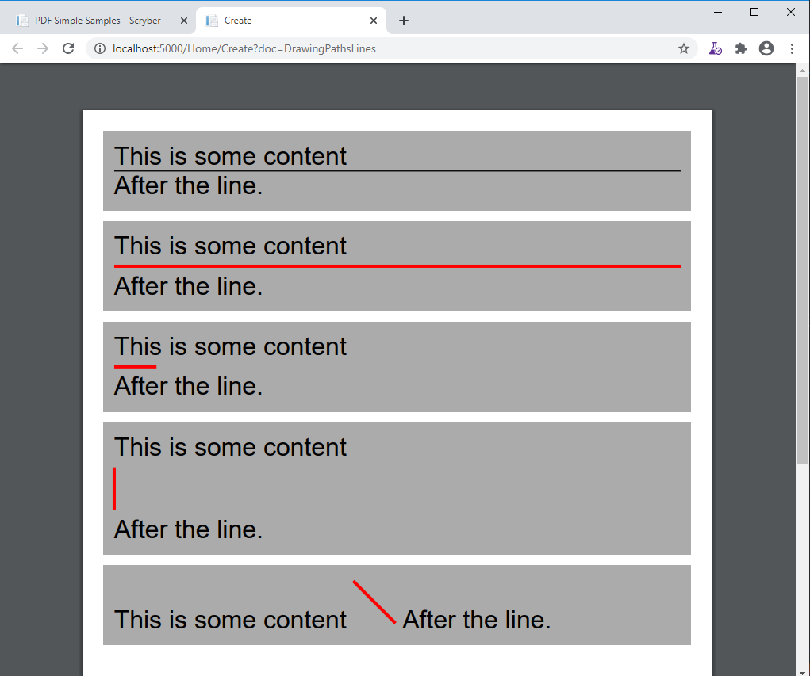

======================================
Drawing paths and shapes - td
======================================

Scryber includes a full drawing capability.

* Lines
* Recangles
* Elipses
* Polygons
* Bezier Curves
* Groups

The drawing components can be either just inline in a document content, or placed directly in a canvas for ease of layout, and compnentization.

Drawing Lines
=============

By default a line will simply extend as a horizontal line block across the available space. Single point width with a black stroke color.
This can be changed using either explicit, or applied style information, with color; width; padding etc.
A width will restrict (or expand) the size horizontally.
If a height is added alone, then it will become a vertical line.
Apply both and it's diagonal, and can also be positioned inline as part of the flowing content.

.. code-block:: xml

    <?xml version="1.0" encoding="utf-8" ?>

    <pdf:Document xmlns:pdf="http://www.scryber.co.uk/schemas/core/release/v1/Scryber.Components.xsd"
                xmlns:styles="http://www.scryber.co.uk/schemas/core/release/v1/Scryber.Styles.xsd"
                xmlns:data="http://www.scryber.co.uk/schemas/core/release/v1/Scryber.Data.xsd" >
    <Styles>

        <styles:Style applied-type="pdf:Div" >
            <styles:Padding all="10pt"/>
            <styles:Margins bottom="10pt" />
            <styles:Background color="#AAA"/>
        </styles:Style>
    
        <!-- Values set on the styles class-->
        <styles:Style applied-class="red" >
            <styles:Padding top="5pt" bottom="5pt" />
            <styles:Stroke color="red" width="3pt"/>
        </styles:Style>
        
    </Styles>
    <Pages>
        
        <pdf:Page styles:margins="20pt" >
        <Content>

            <pdf:Div >
                This is some content
                <pdf:Line />
                After the line.
            </pdf:Div>

            <pdf:Div >
                This is some content
                <pdf:Line styles:class="red" />
                After the line.
            </pdf:Div>

            <pdf:Div >
                This is some content
                <pdf:Line styles:class="red" styles:width="40pt" />
                After the line.
            </pdf:Div>
            
            <pdf:Div >
                This is some content
                <pdf:Line styles:class="red" styles:height="40pt" />
                After the line.
            </pdf:Div>

            <pdf:Div >
                This is some content
                <pdf:Line styles:class="red" styles:position-mode="Inline" styles:height="40pt" styles:width="40pt" />
                After the line.
            </pdf:Div>
        
        </Content>
        </pdf:Page>
    </Pages>
    
    </pdf:Document>

Drawing other shapes
=====================

Rectangles, elipses and polygons are all standard shapes supported by scryber. 
Generally, as closed shapes you will want to provide a width and a height to them, 
so they do **not** fill all the available space, which they will do if not set (both 
horizontally and vertically.

.. code-block:: xml

    <?xml version="1.0" encoding="utf-8" ?>

    <pdf:Document xmlns:pdf="http://www.scryber.co.uk/schemas/core/release/v1/Scryber.Components.xsd"
                xmlns:styles="http://www.scryber.co.uk/schemas/core/release/v1/Scryber.Styles.xsd"
                xmlns:data="http://www.scryber.co.uk/schemas/core/release/v1/Scryber.Data.xsd" >
        <Styles>

            <styles:Style applied-type="pdf:Div" >
                <styles:Padding all="10pt"/>
                <styles:Margins bottom="10pt" />
                <styles:Background color="#AAA"/>
            </styles:Style>
        
            <!-- Values set on the styles class-->
            <styles:Style applied-class="red" >
                <styles:Padding top="5pt" bottom="5pt" />
                <styles:Stroke color="red" width="3pt"/>
            </styles:Style>

            <styles:Style applied-class="small" >
                <styles:Size width="40pt" height="40pt"/>
                <styles:Fill color="lime"/>
            </styles:Style>

            <styles:Style applied-class="inline" >
                <styles:Position mode="Inline"/>
                <styles:Padding all="5pt"/>
            </styles:Style>
            
        </Styles>
        <Pages>
            
            <pdf:Page styles:margins="20pt" >
            <Content>
                <pdf:Div >
                    This is some content<pdf:Br/>
                    
                    <pdf:Rect styles:class="red small inline" />
                    <pdf:Ellipse styles:class="red small inline" ></pdf:Ellipse>
                    <pdf:Poly styles:class="red small inline" styles:vertex-count="3" />
                    <pdf:Poly styles:class="red small inline" styles:vertex-count="5" styles:vertex-step="2" />
                    <pdf:Poly styles:class="red small inline" styles:vertex-count="10" styles:vertex-step="3" />

                    <pdf:Br/>After the line.
                </pdf:Div>

            </Content>
            </pdf:Page>
        </Pages>
    
    </pdf:Document>

.. image:: images/drawingPathShapes.png

Polygon vertices
-----------------

Specifying a location
=====================

Drawing paths
=============

Canvases and Groups
===================

Fills and Repeats
=================

