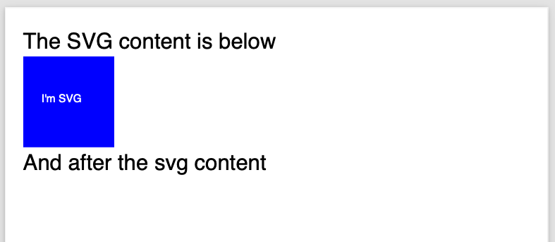
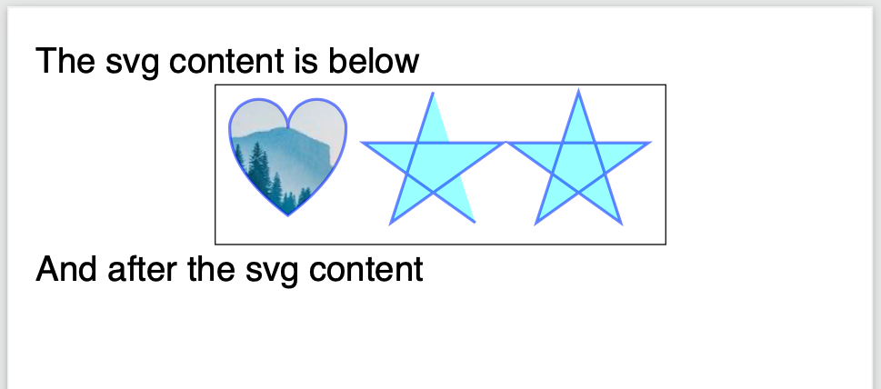
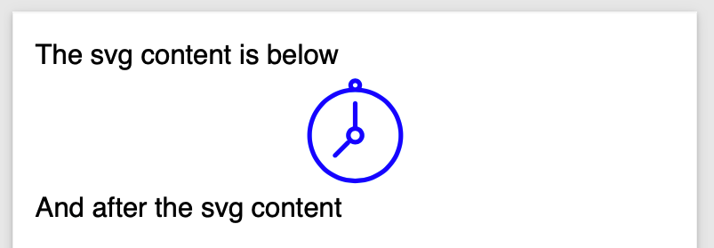
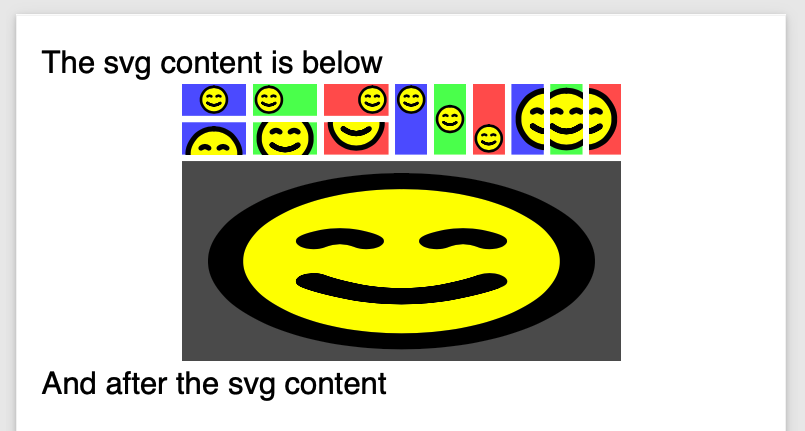

======================================
Drawing with SVG
======================================

Scryber includes the drawing capability with a subset of SVG capabilities.

* Lines
* Recangles
* Elipses
* Polygons
* Bezier Curves
* Groups
* Text
* Use and definitions
* ViewPorts

The drawing components should all be within a namespace qualified svg element, or prefixed svg at the document root.

There are may resources for SVG available, below is a description of the capabilities of scryber's implementation of SVG.
And it is perfectly possible to draw an entire page in SVG within a body or section.

Drawing SVG content
--------------------

.. code-block:: html

    <?xml version="1.0" encoding="utf-8" ?>
    <!DOCTYPE HTML >

    <html xmlns='http://www.w3.org/1999/xhtml' >
    <head>
        
    </head>
    <body style="padding:20pt;">
        
The svg content is below

        <!-- Adding an svg rect and some text to the page -->
        <svg xmlns="http://www.w3.org/2000/svg" >
            <rect class="colored" width="100pt" height="100pt" >
            </rect>
            <text x="20" y="50" fill="white" >I'm SVG</text>
        </svg>
        
And after the svg content

    </body>
    </html>

As can be seen, the svg content is as a block and renders within the flow of the content.
The rect(angle) picks up the styles from the css and the font flows down from the svg container.
The use of svg a an inline, or inline-block may be supported in the future.

With scryber it is possible to use svg elements directly in the document by delcaring a prefixed namespace at the top. And the example below will render the same.
(See :doc:`namespaces_and_assemblies` for more information on how namespaces are used)

.. code-block:: html

    <?xml version="1.0" encoding="utf-8" ?>
    <!DOCTYPE HTML >

    <!-- Declare the naespace here -->
    <html xmlns='http://www.w3.org/1999/xhtml'
        xmlns:svg="http://www.w3.org/2000/svg" >
    <head>
        
    </head>
    <body style="padding:20pt;">
        
The svg content is below

        

            <!-- And prefix our elements here (in a div) -->
            <svg:rect class="colored" width="100pt" height="100pt" >
            </svg:rect>
            <svg:text x="20" y="50" fill="#EEF" >I'm SVG</svg:text>
        

        
And after the svg content

    </body>
    </html>

.. note:: depending on the purpose, this might be advantageous. But not make any html parsers happy unless wrapped in an svg:svg element.

All examples below will follow the standard <svg xmlns='' > convention.

Supported shapes
-----------------

Scryber supports the standard shapes for rectangles, elipses, circles and lines. 
Generally, as closed shapes they will have a black fill and no stroke.

A group group (g) can contain multiple shapes and paths, and alter the style of inner content,
e.g. applying a constitent stroke.

Without a width or height the svg element in scryber with size to the inner content, but it is good practice to specify values.

Scryber also supports the use of styles on the svg element itself.

.. code-block:: html

    <?xml version="1.0" encoding="utf-8" ?>
    <!DOCTYPE HTML >

    <html xmlns='http://www.w3.org/1999/xhtml' >
    <head>
    </head>
    <body style="padding:20pt;">
        
The svg content is below

        <svg xmlns="http://www.w3.org/2000/svg" style="border:solid 1px black" >
            <rect x="0pt" y="0pt" width="100pt" height="80pt" fill="lime" ></rect>
            <g id="eye" stroke="black" stroke-width="2pt" >
                <ellipse cx="50pt" cy="40pt" rx="40pt" ry="20pt" fill="white"></ellipse>
                <circle cx="50pt" cy="40pt" r="20pt" fill="#66F"></circle>
                <circle cx="50pt" cy="40pt" r="10pt" fill="black"></circle>
                <line x1="10" x2="90" y1="40" y2="40" />
                <line x1="50" x2="50" y1="20" y2="60" />
            </g>
        </svg>

        
And after the svg content

    </body>
    </html>

.. image:: images/drawingPathsSVGShapes.png

Polylines, gons and paths
--------------------------

Scryber supports the standard paths, polylines and polygons

.. code-block:: html

    <?xml version="1.0" encoding="utf-8" ?>
    <!DOCTYPE HTML >

    <html xmlns='http://www.w3.org/1999/xhtml' >
    <head>
        
    </head>
    <body style="padding:20pt;">
        
The svg content is below

        

            
            <svg xmlns="http://www.w3.org/2000/svg" style="border:solid 1px black" width="310" height="110">
                <path class="transparentish img-bg" d="M 10,30
            A 20,20 0,0,1 50,30
            A 20,20 0,0,1 90,30
            Q 90,60 50,90
            Q 10,60 10,30 z" ></path>
                <polyline class="transparentish" points="150,5 121,95 198,40 102,40 179,95" stroke="blue"
                        stroke-width="2pt"></polyline>
                <polygon class="transparentish" points="250,5 221,95 298,40 202,40 279,95" stroke="blue"
                        stroke-width="2pt"></polygon>
            </svg>
        

        
And after the svg content

    </body>
    </html>

A path has the operations explicitly defined within the 'd' attribute, see below. 

A polyline is rendered using secific x,y points from the top left of the container.

A polygon automatically closes the path.

Scryber does not currently support the use of patterns or gradients as fills e.g. fill='url(#mypattern)', 
but does support images as fills, and backgrounds e.g. fill='url(./path/toimage.png)'. We will look at this for future releases.

Drawing paths
--------------

Scryber supports the use of bezier paths for the creation of the complex curves and shapes.
The format of the drawing data (d) is exacly the same as the **svg** drawing operations.

* M = moveto
* L = lineto
* H = horizontal lineto
* V = vertical lineto
* C = curveto
* S = smooth curveto
* Q = quadratic Bézier curve
* T = smooth quadratic Bézier curveto
* A = elliptical Arc
* Z = closepath
  
.. code-block:: html

    <?xml version="1.0" encoding="utf-8" ?>
    <!DOCTYPE HTML >

    <html xmlns='http://www.w3.org/1999/xhtml' >
    <head>
        
    </head>
    <body style="padding:20pt;">
        
The svg content is below

        

            <svg id="ClockIcon" top="0" left="0" width="100" height="100" viewBox="0 0 20 20" xmlns="http://www.w3.org/2000/svg">
                <path fill="blue" d="M11.088,2.542c0.063-0.146,0.103-0.306,0.103-0.476c0-0.657-0.534-1.19-1.19-1.19c-0.657,0-1.19,
                0.533-1.19,1.19c0,0.17,0.038,0.33,0.102,0.476c-4.085,0.535-7.243,
                4.021-7.243,8.252c0,4.601,3.73,8.332,8.332,8.332c4.601,0,
                8.331-3.73,8.331-8.332C18.331,6.562,15.173,3.076,11.088,2.542z M10,
                1.669c0.219,0,0.396,0.177,0.396,0.396S10.219,2.462,10,2.462c-0.22,
                0-0.397-0.177-0.397-0.396S9.78,1.669,10,1.669z M10,18.332c-4.163,
                0-7.538-3.375-7.538-7.539c0-4.163,3.375-7.538,7.538-7.538c4.162,0,
                7.538,3.375,7.538,7.538C17.538,14.957,14.162,18.332,10,18.332z M10.386,
                9.26c0.002-0.018,0.011-0.034,0.011-0.053V5.24c0-0.219-0.177-0.396-0.396-0.396c-0.22,
                0-0.397,0.177-0.397,0.396v3.967c0,0.019,0.008,0.035,0.011,0.053c-0.689,0.173-1.201,0.792-1.201,1.534c0,0.324,0.098,0.625,0.264,0.875c-0.079,0.014-0.155,0.043-0.216,0.104l-2.244,2.244c-0.155,0.154-0.155,0.406,0,0.561s0.406,0.154,0.561,0l2.244-2.242c0.061-0.062,0.091-0.139,0.104-0.217c0.251,0.166,0.551,0.264,0.875,0.264c0.876,0,1.587-0.711,1.587-1.587C11.587,10.052,11.075,9.433,10.386,9.26z M10,11.586c-0.438,0-0.793-0.354-0.793-0.792c0-0.438,0.355-0.792,0.793-0.792c0.438,0,0.793,0.355,0.793,0.792C10.793,11.232,10.438,11.586,10,11.586z"></path>
            </svg>
            <!-- Icon from dribble -->
        

        
And after the svg content

    </body>
    </html>

The viewbox defines the area visible and will scale the content of the svg appropriately to the required width and height.

Line options
-------------

The stroke style also supports the standed ending and join options for paths, that will alter the way lines and vertices are rendered.

.. code-block:: xml

    <path id="smiley" fill="yellow" stroke="black" stroke-width="8pt" stroke-linecap="round" stroke-linejoin="round"
                  d="M50,10 A40,40,1,1,1,50,90 A40,40,1,1,1,50,10 M30,40 Q36,35,42,40 M58,40 Q64,35,70,40 M30,60 Q50,75,70,60 Q50,75,30,60" />

Definitions and use
-----------------------

Scryber supports the definition of shapes and reuse within the content.
This can either be directly, or within another viewbox for scaling and position.

The preserveAspectRatio is the standard svg enumeration that allows the content position in the viewbox to be defined on the outer container.

.. code-block:: html

    <?xml version="1.0" encoding="utf-8" ?>
    <!DOCTYPE HTML>

    <html xmlns='http://www.w3.org/1999/xhtml'>
    <head>

    </head>
    <body style="padding:20pt;">
        
The svg content is below

        

            <svg xmlns="http://www.w3.org/2000/svg">

                <!-- define our smiley approx 100 x 100 units -->
                <defs>
                    <path id="smiley" fill="yellow" stroke="black" stroke-width="8pt" stroke-linecap="round" stroke-linejoin="round"
                        d="M50,10 A40,40,1,1,1,50,90 A40,40,1,1,1,50,10 M30,40 Q36,35,42,40 M58,40 Q64,35,70,40 M30,60 Q50,75,70,60 Q50,75,30,60" />
                </defs>

                <!-- use it in the middle so it is scaled to be fully visible -->
                <svg id="smileyWrapper" x="0" width="50pt" height="25pt" viewBox="0 0 100 100" style="background-color:#5555FF;"
                    preserveAspectRatio="xMidYMid">
                    <use href="#smiley" />
                </svg>

                <!-- on the left side fully visible -->
                <svg id="smileyWrapper" x="55" width="50pt" height="25pt" viewBox="0 0 100 100" style="background-color:#55FF55;"
                    preserveAspectRatio="xMinYMid">
                    <use href="#smiley" />
                </svg>

                <!-- on the right side fully visible -->
                <svg id="smileyWrapper" x="110" width="50pt" height="25pt" viewBox="0 0 100 100" style="background-color:#FF5555;"
                    preserveAspectRatio="xMaxYMid">
                    <use href="#smiley" />
                </svg>

                <!-- slice will make the contents fill the box rather than fit -->

                <!-- top middle -->
                <svg id="smileyWrapper" x="0" y="30" width="50pt" height="25pt" viewBox="0 0 100 100" style="background-color:#5555FF;"
                    preserveAspectRatio="xMidYMin slice">
                    <use href="#smiley" />
                </svg>

                <!-- middle middle -->
                <svg id="smileyWrapper" x="55" y="30" width="50pt" height="25pt" viewBox="0 0 100 100" style="background-color:#55FF55;"
                    preserveAspectRatio="xMidYMid slice">
                    <use href="#smiley" />
                </svg>

                <!-- bottom middle -->
                <svg id="smileyWrapper" x="110" y="30" width="50pt" height="25pt" viewBox="0 0 100 100" style="background-color:#FF5555;"
                    preserveAspectRatio="xMidYMax slice">
                    <use href="#smiley" />
                </svg>

                <!-- meet vertical align -->

                <svg id="smileyWrapper" x="165" width="25pt" height="55pt" viewBox="0 0 100 100" style="background-color:#5555FF;"
                    preserveAspectRatio="xMidYMin">
                    <use href="#smiley" />
                </svg>

                <svg x="195" width="25pt" height="55pt" style="background-color:#55FF55;" viewBox="0 0 100 100"
                    preserveAspectRatio="xMidYMid meet">
                    <use href="#smiley" />
                </svg>

                <svg x="225" y="0" width="25pt" height="55pt" style="background-color:#FF5555;" viewBox="0 0 100 100"
                    preserveAspectRatio="xMidYMax meet">
                    <use href="#smiley" />
                </svg>

                <!-- scale vertical align -->

                <svg id="smileyWrapper" x="255" width="25pt" height="55pt" viewBox="0 0 100 100" style="background-color:#5555FF;"
                    preserveAspectRatio="xMinYMax slice">
                    <use href="#smiley" />
                </svg>

                <svg x="285" width="25pt" height="55pt" style="background-color:#55FF55;" viewBox="0 0 100 100"
                    preserveAspectRatio="xMidYMax slice">
                    <use href="#smiley" />
                </svg>

                <svg x="315" y="0" width="25pt" height="55pt" style="background-color:#FF5555;" viewBox="0 0 100 100"
                    preserveAspectRatio="xMaxYMax slice">
                    <use href="#smiley" />
                </svg>

                <!-- Finally just fill the box -->

                <svg x="0" y="60" width="340pt" height="155pt" style="background-color:#555555;" viewBox="0 0 100 100"
                    preserveAspectRatio="none">
                    <use href="#smiley" />
                </svg>

            </svg>
        

        
And after the svg content

    </body>
    </html>

SVG Text
---------

Referencing drawings
--------------------