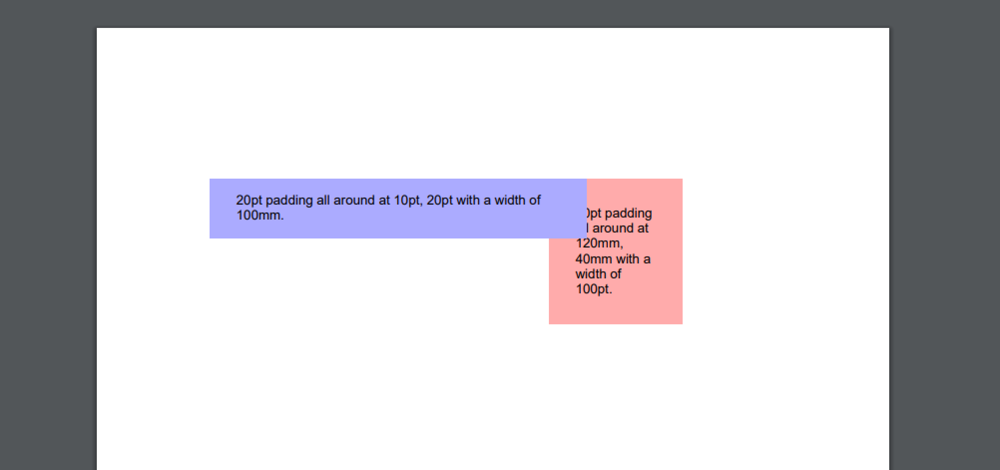

========================================
Drawing units and measures
========================================

Within scryber all drawing and positioning is based from the top left of the page. Scryber allows the definition of a dimension 
based on a number of positioning and sizing structures. All based around the **Unit** of measure.

In all the examples so far we have used pt (points) as the unit of measure, but scryber also supports the use of millimeters (mm) and inches (in)
as postfix units.

* PDFUnit
    * This is the base single dimension value.
    * Its default scale is the prinding standard points unit (1/72nd of an inch).
    * Values can also be specified in millimeters (mm) and inches (in) as well as explicitly in points.
    * Units are used in many places in xml templates
    * e.g. 72, 72pt, 1in, 25.4mm would all represent a 1.0 inch dimension.
    * Units can directly be cast and converted from integer and double values, or constructed in code.
    * see :doc:`reference/drawing_unit` for more information.

* PDFSize
    * This is a width and height dimension with 2 PDFUnits.
    * Units can be mixed and matched within a size, but are generally only used internally for calculation
    * e.g. `72pt 1in` is a 1.0 inch wide and high 
    * see :doc:`reference/drawing_size` for more information.

* PDFPoint
    * This represents a location on a page or container with an x and y component.
    * Again units can be mixed and matched within a point, but are generally only used internally for calculation
    * e.g. `72pt 1in` is 1 inch in from the left of the container and 1 inch down.
    * see :doc:`reference/drawing_point` for more information.

* PDFThickness
    * A thickness represent 4 dimensions around a square.
    * It follows the same order as html starting at the top and moving in a clockwise direction to the right, bottom and left.
    * It can be defined with 1, 2 or 4 values as a string, where 1 dimension refers to all values, 2 is the vertical and then horizontal and all 4 are explicit.
    * Thicknesses are used by the margins, padding, clipping attributes on components.
    * e.g. `25.4mm`, `1in 72pt` or `72 72 72 72` are all equivalent to 1 inch thickness all around.
    * see :doc:`reference/drawing_thickness` for more information.

* PDFRect
    * A rectagle is represented by 4 dimensions forming the x, y, width and height of a rectangle.
    * They can be mixed and matched in units, but are generally only used internally for calculation.
    * This should not be confused with the PDFRectangle used in drawing (see :doc:`drawing_paths`)
    * see :doc:`reference/drawing_rect` for more information.

Units use in templates
======================

When using units in xml templates its easy just to provide the values.
For example the following will add an absolutely positioned Div on a page with some thickness padding textual content

.. code-block:: xml

    <?xml version="1.0" encoding="utf-8" ?>

    <doc:Document xmlns:doc="http://www.scryber.co.uk/schemas/core/release/v1/Scryber.Components.xsd"
                xmlns:styles="http://www.scryber.co.uk/schemas/core/release/v1/Scryber.Styles.xsd"
                xmlns:data="http://www.scryber.co.uk/schemas/core/release/v1/Scryber.Data.xsd" >
    <Styles>
        
        <!-- Catch all style-->
        <styles:Style >
        <styles:Font family="Arial" size="10pt"/>
        </styles:Style>
        
        <!-- Values set on the styles class-->
        <styles:Style applied-class="positioned" >
        <styles:Padding top="10pt" left="20pt" bottom="4mm" right="0.25in"/>
        <styles:Position mode="Absolute" x="30mm" y="40mm"/>
        <styles:Size width="100mm" />
        <styles:Background color="#AAAAFF"/>
        </styles:Style>
        
    </Styles>
    <Pages>
        <doc:Page >
        <Content>
        
        <!-- Explict values on the component -->
        <doc:Div styles:position-mode="Absolute" styles:padding="20pt" styles:x="120mm" styles:y="40mm" styles:width="100pt" styles:bg-color="#FFAAAA" >
            20pt padding all around at 120mm, 40mm with a width of 100pt.
        </doc:Div>
        
        <!-- Or values in the style. -->
        <doc:Div styles:class="positioned" >
            20pt padding all around at 10pt, 20pt with a width of 100mm.
        </doc:Div>
        </Content>
        </doc:Page>
    </Pages>
    
    </doc:Document>

Units in code
=============

The same could have be achieved in code using the Unit and Thickness constructors.

All the dimensions have a range of constructors, casting and parsing options as needed.

.. code-block:: csharp

    //using Scryber.Drawing

    PDFUnit unit1 = 20; //implicit cast to 20pts
    var unit2 = (PDFUnit)72; //explicit cast to 72 points (1 inch)
    var unit3 = new PDFUnit(1, PageUnits.Inches); //explicit unit scale

    var pt1 = new PDFPoint(20,72); //defaults to points
    var pt2 = new PDFPoint(unit1, unit2); //explicit unit dimensions

    var thick1 = new PDFThickness(unit3); //Applies to all with a PDFUnit value
    var thick2 = new PDFThickness(10,20,10,20); //Applies explicit values to each dimensions

    var rect = PDFRect.Empty; //Set to Zeroed values.
    rect.Inflate(thick2); //Then inflate the rectangle by the thickness.

    var rect2 = PDFRect.Parse("12pr 10pt 100pt 2in"); //And all support parsing too.

