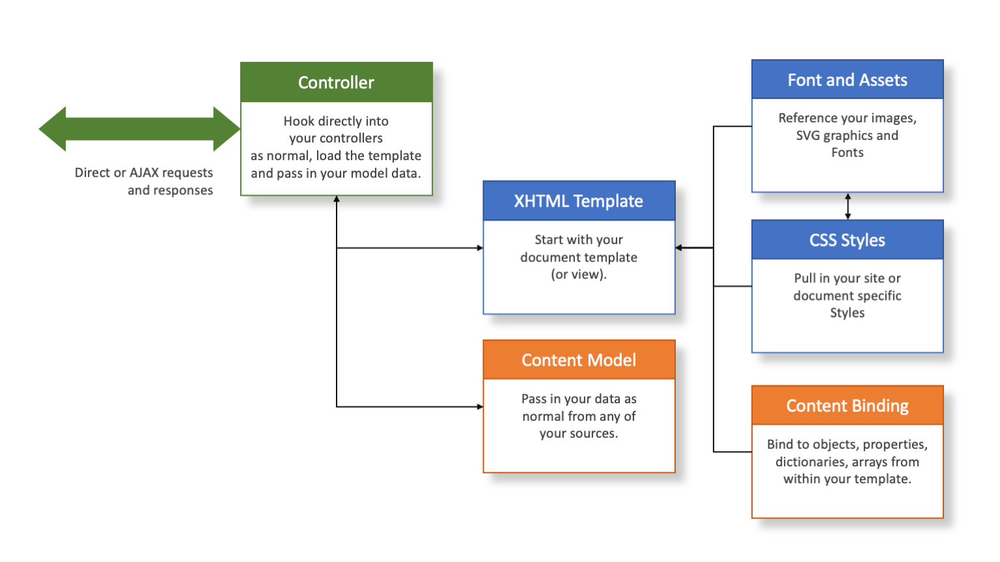
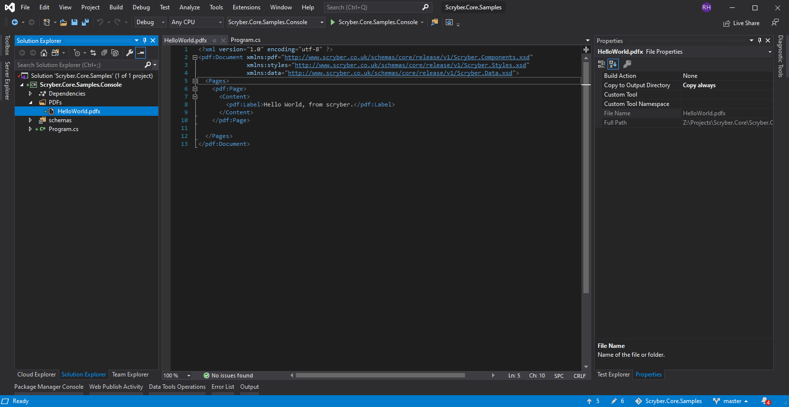
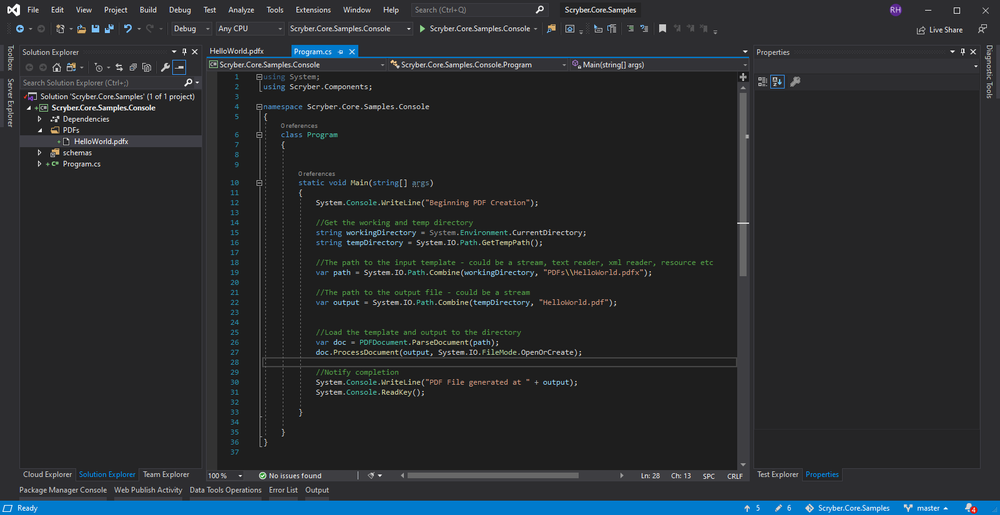
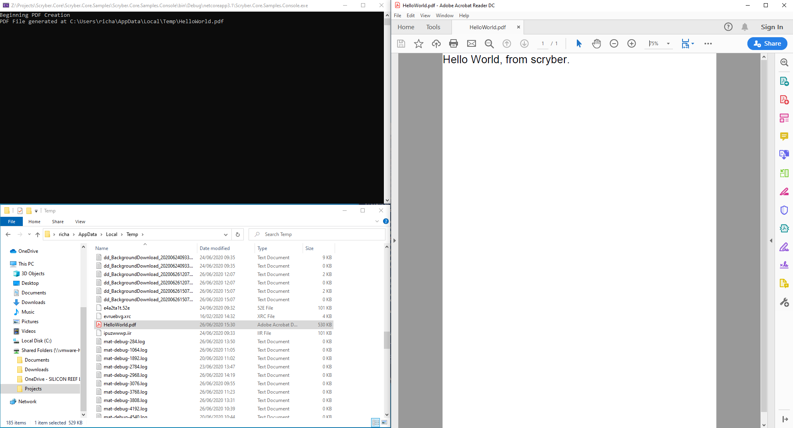
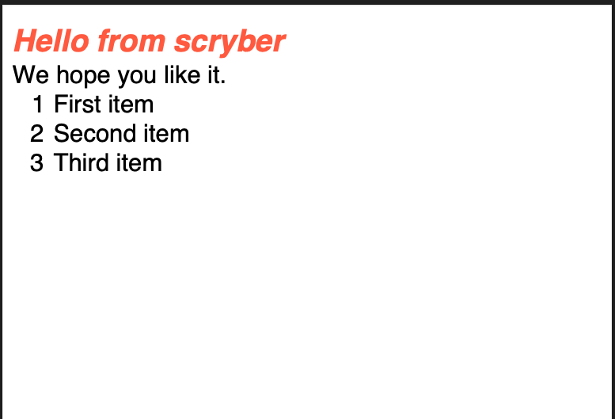
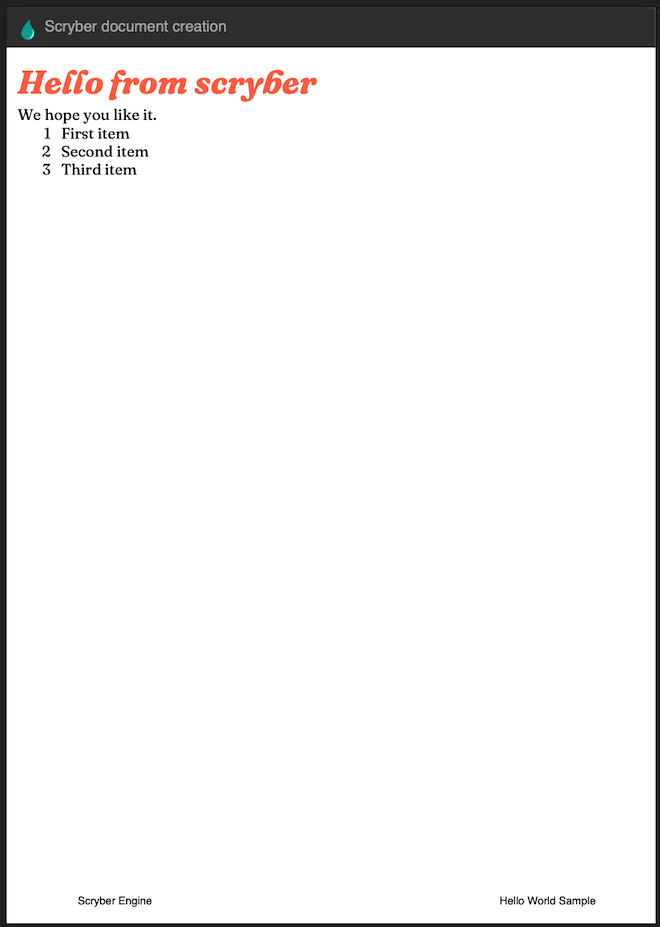
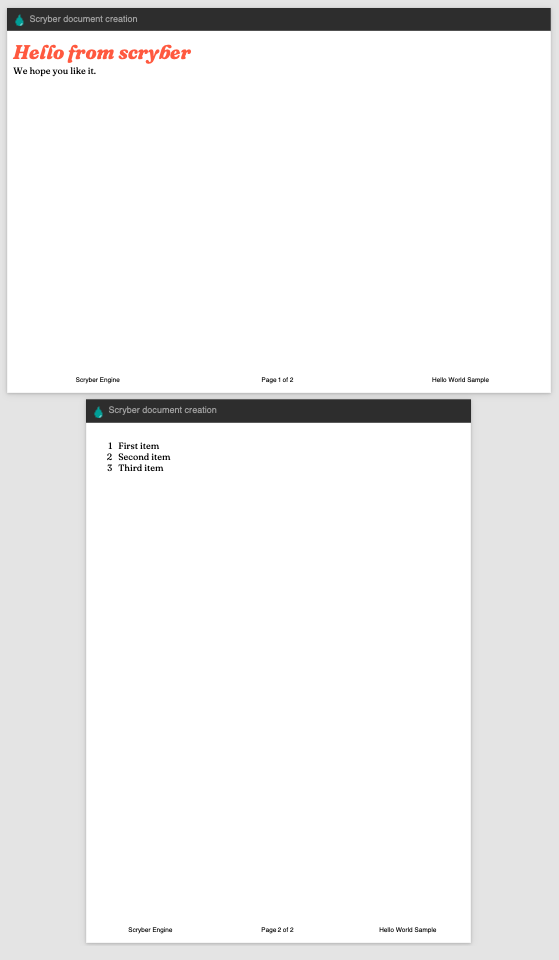

================================
Console or GUI - Getting Started
================================

A Complete example for creating a hello world PDF file in a console application or GUI front end.
For us, we have just created a new dotnet core console application in Visual Studio.

How it works
-------------

We hope scryber works just as you would expect. The engine is based around the controllers you have, using XHTML template views with css, graphics 
and images you are used to, along with your model data you have, to create PDF documents quickly, easily and flexibly.

Nuget Packages
---------------

Make sure you install the Nuget Packages from the Nuget Package Manager

`<https://www.nuget.org/packages/Scryber.Core>`_

This will add the latest version of the Scryber.Core nuget package.

Add a document template
------------------------

In our applications we like to add our templates to a PDF folder. You can break it down however works for you, 
but for now a create a new XHML file called HelloWorld.html in your folder.

And paste the following content into the file

.. code-block:: html

    <!DOCTYPE HTML >
    <html lang='en' xmlns='http://www.w3.org/1999/xhtml' >
        <head>
            <title>Hello World</title>
        </head>
        <body>
            
Hello World from scryber.

        </body>
    </html>

File properties
---------------------

In the file properties for the HelloWorld.html file:
Set the Build Action to None (if it is not already)
And the Copy to output to Always.

Your solution should look something like this.

Program code
--------------

In your program.cs add the namespace to the top of your class.

.. code-block:: csharp

    using Scryber.Components;

Replace your main program method.
----------------------------------

Next change the 'Main' method to your class to load the template and generate the pdf file

.. code-block:: csharp

        static void Main(string[] args)
        {
            System.Console.WriteLine("Beginning PDF Creation");

            //Get the working and temp directory
            string workingDirectory = System.Environment.CurrentDirectory;
            string tempDirectory = System.IO.Path.GetTempPath();

            //The path to the input template - could be a stream, text reader, xml reader, resource etc
            var path = System.IO.Path.Combine(workingDirectory, "PDFs\\HelloWorld.html");

            //The path to the output file - could be a stream
            var output = System.IO.Path.Combine(tempDirectory, "HelloWorld.pdf");

            
            //Load the template and output to the directory
            var doc = Document.ParseDocument(path);
            doc.SaveAsPDF(output, System.IO.FileMode.OpenOrCreate);

            //Notify completion
            System.Console.WriteLine("PDF File generated at " + output);
            System.Console.ReadKey();

        }

The parser will read the document from the pdfx XML content, and then create a new PDF document in the tempDirectory for the output.

Testing your code
------------------

Running your application, you should see the console output the path to the pdf. 
And opening this will show you the file. you could have saved it to a share, opened in Acrobat reader, or sent via email as a stream attachment.

Adding dynamic content
-----------------------

One of the driving forces behind scryber is the separation of the content, data and style. It
is common practice in sites. With scryber all attributes and content is bindable to the data you want to pass to it,

So we can specify our model data with from any source (here we are just using a dynamic object).
And we can pass it to the parsed document either explicitly, or using the special 'model' overload 
on the PDF extension method. 

.. code-block:: csharp

    private static dynamic GetHelloWorldData()
    {
        //get your model data however you wish
        //it's just a sample object for this one.

        var model = new
            {
                titlestyle = "color:#ff6347", //style data
                title = "Hello from scryber", //simple content
                items = new[]                 //or even complex object data
                {
                    new { name = "First item" },
                    new { name = "Second item" },
                    new { name = "Third item" },
                }
            };

        return model;
    }

    static void Main(string[] args)
    {
        System.Console.WriteLine("Beginning PDF Creation");

        string workingDirectory = System.Environment.CurrentDirectory;
        string tempDirectory = System.IO.Path.GetTempPath();

        var path = System.IO.Path.Combine(workingDirectory, "PDFs\\HelloWorld.html");

        var output = System.IO.Path.Combine(tempDirectory, "HelloWorld.pdf");

        var doc = Document.ParseDocument(path);

        //Assign the data model to a parameter
        doc.Params["model"] = GetHelloWorldData();

        doc.SaveAsPDF(output, System.IO.FileMode.OpenOrCreate);

        //Notify completion
        System.Console.WriteLine("PDF File generated at " + output);
        System.Console.ReadKey();

    }

The general syntax for referring paramters in a template is

{@:**parameter[.property]**}

And the html5 tag 'template' is used with the data-bind attribute to loop over one or more items in a collection, and the 
inner objects and properties can be used with the '.' prefix to reference the current data context.

So we can expand our document body to use the model schema.

.. code-block:: html

        <body>

            <main style="padding:10pt">

                <!-- binding styles and values on content -->
                <h2 style="{@:model.titlestyle}">{@:model.title}</h2>

                
We hope you like it.

                <!-- Loop with nested item collection binding to the objects -->
                <ol>
                    <template data-bind='{@:model.items}'>
                        <!-- binding within the model.items content, and can be nested -->
                        <li>{@:.name}</li> 
                    </template>
                </ol>
            </main>

        </body>

Adding Fonts and Styles
------------------------

It's good but rather uninspiring. With scryber we can use css styles, just as we would in html.

Here we are:

* Adding a stylesheet link to the google 'Fraunces' font with the @font-face at-rule (watch that &display=swap link - it's not xhtml)
* Adding some document styles for the body with fall-back fonts.
* A complex style for a page header, with a colour and single background image, that will be repeated across any page.
* And a page footer table with full width and associated style on the inner cells, that will again be repeated.

The css style could just have easily come from another referenced stylesheet. Do not forget to encode the & character as &amp;

.. code-block:: html

    <!DOCTYPE HTML >
    <html lang='en' xmlns='http://www.w3.org/1999/xhtml' >
        <head>
            <title>Hello World</title>

            <!-- support for complex css selectors (or link ot external style sheets )-->
            <link rel="stylesheet"
                href="https://fonts.googleapis.com/css2?family=Fraunces:ital,wght@0,400;0,700;1,400;1,700&amp;display=swap"
                title="Fraunces" />

            
        </head>
        <body>
            <header>
                <!-- document headers -->
                
Scryber document creation

            </header>
            <!-- support for many HTML5 tags-->
            <main style="padding:10pt">

                <!-- binding style and values on content -->
                <h2 style="{@:model.titlestyle}">{@:model.title}</h2>
                
We hope you like it.

                <ol>
                    <!-- Loop through the items in the model -->
                    <template data-bind='{@:model.items}'>
                        <li>{@:.name}</li> <!-- and bind the name value -->
                    </template>
                </ol>
            </main>
            <footer>
                <!-- footers in a table with style -->
                <table class="foot" style="width:100%">
                    <tr>
                        <td>{@:model.author}</td>
                        <td>Hello World Sample</td>
                    </tr>
                </table>
            </footer>
        </body>
    </html>

Make some minor changes to our model.

.. code-block:: csharp

    using Scryber.Components;
    var model = new
    {
         author = "Scryber Engine",   
         titlestyle = "color:#ff6347 font-family:'Fraunces'", //style data
    ...
    
The output from this is much more pleasing. Especially that Fruances font :-)

Page Breaks and sizes
----------------------

Scryber's flexible layout engine supports the use of the @media and @page css at-rules to be able to explicitly style
content just for document output, and also set page sizes and orientiations.

If we add a new css styles file to our site we can alter the layout easily and know it will not affect anything else we might
be using our page for.

.. code-block:: css

    /* HelloPrint.css */

    @media print {

        /* We have a new page before the ordered list
         * And this new page uses the 'portrait' option */
        main ol {
            page-break-before: always;
            padding-top: 20pt;
            page: portrait;
        }

        /* Default style is A4 landscape */

        @page {
            size: A4 landscape;
        }

        /* But can use specific sizes for sections
        @page portrait {
            size: A4 portrait;
        }

    }

And we can add a link to this in our html file. The media attribute is optional, as our css has it, but we 
know browsers will not load the file if it's marked for print.

.. code-block:: html

        </style>
        <link type='stylesheet'
            href='./CSS/HelloPrint.css' 
            media='print' />
    </head>

In our footer we can add the current page number (of total pages) and an author property directly

.. code-block:: html

    <footer>
        <table class="foot" style="width:100%">
            <tr>
                <td>{@:author}</td>

                <!-- the page tag is made up, and has a property attribute
                    (open to suggestions on better syntax)  -->

                <td>Page <page /> of <page property="total" /></td>
                <td>Hello World Sample</td>
            </tr>
        </table>
    </footer>

With this we now alter the layout to use our new pages, and everything will flow nicely.

Further reading
-----------------

You can read more about the what you can do with scryber from the contents.

We have no idea what you will be able to create with scryber. 
It's just there to hopefully help you build amazing documents in an easy and repeatable way.
