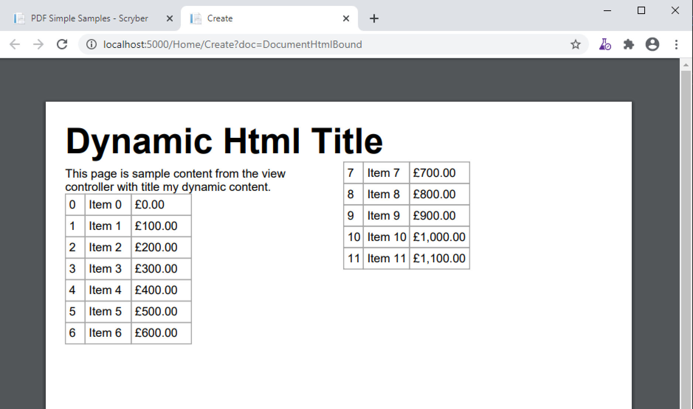

==============================
Dynamic Html content
==============================

The previousd example was all fixed content, it could just have been the standard components rather than html.
The HtmlFragment has 2 attributes that support the use of dymamic content in the document.

* contents - This can dymanically bind to an object, property or xml parameter, or the content of a datasource.
* source - This can point to a file or url that provides html content.

In this example there is an xml parameter containing xhtml that could be changed at generation time. See :doc:`binding_parameters` for more information.
And the html partial source from an MVC controller method.

Template Definition
===================

.. code-block:: xml

    <?xml version="1.0" encoding="utf-8" ?>

    <pdf:Document xmlns:pdf="http://www.scryber.co.uk/schemas/core/release/v1/Scryber.Components.xsd"
                xmlns:styles="http://www.scryber.co.uk/schemas/core/release/v1/Scryber.Styles.xsd"
                xmlns:data="http://www.scryber.co.uk/schemas/core/release/v1/Scryber.Data.xsd">
    <Params>
        <pdf:Xml-Param id="title" >
        <h1>Dynamic Html Title</h1>
        </pdf:Xml-Param>
    </Params>

    <Pages>
        
        <pdf:Section styles:margins="20pt" styles:font-size="12pt">
        <Content>
            
            <!-- Fragment bound to the xml 'title' parameter -->
            <pdf:HtmlFragment source="" contents="{@:title}" />
            
            <!-- Fragment that comes from an MVC Controller method with a name parameter -->
            <pdf:Div styles:column-count="2" styles:height="200pt">
            <pdf:HtmlFragment source="http://localhost:5000/Home/html?name=my%20dynamic%20content" />
            </pdf:Div>
            
        </Content>
        </pdf:Section>

    </Pages>
    
    </pdf:Document>

MVC Controller method
=====================

In the controller define a method that returns the data content for the source.
This could be from any content or call other services.

.. code-block:: csharp

    public IActionResult Html(string name = "Other")
    {
        var data = new Models.DataContentList();
        for(var i = 0; i < 12; i++)
        {
            data.Add(new DataContent() { ID = i.ToString(), Name = "Item " + i.ToString(), Price = i * 100 });
        }
        this.ViewBag.Name = name;
        return PartialView("HtmlContent", data);
    }

Partial View Content
====================

And define the partial view that returns the rendered content required.

.. code-block:: html

    @model Scryber.Core.Samples.Web.Models.DataContentList

    
This page is sample content from the view controller with title @ViewBag.Name.

    <table>
        @foreach (var item in Model)
        {
            <tr>
                <td>@item.ID</td>
                <td>@item.Name</td>
                <td>&#163;@item.Price.ToString("#,##0.00")</td>
            </tr>
        }
    </table>

Output content
==============

And the final rendered content should consume the html feed and render within the columns of the div.

