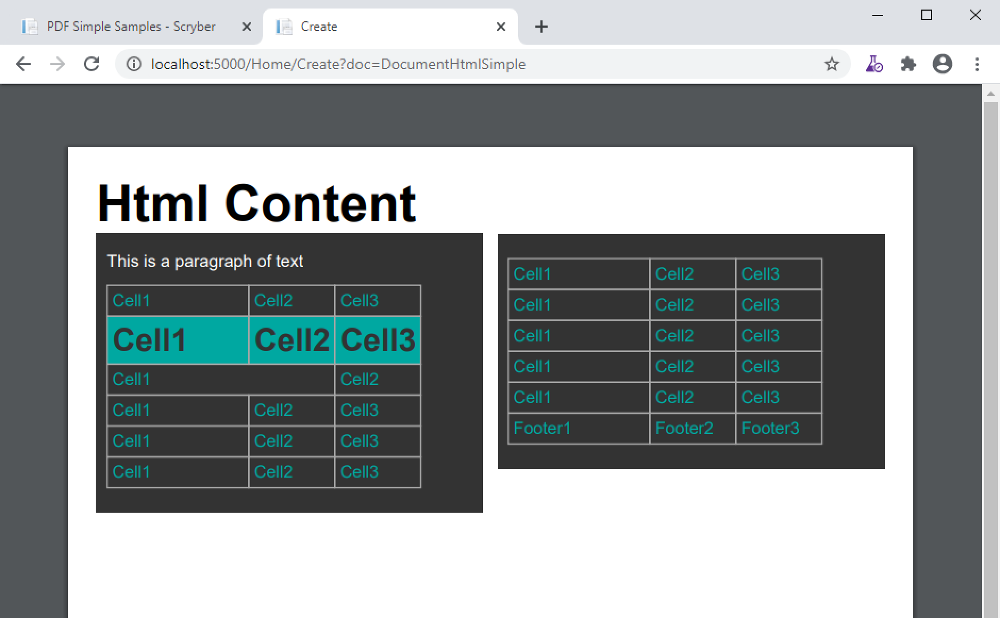

==============================
Html content and Markdown - td
==============================

Scryber supports the use of html within a page as a fragment, or as a full page.

The Html fragment
=================

The easiest way is to simply put the content within the HtmlFragment element.
As the templates use pure xml the content should be XHTML, and it should also declare a namespace.
Scyber does not force this, but it is simply to be valid Xml.

The content within the tag will flow naturally, as a fully qualified component within the document.

.. code-block:: xml

    <?xml version="1.0" encoding="utf-8" ?>

    <pdf:Document xmlns:pdf="http://www.scryber.co.uk/schemas/core/release/v1/Scryber.Components.xsd"
                xmlns:styles="http://www.scryber.co.uk/schemas/core/release/v1/Scryber.Styles.xsd"
                xmlns:data="http://www.scryber.co.uk/schemas/core/release/v1/Scryber.Data.xsd">
    <Pages>
        
        <pdf:Section styles:margins="20pt" styles:font-size="12pt">
        <Content>

            <pdf:HtmlFragment>
                <h1>Html Content</h1> 
            </pdf:HtmlFragment>

            <pdf:Div styles:column-count="2" styles:height="200pt">
                <pdf:HtmlFragment >
                    

                        
This is a paragraph of text

                        <table style="width:400pt; padding: 10pt 0pt; color:#00a8a1">
                        <tr>
                            <td>Cell1</td>
                            <td>Cell2</td>
                            <td>Cell3</td>
                        </tr>
                        <tr  style="background-color:#00a8a1; font-family: 'Arial'; font-size: 30px; color:#323232; font-weight:bold;">
                            <td style="width:100pt">Cell1</td>
                            <td>Cell2</td>
                            <td>Cell3</td>
                        </tr>
                        <tr>
                            <td colspan="2">Cell1</td>
                            <td>Cell2</td>
                        </tr>
                        <tr>
                            <td>Cell1</td>
                            <td>Cell2</td>
                            <td>Cell3</td>
                        </tr>
                        <!-- 
                            Truncated for brevity
                        -->
                        
                        <tfoot>
                            <tr>
                            <td>Footer1</td>
                            <td>Footer2</td>
                            <td>Footer3</td>
                            </tr>
                        </tfoot>
                        </table>
                    

                </pdf:HtmlFragment>
            </pdf:Div>
        </Content>
        </pdf:Section>

    </Pages>
    
    </pdf:Document>

Here we have 2 fragments. The first is a simple heading that inherits all the style information form a pdf:H1 heading
The second we have added some more complex mixed content and styles within the body of an Html Fragment.
Again the elements inherit the style of their base scryber components, but also have the explicit styles added.

The fragment is within a 2 column Div of a fixed height, so wraps fluidly across the page.

.. note:: Within the content and html and body tags will be ignored, and there should be only 1 root element.

Dynamic content
==================

The example above was all fixed content, it could just have been the standard components rather than html.
The HtmlFragment has 2 attributes that support the use of dymamic content in the document.

* contents - This can dymanically bind to an object, property or xml parameter, or the content of a datasource.
* source - This can point to a file or url that provides html content.

In this example we take an xml parameter containing xhtml that can be changed at generation time. See :doc:`binding_parameters` for more information.
And the source from an MVC controller method.

.. code-block:: xml

    <?xml version="1.0" encoding="utf-8" ?>

    <pdf:Document xmlns:pdf="http://www.scryber.co.uk/schemas/core/release/v1/Scryber.Components.xsd"
                xmlns:styles="http://www.scryber.co.uk/schemas/core/release/v1/Scryber.Styles.xsd"
                xmlns:data="http://www.scryber.co.uk/schemas/core/release/v1/Scryber.Data.xsd">
    <Params>
        <pdf:Xml-Param id="title" >
        <h1>Dynamic Html Title</h1>
        </pdf:Xml-Param>
    </Params>

    <Pages>
        
        <pdf:Section styles:margins="20pt" styles:font-size="12pt">
        <Content>
            
            <!-- Fragment bound to the xml 'title' parameter -->
            <pdf:HtmlFragment source="" contents="{@:title}" />
            
            <!-- Fragment that comes from an MVC Controller method with a name parameter -->
            <pdf:Div styles:column-count="2" styles:height="200pt">
            <pdf:HtmlFragment source="http://localhost:5000/Home/html?name=my%20dynamic%20content" />
            </pdf:Div>
            
        </Content>
        </pdf:Section>

    </Pages>
    
    </pdf:Document>

In our controller define the method that returns the data content for the source.
This could be any content or call other services.

.. code-block:: csharp

    public IActionResult Html(string name = "Other")
    {
        var data = new Models.DataContentList();
        for(var i = 0; i < 12; i++)
        {
            data.Add(new DataContent() { ID = i.ToString(), Name = "Item " + i.ToString(), Price = i * 100 });
        }
        this.ViewBag.Name = name;
        return PartialView("HtmlContent", data);
    }

And define the partial view that returns the rendered content required.

.. code-block:: html

    @model Scryber.Core.Samples.Web.Models.DataContentList

    
This page is sample content from the view controller with title @ViewBag.Name.

    <table>
        @foreach (var item in Model)
        {
            <tr>
                <td>@item.ID</td>
                <td>@item.Name</td>
                <td>&#163;@item.Price.ToString("#,##0.00")</td>
            </tr>
        }
    </table>

And the final rendered content should consume the html feed and render within the columns of the div.

.. image:: images/documentHtmlBound.png

.. note:: The html should be treated more as a data structure, rather than full presentation. See below for styles and classes.

Supported tags
==============

Supported styles
================

Classes on html tags
====================

Markdown content
================