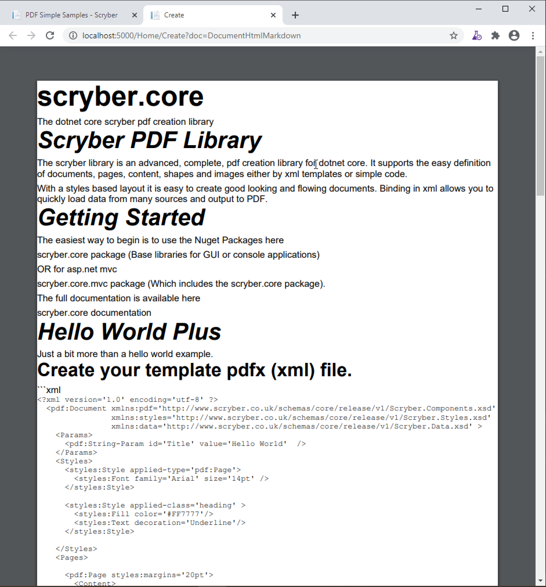
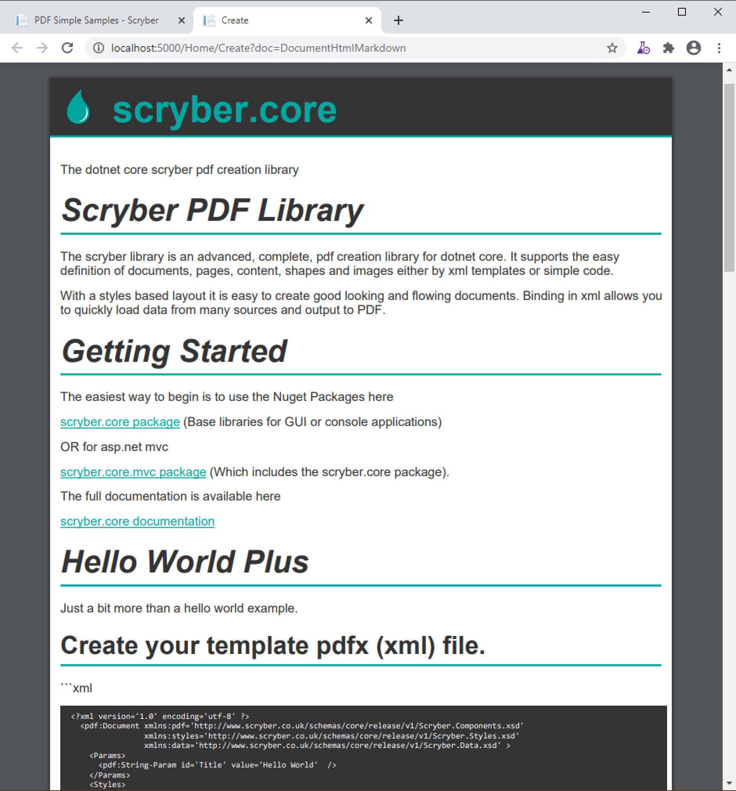

==============================
Markdown (md) content
==============================

Scryber supports conversion of markdown to html using the format attribute. 
There will be more formats to come.

The Markdown content
=====================

By using the source property of the html fragment a url can be specified (or bound). In this case the 
readme.md documentation from the scrtber.core repository (https://raw.githubusercontent.com/richard-scryber/scryber.core/master/README.md)

.. code-block:: xml

    <?xml version="1.0" encoding="utf-8" ?>

    <doc:Document xmlns:doc="http://www.scryber.co.uk/schemas/core/release/v1/Scryber.Components.xsd"
                xmlns:styles="http://www.scryber.co.uk/schemas/core/release/v1/Scryber.Styles.xsd"
                xmlns:data="http://www.scryber.co.uk/schemas/core/release/v1/Scryber.Data.xsd">
    <Params>
        <doc:String-Param id="md-url" value="https://raw.githubusercontent.com/richard-scryber/scryber.core/master/README.md" />
    </Params>

    <Pages>
        
        <doc:Section styles:font-size="12pt">
        <Content>
            
            <doc:Div >
                <doc:HtmlFragment source="{@:md-url}" format="Markdown" />
            </doc:Div>
            
        </Content>
        </doc:Section>

    </Pages>
    
    </doc:Document>

This will pull the markdown content from the github file and transform to html for injection into the document.

Styling the content
====================

The content is very basic and could do with some syles applied.
As mentioned in :doc:`html_tags`, the xmlns for html is referenced and can be qualified for application.
THis can be added to the document and styles applied to the standard html tags.

.. code-block:: xml

    <?xml version="1.0" encoding="utf-8" ?>

    <doc:Document xmlns:doc="http://www.scryber.co.uk/schemas/core/release/v1/Scryber.Components.xsd"
                xmlns:styles="http://www.scryber.co.uk/schemas/core/release/v1/Scryber.Styles.xsd"
                xmlns:data="http://www.scryber.co.uk/schemas/core/release/v1/Scryber.Data.xsd"
                xmlns:html="http://www.w3.org/1999/xhtml">
    <Params>
        <doc:String-Param id="md-url" value="https://raw.githubusercontent.com/richard-scryber/scryber.core/master/README.md" />
    </Params>

    <Styles>
    
        <styles:Style applied-type="html:p" >
            <styles:Margins  left="10pt" bottom="5pt" right="5pt" top="5pt"/>
            <styles:Fill color="#323232"/>
        </styles:Style>
        
        <styles:Style applied-type="html:pre">
            <styles:Font family="Consolas" size="8pt"/>
            <styles:Background color="#323232"/>
            <styles:Margins left="10pt" bottom="5pt" right="5pt" top="5pt"/>
            <styles:Size full-width="true"/>
            <styles:Fill color="white"/>
        </styles:Style>
        
        <styles:Style applied-type="html:a" >
            <styles:Fill color="#00a8a1"/>
            <styles:Text decoration="Underline"/>
        </styles:Style>
        
        <styles:Style applied-type="doc:Heading" >
            <styles:Fill color="#323232"/>
            <styles:Margins all="10pt"/>
            <styles:Padding bottom="5pt"/>
            <styles:Border color="#00a8a1" sides="Bottom" style="Solid" width="2pt"/>
        </styles:Style>
        
        <styles:Style applied-type="html:h1" >
            <!-- adding a logo as a background image once, and applying a padding so it does not overlap -->
            <styles:Background color="#323232" 
                            img-src="https://raw.githubusercontent.com/richard-scryber/scryber.core/master/docs/images/ScyberLogo2_alpha_small.png"
                            repeat="None" x-pos="10" y-pos="10" x-size="35"  />
            <styles:Fill color="#00a8a1"/>
            <styles:Padding all="10pt" left="60pt" />
            <styles:Margins all="0pt" bottom="20pt"/>
        </styles:Style> 
        
    </Styles>

    <Pages>
        
        <doc:Section styles:font-size="12pt">
        <Content>
            
            <doc:Div>
                <doc:HtmlFragment source="{@:md-url}" format="Markdown" />
            </doc:Div>
            
        </Content>
        </doc:Section>

    </Pages>
    
    </doc:Document>

.. note:: Only the styles have been updated with the xml namespace, and these could be taken further with the h1, h2, h3 etc.

